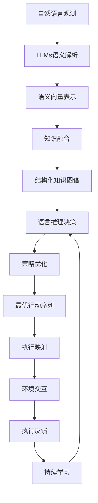

# LLM-based Single-Agent System

关键词：大语言模型、单智能体系统、自然语言处理、强化学习、知识图谱、任务规划、决策推理

## 1. 背景介绍

### 1.1 问题的由来
随着人工智能技术的飞速发展，尤其是大语言模型(Large Language Models, LLMs)的出现，使得构建高度智能化的对话系统成为可能。LLMs展现出了惊人的自然语言理解和生成能力，能够进行开放域对话、问答、文本生成等任务。然而，LLMs本身更多是扮演一个被动回应的角色，缺乏主动性、连贯性和目的性。如何赋予LLMs以单智能体(Single-Agent)系统的特性，使其能够主动思考、规划并完成复杂任务，是一个亟待探索的研究课题。

### 1.2 研究现状
目前，学术界和工业界已经开始探索将LLMs与单智能体系统相结合的研究。一些代表性的工作包括：
- InstructGPT[^1]：由OpenAI提出，通过人工反馈和强化学习，使GPT-3模型能够理解和执行指令性的任务。
- ChatGPT[^2]：同样由OpenAI开发，是一个基于GPT-3.5的大规模对话系统，展现出了惊人的对话和任务完成能力。
- WebGPT[^3]：由Anthropic公司提出，将GPT模型与互联网知识库相结合，使其能够访问和利用网络信息完成任务。
- CAMEL[^4]：由康奈尔大学提出的语言模型，通过因果语言建模，使模型能够进行因果推理和决策。

这些研究工作展现了LLMs与单智能体系统结合的巨大潜力，但目前尚处于初步探索阶段，在系统架构、知识管理、推理决策等方面仍面临诸多挑战。

### 1.3 研究意义
将LLMs与单智能体系统相结合，有望突破传统对话系统和智能助手的局限性，实现更加主动、连贯、高效的人机交互和任务协作。这不仅能极大提升人工智能系统的智能水平，还能在智能客服、虚拟助手、知识工作自动化等领域开辟广阔的应用前景。同时，这一研究方向对认知科学、心理学等学科也有重要启示意义，有助于探索人类智能的奥秘。

### 1.4 本文结构 
本文将围绕LLM-based Single-Agent System这一主题，从以下几个方面展开论述：

- 第2部分介绍LLMs与单智能体系统的核心概念及二者的内在联系；
- 第3部分重点阐述将LLMs融入单智能体系统的核心算法原理和具体操作步骤；
- 第4部分给出问题的形式化描述，构建数学模型并推导相关公式，并结合案例进行详细讲解说明；
- 第5部分通过实际项目，给出代码实例并进行详细的逐行解释说明；
- 第6部分分析该系统的实际应用场景，并展望未来应用前景；
- 第7部分推荐相关学习资源、开发工具和文献资料，供读者进一步研究参考；
- 第8部分对全文进行总结，分析未来发展趋势和面临的挑战，并对后续研究方向提出展望；
- 第9部分的附录，列举了一些常见问题并给出了解答。

## 2. 核心概念与联系

### 2.1 大语言模型 (LLMs)

大语言模型是以自然语言处理为目标，基于海量文本语料库训练的大规模神经网络模型。它通过学习语言的统计规律和深层次语义表示，具备强大的自然语言理解和生成能力。当前主流的LLMs包括GPT系列[^5]、BERT系列[^6]、XLNet[^7]等，它们在机器翻译、对话系统、文本摘要、问答系统等任务上取得了瞩目成绩。

LLMs的核心特点包括：

1. 大规模参数：动辄数百亿、上千亿的模型参数规模，赋予了模型强大的语言建模能力；
2. 无监督预训练：通过自监督学习，在海量无标注语料上进行预训练，使模型学习到语言的一般性知识；
3. 少样本微调：在下游任务上，只需少量标注数据对模型进行微调，即可实现优异性能；
4. 上下文理解：通过注意力机制，模型能够建模长距离的上下文依赖，实现对语义的深层次理解。

### 2.2 单智能体系统 (Single-Agent System)

单智能体系统是一种由单个智能体构成的自主系统，智能体根据自身知识、目标和环境状态，自主地进行感知、推理、决策和行动，以完成特定任务[^8]。相比多智能体系统，单智能体更强调系统的整体性、自主性和目的性。

单智能体系统的关键要素包括：

1. 感知：通过传感器获取环境信息，并将其转化为智能体可理解的内部表示；
2. 知识库：存储智能体的领域知识、常识性知识和过程性知识，用于支持推理和决策；
3. 推理决策：根据知识和目标，对环境信息进行分析推理，生成行动决策；
4. 执行机构：根据决策结果，控制执行器与环境进行交互，完成动作执行；
5. 学习更新：根据执行效果，对知识库和决策模型进行学习更新，实现系统的自适应和进化。

### 2.3 LLMs 与单智能体系统的融合

LLMs为构建高度智能化的单智能体系统提供了新的思路和技术支撑。将LLMs引入单智能体系统，可以从以下几个方面入手：

1. 语言感知：利用LLMs强大的自然语言处理能力，实现对环境信息的语义理解，将非结构化的文本信息转化为结构化的语义表示，为后续推理决策提供支撑。

2. 知识管理：利用LLMs学习到的语言知识，构建覆盖领域知识、常识知识的大规模知识库。通过知识库问答、知识图谱推理等技术，赋予智能体更全面、更准确的知识能力。

3. 语言推理：基于LLMs的上下文理解和语言推理能力，实现基于自然语言的任务分解、规划和决策。通过将复杂任务转化为语言指令序列，智能体可以更好地理解和执行任务。

4. 语言交互：利用LLMs的语言生成能力，实现更自然、更人性化的人机交互。智能体可以根据上下文生成连贯、得体的对话，提供更优质的用户体验。

5. 语言学习：通过持续学习海量语料，LLMs可以不断扩充和更新自身知识。将其与智能体的增量学习机制相结合，可以实现系统知识的持续进化。

## 3. 核心算法原理 & 具体操作步骤

### 3.1 算法原理概述

将LLMs融入单智能体系统的核心，在于实现 LLMs 与智能体的感知、推理、决策、执行等模块的无缝衔接和协同优化。本文提出的算法思路如下：

1. 语义解析：通过LLMs将自然语言观测信息转化为语义向量表示，实现环境状态的结构化表示。
2. 知识融合：将LLMs学习到的语言知识与领域知识库相融合，形成覆盖全面的结构化知识图谱。
3. 语言推理：利用LLMs的上下文理解和语言推理能力，实现基于自然语言的任务分解、规划和决策。
4. 策略优化：引入强化学习，通过奖励反馈不断优化语言推理策略，提升任务完成的效率和质量。
5. 执行映射：将语言空间的行动决策映射到执行空间，通过执行器与环境进行交互并反馈执行效果。
6. 持续学习：利用执行反馈数据，对LLMs的语言模型和智能体策略进行持续微调和优化。

算法流程图如下所示：

### 3.2 算法步骤详解

#### Step 1. 语义解析
给定自然语言观测 $o_t$，利用预训练的LLMs编码器(如GPT、BERT等)将其编码为语义向量$\mathbf{e}_t$:

$$\mathbf{e}_t=\text{LLM\_Encoder}(o_t)$$

其中，$\mathbf{e}_t \in \mathbb{R}^d$ 为 $d$ 维语义向量。通过语义编码，自然语言观测被转化为结构化的特征表示，为后续推理提供支撑。

#### Step 2. 知识融合
将语义向量 $\mathbf{e}_t$ 与外部知识库 $\mathcal{K}$ 进行融合，得到扩展的知识增强语义向量 $\mathbf{h}_t$。知识融合可以通过知识检索、知识注入等方式实现[^9]：

$$\mathbf{h}_t=\text{Knowledge\_Fusion}(\mathbf{e}_t, \mathcal{K})$$

其中，$\mathcal{K}$ 为预先构建的结构化知识库或知识图谱，包含领域知识、常识知识等。知识融合使得语义理解能够利用外部知识，提升理解的准确性和全面性。

#### Step 3. 语言推理决策
基于知识增强语义向量 $\mathbf{h}_t$，通过LLMs的解码器(如GPT的生成式解码)，实现任务规划和行动决策的推理：

$$a_t=\arg\max_{a} \text{LLM\_Decoder}(a|\mathbf{h}_t, \mathcal{G})$$

其中，$a_t$ 为解码生成的行动决策，$\mathcal{G}$ 为任务目标的自然语言描述。通过语言推理，智能体可以根据当前环境状态和任务目标，生成适合的行动决策。

#### Step 4. 策略优化
为了优化语言推理策略，引入强化学习对LLMs的解码器进行微调。定义奖励函数 $r(a_t, s_t)$，评估行动 $a_t$ 在状态 $s_t$ 下的好坏，通过策略梯度等算法对解码器参数 $\theta$ 进行更新：

$$\theta \leftarrow \theta + \alpha \nabla_{\theta} J(\theta)$$

其中，$J(\theta)$ 为策略的期望奖励，$\alpha$ 为学习率。通过不断与环境交互并优化策略，智能体可以学习到更优的行动策略。

#### Step 5. 执行映射
将语言空间的行动决策 $a_t$ 映射到执行空间，生成可执行的低级指令 $c_t$，并通过执行器与环境进行交互：

$$c_t=\text{Execution\_Mapping}(a_t)$$
$$s_{t+1}, r_t = \text{Env\_Interaction}(c_t)$$

其中，$\text{Execution\_Mapping}$ 为语言行动到低级指令的映射函数，$\text{Env\_Interaction}$ 为执行器与环境的交互函数，$s_{t+1}$ 和 $r_t$ 分别为交互后的新状态和奖励反馈。

#### Step 6. 持续学习
根据执行效果，对LLMs的语言模型和策略进行持续微调和优化。收集执行反馈数据 $(o_t,a_t,r_t)$，通过监督微调来更新LLMs的语言理解和生成能力：

$$\mathcal{L}_{LM}=-\sum_{t=1}^{T} \log p(a_t|o_t)$$

同时，也可以通过强化学习来优化语言推理策略(参考Step 4)。通过持续学习，智能体可以不断提升语言理解、推理决策和适应环境的能力。

### 3.3 算法优缺点

优点：
- 利用LLMs的语言理解和生成能力，实现了自然语言