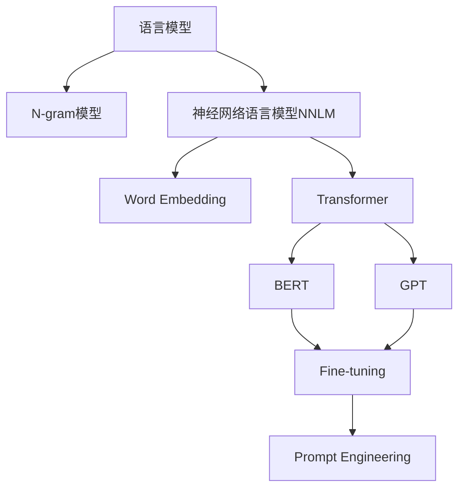

以下是根据您的要求撰写的技术博客文章《Language Models 原理与代码实战案例讲解》的正文内容：

# Language Models 原理与代码实战案例讲解

## 1. 背景介绍

### 1.1 问题的由来

在自然语言处理(NLP)领域中,语言模型(Language Model)是一种用于捕捉和表示语言结构的统计模型。它们通过学习大量文本数据,来预测下一个单词或标记出现的概率。语言模型在诸多NLP任务中发挥着关键作用,例如机器翻译、语音识别、文本生成等。

随着深度学习技术的快速发展,基于神经网络的语言模型(Neural Language Model)逐渐取代了传统的统计语言模型,展现出卓越的性能表现。然而,训练高质量的神经语言模型需要大量计算资源和海量训练数据,这对于普通开发者或研究人员来说是一个巨大挑战。

### 1.2 研究现状

为了解决上述问题,近年来出现了一系列基于Transformer的大型语言模型,如GPT(Generative Pre-trained Transformer)、BERT(Bidirectional Encoder Representations from Transformers)等。这些预训练语言模型在大规模无标注语料库上进行了预训练,学习到了丰富的语言知识。通过在下游任务上进行微调(fine-tuning),可以快速获得出色的性能表现。

预训练语言模型的出现极大地降低了训练成本,使得NLP任务的开发和应用变得更加便捷。目前,这些语言模型已经广泛应用于文本生成、机器翻译、问答系统、情感分析等多个领域,取得了卓越的成绩。

### 1.3 研究意义

虽然现有的预训练语言模型取得了令人瞩目的成就,但它们也面临着一些挑战和局限性,例如:

1. **可解释性**:大型语言模型通常被视为"黑箱",其内部工作机制并不透明,缺乏可解释性。
2. **知识一致性**:生成的文本可能存在内部矛盾或事实错误。
3. **有害输出**:语言模型可能生成包含有害、不当或不道德内容的输出。
4. **计算资源需求**:训练和推理过程需要大量计算资源,对普通用户来说成本高昂。

因此,深入探究语言模型的原理、优化算法以及实际应用,对于提高模型的性能、可解释性和可控性至关重要。本文将系统地介绍语言模型的核心概念、关键算法、数学模型,并通过实战案例讲解代码实现细节,旨在为读者提供全面的理解和实践指导。

### 1.4 本文结构  

本文的结构安排如下:

- 第2部分介绍语言模型的核心概念和相关技术。
- 第3部分详细阐述语言模型的核心算法原理和具体操作步骤。
- 第4部分构建语言模型的数学模型,并推导公式过程和案例分析。
- 第5部分提供语言模型的代码实现示例,包括开发环境搭建、源代码解读等。
- 第6部分探讨语言模型在实际应用场景中的应用。
- 第7部分推荐相关的学习资源、开发工具和论文等。
- 第8部分总结语言模型的研究成果、发展趋势和面临的挑战。
- 第9部分列出常见问题及解答。

## 2. 核心概念与联系

语言模型是自然语言处理领域的核心技术之一,与其他多个概念和技术密切相关,包括:

1. **N-gram模型**: 传统的基于统计学的语言模型,通过计算N个连续词元的概率来预测下一个词元。
2. **神经网络语言模型(NNLM)**: 基于神经网络的语言模型,通过神经网络学习语言的统计特征。
3. **Word Embedding**: 将词汇映射到连续的向量空间中,捕捉词与词之间的语义关系。
4. **Transformer**: 一种基于自注意力机制的序列到序列模型,广泛应用于NLP任务。
5. **BERT**: 基于Transformer的双向编码器表示,通过掩码语言模型(Masked LM)进行预训练。
6. **GPT**: 基于Transformer的生成式预训练模型,通过语言建模(Language Modeling)进行预训练。
7. **Fine-tuning**: 在下游任务上对预训练模型进行微调,以获得针对特定任务的优化模型。
8. **Prompt Engineering**: 设计合适的提示(prompt),以引导语言模型生成所需的输出。

语言模型与上述概念和技术息息相关,共同构建了现代自然语言处理的技术基础。下一部分将重点介绍语言模型的核心算法原理。

## 3. 核心算法原理 & 具体操作步骤

### 3.1 算法原理概述

语言模型的核心任务是根据给定的上文(context)预测下一个词元(token)的概率分布。形式化地,给定一个长度为T的词元序列$S = (w_1, w_2, \dots, w_T)$,语言模型需要计算出条件概率:

$$P(w_t | w_1, w_2, \dots, w_{t-1})$$

上式表示在给定前 t-1 个词元的情况下,第 t 个词元 $w_t$ 出现的概率。通过链式法则,我们可以将序列的联合概率分解为条件概率的乘积:

$$P(w_1, w_2, \dots, w_T) = \prod_{t=1}^T P(w_t | w_1, \dots, w_{t-1})$$

因此,语言模型的目标是最大化给定语料库中所有序列的联合概率。

在神经网络语言模型中,通常采用基于Transformer或RNN的编码器-解码器架构。编码器将输入序列编码为上下文向量表示,解码器则根据上下文向量和历史生成的词元,预测下一个词元的概率分布。

### 3.2 算法步骤详解

以基于Transformer的语言模型GPT为例,其训练和推理过程可分为以下几个主要步骤:

1. **输入处理**:将原始文本转换为词元序列,并添加特殊词元(如[BOS]、[EOS]等)。

2. **位置编码**:由于Transformer没有捕捉序列顺序的内在机制,因此需要通过位置编码将位置信息编码到输入中。

3. **多头自注意力**:输入序列通过多头自注意力机制,计算每个词元与其他词元的注意力权重,捕捉长程依赖关系。

4. **前馈神经网络**:自注意力的输出通过前馈神经网络进行特征转换和非线性映射。

5. **掩码处理**:在训练时,对部分输入词元进行掩码,模型需要预测这些被掩码的词元。

6. **损失计算**:将模型预测的概率分布与真实标签计算交叉熵损失。

7. **梯度更新**:通过反向传播算法计算参数梯度,并使用优化器(如Adam)更新模型参数。

8. **推理**:给定起始词元,基于历史生成的词元序列,模型重复预测下一个最可能的词元,直至达到终止条件(如生成[EOS]词元)。

上述算法步骤反映了语言模型的基本工作原理,具体实现细节可能因模型架构和任务而有所不同。

### 3.3 算法优缺点

语言模型算法具有以下优缺点:

**优点**:

1. **泛化能力强**:通过在大规模语料库上预训练,语言模型能够学习到丰富的语言知识,并在下游任务上展现出良好的泛化性能。

2. **端到端训练**:整个模型可以端到端地进行训练,无需人工设计复杂的特征工程。

3. **多任务能力**:预训练语言模型可通过微调应用于多种不同的NLP任务。

4. **长程依赖建模**:自注意力机制使模型能够有效捕捉长程依赖关系。

**缺点**:

1. **可解释性差**:大型语言模型通常被视为"黑箱",内部工作机制缺乏透明度。

2. **训练成本高**:训练高质量的语言模型需要大量计算资源和海量数据。

3. **知识一致性问题**:生成的文本可能存在内部矛盾或事实错误。

4. **有害输出风险**:语言模型可能生成包含有害、不当或不道德内容的输出。

5. **上下文长度限制**:由于计算资源限制,模型通常只能处理有限长度的上下文。

### 3.4 算法应用领域

语言模型广泛应用于自然语言处理的各个领域,包括但不限于:

1. **文本生成**: 如新闻文章写作、故事创作、对话系统等。

2. **机器翻译**: 将源语言文本翻译为目标语言。

3. **文本摘要**: 自动生成文本的摘要或概述。

4. **问答系统**: 根据给定问题从知识库中检索并生成自然语言回答。

5. **情感分析**: 分析文本的情感极性(正面、负面)和情绪类别。

6. **代码生成**: 根据给定的代码片段或自然语言描述生成程序代码。

7. **数据增强**: 通过生成相似但不同的文本,扩充训练数据集。

总的来说,语言模型是自然语言处理领域的核心技术,在广泛的应用场景中发挥着重要作用。

## 4. 数学模型和公式 & 详细讲解 & 举例说明

### 4.1 数学模型构建

语言模型的核心目标是最大化给定语料库中所有序列的联合概率。形式化地,给定一个长度为T的词元序列$S = (w_1, w_2, \dots, w_T)$,我们希望最大化该序列的概率:

$$\begin{aligned}
P(w_1, w_2, \dots, w_T) &= \prod_{t=1}^T P(w_t | w_1, \dots, w_{t-1}) \\
&= \prod_{t=1}^T P(w_t | \mathbf{h}_t)
\end{aligned}$$

其中,$\mathbf{h}_t$是一个向量,表示词元$w_t$的上下文表示,由神经网络编码器根据前 t-1 个词元计算得到。

为了计算条件概率$P(w_t | \mathbf{h}_t)$,我们可以使用softmax函数:

$$P(w_t | \mathbf{h}_t) = \frac{e^{s(w_t, \mathbf{h}_t)}}{\sum_{w' \in \mathcal{V}} e^{s(w', \mathbf{h}_t)}}$$

其中,$\mathcal{V}$是词表(vocabulary),包含所有可能的词元;$s(w, \mathbf{h})$是一个评分函数,它衡量了在给定上下文$\mathbf{h}$下,词元$w$出现的适当程度。

评分函数$s(w, \mathbf{h})$通常由一个线性层和非线性激活函数组成:

$$s(w, \mathbf{h}) = \mathbf{e}_w^\top \tanh(\mathbf{W}\mathbf{h} + \mathbf{b})$$

其中,$\mathbf{e}_w$是词元$w$的embedding向量,$\mathbf{W}$和$\mathbf{b}$是可训练的权重和偏置参数。

在训练过程中,我们最小化语料库中所有序列的负对数似然损失:

$$\mathcal{L} = -\frac{1}{N} \sum_{i=1}^N \log P(S_i)$$

其中,$N$是语料库中序列的总数,$S_i$表示第$i$个序列。通过反向传播算法计算参数梯度,并使用优化器(如Adam)更新模型参数,从而最大化序列的联合概率。

### 4.2 公式推导过程

接下来,我们将推导语言模型的核心公式,即如何从给定的上下文$\mathbf{h}_t$计算词元$w_t$的条件概率分布$P(