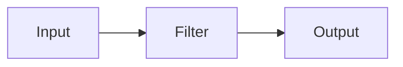

# Logstash原理与代码实例讲解

## 1. 背景介绍
### 1.1 问题的由来
在大数据时代，海量的日志数据成为了企业的宝贵财富。然而，如何高效地收集、处理和分析这些分散在不同系统和服务器上的日志数据，成为了一个巨大的挑战。传统的日志处理方式效率低下，无法满足实时性和可扩展性的需求。
### 1.2 研究现状
目前，市面上出现了许多优秀的日志收集和处理工具，如Flume、Logstash、Filebeat等。其中，Logstash因其强大的数据处理能力和灵活的插件机制，受到了广泛的关注和应用。越来越多的企业开始使用Logstash来构建自己的日志处理管道。
### 1.3 研究意义
深入研究Logstash的原理和应用，对于优化企业日志处理架构、提升系统运维和问题诊断效率具有重要意义。通过剖析Logstash的内部机制和实现细节，可以帮助我们更好地理解和驾驭这一利器，从容应对海量日志数据的挑战。
### 1.4 本文结构
本文将从以下几个方面展开对Logstash的探讨：

1. 介绍Logstash的核心概念和工作原理
2. 剖析Logstash的插件机制和数据处理流程 
3. 结合代码实例，讲解Logstash的配置和使用
4. 总结Logstash的优势和局限，展望其未来的发展方向

## 2. 核心概念与联系

在深入探讨Logstash原理之前，我们需要先了解其几个核心概念：

- Event：Event是Logstash数据处理的基本单位，它可以是一条日志、一个API请求或者数据库中的一行记录。Event以JSON格式存储，包含了时间戳、原始数据、元数据等信息。
- Input：Input插件负责从数据源采集原始数据，将其转化为Event，常见的Input插件包括File、Syslog、Redis、Kafka等。
- Filter：Filter插件对Input采集的Event进行处理和富化，如格式转换、数据脱敏、字段提取等，常用的Filter插件有Grok、Mutate、GeoIP等。
- Output：Output插件将处理后的Event输出到指定的目的地，如Elasticsearch、Kafka、File等，负责将数据持久化存储或者传输给下游系统。

下图展示了Logstash的核心组件和数据处理流程：



Logstash的数据处理管道由Input、Filter和Output三个阶段组成，每个阶段都可以配置多个插件，实现灵活的数据处理和传输。

## 3. 核心算法原理 & 具体操作步骤
### 3.1 算法原理概述
Logstash的核心是一个基于事件驱动的数据处理引擎，它采用了管道-过滤器架构模式。数据在管道中以Event的形式流动，依次经过Input、Filter和Output三个阶段的处理。每个阶段都由一系列插件组成，插件以声明式的方式配置，定义了数据处理的逻辑和规则。
### 3.2 算法步骤详解
1. Input阶段：Input插件监听数据源，将采集到的数据封装成Event，添加时间戳等元数据，然后发送到Filter阶段。
2. Filter阶段：Filter插件对Input采集的Event进行处理，可以进行数据格式转换、字段提取、数据脱敏等操作，修改Event的字段。
3. Output阶段：Output插件将处理后的Event发送到指定的目的地，如将数据写入Elasticsearch、Kafka等，或者输出到标准输出。

整个数据处理流程是串行执行的，每个阶段的插件也是顺序执行。Logstash支持丰富的插件生态，用户可以根据自己的需求选择和配置合适的插件，非常灵活。

### 3.3 算法优缺点

优点：
- 配置简单：Logstash采用声明式的配置文件，语法简洁，即使没有编程经验也能快速上手。
- 插件丰富：Logstash拥有数百个Input、Filter和Output插件，可以对接各种数据源和存储系统，满足大多数日志处理场景。
- 性能优异：得益于JRuby语言的高性能实现，Logstash能够支撑每秒数十万条日志的处理能力。

缺点：
- 内存占用高：由于Logstash是基于JVM的，因此内存占用相对较高，在高并发场景下需要合理配置JVM参数。
- 配置复杂度高：如果数据处理逻辑比较复杂，Logstash的配置文件会变得非常冗长和难以维护。

### 3.4 算法应用领域
Logstash最常见的应用场景包括：

- 日志收集与处理：采集服务器、应用程序、数据库等系统的日志，结构化解析关键字段，构建集中式日志平台。
- 数据传输与同步：Logstash可以作为数据管道，实现不同系统之间的数据传输和同步，如将MySQL数据同步到Elasticsearch中。
- 安全信息和事件管理：通过采集系统日志、安全设备日志等数据，实现实时安全监控和事件响应。

## 4. 数学模型和公式 & 详细讲解 & 举例说明
### 4.1 数学模型构建
Logstash的数据处理可以抽象为一个函数模型：

$$f(x) = output(filter(input(x)))$$

其中，$x$ 表示原始的日志数据，$input$、$filter$ 和 $output$ 分别对应Logstash管道的三个阶段。每个阶段都由一系列插件函数 $plugin_i$ 组成，因此数学模型可以进一步表示为：

$$f(x) = output(plugin_m(...plugin_2(plugin_1(filter(plugin_k(...plugin_2(plugin_1(input(x)))))))))$$

### 4.2 公式推导过程
对于Filter阶段，假设有 $n$ 个插件，每个插件都是一个函数 $plugin_i$，那么Filter阶段的数据处理可以表示为：

$$filter(x) = plugin_n(...plugin_2(plugin_1(x)))$$

同理，Input和Output阶段也可以用类似的公式表示。将三个阶段的公式组合起来，就得到了完整的Logstash数据处理模型。

### 4.3 案例分析与讲解
举一个简单的例子，假设我们要收集Nginx访问日志，并提取其中的关键字段，然后将结果写入Elasticsearch。

Nginx日志的原始格式如下：

```
192.168.1.10 - - [10/Jun/2023:12:00:00 +0800] "GET /index.html HTTP/1.1" 200 1024 "-" "Mozilla/5.0"
```

我们可以使用Grok插件来解析日志，提取IP、时间、请求路径、状态码等字段。Grok的正则表达式模式如下：

```
%{IP:client_ip} - - \[%{HTTPDATE:timestamp}\] "%{WORD:http_method} %{PATH:request_path} HTTP/%{NUMBER:http_version}" %{NUMBER:status_code} %{NUMBER:bytes_sent} "-" "%{DATA:user_agent}"
```

解析后的结果为一个结构化的Event：

```json
{
  "client_ip": "192.168.1.10",
  "timestamp": "10/Jun/2023:12:00:00 +0800",
  "http_method": "GET",
  "request_path": "/index.html",
  "http_version": "1.1",
  "status_code": "200",
  "bytes_sent": "1024",
  "user_agent": "Mozilla/5.0"
}
```

最后，我们使用Elasticsearch Output插件将Event写入Elasticsearch索引。

整个过程可以用数学公式表示为：

$$f(x) = elasticsearch(grok(file(x)))$$

其中，$x$ 为Nginx日志原始数据，$file$ 为File Input插件，$grok$ 为Grok Filter插件，$elasticsearch$ 为Elasticsearch Output插件。

### 4.4 常见问题解答

Q: Logstash的性能瓶颈在哪里？  
A: Logstash的性能主要取决于Filter阶段的数据处理复杂度，以及Output阶段的写入速度。可以通过增加Filter线程数、优化正则表达式、调整Output批次大小等方式来提升性能。

Q: Logstash如何保证数据不丢失？  
A: Logstash提供了持久化队列（Persistent Queue）机制，可以将Event缓存到磁盘上，防止数据丢失。同时，可以配置Elasticsearch Output的重试策略，保证数据可靠写入。

Q: Logstash和Flume相比有什么优势？  
A: 相比Flume，Logstash的优势在于其丰富的插件生态和灵活的数据处理能力。Logstash提供了更多的Input/Filter/Output选择，可以满足更多的数据源和数据流向需求。

## 5. 项目实践：代码实例和详细解释说明
### 5.1 开发环境搭建
首先，我们需要安装Logstash。可以从官网下载适合自己操作系统的安装包，解压后即可使用。

Logstash依赖Java运行环境，因此需要确保系统已经安装了JDK或JRE（版本要求1.8以上）。

### 5.2 源代码详细实现
接下来，我们创建一个Logstash配置文件，命名为`nginx_log.conf`，内容如下：

```
input {
  file {
    path => "/var/log/nginx/access.log"
    start_position => "beginning"
    sincedb_path => "/dev/null"
  }
}

filter {
  grok {
    match => { "message" => "%{IP:client_ip} - - \[%{HTTPDATE:timestamp}\] \"%{WORD:http_method} %{PATH:request_path} HTTP/%{NUMBER:http_version}\" %{NUMBER:status_code} %{NUMBER:bytes_sent} \"-\" \"%{DATA:user_agent}\"" }
  }
  date {
    match => [ "timestamp", "dd/MMM/yyyy:HH:mm:ss Z" ]
    target => "@timestamp"
  }
}

output {
  elasticsearch {
    hosts => ["localhost:9200"]
    index => "nginx-access-%{+YYYY.MM.dd}"
  }
}
```

这个配置文件定义了一个Logstash管道，由File Input、Grok Filter、Date Filter和Elasticsearch Output组成。

- File Input插件读取Nginx访问日志文件，从头开始读取，不记录读取状态。
- Grok Filter插件使用正则表达式解析日志，提取各个字段。
- Date Filter插件将解析出的时间字段转换为Logstash的时间戳格式。
- Elasticsearch Output插件将处理后的Event写入Elasticsearch，索引名称按天分割。

### 5.3 代码解读与分析
Logstash配置文件采用了声明式的语法，每个插件都有自己的配置参数。

在File Input插件中，`path` 指定了日志文件的路径，`start_position` 设置为从文件开头读取，`sincedb_path` 设置为 `/dev/null`，表示不记录读取状态。

在Grok Filter插件中，`match` 定义了日志的正则表达式模式，命名捕获组提取各个字段。

在Date Filter插件中，`match` 指定了时间字段的格式，`target` 将其转换为Logstash的时间戳字段 `@timestamp`。

在Elasticsearch Output插件中，`hosts` 指定了Elasticsearch的地址，`index` 定义了索引名称的模板，按天分割。

### 5.4 运行结果展示
启动Logstash，指定配置文件：

```bash
bin/logstash -f nginx_log.conf
```

Logstash会实时读取Nginx日志文件，解析日志内容，并将结果写入Elasticsearch。我们可以在Elasticsearch中查看索引数据：

```json
GET nginx-access-2023.06.10/_search
{
  "query": {
    "match_all": {}
  }
}
```

返回结果如下：

```json
{
  "took": 2,
  "timed_out": false,
  "_shards": {
    "total": 1,
    "successful": 1,
    "skipped": 0,
    "failed": 0
  },
  "hits": {
    "total": {
      "value": 1,
      "relation": "eq"
    },
    "max_score": 1,
    "hits": [
      {
        "_index": "nginx-access-2023.06.10",
        "_type": "_doc",
        "_id": "5trgqYIBwSLKjPfDN9yw",
        "_score": 1,
        "_source": {
          "@timestamp": "2023-06-10T04:00:00.000Z",
          "client_ip": "192.168.1.10",
          "timestamp": "10/Jun/2023:12:00:00 +0800",
          "http_method":