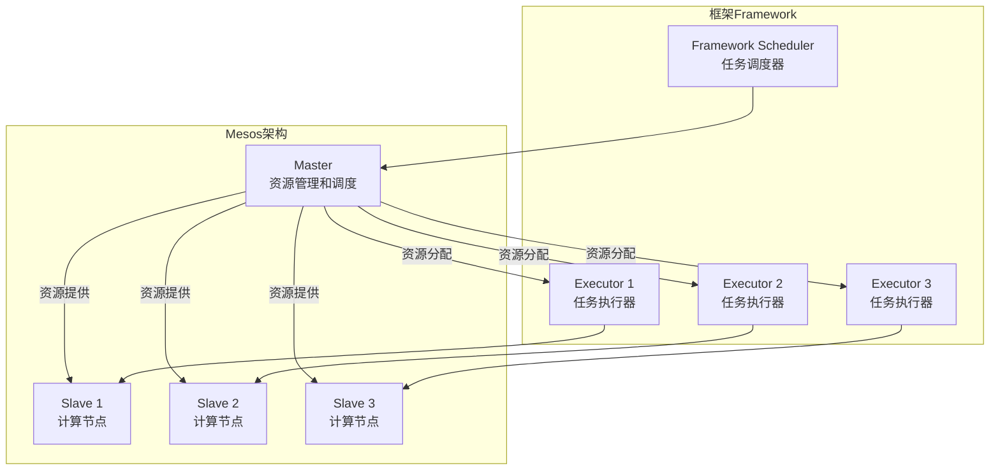

好的,我明白了您的要求。以下是题为《Mesos原理与代码实例讲解》的技术博客文章正文:

# Mesos原理与代码实例讲解

## 1. 背景介绍

### 1.1 问题的由来

随着云计算、大数据和微服务架构的兴起,资源调度和集群管理成为了关键的基础设施问题。传统的静态资源分配模式已无法满足动态、异构和弹性的资源需求。Apache Mesos作为一种通用的集群资源管理和调度平台,应运而生。

### 1.2 研究现状  

Mesos最初由加州大学伯克利分校的AMPLab开发,后捐赠给Apache软件基金会,成为Apache顶级项目。作为一种分布式系统内核,Mesos可以有效地将集群中的CPU、内存、存储和其他计算资源统一抽象,并对这些资源进行动态且高效的共享和隔离。

Mesos已被众多知名公司和组织广泛采用,如Twitter、Apple、Netflix、Airbnb、Uber等,用于构建大规模的分布式系统和运行各种关键任务。

### 1.3 研究意义

深入理解Mesos的设计原理和实现细节,对于构建高效、可扩展和容错的分布式系统至关重要。本文将全面剖析Mesos的核心概念、关键算法、数学模型以及实际应用,为读者提供系统且实用的指导。

### 1.4 本文结构

本文首先介绍Mesos的核心概念和体系架构,接着深入探讨资源调度和容错的算法原理,并建立相应的数学模型。然后通过代码实例和实际场景说明Mesos的具体应用。最后总结Mesos的发展趋势和面临的挑战。

## 2. 核心概念与联系

Mesos的核心概念包括Master、Slave、Framework、Scheduler和Executor等组件:

- **Master**: 负责整个集群的资源管理和调度,接收Slave节点的资源报告,并根据调度策略将资源分配给不同的Framework。
- **Slave**: 代表集群中的计算节点,向Master报告可用资源,并根据Master的指令运行相应的任务。
- **Framework**: 包含Scheduler和Executor两个组件,用于定义不同类型的分布式应用或服务。
- **Scheduler**: Framework的调度器,根据应用需求向Mesos Master请求资源,并决定任务的调度和执行策略。
- **Executor**: 任务的具体执行器,在Slave节点上启动并运行计算任务。

Mesos采用了两级调度器模型,Master负责跨Framework的资源分配,而Scheduler则负责针对特定Framework的任务调度。这种设计使得Mesos具有很强的扩展性和通用性,可以支持各种类型的分布式应用。

## 3. 核心算法原理 & 具体操作步骤  

### 3.1 算法原理概述

Mesos的核心算法包括资源管理、任务调度和容错机制等几个方面:

1. **资源管理**: Mesos采用了基于提供计算模型的资源抽象,将CPU、内存、磁盘、网络等资源统一表示为资源向量,支持细粒度的资源共享和隔离。

2. **任务调度**: Mesos使用基于DRF(Dominant Resource Fairness)的max-min公平共享调度算法,保证资源在Framework之间的公平分配。同时,每个Framework可以自定义调度策略,实现针对特定应用的优化。

3. **容错机制**: Mesos采用主从架构和ZooKeeper实现高可用,当Master宕机时可快速选举新的Master接管集群。任务级别的容错由Framework自身实现,如通过检查点或重新调度等方式。

### 3.2 算法步骤详解

#### 3.2.1 资源管理算法

Mesos使用向量将不同类型的资源统一表示,如$\vec{r} = (cpu, mem, disk, ports)$。每个Slave定期将其剩余资源向量报告给Master。

当Framework向Master请求资源时,Master将尝试从所有Slave中选取一个资源向量子集,使其能满足Framework的需求。这是一个向量加法问题:

$$\sum_{i=1}^n \vec{r_i} \geq \vec{R}$$

其中$\vec{R}$为Framework的资源需求向量,而$\vec{r_i}$为第i个Slave提供的资源向量。

一旦找到满足条件的资源子集,Master将这些资源分配给相应的Framework执行器。当任务完成后,Slave将释放的资源再次报告给Master,重新加入资源池中。

#### 3.2.2 DRF任务调度算法

DRF(Dominant Resource Fairness)是Mesos采用的一种公平调度算法,目标是最大化集群中最小剩余资源的比例。

具体步骤如下:

1. 计算每个Framework占用的dominant share,即占用最多资源的那一种:

$$
dominant\_share_i = \max\limits_{r \in R} \frac{用户使用资源r}{集群总资源r}
$$

2. 按dominant share从小到大对Framework排序
3. 按顺序依次为每个Framework分配其请求的资源,直到无法继续分配
4. 重复上述过程,直到所有Framework的dominant share相等或无资源可分配

DRF算法保证了资源在Framework间的公平分配,避免了某些Framework独占部分资源的情况。

### 3.3 算法优缺点

**优点**:

- 资源统一抽象,支持细粒度共享和隔离
- 采用max-min公平调度,避免资源独占
- 框架可自定义调度策略,满足不同应用需求
- 主从架构和ZooKeeper支持高可用

**缺点**:

- 公平调度可能导致部分资源利用率不高  
- 无法感知应用的优先级,无法支持服务质量保证
- 中心化的Master节点可能会成为瓶颈

### 3.4 算法应用领域

Mesos广泛应用于以下领域:

- 云计算和数据中心资源管理
- 大数据分析和机器学习任务
- 微服务架构和容器编排
- 科学计算和高性能计算
- 物联网和边缘计算等新兴领域

## 4. 数学模型和公式 & 详细讲解 & 举例说明

### 4.1 数学模型构建

我们可以将Mesos集群建模为一个具有M个节点的异构分布式系统,每个节点i拥有一个资源向量$\vec{r_i} = (cpu_i, mem_i, disk_i, ...)$。

有N个Framework,每个Framework j有一个资源需求向量$\vec{R_j} = (CPU_j, MEM_j, DISK_j, ...)$。

我们的目标是找到一个分配方案$\vec{x_{ij}}$,使得:

$$
\begin{align}
&\sum_{i=1}^M \vec{x_{ij}} \geq \vec{R_j},\ \forall j \in \{1,...,N\} \\
&\sum_{j=1}^N \vec{x_{ij}} \leq \vec{r_i},\ \forall i \in \{1,...,M\}
\end{align}
$$

即每个Framework的资源需求都得到满足,同时每个节点的资源使用量不超过其容量。

### 4.2 公式推导过程  

我们定义一个目标函数:

$$\max \min\limits_{1\leq i\leq M}\left\{\frac{\sum\limits_{j=1}^N x_{ij}^{cpu}}{r_i^{cpu}}, \frac{\sum\limits_{j=1}^N x_{ij}^{mem}}{r_i^{mem}},...\right\}$$

该目标函数表示,我们希望最大化集群中所有节点上最小剩余资源的比例。

对此问题建立拉格朗日函数:

$$L(\vec{x},\vec{\alpha},\vec{\beta})=\max\limits_{\vec{x}\geq 0}\min\limits_{1\leq i\leq M}\left\{\frac{\sum\limits_{j=1}^N x_{ij}^{cpu}}{r_i^{cpu}}, \frac{\sum\limits_{j=1}^N x_{ij}^{mem}}{r_i^{mem}},...\right\}+\sum\limits_{j=1}^N\alpha_j\left(\sum\limits_{i=1}^M\vec{x_{ij}}-\vec{R_j}\right)+\sum\limits_{i=1}^M\beta_i\left(\vec{r_i}-\sum\limits_{j=1}^N\vec{x_{ij}}\right)$$

其中$\vec{\alpha}$和$\vec{\beta}$是拉格朗日乘子向量。

通过对拉格朗日函数求导,并结合KKT条件,我们可以得到资源分配的最优解$\vec{x^*}$。

### 4.3 案例分析与讲解

假设有一个Mesos集群,包含3个Slave节点,每个节点的资源如下:

- Node1: (CPU=4, MEM=8GB)  
- Node2: (CPU=2, MEM=4GB)
- Node3: (CPU=3, MEM=6GB)

现有两个Framework,资源需求分别为:

- Framework1: (CPU=3, MEM=4GB)
- Framework2: (CPU=2, MEM=5GB)

我们需要找到一种资源分配方案,使两个Framework的需求都能得到满足。

根据前面的模型,我们有约束条件:

$$
\begin{align}
&x_{11}^{cpu} + x_{21}^{cpu} \geq 3 \\
&x_{12}^{cpu} + x_{22}^{cpu} \geq 2\\
&x_{11}^{mem} + x_{21}^{mem} \geq 4\\  
&x_{12}^{mem} + x_{22}^{mem} \geq 5\\
&x_{11}^{cpu} + x_{12}^{cpu} \leq 4\\
&x_{21}^{cpu} + x_{22}^{cpu} \leq 2\\
&x_{31}^{cpu} + x_{32}^{cpu} \leq 3\\
&x_{11}^{mem} + x_{12}^{mem} \leq 8\\
&x_{21}^{mem} + x_{22}^{mem} \leq 4\\
&x_{31}^{mem} + x_{32}^{mem} \leq 6\\
\end{align}
$$

一种可能的分配方案是:

- $x_{11}^{cpu}=3, x_{11}^{mem}=4, x_{21}^{cpu}=0, x_{21}^{mem}=0, x_{31}^{cpu}=0, x_{31}^{mem}=0$
- $x_{12}^{cpu}=1, x_{12}^{mem}=3, x_{22}^{cpu}=1, x_{22}^{mem}=2, x_{32}^{cpu}=0, x_{32}^{mem}=0$

即Framework1使用Node1的(CPU=3,MEM=4GB)资源,Framework2使用Node1的(CPU=1,MEM=3GB)和Node2的(CPU=1,MEM=2GB)资源。

这种分配方案满足了两个Framework的需求,并且没有节点资源被超分。

### 4.4 常见问题解答  

**Q: Mesos是如何实现资源隔离的?**

A: Mesos使用了Linux的cgroups和namespaces等内核特性,为每个任务创建一个独立的容器,实现资源的限制和隔离。这样一个任务的资源使用就不会影响到其他任务。

**Q: 如果Master节点宕机会怎样?**

A: Mesos采用了主备架构,当Master宕机时,ZooKeeper会选举一个新的Master接管整个集群。之前Master上的状态信息会被新Master重建,保证集群的高可用性。

**Q: 除了DRF,Mesos还支持其他调度策略吗?**  

A: 是的,Mesos支持用户自定义调度策略。比如基于优先级的调度、延迟敏感的调度等。这些策略可以在Framework的Scheduler模块中实现。

## 5. 项目实践:代码实例和详细解释说明

### 5.1 开发环境