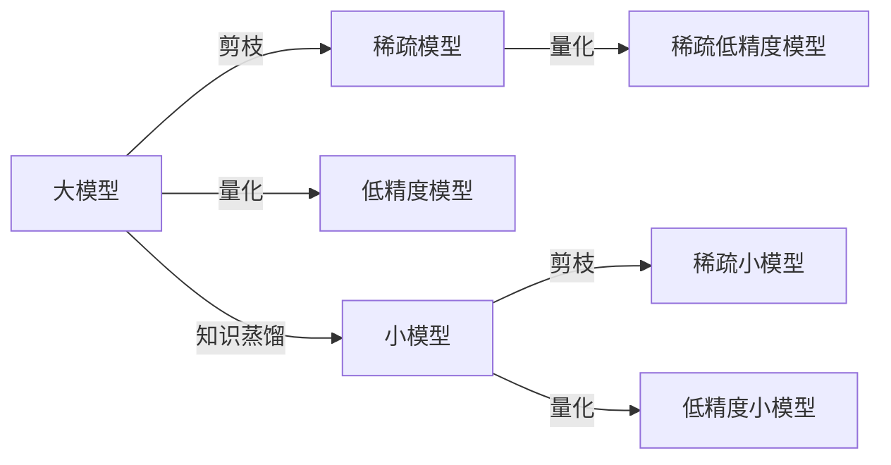

# Model Optimization 原理与代码实战案例讲解

关键词：模型优化、超参数调优、剪枝、量化、知识蒸馏、模型压缩

## 1. 背景介绍
### 1.1 问题的由来
随着深度学习的快速发展,神经网络模型在各个领域取得了巨大成功。然而,随之而来的是模型参数量和计算复杂度的急剧增加,这给模型在资源受限的场景下的部署带来了巨大挑战。如何在保证模型性能的同时,降低其存储和计算开销,成为了一个亟待解决的问题。
### 1.2 研究现状 
为了解决上述问题,学术界和工业界提出了一系列的模型优化方法。这些方法大致可以分为以下几类:
1. 超参数调优:通过搜索最优的网络结构和训练超参数来提升模型性能。代表方法有:网格搜索、随机搜索、贝叶斯优化等。
2. 剪枝:通过移除冗余和不重要的神经元或连接,在降低模型复杂度的同时保持其性能。代表方法有:L1/L2正则化剪枝、低秩分解等。
3. 量化:将模型参数和激活从高精度浮点数(如32位)量化到低精度(如8位整数),从而减小存储和计算量。 
4. 知识蒸馏:通过让小模型(学生)去模仿大模型(教师)的软目标,将知识从大模型转移到小模型,从而获得一个性能接近大模型的小模型。
5. 架构搜索:利用强化学习、进化算法等方法自动搜索最优的网络架构。

目前,上述方法在学术界已有大量研究,并在工业界得到了广泛应用。一些代表性的工作如下:
- Han等人提出的基于L1/L2正则和低秩分解的三阶段剪枝方法[1],在几乎不损失精度的情况下将模型压缩了40倍。 
- Howard等人提出的MobileNet[2]使用深度可分离卷积代替标准卷积,并通过超参数控制模型的宽度和分辨率,在同等计算量下取得了更高的精度。
- Hinton等人率先提出知识蒸馏[3],并被广泛应用于模型压缩中。一个典型的例子是SqueezeNet[4],它通过蒸馏ResNet-101的知识,获得了一个参数量减少50倍但精度相当的小模型。
- Zoph和Le利用强化学习搜索到了NASNet[5],在CIFAR-10上达到了当时最好的结果。

### 1.3 研究意义
模型优化技术对于深度学习的工程实践具有重要意义:
1. 降低部署门槛:优化后的模型可以部署到移动端、Web端等资源受限的场景,扩大深度学习的应用范围。
2. 加速推理:通过降低模型复杂度,可以显著提高推理速度,实现实时的交互和响应。
3. 节省成本:模型优化可以减少存储和通信带宽的需求,节省设备成本和运营开销。
4. 环保:模型优化通过提高能效,为节能减排做出了贡献。

总的来说,模型优化技术是连接深度学习研究和应用的重要桥梁,对于人工智能产业的良性发展具有重要意义。

### 1.4 本文结构
本文将全面介绍几种主流的模型优化技术,内容安排如下:
- 第2部分介绍模型优化涉及的一些核心概念。 
- 第3部分重点介绍剪枝、量化、知识蒸馏的原理和实现步骤。
- 第4部分对这些技术背后的数学原理进行详细推导和案例分析。
- 第5部分通过具体的代码实例,演示如何使用主流的深度学习框架实现模型优化。 
- 第6部分讨论模型优化技术在工业界的典型应用场景。
- 第7部分推荐一些学习模型优化的资源。
- 第8部分对全文进行总结,并对未来的发展趋势和挑战进行展望。

## 2. 核心概念与联系

在深入介绍模型优化方法之前,我们先来了解一些核心概念:
- 模型尺寸:通常用参数量和计算量(如FLOPs)来衡量。参数量影响模型的存储开销,计算量影响推理速度。
- 表示能力:模型对输入数据进行特征提取和函数拟合的能力,通常用精度指标(如分类误差)来衡量。  
- 冗余度:模型中存在大量对输出贡献很小的参数,去除它们不会明显影响性能。模型优化的目标就是去除这些冗余。
- 域外泛化:模型在训练数据(源域)之外的样本(目标域)上的性能。模型优化要尽量避免降低域外泛化能力。

下图展示了几种主要的模型优化技术之间的联系:

可以看到,不同的优化技术可以相互结合,比如:
- 首先对大模型进行剪枝,得到稀疏模型,然后再量化,进一步压缩。
- 首先通过知识蒸馏得到小模型,然后再通过剪枝或量化压缩。

实践中需要根据具体的任务需求和资源限制,灵活选择和组合不同的技术,以达到最佳的效果。

## 3. 核心算法原理 & 具体操作步骤
本节重点介绍三种常用的模型优化方法:剪枝、量化和知识蒸馏。

### 3.1 剪枝
剪枝通过去除冗余的结构(如神经元、卷积核、层等)来压缩模型。根据粒度可分为非结构化剪枝和结构化剪枝:
- 非结构化剪枝:以个别参数为单位进行剪枝,导致稀疏的连接模式。
- 结构化剪枝:以滤波器、层为单位进行剪枝,保持规整的结构。

#### 3.1.1 基于重要性评估的剪枝
这类方法的基本思想是:根据某种重要性指标,去除重要性低的结构。以基于L1范数的非结构化剪枝为例,具体步骤如下:
1. 正常训练模型。
2. 计算每个参数的L1范数(绝对值),作为其重要性得分。 
3. 根据预设的稀疏度,去除L1范数较小的参数,即令其永久为0。
4. 微调剪枝后的稀疏模型。
5. 重复2-4步,直到达到目标稀疏度或性能下降到不可接受的程度。

其他常见的重要性指标还有:
- L2范数
- 神经元激活值的平均大小
- 参数或激活值的梯度大小
- 参数或激活值的二阶导(Hessian)大小

#### 3.1.2 基于搜索的剪枝 
另一类剪枝方法不预设重要性指标,而是将剪枝看作一个组合优化问题,搜索最优的剪枝方案。以进化算法为例,步骤如下:
1. 将网络每一层的剪枝率编码为一个向量,作为个体的基因型。
2. 随机生成一个初始种群。 
3. 在当前种群中,根据每个个体的基因型对网络进行剪枝,并评估剪枝后模型在验证集上的性能,作为个体的适应度。
4. 对当前种群进行选择、交叉、变异,产生下一代种群。
5. 重复3-4步,直到达到进化代数或满意的性能。
6. 取适应度最高的个体所对应的剪枝方案。

其他常见的搜索算法还有:
- 强化学习
- 贪心搜索
- 启发式搜索

### 3.2 量化
量化是指将原本32位浮点型(FP32)的模型参数和中间激活值用更低比特数表示,常见的有:
- 16位浮点型(FP16)
- 8位整型(INT8)
- 二值(-1或1)
- 三值(-1、0或1)

量化可以显著减小模型尺寸(最高可达32倍),并通过有效利用硬件加速指令(如SIMD),提高计算效率。

量化方法可分为训练后量化(Post-Training Quantization,PTQ)和量化感知训练(Quantization-Aware Training,QAT)两大类。

#### 3.2.1 训练后量化
训练后量化是指在模型训练完成后,直接对其进行量化,不需要重新训练。以最简单的均匀量化为例,步骤如下:
1. 计算FP32参数的最大值$max$和最小值$min$。
2. 确定量化比特数$n$(如8),则量化级别数为$2^n$。
3. 计算量化步长$\Delta=\frac{max-min}{2^n-1}$。
4. 对每个FP32参数$x$,将其量化为离散级别:$round(\frac{x-min}{\Delta})$,然后再反量化为INT8值。

其中,$round$表示四舍五入。

此外还有其他训练后量化方法,如:
- 非均匀量化:不等间隔地划分量化级别,在参数分布密集的区间设置更多级别。代表方法有K-means量化。
- 聚类量化:将参数聚类为$2^n$类,每一类共享同一个INT8值(聚类中心)。

#### 3.2.2 量化感知训练
训练后量化虽然简单,但量化误差可能导致较大的性能下降,尤其是比特数很低时。量化感知训练通过在训练过程中加入量化操作,使模型自适应量化带来的误差,从而达到更好的量化效果。

以最简单的均匀量化为例,步骤如下:
1. 构建一个量化模拟函数$Q$,对FP32张量$x$进行量化和反量化:
$$
\begin{aligned}
Q(x) &= \Delta\cdot round(\frac{x}{\Delta}) \\
\Delta &= \frac{max(|x|)}{2^{n-1}-1}
\end{aligned}
$$
其中$n$为量化比特数。
2. 将$Q$插入到模型的每一层之后,对其输出进行量化。
3. 正常训练量化后的模型。
4. 训练完成后,使用$Q$对模型进行最终量化,保存为INT8格式。

QAT的其他改进方法包括:
- 学习量化步长:将$\Delta$作为可学习参数,与模型一起训练。
- 量化正则化:在损失函数中加入量化误差项,鼓励模型学习对量化鲁棒的特征。

### 3.3 知识蒸馏
知识蒸馏(Knowledge Distillation)是指使用一个容量大、性能好的教师模型(Teacher)去指导一个小的学生模型(Student),使其达到与教师模型相近的性能。

知识蒸馏的核心是软目标(Soft Target),即教师模型输出的类别概率分布。与硬目标(真实标签)相比,软目标包含了更多的信息,如不同类别之间的相关性。学生模型通过模仿教师模型的软目标,可以学到更多的"暗知识"(Dark Knowledge)。

标准的知识蒸馏步骤如下:
1. 训练教师模型,在验证集上达到满意的性能。
2. 使用教师模型对训练集进行推理,得到软目标。具体地,设教师模型的输出logits为$z_i$,温度系数为$T$,则软目标为:
$$
p_i = \frac{exp(z_i/T)}{\sum_j exp(z_j/T)}
$$
其中$i$为类别索引。$T$是一个超参数,控制软目标的平滑程度,通常取1到10之间。
3. 训练学生模型,在损失函数中加入软目标项:
$$
\mathcal{L} = \alpha \mathcal{L}_{CE}(y,\hat{y}) + (1-\alpha) T^2\mathcal{L}_{CE}(p,\hat{p})