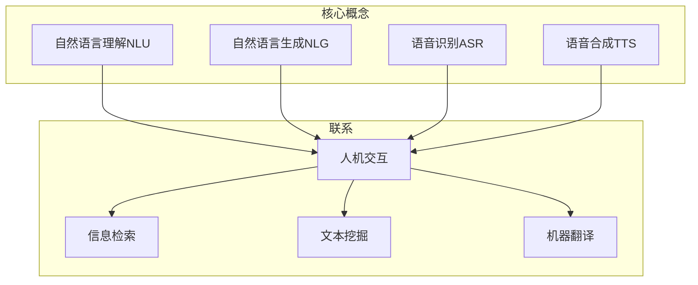
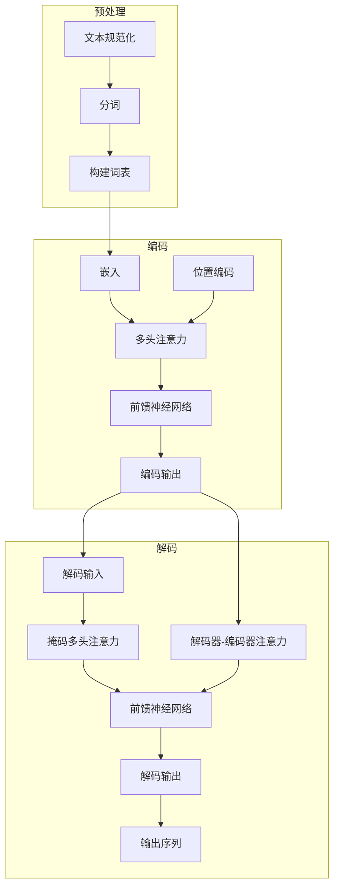

好的,我会按照您的要求,以"NLP是人类和计算机沟通的桥梁"为题目,写一篇专业的技术博客文章。我会努力遵循您列出的所有约束条件,包括字数、格式、完整性、目录结构等要求。文章将围绕自然语言处理(NLP)这一主题,深入探讨相关的核心概念、算法原理、数学模型、实践应用等内容。我会尽最大努力提供流程图、代码示例、公式推导等,确保内容专业、深入且实用。同时也会总结NLP的发展趋势和面临的挑战。以下是正文:

# NLP是人类和计算机沟通的桥梁

## 1. 背景介绍

### 1.1 问题的由来

自计算机诞生以来,人类一直梦想能与机器进行自然交流,就像与另一个人交谈一样顺畅无阻。但由于自然语言的复杂性和多样性,构建一个能够真正理解和生成人类语言的智能系统一直是一个巨大的挑战。

### 1.2 研究现状  

近年来,随着大数据、强大的计算能力和新的机器学习算法的出现,自然语言处理(NLP)技术取得了长足进步。我们已经能看到一些商用的NLP系统,如智能语音助手、机器翻译、自动问答等。但与人类水平的自然语言理解和生成能力相比,现有技术仍有很大差距。

### 1.3 研究意义

NLP技术的突破将极大推动人机交互的发展,让人类能以更自然、高效的方式与计算机进行信息交换和指令交互。这将为人类的工作、学习和生活带来全新的体验。因此,NLP一直是人工智能领域的核心研究方向。

### 1.4 本文结构

本文将首先介绍NLP的核心概念,然后深入探讨主流NLP算法的原理和实现细节。接下来将建立数学模型并推导公式,分析案例并解答常见问题。之后将给出项目实践的代码示例并解读。最后总结NLP的应用场景、发展趋势和面临的挑战。

## 2. 核心概念与联系



自然语言处理(NLP)是一门研究计算机处理人类语言的科学,包括两个核心任务:

1. **自然语言理解(NLU)**: 使计算机能够理解人类的自然语言输入,如文本、语音等。
2. **自然语言生成(NLG)**: 使计算机能够生成人类可以理解的自然语言输出。

与核心任务密切相关的是语音识别(ASR)和语音合成(TTS)技术。

NLP技术支撑了诸多应用场景,如人机交互系统(如智能助手)、信息检索系统、文本挖掘和机器翻译等。可以说,NLP就是人类与计算机之间进行自然语言交流的桥梁。

## 3. 核心算法原理 & 具体操作步骤  

### 3.1 算法原理概述

目前主流的NLP算法主要基于以下几种技术:

1. **统计机器学习算法**: 利用大量标注语料训练统计模型,如隐马尔可夫模型、条件随机场等。
2. **深度学习算法**: 使用神经网络自动从数据中学习特征表示,如卷积神经网络用于处理序列数据,循环神经网络及其变种用于处理变长序列等。
3. **规则与知识库方法**: 构建语言规则库和知识本体库,结合统计模型或深度模型进行语义理解。

不同算法适用于不同的NLP任务,如文本分类、序列标注、机器翻译、对话系统等。通常需要集成多种技术方案来完成复杂的NLP系统。

### 3.2 算法步骤详解

以下以基于注意力机制的Transformer模型为例,介绍序列到序列(Seq2Seq)任务的一般处理流程:



1. **预处理**:对原始文本进行规范化(如去除标点、转小写等)、分词,并构建词表。
2. **编码**:将输入序列的词条映射为向量表示(嵌入),并添加位置编码,然后通过多头注意力机制和前馈神经网络对序列进行编码,得到编码器输出。
3. **解码**:将编码器输出和解码器输入(如前一个时间步的输出词条)按照Transformer的结构通过多头注意力、编码器-解码器注意力和前馈网络计算出解码器输出,最后通过输出层(如Softmax)得到概率分布,选择概率最大的词条作为当前时间步输出。重复这一过程直至输出终止符。

上述算法流程可应用于机器翻译、文本摘要、对话系统等Seq2Seq任务。具体任务会在模型、注意力机制、损失函数等环节有所差异。

### 3.3 算法优缺点

**优点**:

- 基于注意力机制,可以更好地捕捉长距离依赖关系
- 并行计算,加速训练
- 无歧义性,每一步只生成一个词条

**缺点**:  

- 训练数据需求量大
- 容易出现曝光偏差(exposure bias)问题
- 难以捕捉长期上下文依赖关系

### 3.4 算法应用领域

Transformer等Seq2Seq模型及其变种已广泛应用于以下NLP任务:

- 机器翻译
- 文本摘要
- 对话系统
- 代码生成
- 任务导向对话

## 4. 数学模型和公式 & 详细讲解 & 举例说明

### 4.1 数学模型构建

我们以Transformer编码器的多头注意力机制为例,构建其数学模型。首先定义输入由n个词条组成的序列$X = (x_1, x_2, ..., x_n)$,其中$x_i$是第i个词条的词向量表示。

多头注意力机制由h个并行的注意力头组成,每个注意力头首先计算三个值:

$$
\begin{aligned}
Q_i &= XW_i^Q\\  
K_i &= XW_i^K\\
V_i &= XW_i^V\\
\end{aligned}
$$

其中$W_i^Q,W_i^K,W_i^V$分别是查询(Query)、键(Key)和值(Value)的可训练矩阵。

接着计算每个注意力头的注意力分数:

$$\text{head}_i = \text{Attention}(Q_i, K_i, V_i) = \text{softmax}(\frac{Q_iK_i^T}{\sqrt{d_k}})V_i$$

其中$d_k$是缩放因子,用于防止内积过大导致梯度消失。

最后,将所有注意力头的输出进行拼接并经过线性变换,得到多头注意力的最终输出:

$$\text{MultiHead}(Q, K, V) = \text{Concat}(\text{head}_1, ..., \text{head}_h)W^O$$

其中$W^O$是可训练的线性变换矩阵。

### 4.2 公式推导过程

我们以自注意力机制(Self-Attention)为例,推导其公式:

已知输入序列$X$,我们需要计算其加权和表示$Z$,其中每个位置$i$的权重$\alpha_{ij}$由$x_i$和$x_j$之间的相似度决定:

$$Z = \sum_{j=1}^n \alpha_{ij}(x_j)$$

根据注意力机制的思想,相似度可以用查询$q_i$与键$k_j$的点积来计算:

$$\alpha_{ij} = \frac{\exp(q_i^Tk_j)}{\sum_{l=1}^n\exp(q_i^Tk_l)}$$

其中分母项是用于归一化。将$q_i$和$k_j$分别替换为$x_iW^Q$和$x_jW^K$:

$$\alpha_{ij} = \frac{\exp((x_iW^Q)(x_jW^K)^T)}{\sum_{l=1}^n\exp((x_iW^Q)(x_lW^K)^T)}$$

将注意力分数$\alpha_{ij}$代入加权和公式,并引入值$v_j=x_jW^V$:

$$Z_i = \sum_{j=1}^n\frac{\exp((x_iW^Q)(x_jW^K)^T)}{\sum_{l=1}^n\exp((x_iW^Q)(x_lW^K)^T)}(x_jW^V)$$

这就是自注意力机制的完整公式。可以看出,它实现了将序列中每个位置的表示与其他位置的表示进行加权求和。

### 4.3 案例分析与讲解  

假设有一个输入序列"The dog chased the cat"。我们将其输入到Transformer编码器,看看多头注意力层对其进行编码的具体过程:

1. 首先将每个词条映射为词向量,如"The"映射为$x_1$。
2. 计算查询$Q$、键$K$和值$V$:
   
$$
\begin{aligned}
Q &= (x_1, x_2, x_3, x_4, x_5)W^Q\\
K &= (x_1, x_2, x_3, x_4, x_5)W^K\\
V &= (x_1, x_2, x_3, x_4, x_5)W^V
\end{aligned}
$$

3. 计算每个位置的注意力分数,如第一个位置"The"的注意力分数为:

$$\alpha_{1j} = \text{softmax}(\frac{q_1k_j^T}{\sqrt{d_k}})$$

其中$j$遍历整个序列的所有位置。

4. 对每个位置,将其注意力分数与值$V$相乘求和,作为该位置的输出表示:

$$z_1 = \sum_{j=1}^5 \alpha_{1j}v_j$$

5. 重复上述过程得到整个序列的输出表示$Z = (z_1, z_2, ..., z_5)$。

可以看出,多头注意力机制赋予了每个位置不同的注意力分数,使其能够更加关注对当前位置更为重要的其他位置信息。

### 4.4 常见问题解答

**Q1:为什么需要多头注意力机制?单头注意力不够吗?**

A:多头注意力机制可以从不同的表示子空间提取不同的信息,并通过组合来增强模型的表示能力。单头注意力只关注单一的表示子空间,难以捕捉到复杂的特征。

**Q2:注意力机制如何解决长序列的问题?**

A:注意力机制通过计算权重分数,可以直接捕捉任意两个位置之间的依赖关系,而不受序列长度的影响。这避免了RNN等顺序模型在长序列时出现的梯度消失或爆炸问题。

**Q3:注意力机制如何应用于非序列数据?**

A:注意力机制的思想不仅可以应用于序列数据,也可以推广到其他结构化数据,如图像、视频等。这种注意力机制被称为"空间注意力"。

## 5. 项目实践:代码实例和详细解释说明

### 5.1 开发环境搭建

本示例使用Python 3.7和PyTorch 1.7.1进行开发。首先安装必要的Python包:

```bash
pip install torch==1.7.1 torchtext==0.8.1
```

接下来下载翻译数据集,如WMT'14英德翻译数据:

```bash
wget https://nlp.stanford.edu/projects/nmt/data/wmt14.en-