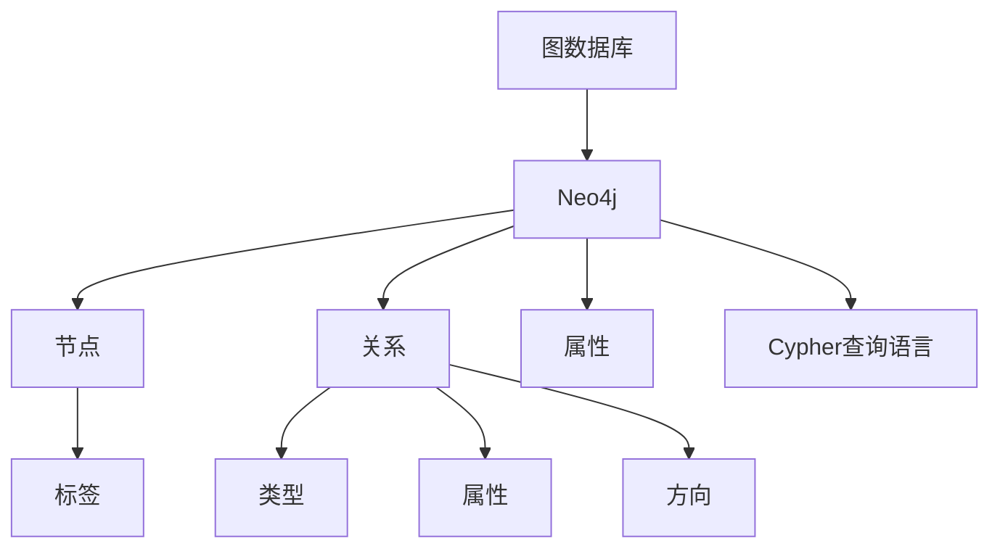
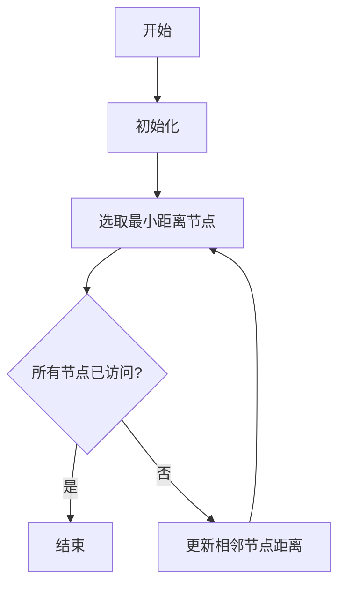
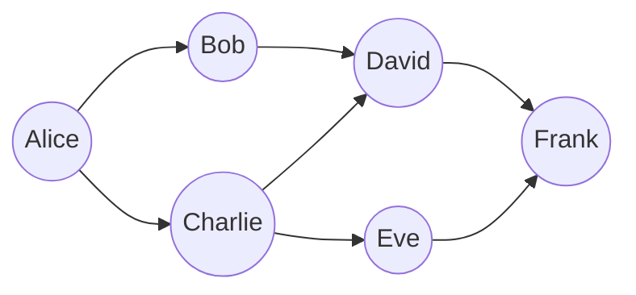

# Neo4j原理与代码实例讲解

## 1. 背景介绍

### 1.1 问题的由来

在当今数据驱动的时代，数据正以前所未有的规模和复杂性增长。传统的关系数据库在处理高度连接的数据时往往会遇到性能瓶颈和查询复杂性的挑战。这就催生了图数据库的兴起,Neo4j作为领先的图数据库,凭借其高效处理高度连接数据的能力,在各行各业得到了广泛应用。

### 1.2 研究现状  

图数据库的概念源于20世纪60年代提出的数学图论。早期的图数据库系统主要用于特定领域,如社交网络分析、基因组学等。直到2000年,Neo4j作为第一个开源的图数据库管理系统问世,标志着图数据库进入主流视野。

随着大数据时代的到来,越来越多的应用场景需要处理复杂的关系数据,如社交网络、知识图谱、推荐系统等。传统的关系数据库在处理这些数据时往往需要进行大量的表连接操作,效率低下。而Neo4j则天生适合处理这种高度连接的数据,因此受到了广泛关注和应用。

### 1.3 研究意义

掌握Neo4j的原理和实践技能,对于解决当前和未来的数据挑战至关重要。本文将深入探讨Neo4j的核心概念、算法原理、数学模型,并通过代码实例详细讲解其实现细节。读者将获得以下收获:

1. 理解图数据库的优势及适用场景
2. 掌握Neo4j的核心概念和原理
3. 熟悉Neo4j的查询语言Cypher
4. 能够基于Neo4j构建高效的图数据应用

### 1.4 本文结构

本文将从以下几个方面全面介绍Neo4j:

1. 背景介绍
2. 核心概念与联系
3. 核心算法原理与具体操作步骤  
4. 数学模型和公式详细讲解与案例分析
5. 项目实践:代码实例和详细解释
6. 实际应用场景
7. 工具和学习资源推荐
8. 总结:未来发展趋势与挑战
9. 附录:常见问题与解答

## 2. 核心概念与联系



Neo4j作为领先的图数据库,其核心概念包括:

1. **节点(Node)**: 代表图中的实体,如人、地点、事物等,可以通过标签(Label)对节点进行分类和过滤。
2. **关系(Relationship)**: 连接两个节点的链路,描述它们之间的关联,关系有类型、属性和方向。
3. **属性(Property)**: 为节点和关系赋予更多的上下文信息,属性是键值对的形式。
4. **Cypher查询语言**: Neo4j的声明式查询语言,类似于SQL,但专门针对图数据结构进行优化。

这些核心概念紧密相连,共同构建了Neo4j的图数据模型。开发者可以使用Cypher查询语言高效地查询、创建和管理图数据。

## 3. 核心算法原理与具体操作步骤

### 3.1 算法原理概述

Neo4j的核心算法主要包括:

1. **图遍历算法**: 用于高效查找节点之间的路径,如深度优先搜索(DFS)和广度优先搜索(BFS)。
2. **最短路径算法**: 计算两个节点之间的最短路径,如Dijkstra算法。
3. **图算法**: 用于分析图结构,如PageRank、社区发现、连通分量等。
4. **索引**: 提高查询效率的关键,Neo4j支持节点和关系的索引。

这些算法保证了Neo4j在处理大规模图数据时的高效性和可扩展性。

### 3.2 算法步骤详解

以Dijkstra算法为例,其步骤如下:



1. **初始化**: 将起点距离设为0,其他节点距离设为无穷大。
2. **选取最小距离节点**: 从未访问节点中选取距离最小的节点。
3. **更新相邻节点距离**: 更新该节点相邻节点的距离。
4. **重复2、3步骤**: 直到所有节点都被访问过。

### 3.3 算法优缺点

Neo4j算法的优点:

- 高效处理图数据,避免了关系数据库中的大量连接操作。
- 支持图分析算法,如最短路径、PageRank等。
- 可扩展性强,支持水平扩展。

缺点:

- 不适合处理高度规范化的结构化数据。
- 缺乏成熟的事务支持和ACID特性。
- 对于非图操作,性能可能不如关系数据库。

### 3.4 算法应用领域

Neo4j算法广泛应用于以下领域:

- **社交网络**: 分析人际关系网络、推荐好友等。
- **知识图谱**: 构建知识库,支持智能问答等。
- **金融风控**: 发现欺诈行为和洗钱网络。
- **网络与IT运维**: 管理复杂的网络拓扑结构。
- **生命科学**: 分析基因调控网络和蛋白质互作网络。

## 4. 数学模型和公式详细讲解与举例说明

### 4.1 数学模型构建

Neo4j的数学模型基于图论,可以用G(V,E)表示,其中:

- V是节点集合
- E是边集合,每条边连接两个节点

更formally:

$$
G = (V, E) \\
V = \\{v_1, v_2, ..., v_n\\} \\
E = \\{e_1, e_2, ..., e_m\\} \\
e_i = (v_j, v_k), v_j, v_k \in V
$$

节点和边可以带有属性,用于存储额外的上下文信息。

### 4.2 公式推导过程

以PageRank算法为例,它用于计算网页的重要性排名,Neo4j也使用了类似的算法来计算节点的重要性。

PageRank的迭代公式为:

$$
PR(v_i) = \frac{1-d}{N} + d \sum_{v_j \in In(v_i)} \frac{PR(v_j)}{L(v_j)}
$$

其中:

- $PR(v_i)$是节点$v_i$的PageRank值
- $In(v_i)$是指向$v_i$的节点集合
- $L(v_j)$是节点$v_j$的出度(指出边的数量)
- $d$是阻尼系数,通常取0.85
- $N$是图中节点的总数

算法的思路是,一个节点的PageRank值由其他节点的PageRank值以及指向它的边的数量决定。通过迭代计算,直到PageRank值收敛。

### 4.3 案例分析与讲解

考虑一个简单的社交网络图,包含6个人和他们之间的关系:



我们想计算每个人在这个网络中的重要性排名。使用PageRank算法,初始时每个节点的PR值都设为1/6。经过几轮迭代后,PR值收敛为:

- Alice: 0.22
- Bob: 0.15
- Charlie: 0.26
- David: 0.19  
- Eve: 0.11
- Frank: 0.07

可以看出,Charlie和Alice在这个网络中最重要,因为他们拥有最多的连接。而Frank的重要性最低,因为只有两个入边。

这个例子展示了PageRank算法如何根据节点之间的关系计算出重要性排名,在诸如社交网络影响力分析、搜索引擎排名等场景都有应用。

### 4.4 常见问题解答

**Q: Neo4j是如何存储图数据的?**

A: Neo4j使用了自己的本地存储引擎,将图数据存储在文件系统中。节点和关系以紧凑的二进制格式存储,属性使用键值对的形式。Neo4j还支持集群模式,可以通过分片和复制实现水平扩展。

**Q: Neo4j如何保证事务的ACID特性?**

A: Neo4j从4.0版本开始,引入了全面的ACID事务支持。它使用了写前日志(Write-Ahead Logging)和两阶段提交协议,确保即使在系统崩溃时也能恢复数据。不过,与传统关系数据库相比,Neo4j的事务支持还不够成熟。

## 5. 项目实践:代码实例和详细解释说明  

### 5.1 开发环境搭建

在实践之前,我们需要先搭建Neo4j的开发环境。Neo4j支持多种部署方式,包括:

1. **本地独立模式**: 下载Neo4j的zip包,解压后直接运行。适合开发和测试。
2. **Docker容器**: 使用官方提供的Docker镜像,快速部署Neo4j实例。
3. **云服务**: 使用像Neo4j Aura这样的云托管服务,无需自行部署。

本例中,我们将使用Docker容器的方式部署Neo4j。首先安装Docker,然后运行:

```bash
docker run \
    --publish=7474:7474 --publish=7687:7687 \
    --volume=$HOME/neo4j/data:/data \
    neo4j:latest
```

这将启动一个Neo4j实例,并将数据目录映射到主机的`$HOME/neo4j/data`。通过`http://localhost:7474`访问Neo4j浏览器界面。

### 5.2 源代码详细实现

我们将构建一个简单的社交网络应用,其中包含人物节点、城市节点以及他们之间的关系。下面是使用Cypher查询语言的代码实现:

#### 创建约束和索引

```cypher
CREATE CONSTRAINT UniqueNames ON (p:Person) ASSERT p.name IS UNIQUE;
CREATE CONSTRAINT UniqueCity ON (c:City) ASSERT c.name IS UNIQUE;
CREATE INDEX PersonNameIndex FOR (p:Person) ON (p.name);
CREATE INDEX CityNameIndex FOR (c:City) ON (c.name);
```

#### 创建节点和关系

```cypher
CREATE (alice:Person {name:"Alice"})
CREATE (bob:Person {name:"Bob"})
CREATE (charlie:Person {name:"Charlie"})
CREATE (david:Person {name:"David"})
CREATE (eve:Person {name:"Eve"})
CREATE (frank:Person {name:"Frank"})

CREATE (city1:City {name:"City A"})
CREATE (city2:City {name:"City B"})

CREATE (alice)-[:LIVES_IN]->(city1)
CREATE (bob)-[:LIVES_IN]->(city1)
CREATE (charlie)-[:LIVES_IN]->(city2)
CREATE (david)-[:LIVES_IN]->(city2)
CREATE (eve)-[:LIVES_IN]->(city2)
CREATE (frank)-[:LIVES_IN]->(city1)

CREATE (alice)-[:KNOWS]->(bob)
CREATE (alice)-[:KNOWS]->(charlie)
CREATE (bob)-[:KNOWS]->(david)
CREATE (charlie)-[:KNOWS]->(david)
CREATE (charlie)-[:KNOWS]->(eve)
CREATE (david)-[:KNOWS]->(frank)
CREATE (eve)-[:KNOWS]->(frank)
```

#### 查询和遍历

```cypher
// 查找Alice的朋友
MATCH (alice:Person {name:"Alice"})-[:KNOWS]->(friend)
RETURN friend.name

// 查找Alice所在城市的所有人
MATCH (p:Person)-[:LIVES_IN]->(c:City)<-[:LIVES_IN]-(alice:Person {name:"Alice"})
RETURN p.name

// 查找两个人之间的最短路径
MATCH (p1:Person {name:"Alice"}), (p2:Person {name:"Frank"}),
       path = shortestPath((p1)-[*..15]-(p2))
RETURN path

// 使用Cypher查询构建推荐系统
MATCH (p:Person {name:"Alice"})-[:KNOWS*2]-(rec:Person)
WHERE NOT (p)-[:KNOWS]-(rec)
RETURN rec.name AS Recommendation
```

上述代码展示了如何使用Cypher查询语言创建节点、关系,以及执行各种查询和遍历操作。Cypher语法简洁明了,与SQL类似,但专门针对图数据结构进行了优化。

### 5.3 代码解读与分析  

让我们对上面的