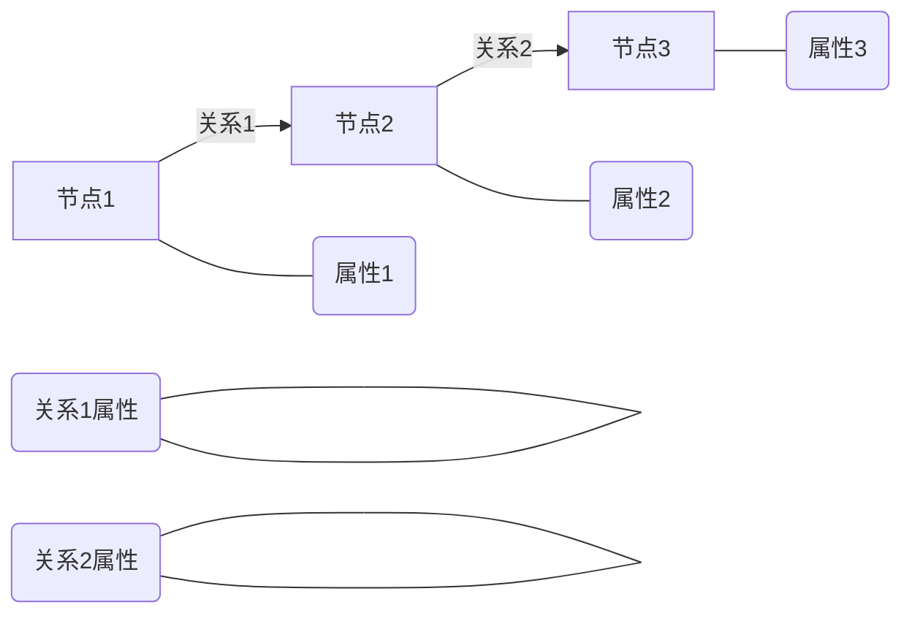

# Neo4j图数据库原理与Cypher代码实例讲解

## 1. 背景介绍

### 1.1 问题的由来

在当今数据爆炸式增长的时代，传统的关系型数据库在处理复杂的数据关系时显得力不从心。随着社交网络、物联网、生物信息学等领域的兴起,数据之间的关联性越来越强,网状结构和图形结构的数据模型变得越来越重要。传统关系型数据库在处理这些复杂关系时,需要进行大量的表连接操作,效率低下且难以维护。因此,一种专门处理图形结构数据的新型数据库应运而生——图数据库。

### 1.2 研究现状

图数据库是一种以图形结构存储数据的数据库管理系统,它使用节点(Node)、关系(Relationship)和属性(Property)来表示和存储数据。与关系型数据库相比,图数据库更擅长处理复杂的数据关系,特别适合于社交网络、推荐系统、知识图谱等领域。目前,图数据库领域的主要代表有Neo4j、JanusGraph、ArangoDB等。

其中,Neo4j作为图数据库的先驱和领导者,拥有活跃的社区和完善的生态系统,被广泛应用于各个领域。Neo4j不仅提供了高效的图形查询语言Cypher,还支持ACID事务、高可用性集群等企业级特性。

### 1.3 研究意义

本文将深入探讨Neo4j图数据库的原理和实践,旨在帮助读者全面了解图数据库的概念、优势、应用场景,并掌握使用Neo4j进行数据建模、查询和管理的技能。通过实际案例和代码示例,读者可以更好地理解图数据库的强大功能,并学习如何将其应用于实际项目中。

### 1.4 本文结构

本文将从以下几个方面展开讨论:

1. 介绍图数据库的核心概念和Neo4j的基本架构。
2. 详细解释Cypher查询语言的原理和使用方法。
3. 通过数学建模和公式推导,深入探讨Neo4j的图算法和查询优化策略。
4. 提供完整的代码示例,并对关键实现进行解读和分析。
5. 介绍Neo4j在不同领域的实际应用场景。
6. 推荐相关学习资源、开发工具和论文。
7. 总结Neo4j的发展趋势和面临的挑战。

## 2. 核心概念与联系

在深入探讨Neo4j图数据库之前,我们需要先了解一些核心概念。图数据库是基于图论的数据模型,它由节点(Node)、关系(Relationship)和属性(Property)组成。

**节点(Node)** 用于表示实体对象,如人、地点、事物等。每个节点都有一个唯一的标识符,并可以包含任意数量的属性。

**关系(Relationship)** 用于连接两个节点,表示它们之间的关联。关系具有方向性,可以是单向或双向。每个关系也可以包含属性,用于描述关系的性质。

**属性(Property)** 是键值对的形式,用于存储节点或关系的附加信息。属性可以是各种数据类型,如字符串、数字、布尔值等。

下图使用Mermaid流程图展示了图数据库的核心概念:

在图数据库中,数据以网状结构存储,节点通过关系相连。这种模型非常适合表示复杂的、互连的数据结构,如社交网络、推荐系统、知识图谱等。与关系型数据库相比,图数据库在处理复杂关系查询时具有更高的效率和灵活性。

Neo4j是目前最流行的图数据库之一,它基于属性图模型(Property Graph Model),支持使用声明式查询语言Cypher进行数据操作。Cypher语言简洁易学,能够高效地执行图形查询和遍历操作。

## 3. 核心算法原理 & 具体操作步骤

### 3.1 算法原理概述

Neo4j的核心算法原理是基于图论和图遍历算法。图遍历算法是图数据库中最常用的操作之一,用于查找节点之间的路径或满足特定条件的模式。Neo4j支持多种图遍历算法,包括深度优先搜索(DFS)、广度优先搜索(BFS)、A*算法等。

在Neo4j中,图遍历算法的执行过程如下:

1. 从起始节点开始遍历。
2. 根据查询条件和算法策略,选择下一个要访问的节点。
3. 访问选定的节点,并检查是否满足查询条件。
4. 如果满足条件,则将该节点加入结果集;否则继续遍历。
5. 重复步骤2-4,直到找到所有满足条件的节点或遍历完整个图。

不同的图遍历算法在选择下一个访问节点的策略上有所不同,从而导致了时间和空间复杂度的差异。例如,DFS算法使用递归或栈的方式进行深度优先遍历,适合查找单个路径;而BFS算法使用队列的方式进行广度优先遍历,适合查找最短路径。

### 3.2 算法步骤详解

以下是Neo4j中常见的图遍历算法步骤详解:

**1. 深度优先搜索(DFS)**

DFS算法从起始节点出发,沿着一条路径一直遍历下去,直到无法继续前进为止,然后回溯到上一个节点,尝试另一条路径。它的步骤如下:

1. 将起始节点压入栈。
2. 从栈顶取出一个节点n。
3. 检查n是否满足查询条件,如果满足则将n加入结果集。
4. 遍历n的所有邻居节点,将未访问过的邻居节点压入栈。
5. 重复步骤2-4,直到栈为空或找到所有满足条件的节点。

DFS算法的优点是空间复杂度较低,只需要维护一个栈即可。但它的缺点是可能会陷入死循环,因此需要设置遍历深度的上限。

**2. 广度优先搜索(BFS)**

BFS算法从起始节点开始,先访问所有距离为1的邻居节点,然后访问所有距离为2的节点,依次类推。它的步骤如下:

1. 将起始节点加入队列。
2. 从队列取出一个节点n。
3. 检查n是否满足查询条件,如果满足则将n加入结果集。
4. 将n的所有未访问过的邻居节点加入队列。
5. 重复步骤2-4,直到队列为空或找到所有满足条件的节点。

BFS算法的优点是能够找到起始节点到目标节点的最短路径,但它的缺点是空间复杂度较高,需要维护一个队列来存储所有待访问的节点。

**3. A*算法**

A*算法是一种启发式搜索算法,它结合了BFS和贪心算法的优点,能够更快地找到最短路径。它的步骤如下:

1. 将起始节点加入优先队列。
2. 从优先队列取出估计代价最小的节点n。
3. 检查n是否为目标节点或满足查询条件,如果是则返回结果。
4. 将n的所有未访问过的邻居节点加入优先队列,并计算它们的估计代价。
5. 重复步骤2-4,直到找到目标节点或队列为空。

A*算法的估计代价函数通常由两部分组成:已经走过的实际代价,以及到目标节点的预估代价(启发式函数)。合理的启发式函数可以大大提高A*算法的搜索效率。

### 3.3 算法优缺点

不同的图遍历算法各有优缺点,需要根据具体场景选择合适的算法:

- **DFS算法**
  - 优点:空间复杂度低,只需要维护一个栈。
  - 缺点:可能陷入死循环,需要设置遍历深度上限;不能保证找到最短路径。

- **BFS算法**
  - 优点:能够找到最短路径。
  - 缺点:空间复杂度较高,需要维护一个队列存储所有待访问节点。

- **A*算法**
  - 优点:综合了BFS和贪心算法的优点,能够更快地找到最短路径。
  - 缺点:需要设计合理的启发式函数,否则可能无法发挥优势;空间复杂度较高。

### 3.4 算法应用领域

图遍历算法在Neo4j中有广泛的应用场景,包括但不限于:

- **社交网络分析**:查找两个用户之间的关系路径、共同好友等。
- **推荐系统**:基于协同过滤算法,找到与目标用户兴趣相似的其他用户。
- **知识图谱**:查询实体之间的关系,进行语义推理和知识发现。
- **网络和电路布线**:寻找最短路径或满足特定条件的路径。
- **反垃圾邮件**:检测垃圾邮件发送者之间的关联网络。

## 4. 数学模型和公式 & 详细讲解 & 举例说明

### 4.1 数学模型构建

在Neo4j中,图数据库可以用数学模型来表示。我们将图G定义为一个有序对$(N, R)$,其中:

- $N$是一个非空的节点集合,表示图中的所有节点。
- $R$是一个关系集合,表示图中的所有关系。每个关系$r \in R$都是一个有序三元组$(n_1, n_2, t)$,其中$n_1, n_2 \in N$分别表示关系的起点和终点节点,而$t$表示关系的类型。

此外,我们还定义了一个属性函数$P$,将节点或关系映射到它们对应的属性集合。对于任意节点$n \in N$,有$P(n) = \{p_1, p_2, \dots, p_k\}$,其中$p_i$是节点$n$的属性。同理,对于任意关系$r = (n_1, n_2, t) \in R$,有$P(r) = \{q_1, q_2, \dots, q_m\}$,其中$q_j$是关系$r$的属性。

使用这个数学模型,我们可以形式化地表示和操作图数据库中的数据。例如,给定一个起点节点$n_s$和终点节点$n_t$,我们可以定义一个路径$\pi$为一个节点序列$\pi = \langle n_1, n_2, \dots, n_k \rangle$,其中$n_1 = n_s$,$n_k = n_t$,并且对于任意$1 \leq i < k$,都存在一个关系$r_i = (n_i, n_{i+1}, t_i) \in R$。路径的长度$l(\pi)$定义为路径中关系的数量,即$l(\pi) = k - 1$。

### 4.2 公式推导过程

在Neo4j中,图遍历算法的核心就是寻找满足特定条件的路径。我们可以将这个问题形式化为:给定一个图$G = (N, R)$、起点节点$n_s$、终点节点$n_t$以及一个路径条件$C$,找到所有从$n_s$到$n_t$的路径$\pi$,使得$\pi$满足条件$C$。

为了解决这个问题,我们可以使用图论中的一些概念和公式。首先,我们定义一个路径评估函数$f(\pi)$,用于衡量路径$\pi$是否满足条件$C$。如果$\pi$满足条件$C$,则$f(\pi) = 1$;否则$f(\pi) = 0$。

接下来,我们定义一个目标函数$F(G, n_s, n_t, C)$,表示从$n_s$到$n_t$的所有满足条件$C$的路径的集合:

$$
F(G, n_s, n_t, C) = \{\pi \mid \pi \text{ is a path from } n_s \text{ to } n_t \text{ in } G, f(\pi) = 1\}
$$

我们的目标就是找到$F(G,