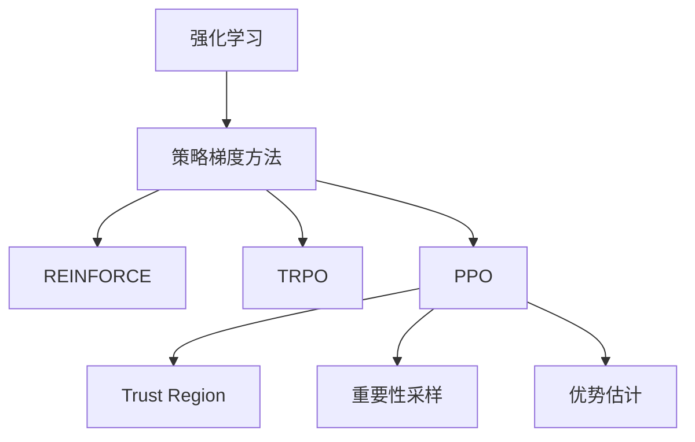

# PPO原理与代码实例讲解

## 1. 背景介绍

### 1.1 问题的由来

在强化学习领域中,策略梯度方法(Policy Gradient Methods)是一种常用的算法范式。传统的策略梯度方法存在一些问题,例如训练过程不稳定、样本利用效率低等。为了解决这些问题,Proximal Policy Optimization(PPO)算法应运而生。

### 1.2 研究现状 

PPO算法由OpenAI在2017年提出,并在同年发表在ICLR顶会上。该算法在Atari游戏等任务上取得了优异的表现,成为强化学习领域的一股新的力量。近年来,PPO算法得到了广泛的关注和研究,在连续控制、机器人控制、多智能体系统等领域均有应用。

### 1.3 研究意义

PPO算法的提出解决了传统策略梯度方法存在的不足,使得算法训练更加稳定,并提高了样本利用效率。研究PPO算法的原理及实现,有助于我们更好地理解和应用强化学习技术,为解决实际问题提供有力工具。

### 1.4 本文结构

本文将从以下几个方面全面介绍PPO算法:

1. 核心概念与联系
2. 核心算法原理及具体操作步骤
3. 数学模型和公式的详细推导及案例分析
4. 项目实践:代码实例和详细解释
5. 实际应用场景
6. 相关工具和学习资源推荐
7. 总结未来发展趋势与挑战
8. 常见问题解答

## 2. 核心概念与联系

PPO算法是建立在策略梯度方法的基础之上的。策略梯度方法的核心思想是直接对策略网络的参数进行优化,使得在当前策略下的期望回报最大化。

早期的策略梯度算法存在一些不足,比如REINFORCE算法的高方差问题。为了解决这一问题,Trust Region Policy Optimization(TRPO)算法被提出,它通过约束新老策略之间的差异来确保训练稳定性。但是TRPO算法计算复杂,效率较低。

PPO算法在TRPO的基础上做了简化,通过引入重要性采样和优势估计等技术,既保证了算法的稳定性,又提高了样本利用效率,成为了强化学习领域的主流算法之一。

## 3. 核心算法原理及具体操作步骤  

### 3.1 算法原理概述

PPO算法的核心思想是:在一定范围内最大化新策略相对于老策略的重要性比率的期望值,从而确保新策略相对于老策略的改善。具体来说,PPO算法通过以下两个部分实现:

1. **重要性采样(Importance Sampling)**:通过重要性采样比率来估计新老策略之间的差异,并对该比率进行裁剪,从而控制新老策略之间的差异在一定范围内。

2. **优势估计(Advantage Estimation)**:使用一种基于状态值函数的方法来估计每个状态的优势函数,作为策略梯度的基础。

通过上述两个部分的相互作用,PPO算法实现了策略的持续优化,并保证了训练的稳定性。

### 3.2 算法步骤详解

PPO算法的具体步骤如下:

1. **初始化**:初始化策略网络$\pi_\theta$和状态值网络$V_\phi$,其中$\theta$和$\phi$分别表示两个网络的参数。

2. **采样数据**:在当前策略$\pi_\theta$指导下,与环境进行交互,采集一批轨迹数据,包括状态、动作、奖励等。

3. **计算优势估计**:基于采样数据,使用广义优势估计(GAE)等方法计算每个状态的优势估计$\hat{A}_t$。

4. **更新策略网络**:使用PPO目标函数对策略网络$\pi_\theta$进行优化,目标函数定义如下:

$$J^{CLIP}(\theta)=\hat{\mathbb{E}}_t\left[\min\left(r_t(\theta)\hat{A}_t,\; \text{clip}(r_t(\theta),1-\epsilon,1+\epsilon)\hat{A}_t\right)\right]$$

其中$r_t(\theta)=\frac{\pi_\theta(a_t|s_t)}{\pi_{\theta_{old}}(a_t|s_t)}$是重要性采样比率,$\epsilon$是一个超参数,用于控制新老策略之间的差异范围。

5. **更新状态值网络**:基于采样数据,使用回归方法更新状态值网络$V_\phi$,以最小化均方误差:

$$\min_\phi \frac{1}{T}\sum_{t=0}^{T}\left(V_\phi(s_t)-\hat{V}_t^{targ}\right)^2$$

其中$\hat{V}_t^{targ}$是使用时间差分等方法估计的目标状态值。

6. **迭代训练**:重复步骤2-5,直到策略收敛或达到预设的训练次数。

### 3.3 算法优缺点

**优点**:

- 训练稳定:通过对策略改变的约束,确保新策略相对于老策略的改善,从而使训练过程更加稳定。
- 样本利用效率高:通过重要性采样和优势估计等技术,PPO算法能够充分利用采样数据,提高样本利用效率。
- 易于实现和调参:相比TRPO等算法,PPO算法的实现和调参相对简单。

**缺点**:

- 存在超参数:PPO算法需要调节裁剪范围$\epsilon$等超参数,对算法性能有一定影响。
- 收敛速度较慢:由于PPO算法对策略改变做了约束,可能导致收敛速度较慢。
- 样本效率仍有提升空间:尽管PPO算法提高了样本利用效率,但仍有进一步优化的空间。

### 3.4 算法应用领域

PPO算法作为强化学习领域的主流算法之一,已被广泛应用于多个领域,包括但不限于:

- 连续控制:如机器人控制、自动驾驶等。
- 游戏AI:在Atari游戏、棋类游戏等领域取得了优异的表现。
- 机器人控制:用于控制机器人完成各种任务,如行走、抓取等。
- 多智能体系统:在多个智能体之间进行协作或竞争。
- 自然语言处理:如对话系统、机器翻译等。

## 4. 数学模型和公式及详细讲解与举例说明

### 4.1 数学模型构建

在PPO算法中,我们需要构建两个核心的数学模型:策略模型和状态值模型。

**策略模型**:策略模型$\pi_\theta(a|s)$描述了在给定状态$s$下,选择动作$a$的概率分布,其中$\theta$是策略网络的参数。策略模型通常使用神经网络来表示,输入是状态$s$,输出是动作$a$的概率分布。

**状态值模型**:状态值模型$V_\phi(s)$估计了在给定状态$s$下,按照当前策略执行可获得的期望回报,其中$\phi$是状态值网络的参数。状态值模型同样使用神经网络来表示,输入是状态$s$,输出是对应的状态值估计。

在PPO算法中,我们需要同时优化策略模型和状态值模型的参数,以最大化期望回报,并保证训练的稳定性。

### 4.2 公式推导过程

PPO算法的目标函数是通过重要性采样和优势估计推导得到的。具体推导过程如下:

1. **策略梯度定理**:根据策略梯度定理,我们可以将期望回报$\eta(\theta)$对策略参数$\theta$的梯度表示为:

$$\nabla_\theta\eta(\theta)=\mathbb{E}_{\pi_\theta}\left[\nabla_\theta\log\pi_\theta(a|s)Q^{\pi_\theta}(s,a)\right]$$

其中$Q^{\pi_\theta}(s,a)$是在策略$\pi_\theta$下,状态$s$执行动作$a$后的期望回报。

2. **重要性采样**:为了估计新策略$\pi_{\theta'}$相对于老策略$\pi_{\theta}$的期望回报改善,我们引入重要性采样比率$r_t(\theta)=\frac{\pi_{\theta'}(a_t|s_t)}{\pi_{\theta}(a_t|s_t)}$,得到:

$$\eta(\theta')=\eta(\theta)+\mathbb{E}_{\pi_\theta}\left[r_t(\theta)Q^{\pi_\theta}(s,a)\right]$$

3. **优势估计**:由于$Q^{\pi_\theta}(s,a)$难以直接估计,我们引入优势估计$\hat{A}_t=Q^{\pi_\theta}(s_t,a_t)-V^{\pi_\theta}(s_t)$,其中$V^{\pi_\theta}(s_t)$是状态值函数。将优势估计代入上式,得到:

$$\eta(\theta')=\eta(\theta)+\mathbb{E}_{\pi_\theta}\left[r_t(\theta)\hat{A}_t\right]$$

4. **PPO目标函数**:为了控制新老策略之间的差异,我们对重要性采样比率$r_t(\theta)$进行裁剪,得到PPO目标函数:

$$J^{CLIP}(\theta)=\hat{\mathbb{E}}_t\left[\min\left(r_t(\theta)\hat{A}_t,\; \text{clip}(r_t(\theta),1-\epsilon,1+\epsilon)\hat{A}_t\right)\right]$$

通过最大化PPO目标函数,我们可以在一定范围内优化新策略相对于老策略的改善,从而实现稳定的策略优化。

### 4.3 案例分析与讲解

为了更好地理解PPO算法的原理和公式,我们以一个简单的网格世界(GridWorld)游戏为例进行分析和讲解。

在这个游戏中,智能体需要从起点出发,到达终点。智能体可以选择上下左右四个动作,每一步都会获得相应的奖励或惩罚。我们的目标是训练一个策略,使智能体能够找到从起点到终点的最优路径。

我们将使用PPO算法来训练这个策略。首先,我们初始化策略网络$\pi_\theta$和状态值网络$V_\phi$,并采集一批轨迹数据。然后,我们计算每个状态的优势估计$\hat{A}_t$,并使用PPO目标函数对策略网络进行优化:

$$J^{CLIP}(\theta)=\hat{\mathbb{E}}_t\left[\min\left(r_t(\theta)\hat{A}_t,\; \text{clip}(r_t(\theta),1-\epsilon,1+\epsilon)\hat{A}_t\right)\right]$$

其中$r_t(\theta)=\frac{\pi_\theta(a_t|s_t)}{\pi_{\theta_{old}}(a_t|s_t)}$是重要性采样比率,用于估计新老策略之间的差异。我们对$r_t(\theta)$进行裁剪,以控制新老策略之间的差异范围,从而确保训练的稳定性。

同时,我们还需要更新状态值网络$V_\phi$,以最小化均方误差:

$$\min_\phi \frac{1}{T}\sum_{t=0}^{T}\left(V_\phi(s_t)-\hat{V}_t^{targ}\right)^2$$

其中$\hat{V}_t^{targ}$是使用时间差分等方法估计的目标状态值。

通过不断迭代上述过程,我们可以逐步优化策略网络和状态值网络,使智能体最终学会从起点到达终点的最优路径。

### 4.4 常见问题解答

**Q1: PPO算法中的裁剪范围$\epsilon$如何选择?**

$\epsilon$是一个超参数,用于控制新老策略之间的差异范围。一般来说,$\epsilon$的取值范围在0.1到0.3之间。较小的$\epsilon$值会导致策略改变受到更多限制,训练更加稳定但收敛速度较慢;较大的$\epsilon$值则允许策略改变更加自由,收敛速度更快但训练可能不太稳定。因此,$\epsilon$的选择需要在稳定性和收敛速度之间权衡。通常可以先选择一个中等值(如0