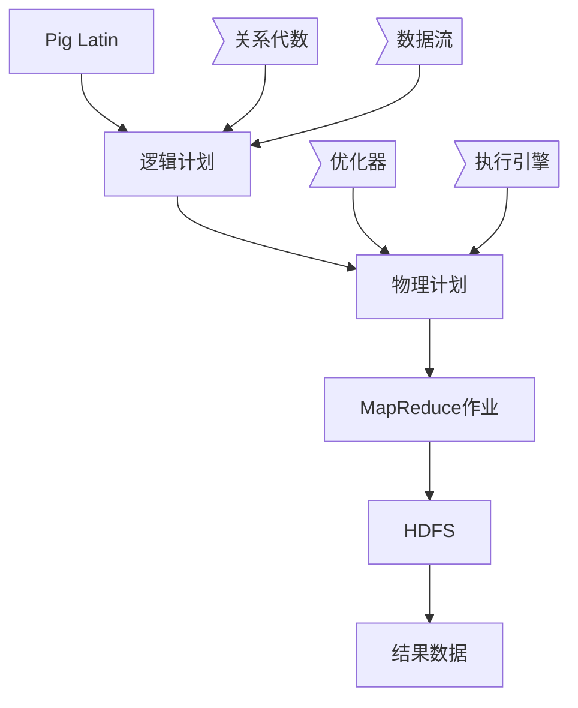

以下是《Pig原理与代码实例讲解》的技术博客文章正文:

# Pig原理与代码实例讲解

## 1. 背景介绍

### 1.1 问题的由来

在大数据时代,海量的结构化和非结构化数据被源源不断地产生和收集。如何高效地处理和分析这些数据,从中获取有价值的信息和见解,成为了企业和组织面临的一大挑战。传统的数据处理方式很难满足大数据场景下的需求,因此出现了一系列新的大数据处理框架和工具,其中Pig就是一种流行的大数据分析工具。

### 1.2 研究现状 

Apache Pig是一个用于大规模数据分析的开源平台,由Yahoo!开发并捐献给Apache软件基金会。它提供了一种高级的数据流语言(Pig Latin),使用户可以用类SQL的语法来描述复杂的数据处理流程,而不必直接编写MapReduce代码。Pig Latin脚本会被Pig解释器翻译成一系列MapReduce任务,并在Hadoop集群上执行。

Pig广泛应用于网络日志分析、会话数据处理、用户行为分析等领域。它简化了大数据处理的复杂性,提高了开发效率,成为了大数据工程师的重要工具之一。

### 1.3 研究意义

尽管Pig已经被广泛使用,但对于初学者来说,掌握Pig的原理和使用方法仍然是一个挑战。本文将深入探讨Pig的核心概念、算法原理、数学模型,并通过丰富的代码示例和案例分析,帮助读者全面理解Pig的工作机制和使用方法。

### 1.4 本文结构

本文首先介绍Pig的核心概念和它们之间的关系,然后深入探讨Pig的核心算法原理和数学模型,接着通过实际的代码示例和案例分析,说明如何在实践中使用Pig进行数据处理和分析。最后,本文总结了Pig的发展趋势和面临的挑战,并提供了一些有用的工具和资源推荐。

## 2. 核心概念与联系



Pig的核心概念包括:

1. **Pig Latin**: 一种类SQL的数据流语言,用于描述数据处理流程。
2. **逻辑计划**: Pig Latin脚本被解析和翻译成一系列逻辑操作的有向无环图。
3. **物理计划**: 逻辑计划经过优化器优化后,生成对应的物理执行计划。
4. **MapReduce作业**: 物理计划被映射为一系列MapReduce作业,在Hadoop集群上执行。
5. **HDFS**: Hadoop分布式文件系统,用于存储输入数据和输出结果。

Pig Latin脚本基于关系代数和数据流模型,被解析和翻译成逻辑计划。逻辑计划经过优化器优化,生成物理计划。物理计划由执行引擎映射为MapReduce作业,在Hadoop集群上并行执行,读写数据使用HDFS。最终的结果数据存储在HDFS中。

## 3. 核心算法原理 & 具体操作步骤  

### 3.1 算法原理概述

Pig的核心算法原理包括:

1. **解析和翻译**: 将Pig Latin脚本解析成抽象语法树(AST),并翻译成逻辑计划。
2. **逻辑优化**: 对逻辑计划进行一系列优化,如投影剪枝、过滤器下推等。
3. **物理优化**: 根据集群状态和数据统计信息,对逻辑计划进行代价模型优化,生成物理计划。
4. **执行引擎**: 将物理计划映射为一系列MapReduce作业,并行执行在Hadoop集群上。

### 3.2 算法步骤详解

1. **解析和翻译**
    - 词法分析: 将Pig Latin脚本分割成一个个有意义的标记(token)。
    - 语法分析: 根据Pig Latin语法规则,构建抽象语法树(AST)。
    - 语义分析: 对AST进行类型检查、名称解析等语义分析。
    - 逻辑计划生成: 将AST翻译成逻辑计划,即一系列逻辑操作的有向无环图。

2. **逻辑优化**
    - 投影剪枝: 去除不需要的字段投影。
    - 过滤器下推: 将过滤条件尽可能下推到数据源。
    - 常量折叠: 预计算常量表达式。
    - 逻辑重写: 重写逻辑表达式,以更高效的形式执行。

3. **物理优化**
    - 代价模型: 根据集群状态和数据统计信息,估算每个物理操作符的代价。
    - 查询重写: 根据代价模型,重写查询计划以获得更优的执行方案。
    - 并行度选择: 根据数据大小和集群资源,为每个操作符选择合适的并行度。

4. **执行引擎**
    - 作业构建: 将物理计划映射为一系列MapReduce作业。
    - 作业调度: 根据作业依赖关系,将作业提交到Hadoop集群执行。
    - 监控和故障恢复: 监控作业执行状态,并在发生故障时进行恢复。

### 3.3 算法优缺点

**优点**:

- 简化编程模型,使用类SQL语法,降低了大数据处理的复杂性。
- 自动优化和并行执行,提高了处理效率。
- 可扩展性强,支持用户自定义函数(UDF)。

**缺点**:

- 对迭代计算和流式计算支持较弱。
- 调试和错误处理相对困难。
- 对于小数据集的处理,性能可能不如手写MapReduce代码。

### 3.4 算法应用领域

Pig算法广泛应用于以下领域:

- 网络日志分析
- 用户行为分析
- 推荐系统
- 数据仓库构建
- 机器学习特征工程
- 文本处理
- ...

## 4. 数学模型和公式 & 详细讲解 & 举例说明

### 4.1 数学模型构建

Pig的数学模型基于关系代数和数据流模型。

**关系代数模型**:

设有关系 $R(A_1, A_2, ..., A_n)$, 其中 $A_i (1 \leq i \leq n)$ 为属性。常见的关系代数运算包括:

- 选择 (Selection): $\sigma_{条件}(R)$
- 投影 (Projection): $\pi_{A_1, A_2, ..., A_k}(R)$  
- 并 (Union): $R \cup S$
- 差 (Difference): $R - S$
- 笛卡尔积 (Cartesian Product): $R \times S$
- 连接 (Join): $R \bowtie S$
- ...

**数据流模型**:

数据被视为一系列的数据元组(tuples)流。Pig Latin语句描述了对数据流执行的一系列转换操作,如:

- 过滤 (Filter): $F(R)$
- 映射 (Map): $M(R)$
- 分组 (Group): $G(R)$
- 连接 (Join): $J(R, S)$
- ...

通过将关系代数运算映射到数据流转换操作,Pig可以高效地处理大规模数据。

### 4.2 公式推导过程

考虑以下Pig Latin语句:

```pig
A = LOAD 'data' AS (x:int, y:int);
B = FILTER A BY x > 10;
C = GROUP B BY y;
D = FOREACH C GENERATE group, COUNT(B);
STORE D INTO 'output';
```

该脚本的执行过程可表示为:

$$
\begin{align*}
A &= \text{LOAD}(\text{'data'}) \\
B &= \sigma_{x > 10}(A) \\
C &= G_y(B) \\
D &= \pi_{y, \text{COUNT}(*)}(C) \\
\text{STORE}(D, \text{'output'})
\end{align*}
$$

其中:

- $A$ 是从文件 'data' 加载的初始关系
- $B$ 是对 $A$ 进行选择 ($x > 10$) 的结果
- $C$ 是对 $B$ 按 $y$ 属性分组的结果
- $D$ 是对 $C$ 进行投影和聚合计数的结果
- 最终将 $D$ 存储到文件 'output' 中

通过将关系代数运算表示为数据流转换,Pig可以高效地并行执行这些操作。

### 4.3 案例分析与讲解

假设我们有一个网站访问日志文件,其中每行记录包含以下字段:

```
user_id, timestamp, url, http_status
```

我们希望统计每个用户访问网站的总次数和状态码为200(成功)的次数。可以使用以下Pig Latin脚本:

```pig
-- 加载原始数据
logs = LOAD 'access_logs' AS (user, ts, url, status:int); 

-- 过滤出状态码为200的记录
ok_logs = FILTER logs BY status == 200;

-- 分组计算每个用户的总访问次数和状态码200的次数  
user_stats = FOREACH (GROUP ok_logs BY user) {
    ok_count = COUNT(ok_logs);
    all_count = COUNT(logs);
    GENERATE group AS user, ok_count, all_count;
}

-- 存储结果
STORE user_stats INTO 'user_access_stats';
```

让我们逐步分析这个脚本:

1. 首先使用 `LOAD` 从文件 'access_logs' 加载原始日志数据,并为每个字段指定别名。

2. 使用 `FILTER` 过滤出状态码为200的记录,得到 `ok_logs` 关系。

3. 使用 `GROUP...BY` 按 `user` 字段对 `ok_logs` 进行分组。

4. 在 `FOREACH` 语句中:
    - `ok_count = COUNT(ok_logs)` 计算每个分组(即每个用户)中状态码为200的记录数。
    - `all_count = COUNT(logs)` 计算每个用户的总访问次数(使用外部数据 `logs`)。
    - `GENERATE` 输出每个用户的ID、状态码200的访问次数和总访问次数。

5. 最后使用 `STORE` 将结果存储到文件 'user_access_stats' 中。

通过这个案例,我们可以看到Pig Latin语句如何清晰地表达数据处理逻辑,以及Pig如何高效地执行这些操作。

### 4.4 常见问题解答

**1. 如何在Pig脚本中使用用户自定义函数(UDF)?**

可以使用 `DEFINE` 语句注册UDF,然后在脚本中像内置函数一样使用它。例如:

```pig
DEFINE myUdf `com.example.MyUdf()`;
...
filtered = FILTER logs BY myUdf(url);
```

**2. Pig如何处理数据倾斜问题?**

数据倾斜是指数据在分区或分组时出现数据分布不均匀的情况,可能导致作业效率低下。Pig提供了一些技术来缓解数据倾斜问题,如:

- 使用 `SKEWED` 语句处理倾斜键
- 调整分区数和分组策略
- 使用采样和分块技术

**3. Pig是否支持流式处理?**

Pig原生不支持流式处理,但可以通过与其他系统(如Apache Storm)集成来实现近实时的流式处理。

## 5. 项目实践:代码实例和详细解释说明

### 5.1 开发环境搭建

1. 安装Hadoop和Pig
    - 下载Hadoop和Pig的二进制包
    - 配置环境变量
    - 启动Hadoop集群和Pig

2. 使用Pig命令行工具
    - `pig` 进入Grunt shell交互式环境
    - `pig -x local` 在本地文件系统上运行Pig脚本
    - `pig -x mapreduce` 在HDFS上运行Pig脚本

3. 集成开发环境
    - 使用IDE如IntelliJ IDEA或Eclipse
    - 安装Pig插件
    - 配置Hadoop和Pig运行环境

### 5.2 源代码详细实现

以下是一个使用Pig Latin实现单词计数(Word Count)的示例:

```pig
-- 加载输