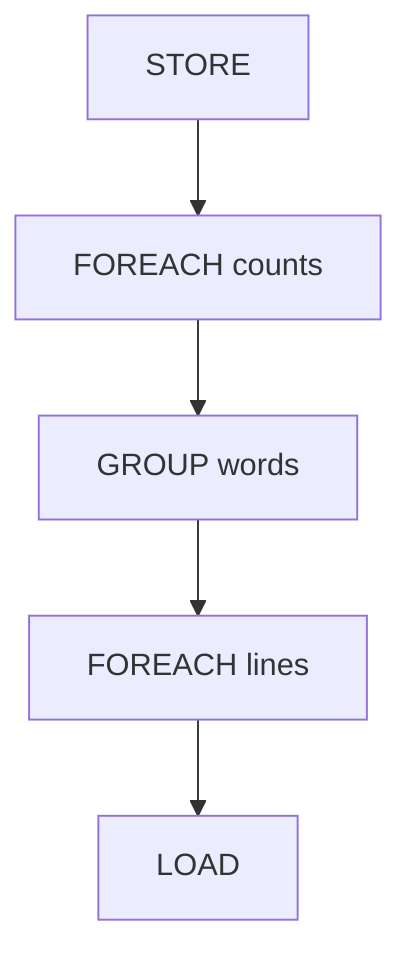

# Pig大规模数据分析平台原理与代码实例讲解

关键词：大数据、Pig、数据分析、MapReduce、Hadoop

## 1. 背景介绍
### 1.1  问题的由来
随着互联网、物联网等技术的快速发展,数据呈现爆炸式增长。如何高效地存储、处理和分析海量数据成为了企业和研究机构面临的重大挑战。传统的数据处理方式已经无法满足大数据时代的需求,迫切需要一种高效、易用、可扩展的大规模数据分析平台。
### 1.2  研究现状
目前,针对大数据处理已经出现了多种技术方案,如Hadoop、Spark、Flink等。其中,Hadoop生态系统因其成熟、稳定、可扩展等特点被广泛应用。Pig作为Hadoop生态系统中的重要组成部分,提供了一种高层次的数据流语言Pig Latin,大大简化了MapReduce程序的开发。众多企业如Yahoo、Twitter、LinkedIn都在使用Pig进行大规模数据分析。
### 1.3  研究意义
深入研究Pig的原理和应用,对于掌握大数据处理技术、提升数据分析效率具有重要意义。通过学习Pig的架构设计、工作原理、Pig Latin语言特性以及代码实例,可以帮助我们更好地理解大规模数据分析的实现方式,为构建高效的数据分析应用奠定基础。同时,Pig也为不同行业和领域的数据分析需求提供了一种可行的解决方案。
### 1.4  本文结构
本文将全面介绍Pig大规模数据分析平台的原理与应用。内容涵盖Pig的核心概念、架构设计、工作原理、Pig Latin语言详解、代码实例讲解、实际应用场景等多个方面。通过本文的学习,读者可以系统地掌握Pig技术,并能够运用Pig进行高效的大规模数据分析。

## 2. 核心概念与联系
在正式介绍Pig原理之前,我们先来了解一下Pig的几个核心概念:
- Pig:一个基于Hadoop的大规模数据分析平台,提供Pig Latin数据流语言,编译成MapReduce任务在Hadoop集群上运行。
- Pig Latin:Pig平台使用的高级数据流语言,支持结构化和半结构化数据的处理,使用类SQL语法。
- MapReduce:Hadoop的核心编程模型,用于大规模数据的并行处理。Pig Latin程序会被Pig编译器转换为一系列MapReduce任务。
- HDFS:Hadoop分布式文件系统,为Pig提供了数据存储。
- Grunt:Pig的交互式Shell界面,用于编写和执行Pig Latin脚本。
下图展示了Pig与Hadoop生态系统的关系:


可以看出,Pig Latin脚本经过Pig平台的解析和编译,转换成一系列MapReduce任务在Hadoop集群上执行,处理HDFS上存储的数据,最终将计算结果回写到HDFS。Pig屏蔽了MapReduce编程的复杂性,提供了更加简单友好的Pig Latin语言,使得开发人员能够更加高效地实现复杂的数据处理和分析逻辑。

## 3. 核心算法原理 & 具体操作步骤
### 3.1  算法原理概述
Pig的核心算法是将Pig Latin脚本转换为MapReduce任务的过程。具体来说,主要经历以下步骤:
1. 语法解析:将Pig Latin脚本解析成抽象语法树AST。
2. 逻辑优化:对AST进行逻辑优化,如列剪枝、过滤下推等。
3. 物理优化:将优化后的逻辑计划转换成物理计划,生成MapReduce任务。
4. MapReduce执行:在Hadoop集群上执行MapReduce任务,完成数据处理。
### 3.2  算法步骤详解
接下来,我们对Pig的核心算法步骤进行详细说明。
#### 3.2.1 语法解析
Pig Latin脚本首先会经过词法分析和语法分析,生成抽象语法树AST。在这个过程中,Pig脚本中的每一条语句都会被解析成树的一个节点。
例如对于以下Pig Latin脚本:
```
lines = LOAD 'input.txt' AS (line:chararray); 
words = FOREACH lines GENERATE FLATTEN(TOKENIZE(line)); 
grouped = GROUP words BY $0;
counts = FOREACH grouped GENERATE group, COUNT(words);
STORE counts INTO 'output';
```
解析后的AST如下图所示:



#### 3.2.2 逻辑优化
语法树生成后,Pig会对其进行一系列的逻辑优化,包括:
- 列剪枝:删除查询中未使用的列,减少数据传输量。
- 过滤下推:将过滤条件提前到数据源处执行,减少处理的数据量。
- 投影下推:类似列剪枝,将投影操作下推到数据源。
- 合并连续的FOREACH操作。

逻辑优化后,语法树变得更加简洁高效。
#### 3.2.3 物理优化
逻辑计划优化完成后,Pig会将其转换成物理计划,即一系列的MapReduce任务。每个逻辑操作节点会被转换为若干个MapReduce任务,并添加必要的数据shuffle和sort操作,形成完整的DAG图。
上述示例脚本的物理计划如下:


#### 3.2.4 MapReduce任务执行
物理计划生成后,Pig会将MapReduce任务提交到Hadoop集群运行。每个MapReduce任务都会被分配到集群的节点上并行执行。Mapper负责数据的读取和转换,Reducer负责数据的聚合计算,最终将结果写回HDFS。

### 3.3  算法优缺点
Pig的优点主要有:
- 使用Pig Latin这种高级语言编程,开发效率高。
- 程序自动转换为MapReduce,屏蔽了并行计算的复杂性。
- 良好的可扩展性,可处理PB级数据。
- 丰富的内置函数,支持UDF。

Pig的缺点包括:
- 实时性不足,更适合离线批处理。
- 对于复杂的算法实现不够灵活。
- 面向熟悉SQL的分析人员,对工程师不够友好。

### 3.4  算法应用领域
Pig广泛应用于各种大规模数据分析场景,如:
- 日志分析:分析Web服务器日志,统计PV、UV等。
- 用户行为分析:分析用户的搜索、浏览、购买行为,挖掘用户特征。
- 文本处理:自然语言处理、文本挖掘等。
- 图计算:社交网络分析、PageRank计算等。
- 数据ETL:海量数据的清洗、转换、统计等。

## 4. 数学模型和公式 & 详细讲解 & 举例说明
### 4.1  数学模型构建
Pig本质上是将数据分析任务转换为MapReduce模型,因此可以用MapReduce的数学模型来描述。
设输入数据集为$D={d_1,d_2,...,d_n}$,Map函数为$f_m$,Reduce函数为$f_r$。
Map阶段:

$map(k_1,v_1) \rightarrow list(k_2,v_2)$

$f_m(d_i) \rightarrow list((k_2^{(i,1)},v_2^{(i,1)}),(k_2^{(i,2)},v_2^{(i,2)}),...,(k_2^{(i,j)},v_2^{(i,j)}))$

Reduce阶段:

$reduce(k_2, list(v_2)) \rightarrow list(v_3)$

$f_r(k_2^{i}, list(v_2^{(i,1)}, v_2^{(i,2)},...,v_2^{(i,j)})) \rightarrow list(v_3^{(i,1)}, v_3^{(i,2)},...,v_3^{(i,k)})$

其中,$k_1$和$k_2$表示Map和Reduce的输入键,$v_1$、$v_2$、$v_3$表示对应的值。

### 4.2  公式推导过程
以WordCount为例,推导Pig Latin脚本与MapReduce数学模型的对应关系。
Pig Latin脚本:
```
lines = LOAD 'input' AS (line:chararray);
words = FOREACH lines GENERATE FLATTEN(TOKENIZE(line)) AS word; 
word_groups = GROUP words BY word;
word_count = FOREACH word_groups GENERATE group, COUNT(words);
STORE word_count INTO 'output';
```

Map阶段:
$f_m(line_i) \rightarrow list((w_1,1),(w_2,1),...,(w_j,1))$
其中,$w_j$表示第$i$行中第$j$个单词。

Combine阶段(可选):
$f_c(w_j,list(1,1,...)) \rightarrow (w_j,n)$
其中,$n$表示单词$w_j$在该Mapper中出现的次数。

Reduce阶段:
$f_r(w_j,list(n_1,n_2,...,n_k)) \rightarrow (w_j,\sum_{i=1}^{k}n_i)$
即将各个Mapper统计的同一单词的计数累加,得到该单词在整个数据集中出现的总次数。

### 4.3  案例分析与讲解
下面以一个实际的WordCount例子来说明。
输入数据input.txt:
```
hello world
hello hadoop 
hello pig
```
Pig Latin脚本:
```
lines = LOAD 'input.txt' AS (line:chararray);
words = FOREACH lines GENERATE FLATTEN(TOKENIZE(line)) AS word; 
word_groups = GROUP words BY word;
word_count = FOREACH word_groups GENERATE group, COUNT(words);
DUMP word_count;
```

Map阶段输出:
```
(hello,1)
(world,1)  
(hello,1)
(hadoop,1)
(hello,1)
(pig,1)
```

Reduce阶段输出:
```
(hadoop,1)
(hello,3)
(pig,1)
(world,1)
```

可以看出,MapReduce模型与Pig Latin脚本的对应关系为:
- Load对应输入数据集$D$
- Tokenize和Flatten对应Map函数$f_m$
- Group By对应MapReduce的shuffle过程  
- Count对应Reduce函数$f_r$

通过数学模型和代码实例的结合,可以加深对Pig工作原理的理解。

### 4.4  常见问题解答
1. Pig Latin与SQL的区别是什么?
   Pig Latin是面向数据流的过程式语言,而SQL是面向数据集的声明式语言。Pig Latin更灵活,可以定义复杂的数据流,而SQL更简洁,适合关系型数据。
2. Pig的性能如何?  
   Pig基于MapReduce,通过并行计算获得了很好的性能。但Pig会引入额外的开销,如数据解析、任务调度等,因此性能不如手写MapReduce。不过Pig的开发效率要高得多。
3. Pig适合处理哪些数据? 
   Pig适合处理结构化和半结构化数据,如日志、文本、CSV等。对于完全非结构化数据,如图片、视频等,则不太适合。
4. Pig如何处理数据倾斜?
   combiner可以在Map端合并数据,减少数据倾斜。此外,还可以使用Pig Latin中的SAMPLE、FILTER等操作进行数据过滤,或者自定义Partition函数调整数据分布。

## 5. 项目实践：代码实例和详细解释说明
### 5.1  开发环境搭建
首先需要搭建Pig开发环境。Pig可以运行在单机或者集群模式下,这里以单机模式为例。
准备工作:
- 安装JDK
- 安装Hadoop
- 下载Pig安装包
安装步骤:
1. 解压Pig安装包到指定目录
   ```shell
   tar -zxvf pig-0.17.0.tar.gz -C /usr/local
   ```
2. 配置环境变量
   ```shell
   vim ~/.bashrc
   export PIG_HOME=/usr/local/pig-0.17.0
   export PATH=$PIG_HOME/bin:$PATH
   source ~/.bashrc  
   ```
3. 验证安装
   ```shell
   pig -help
   ```
   出现Pig帮助信息说明安装成功。

### 5