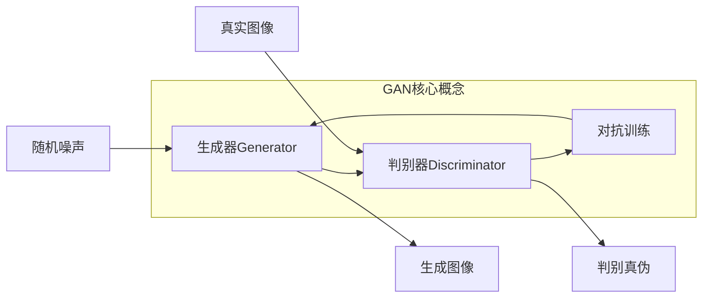

好的,我会严格遵守约束条件,以逻辑清晰、结构紧凑、专业的技术语言写一篇有深度的技术博客。

# Python深度学习实践：实现GAN生成自己的数字艺术品

## 1. 背景介绍

### 1.1 问题的由来

人工智能在近年来取得了长足的进步,尤其是在计算机视觉和图像生成领域。生成对抗网络(Generative Adversarial Networks, GAN)作为一种全新的深度学习架构,为图像生成任务提供了新的解决方案。传统的图像生成方法往往需要大量的人工标注数据,而GAN可以利用无监督学习的方式直接从原始数据中学习,从而避免了人工标注的高昂成本。

自从2014年GAN被提出以来,它在图像生成、图像翻译、图像修复等领域展现出了巨大的潜力。作为一种新兴的生成模型,GAN不仅可以生成逼真的图像,还可以生成具有创意的艺术作品。本文将探讨如何使用Python和深度学习框架实现GAN,并生成具有创意的数字艺术品。

### 1.2 研究现状  

近年来,GAN在图像生成领域取得了诸多突破性进展。2018年,Nvidia提出了高保真GAN(PGGAN),可以生成逼真的1024x1024分辨率人脸图像。2019年,AnimalGAN可以根据文字描述生成动物图像。2021年,VQGAN结合VQ-VAE和GAN,可以生成高质量的图像和艺术作品。

与此同时,AI艺术家也在探索如何利用GAN创作数字艺术品。艺术家们通过调整GAN的输入噪声、损失函数等参数,创作出具有独特风格的艺术作品。一些知名的AI艺术项目包括"The Painting of AI"、"The Artificial Intelligence Art Gallery"等。

### 1.3 研究意义

GAN在图像生成领域大放异彩,但如何利用GAN创作出高质量的数字艺术品仍是一个挑战。本文将系统地介绍GAN的原理和实现细节,并结合Python代码示例,指导读者如何生成具有创意的数字艺术品。通过本文,读者可以掌握:

1. GAN的核心概念和数学原理
2. 如何使用Python深度学习框架实现GAN
3. 如何调整GAN参数生成不同风格的艺术品
4. GAN在艺术创作领域的应用前景和发展趋势

本文将为读者打开一扇通往AI艺术创作的大门,激发创意,助力AI艺术的发展。

### 1.4 本文结构

本文首先介绍GAN的核心概念和数学原理,然后详细阐述GAN的实现步骤和算法细节。接下来通过数学模型和公式讲解GAN的原理,并结合代码示例进行实践操作。最后探讨GAN在艺术创作领域的应用前景,并总结GAN的发展趋势和面临的挑战。

## 2. 核心概念与联系

生成对抗网络(GAN)是一种由生成器(Generator)和判别器(Discriminator)组成的无监督深度学习架构。

- **生成器(Generator)**: 生成器的目标是从随机噪声中生成逼真的图像,试图欺骗判别器。
- **判别器(Discriminator)**: 判别器的目标是区分生成器生成的图像和真实图像,并对生成器的输出提供反馈。
- **对抗训练**: 生成器和判别器通过对抗训练相互博弈,生成器不断努力生成更逼真的图像以欺骗判别器,而判别器则不断提高区分能力。

生成器和判别器相互对抗、相互促进,最终达到一个"纳什均衡",生成器可以生成高质量的图像,而判别器无法分辨真伪。GAN的核心思想是通过对抗训练实现无监督学习,避免了人工标注的高昂成本。

## 3. 核心算法原理 & 具体操作步骤

### 3.1 算法原理概述

GAN的算法原理可以概括为:生成器从随机噪声中生成图像,判别器判断生成图像和真实图像的真伪,然后根据判别器的反馈,生成器和判别器相互对抗、相互学习、相互促进。具体来说:

1. 生成器将随机噪声作为输入,通过上采样、卷积等操作生成图像。
2. 判别器输入生成器生成的图像和真实图像,判断它们的真伪。
3. 生成器的目标是最小化判别器判别为假的概率,即生成逼真的图像去欺骗判别器。
4. 判别器的目标是最大化判别正确的概率,即正确区分真实图像和生成图像。
5. 生成器和判别器相互对抗、相互学习,最终达到一个纳什均衡。

这种对抗性的训练过程可以用一个 min-max 两玩家游戏来刻画:

$$\min_G \max_D V(D,G) = \mathbb{E}_{x\sim p_{\text{data}}(x)}\big[\log D(x)\big] + \mathbb{E}_{z\sim p_z(z)}\big[\log(1-D(G(z)))\big]$$

其中 $G$ 试图最小化这个值以欺骗 $D$,而 $D$ 则试图最大化这个值以正确识别真伪。

### 3.2 算法步骤详解

1. **初始化生成器和判别器**
   
   首先初始化生成器 $G$ 和判别器 $D$ 的神经网络模型,一般使用卷积神经网络。生成器输入是随机噪声 $z$,输出是生成图像 $G(z)$。判别器输入是真实图像 $x$ 或生成图像 $G(z)$,输出是对应的真实概率 $D(x)$ 或 $D(G(z))$。

2. **生成器前向传播**

   将随机噪声 $z$ 输入生成器,得到生成图像 $G(z)$。

3. **判别器判别真伪**

   将真实图像 $x$ 和生成图像 $G(z)$ 分别输入判别器,得到对应的真实概率 $D(x)$ 和 $D(G(z))$。

4. **计算生成器和判别器损失**

   - 生成器损失: $\log(1 - D(G(z)))$,即判别器判别生成图像为假的概率的负对数。生成器希望最小化这个损失,使生成图像被判别为真。
   - 判别器损失: $-\log D(x) - \log(1 - D(G(z)))$,即真实图像被判别为假和生成图像被判别为真的概率的负对数之和。判别器希望最大化这个损失,正确区分真伪。

5. **反向传播和优化**

   - 固定生成器 $G$,优化判别器 $D$ 以最小化判别器损失。
   - 固定判别器 $D$,优化生成器 $G$ 以最小化生成器损失。

6. **重复训练**

   重复上述步骤,直到生成器和判别器达到一个动态平衡,生成图像质量良好。

### 3.3 算法优缺点

**优点**:

1. **无监督学习**: GAN可以直接从原始数据中学习,无需人工标注,降低了数据成本。
2. **生成质量高**: 经过足够训练,GAN可以生成逼真、多样化的高质量图像。
3. **多样化输出**: 通过改变输入噪声,GAN可以生成多种多样的输出。
4. **端到端训练**: GAN的生成器和判别器可以端到端训练,无需分步骤训练。

**缺点**:

1. **训练不稳定**: GAN的训练过程容易出现模式崩溃、梯度消失等问题,需要精心设计。
2. **缺乏多样性**: 生成器有时会倾向于生成某些特定的输出模式,缺乏多样性。
3. **评估困难**: 没有标准的评估指标来衡量GAN生成图像的质量。
4. **计算资源需求高**: 训练GAN需要大量的计算资源,如GPU等。

### 3.4 算法应用领域

GAN已在多个领域展现出巨大的应用潜力:

1. **图像生成**: 生成逼真的人脸、物体、场景等图像。
2. **图像翻译**: 将一种图像风格转换为另一种,如将素描转换为彩色照片。
3. **图像修复**: 修复受损图像中的缺失部分。
4. **数据增广**: 通过GAN生成额外的训练数据,提高其他模型的性能。
5. **艺术创作**: 生成具有创意的数字艺术品。
6. **语音合成**: 基于GAN的语音生成模型可以合成逼真的人声。

## 4. 数学模型和公式 & 详细讲解 & 举例说明

### 4.1 数学模型构建

GAN的数学模型可以形式化为一个 min-max 优化问题,生成器 $G$ 试图最小化一个值函数 $V(G,D)$,而判别器 $D$ 则试图最大化这个值函数:

$$\min_G \max_D V(D,G) = \mathbb{E}_{x\sim p_{\text{data}}(x)}\big[\log D(x)\big] + \mathbb{E}_{z\sim p_z(z)}\big[\log(1-D(G(z)))\big]$$

其中:

- $p_{\text{data}}(x)$ 是真实数据 $x$ 的分布
- $p_z(z)$ 是生成器输入噪声 $z$ 的分布,通常取高斯分布或均匀分布
- $G(z)$ 是生成器根据噪声 $z$ 生成的图像
- $D(x)$ 是判别器判断真实图像 $x$ 为真的概率
- $D(G(z))$ 是判别器判断生成图像 $G(z)$ 为真的概率

这个值函数由两部分组成:

1. $\mathbb{E}_{x\sim p_{\text{data}}(x)}\big[\log D(x)\big]$: 对于来自真实数据分布的样本 $x$,判别器判断它为真的概率的对数期望。判别器希望这个值最大化,即正确识别真实样本。

2. $\mathbb{E}_{z\sim p_z(z)}\big[\log(1-D(G(z)))\big]$: 对于生成器生成的样本 $G(z)$,判别器判断它为假的概率的对数期望。判别器希望这个值最大化,即正确识别生成样本。

相应地,生成器 $G$ 希望最小化这个值函数,即生成逼真的图像以欺骗判别器。通过这种对抗性的训练过程,生成器和判别器相互促进,最终达到一个纳什均衡。

### 4.2 公式推导过程

我们可以从最小化 Kullback-Leibler(KL) 散度的角度推导出 GAN 的目标函数。KL 散度用于衡量两个概率分布之间的差异,定义如下:

$$D_{KL}(P||Q) = \int_x P(x)\log\frac{P(x)}{Q(x)}dx$$

其中 $P(x)$ 和 $Q(x)$ 分别表示两个概率分布。我们的目标是找到一个生成分布 $P_g$,使其尽可能接近真实数据分布 $P_{\text{data}}$,即最小化:

$$\min_G D_{KL}(P_{\text{data}}||P_g)$$

由于 KL 散度不对称,我们可以将其分解为:

$$\begin{aligned}
D_{KL}(P_{\text{data}}||P_g) &= \int_x P_{\text{data}}(x)\log\frac{P_{\text{data}}(x)}{P_g(x)}dx\\
&= \int_x P_{\text{data}}(x)\log P_{\text{data}}(x)dx - \int_x P_{\text{data}}(x)\log P_g(x)dx\\
&= -\mathbb{E}_{x\sim P_{\text{data}}}\big[\log P_g(x)\big] + \text{const}
\end{aligned}$$

其中常数项与生成器 $G$ 无关,可以忽略。因此我们的目