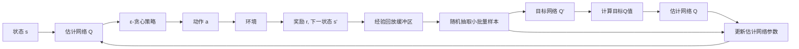

# Python深度学习实践：深度Q网络（DQN）入门与实现

## 1. 背景介绍
### 1.1 问题的由来
强化学习是人工智能领域的一个重要分支,它主要研究如何让智能体（agent）通过与环境的交互来学习最优策略,以获得最大的累积奖励。近年来,随着深度学习技术的发展,将深度神经网络与强化学习相结合,诞生了一系列强大的深度强化学习算法,其中最具代表性的就是深度Q网络(Deep Q-Network,DQN)。

DQN算法最早由DeepMind公司在2015年提出,并在Atari 2600游戏平台上取得了里程碑式的突破。传统的Q学习算法使用Q表来存储每个状态-动作对的Q值,但对于状态和动作空间很大的问题,这种方法难以奏效。DQN的核心思想是用深度神经网络来拟合Q函数,从而可以处理高维的状态输入。这为解决复杂的决策控制问题开辟了一条新的道路。

### 1.2 研究现状
自从DQN算法提出以来,围绕它展开了大量的研究工作。一方面,研究者们对DQN算法进行了各种改进和扩展,如Double DQN、Dueling DQN、Priority Replay等,进一步提升了算法的性能和稳定性。另一方面,DQN在越来越多的领域得到了应用,如自动驾驶、智能游戏、机器人控制等,展现出了广阔的应用前景。

近年来,一些新的深度强化学习算法也不断涌现,如DDPG、A3C、PPO等。它们在连续动作空间、多智能体等场景下表现出色。不过,DQN作为开创性的工作,仍然是学习和研究深度强化学习的重要基础。

### 1.3 研究意义
DQN将深度学习引入强化学习,极大地拓展了强化学习的应用范围,使得我们可以利用原始的高维感知信息（如图像）来进行决策控制,这在很多实际问题中是必不可少的。通过学习和实践DQN算法,我们可以：

1. 掌握深度强化学习的基本原理和思想
2. 了解如何将深度学习和强化学习进行结合 
3. 学会用Python和PyTorch等深度学习库来实现DQN
4. 理解DQN的训练和调优技巧
5. 开拓将深度强化学习应用到实际问题的思路

总之,学习DQN不仅是深入理解深度强化学习的捷径,更是走向实践应用的关键一步。

### 1.4 本文结构
本文将全面介绍DQN算法的原理和实现,主要内容安排如下：

- 第2部分介绍DQN中的一些核心概念,如MDP、Q学习、经验回放等。
- 第3部分详细讲解DQN算法的原理和训练步骤。  
- 第4部分给出DQN的数学模型和关键公式,并举例说明。
- 第5部分提供了一个基于PyTorch实现的DQN代码示例,并进行了详细的解读。
- 第6部分讨论了DQN的一些典型应用场景。
- 第7部分推荐了一些学习DQN的资源和工具。
- 第8部分总结了DQN的特点,并展望了未来的研究方向。
- 第9部分整理了一些常见问题与解答。

## 2. 核心概念与联系
在正式介绍DQN算法之前,我们先来了解几个核心概念：

1. 马尔可夫决策过程(Markov Decision Process, MDP):MDP是强化学习问题的标准形式化定义。一个MDP由状态空间、动作空间、转移概率、奖励函数和折扣因子组成。智能体与环境的交互可以用MDP来描述。

2. Q学习(Q-Learning):Q学习是一种经典的无模型、异策略的强化学习算法。它通过学习状态-动作值函数Q(s,a)来寻找最优策略。Q函数表示在状态s下采取动作a可以获得的期望累积奖励。

3. 经验回放(Experience Replay):经验回放是一种用于提高数据利用效率和训练稳定性的技术。它将智能体与环境交互产生的转移样本(st,at,rt,st+1)存储到一个回放缓冲区中,并从中随机抽取小批量样本来更新模型参数。

4. ε-贪心策略(ε-Greedy Policy):在训练过程中,为了平衡探索和利用,通常采用ε-贪心策略来选择动作。以概率ε随机选择动作,以概率1-ε选择当前Q值最大的动作。ε随着训练的进行逐渐衰减。

5. 目标网络(Target Network):DQN使用两个结构相同但参数不同的神经网络,一个是估计网络(Estimate Network),用于选择动作和计算当前Q值；另一个是目标网络(Target Network),用于计算目标Q值。定期将估计网络的参数复制给目标网络,以提高训练稳定性。

这些概念环环相扣,共同构建了DQN算法的基础。MDP为问题提供了形式化的描述；Q学习提供了学习Q函数的思路；经验回放、ε-贪心策略和目标网络则是实现DQN时的重要技巧。

下图展示了DQN算法的整体架构和各组件之间的联系。

## 3. 核心算法原理 & 具体操作步骤
### 3.1 算法原理概述
DQN的核心思想是使用深度神经网络来近似Q函数。传统的Q学习使用Q表来存储每个状态-动作对的Q值,但在状态空间和动作空间很大的情况下,这种方法难以奏效。DQN用一个深度神经网络Q(s,a;θ)来拟合Q函数,其中s为状态,a为动作,θ为网络参数。给定状态s,网络可以输出所有动作的Q值。

DQN的训练过程可以看作是在最小化以下损失函数:

$$L(\theta)=\mathbb{E}_{(s,a,r,s')\sim D}\left[\left(r+\gamma\max_{a'}Q(s',a';\theta^-)-Q(s,a;\theta)\right)^2\right]$$

其中,$(s,a,r,s')$是从经验回放缓冲区$D$中抽取的转移样本,$\gamma$是折扣因子,$\theta^-$是目标网络的参数。这个损失函数描述了估计网络预测的Q值与目标Q值之间的均方误差。目标Q值由即时奖励$r$和下一状态$s'$的最大Q值(由目标网络计算)组成。

通过最小化这个损失函数,估计网络的输出Q值将不断逼近最优Q函数。同时,目标网络的参数定期从估计网络复制,以保持训练的稳定性。

### 3.2 算法步骤详解
DQN算法的具体训练步骤如下:

1. 初始化估计网络$Q(s,a;\theta)$和目标网络$Q(s,a;\theta^-)$,初始化经验回放缓冲区$D$。

2. 对于每个episode:
   1. 初始化初始状态$s_0$。
   2. 对于每个时间步$t$:
      1. 根据ε-贪心策略,使用估计网络选择动作$a_t$。
      2. 执行动作$a_t$,观察奖励$r_t$和下一状态$s_{t+1}$。
      3. 将转移样本$(s_t,a_t,r_t,s_{t+1})$存储到经验回放缓冲区$D$中。
      4. 从$D$中随机抽取一个小批量转移样本。
      5. 对于每个样本$(s,a,r,s')$,计算目标Q值:
         - 如果$s'$是终止状态,则$y=r$。
         - 否则,$y=r+\gamma\max_{a'}Q(s',a';\theta^-)$。
      6. 更新估计网络参数$\theta$,最小化损失函数:
         $$L(\theta)=\frac{1}{N}\sum_{i=1}^N\left(y_i-Q(s_i,a_i;\theta)\right)^2$$
         其中$N$为小批量样本的大小。
      7. 每隔一定步数,将估计网络的参数复制给目标网络。
   3. 更新ε值,使其随着训练的进行逐渐衰减。

3. 返回训练好的估计网络$Q(s,a;\theta)$。

在测试阶段,我们使用训练好的估计网络来选择动作。给定状态$s$,选择Q值最大的动作$a^*=\arg\max_aQ(s,a;\theta)$即可。

### 3.3 算法优缺点
DQN算法的主要优点包括:

1. 可以处理高维状态输入,如图像。
2. 通过经验回放和目标网络提高了训练的稳定性。
3. 可以在连续状态空间中进行学习。
4. 相比传统的Q学习,具有更好的泛化能力。

但DQN也存在一些缺点:

1. 训练时间较长,对计算资源要求较高。
2. 对于连续动作空间问题,需要进行离散化处理。
3. 难以处理部分可观测(Partially Observable)问题。
4. 对超参数较为敏感,调参需要一定经验。

### 3.4 算法应用领域
DQN算法在很多领域都有成功的应用,包括:

1. 游戏:DQN最初就是在Atari游戏上取得突破的。此后,它被广泛用于各种游戏的智能体训练,如星际争霸、毁灭战士等。

2. 机器人控制:DQN可以用于训练机器人的运动控制策略,如走路、抓取等。

3. 自动驾驶:DQN可以用于训练无人车的决策控制系统,如避障、车道保持等。

4. 推荐系统:DQN可以用于在线推荐场景,通过与用户的交互来学习最优的推荐策略。

5. 智能调度:DQN可以用于各种调度优化问题,如电梯调度、任务分配等。

6. 通信与网络:DQN可以用于解决通信和网络领域的各种优化控制问题,如路由选择、资源分配等。

总之,DQN是一种通用的决策优化算法,只要问题能够建模为MDP,都可以尝试使用DQN来求解。

## 4. 数学模型和公式 & 详细讲解 & 举例说明
### 4.1 数学模型构建
为了使用DQN算法,我们首先需要将问题建模为马尔可夫决策过程(MDP)。一个MDP可以用一个五元组$(S,A,P,R,\gamma)$来描述:

- 状态空间$S$:所有可能的状态的集合。
- 动作空间$A$:所有可能的动作的集合。
- 转移概率$P(s'|s,a)$:在状态$s$下采取动作$a$后转移到状态$s'$的概率。
- 奖励函数$R(s,a)$:在状态$s$下采取动作$a$后获得的即时奖励。
- 折扣因子$\gamma\in[0,1]$:用于衡量未来奖励的重要性。

MDP的目标是寻找一个最优策略$\pi^*:S\rightarrow A$,使得在该策略下,智能体能够获得最大的期望累积奖励。

Q学习算法通过学习最优的状态-动作值函数$Q^*(s,a)$来寻找最优策略。$Q^*(s,a)$表示在状态$s$下采取动作$a$,然后遵循最优策略所能获得的期望累积奖励:

$$Q^*(s,a)=\mathbb{E}\left[\sum_{t=0}^\infty\gamma^tr_t|s_0=s,a_0=a,\pi^*\right]$$

根据Bellman最优方