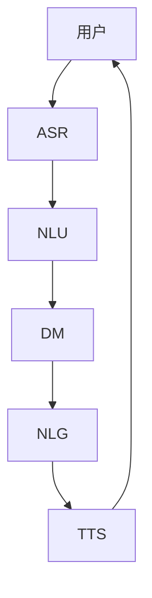

# Python深度学习实践：深度学习在虚拟助理中的应用

## 1. 背景介绍
### 1.1 问题的由来
随着人工智能技术的飞速发展,虚拟助理已经成为人们日常生活中不可或缺的一部分。从苹果的Siri、微软的Cortana,到亚马逊的Alexa和谷歌助手,虚拟助理正在以前所未有的方式改变着我们的生活。然而,传统的虚拟助理主要依赖于规则和模板匹配等方法,难以真正理解用户的意图和需求,提供个性化、智能化的服务。深度学习作为人工智能的前沿技术,为虚拟助理的智能化发展提供了新的思路和方向。

### 1.2 研究现状 
目前,深度学习已经在语音识别、自然语言处理、计算机视觉等多个领域取得了突破性进展,并被广泛应用于虚拟助理的各个模块中。例如,谷歌助手采用了端到端的深度学习模型进行语音识别和语言理解;微软小冰则利用生成式对抗网络(GAN)实现了个性化的语音合成;苹果Siri团队也在积极探索基于深度强化学习的对话管理技术。这些研究表明,深度学习正在推动虚拟助理向更加智能化、人性化的方向发展。

### 1.3 研究意义
深入研究深度学习在虚拟助理中的应用,对于提升虚拟助理的用户体验和服务质量具有重要意义。一方面,深度学习可以帮助虚拟助理更好地理解用户意图,提供准确、相关的信息和服务;另一方面,深度学习也为虚拟助理的个性化和情感化交互提供了技术支撑,使其更具人性化特征。此外,探索深度学习在虚拟助理中的应用,也有助于推动人工智能在更广泛领域的发展和普及。

### 1.4 本文结构
本文将围绕Python深度学习在虚拟助理中的应用展开讨论。首先,我们将介绍虚拟助理的核心概念和关键技术,重点分析深度学习与虚拟助理各模块之间的联系。然后,我们将详细阐述几种主流的深度学习算法在虚拟助理中的应用原理和实现步骤。接下来,我们将通过实际项目案例,演示如何使用Python实现基于深度学习的虚拟助理。最后,我们将总结深度学习在虚拟助理领域的发展趋势和面临的挑战,并对未来的研究方向进行展望。

## 2. 核心概念与联系
虚拟助理是一种基于人工智能技术,通过自然语言交互为用户提供个性化服务的软件系统。其核心目标是理解用户的意图和需求,并给出相应的反馈和行动。虚拟助理通常由以下几个关键模块组成:

1. 自动语音识别(ASR):将用户的语音输入转换为文本。
2. 自然语言理解(NLU):分析理解用户输入的文本,提取关键信息和意图。 
3. 对话管理(DM):根据用户意图和上下文,决策系统的反应策略。
4. 自然语言生成(NLG):将系统要表达的信息转化为自然语言文本。
5. 语音合成(TTS):将文本转换为语音,输出给用户。

深度学习作为一种端到端的学习范式,可以用于构建虚拟助理的各个模块。在ASR中,卷积神经网络(CNN)和循环神经网络(RNN)被广泛用于声学建模;在NLU和DM中,RNN和注意力机制可以帮助理解长文本和对话历史;在NLG中,基于Transformer的生成模型如GPT系列在文本生成任务上取得了瞩目成绩;在TTS中,WaveNet等自回归模型和GAN被用于建模语音的音色和韵律。

下图展示了一个基于深度学习的典型虚拟助理系统架构:



## 3. 核心算法原理 & 具体操作步骤
### 3.1 算法原理概述
本节我们将重点介绍几种在虚拟助理中广泛使用的深度学习算法,包括CNN、RNN、Seq2Seq、注意力机制和Transformer。

- CNN:通过局部连接和权值共享,提取输入数据的局部特征。常用于语音识别的声学建模。
- RNN:通过循环连接,建模序列数据的长距离依赖关系。常用于语言理解和对话管理。
- Seq2Seq:由编码器和解码器组成,可以将一个序列转换为另一个序列。常用于机器翻译和文本摘要。
- 注意力机制:通过学习输入序列中各元素对输出的贡献权重,使模型能够有选择地关注输入的不同部分。
- Transformer:基于自注意力机制,通过并行计算提高了模型训练效率。常用于大规模语言模型预训练。

### 3.2 算法步骤详解
以Seq2Seq模型为例,其训练过程可分为以下步骤:

1. 将输入序列$X=(x_1,x_2,...,x_T)$通过编码器转换为一组隐向量$H=(h_1,h_2,...,h_T)$。编码器可以使用RNN、CNN等结构。
2. 将隐向量$H$作为解码器的输入,解码器根据$H$和之前的输出,逐步生成目标序列$Y=(y_1,y_2,...,y_{T'})$。解码器通常使用RNN结构。
3. 在每一步解码时,通过注意力机制计算$H$中各元素的权重,得到一个上下文向量$c_t$。$c_t$与当前解码器隐状态$s_t$拼接,作为解码器的输入。
4. 重复步骤3,直到生成结束符或达到最大长度。
5. 使用交叉熵损失函数,计算生成序列与真实序列之间的差异,并通过反向传播算法更新模型参数。

### 3.3 算法优缺点
- CNN:能够有效提取局部特征,但无法捕捉长距离依赖关系。
- RNN:能够建模序列数据,但训练过程中容易出现梯度消失和梯度爆炸问题。
- Seq2Seq:能够处理不定长序列,但在处理长序列时性能下降明显。
- 注意力机制:能够捕捉输入序列中的重要信息,提高了模型的表达能力,但计算复杂度较高。
- Transformer:并行计算效率高,能够处理长序列依赖,但需要大量的训练数据和计算资源。

### 3.4 算法应用领域
- CNN:语音识别、关键词检索等
- RNN:语言模型、机器翻译、文本分类等  
- Seq2Seq:机器翻译、文本摘要、对话生成等
- 注意力机制:机器翻译、语音识别、图像描述等
- Transformer:大规模语言模型预训练、机器翻译、阅读理解等

## 4. 数学模型和公式 & 详细讲解 & 举例说明
### 4.1 数学模型构建
以门控循环单元(GRU)为例,其数学模型可表示为:

$$z_t=\sigma(W_z\cdot[h_{t-1},x_t])$$
$$r_t=\sigma(W_r\cdot[h_{t-1},x_t])$$ 
$$\tilde{h}_t=\tanh(W\cdot[r_t*h_{t-1},x_t])$$
$$h_t=(1-z_t)*h_{t-1}+z_t*\tilde{h}_t$$

其中,$z_t$是更新门,$r_t$是重置门,$\tilde{h}_t$是候选隐状态,$h_t$是当前隐状态,$\sigma$是sigmoid激活函数。

### 4.2 公式推导过程
GRU通过引入更新门和重置门,来控制隐状态的更新过程。更新门决定了前一时刻的隐状态有多少保留到当前时刻,重置门决定了忽略前一时刻隐状态的哪些信息。

更新门的计算公式为:
$$z_t=\sigma(W_z\cdot[h_{t-1},x_t])$$
其中,$W_z$是更新门的权重矩阵。更新门的取值范围为[0,1],越接近1表示前一时刻的隐状态保留得越多。

重置门的计算公式为:
$$r_t=\sigma(W_r\cdot[h_{t-1},x_t])$$  
其中,$W_r$是重置门的权重矩阵。重置门的取值范围也为[0,1],越接近0表示忽略前一时刻隐状态的信息越多。

候选隐状态的计算公式为:
$$\tilde{h}_t=\tanh(W\cdot[r_t*h_{t-1},x_t])$$
其中,$r_t*h_{t-1}$表示对前一时刻隐状态按元素乘以重置门。这使得模型能够有选择地忽略掉一些不重要的信息。

最后,当前隐状态通过更新门在前一时刻隐状态和候选隐状态之间进行平滑:
$$h_t=(1-z_t)*h_{t-1}+z_t*\tilde{h}_t$$

### 4.3 案例分析与讲解
下面我们以一个简单的情感分类任务为例,说明如何使用GRU进行建模。假设我们有一个电影评论数据集,每个样本由一段文本和一个情感标签(正面/负面)组成。我们可以将每个文本看作一个单词序列$(x_1,x_2,...,x_T)$,其中$x_t$是第$t$个单词的词向量表示。

我们构建一个GRU模型,它接受词向量序列作为输入,经过GRU层得到最后一个隐状态$h_T$,再通过一个全连接层和sigmoid激活函数输出情感分类概率:

$$h_t=GRU(x_t,h_{t-1})$$
$$p=\sigma(W_o\cdot h_T+b_o)$$

其中,$W_o$和$b_o$是输出层的权重矩阵和偏置项。我们可以使用二元交叉熵损失函数来训练该模型:

$$L=-\frac{1}{N}\sum_{i=1}^N[y_i\log p_i+(1-y_i)\log(1-p_i)]$$

其中,$y_i$是第$i$个样本的真实标签,$p_i$是模型预测的概率。通过最小化损失函数,模型可以学习到不同单词对情感分类的贡献,从而做出正确的预测。

### 4.4 常见问题解答
1. GRU与LSTM相比有什么优势?
   
   GRU通过更新门和重置门来控制信息流,参数数量比LSTM少,训练速度更快。在许多任务上,GRU能够取得与LSTM相当的性能。

2. 如何解释GRU中的隐状态?

   GRU的隐状态可以看作是对输入序列信息的一种压缩表示。通过更新门和重置门的控制,隐状态能够动态地保留和遗忘不同时刻的信息,从而捕捉序列的长距离依赖关系。

3. GRU能否处理变长序列?

   可以。与其他RNN结构一样,GRU也采用了循环计算的方式,因此能够处理任意长度的序列数据。在实际应用中,我们通常会设置一个最大长度,对超过该长度的序列进行截断或填充。

## 5. 项目实践：代码实例和详细解释说明
### 5.1 开发环境搭建
本项目使用Python 3.7和PyTorch 1.8进行开发。首先创建一个虚拟环境,并安装所需库:

```bash
python -m venv venv
source venv/bin/activate
pip install torch==1.8.1 tqdm numpy matplotlib
```

### 5.2 源代码详细实现
下面我们使用PyTorch实现一个基于GRU的情感分类模型。首先定义模型类:

```python
import torch
import torch.nn as nn

class GRUClassifier(nn.Module):
    def __init__(self, vocab_size, embed_dim, hidden_dim, num_classes):
        super().__init__()
        self.embedding = nn.Embedding(vocab_size, embed_dim)
        self.gru = nn.GRU