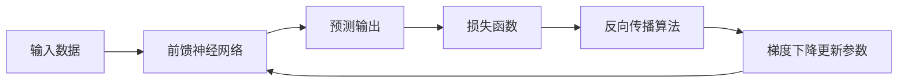

# Python深度学习实践：理解反向传播算法的细节

作者：禅与计算机程序设计艺术 / Zen and the Art of Computer Programming

关键词：深度学习, 反向传播算法, 神经网络, 梯度下降, Python实现

## 1. 背景介绍

### 1.1 问题的由来

深度学习作为人工智能领域的一个重要分支,其核心在于利用多层神经网络从大量数据中学习有用的特征表示。而支撑深度学习算法高效训练的关键技术之一就是反向传播算法(Backpropagation)。反向传播算法自20世纪80年代被提出以来,已经成为训练神经网络的标准算法。然而,对于许多初学者和非专业人士来说,反向传播算法的数学原理和实现细节仍然比较难以理解和掌握。因此有必要对该算法进行深入浅出的讲解和实践。

### 1.2 研究现状

目前关于反向传播算法的研究主要集中在以下几个方面:

(1)反向传播算法的数学原理。许多研究者从数学角度对反向传播算法进行了严格的推导和证明,揭示了其内在机制。

(2)反向传播算法的改进和优化。针对反向传播算法存在的一些问题如梯度消失/爆炸、收敛速度慢等,研究者们提出了许多改进方法,如Xavier/He初始化、梯度截断、Adam优化器等。

(3)反向传播算法的应用。反向传播算法被广泛应用于图像分类、语音识别、自然语言处理等诸多领域,取得了显著成果。

(4)反向传播算法的实现。各大深度学习框架如TensorFlow、PyTorch等都内置了高效的反向传播算法实现,方便用户使用。

### 1.3 研究意义

深入理解反向传播算法对于学习和应用深度学习技术具有重要意义:

(1)掌握反向传播算法有助于理解神经网络的训练过程和内在机制,加深对深度学习的认识。

(2)了解反向传播算法的细节,可以更好地设计网络结构、调试模型、分析问题,提高建模和优化的效率。 

(3)基于反向传播算法的原理,可以针对具体问题改进算法,或者设计出新的学习算法。

(4)反向传播思想不局限于神经网络,在其他机器学习模型和优化问题中也有应用。学习反向传播算法可以培养分析和解决问题的思路。

### 1.4 本文结构

本文将从以下几个方面来系统阐述反向传播算法:

- 介绍神经网络和反向传播算法的基本概念。
- 详细推导反向传播算法的数学原理和公式。
- 总结反向传播算法的步骤,并通过实例讲解。
- 使用Python和NumPy库完整实现一个简单的反向传播神经网络。
- 讨论反向传播算法的局限性和改进方向。
- 分享反向传播算法的学习资源。

通过本文的学习,读者将全面掌握反向传播算法的原理和实现,为进一步学习和应用深度学习打下坚实基础。

## 2. 核心概念与联系

在深入讨论反向传播算法之前,我们先来了解一些相关的核心概念。

**人工神经网络(Artificial Neural Network)**是一种模拟生物神经系统结构和功能的数学模型,由大量的节点(神经元)通过带权重的连接组成。每个节点接收输入信号并产生输出信号。

**前馈神经网络(Feedforward Neural Network)**是一种层次结构的网络,信号从输入层经过一个或多个隐藏层传递到输出层,没有反馈回路。

**损失函数(Loss Function)**衡量神经网络的预测输出与真实标签之间的差异大小。均方误差和交叉熵是两种常用的损失函数。

**梯度下降(Gradient Descent)**通过沿损失函数梯度的反方向更新参数,使损失函数最小化的优化算法。随机梯度下降(SGD)使用随机小批量样本估计梯度。

**反向传播(Backpropagation)**利用链式法则,按照从输出层到输入层的顺序,递归计算各层权重参数的损失函数梯度,再使用梯度下降法更新参数的算法。

这些概念之间的联系可以用下面的流程图表示:

反向传播算法是连接损失函数和参数优化的桥梁,使得神经网络能够从数据中学习。

## 3. 核心算法原理 & 具体操作步骤

### 3.1 算法原理概述

反向传播算法的核心思想是:先根据输入数据,通过前馈计算得到网络的预测输出;然后比较预测输出与真实标签,计算损失函数;最后从输出层开始,反向逐层计算损失函数关于各层参数的梯度,并用梯度下降法更新参数。重复这一过程直到网络收敛。

设$L$为损失函数,$\mathbf{W}^{(l)}$和$\mathbf{b}^{(l)}$分别为第$l$层的权重矩阵和偏置向量。反向传播算法可以分为以下几个步骤:

1. 前馈计算:根据输入$\mathbf{x}$,逐层计算各层的加权输入$\mathbf{z}^{(l)}$和激活值$\mathbf{a}^{(l)}$直到输出层。
2. 计算损失函数$L$关于输出层的梯度$\frac{\partial L}{\partial \mathbf{a}^{(L)}}$。
3. 反向计算梯度:从最后一层$l=L-1$开始,反向逐层计算$\frac{\partial L}{\partial \mathbf{z}^{(l)}}$,$\frac{\partial L}{\partial \mathbf{W}^{(l)}}$和$\frac{\partial L}{\partial \mathbf{b}^{(l)}}$。
4. 参数更新:使用梯度下降法,根据上一步得到的梯度更新各层参数$\mathbf{W}^{(l)}$和$\mathbf{b}^{(l)}$。
5. 重复步骤1-4,直到网络收敛。

可以看出,反向传播算法的关键在于通过链式法则递归计算梯度。

### 3.2 算法步骤详解

下面我们详细推导反向传播算法的数学公式。考虑一个$L$层的前馈神经网络,第$l$层有$n_l$个神经元。记第$l$层第$j$个神经元的加权输入为$z_j^{(l)}$,激活值为$a_j^{(l)}$,激活函数为$f^{(l)}$。则前馈过程为:

$$
\begin{aligned}
\mathbf{z}^{(l)} &= \mathbf{W}^{(l)}\mathbf{a}^{(l-1)} + \mathbf{b}^{(l)} \\
\mathbf{a}^{(l)} &= f^{(l)}(\mathbf{z}^{(l)})
\end{aligned}
$$

其中$\mathbf{a}^{(0)}=\mathbf{x}$为输入层。定义单样本损失函数为$L(\mathbf{a}^{(L)},\mathbf{y})$,其中$\mathbf{y}$为真实标签。我们的目标是求$\frac{\partial L}{\partial \mathbf{W}^{(l)}}$和$\frac{\partial L}{\partial \mathbf{b}^{(l)}}$。

首先,定义误差项$\delta_j^{(l)}$为:

$$
\delta_j^{(l)} = \frac{\partial L}{\partial z_j^{(l)}}
$$

对于输出层$l=L$,根据链式法则有:

$$
\delta_j^{(L)} = \frac{\partial L}{\partial a_j^{(L)}} \cdot \frac{\partial a_j^{(L)}}{\partial z_j^{(L)}} = \frac{\partial L}{\partial a_j^{(L)}} \cdot f'^{(L)}(z_j^{(L)})
$$

对于隐藏层$l<L$,根据链式法则有:

$$
\begin{aligned}
\delta_j^{(l)} &= \frac{\partial L}{\partial z_j^{(l)}} = \sum_k \frac{\partial L}{\partial z_k^{(l+1)}} \cdot \frac{\partial z_k^{(l+1)}}{\partial a_j^{(l)}} \cdot \frac{\partial a_j^{(l)}}{\partial z_j^{(l)}} \\
&= \sum_k \delta_k^{(l+1)} \cdot w_{kj}^{(l+1)} \cdot f'^{(l)}(z_j^{(l)})
\end{aligned}
$$

上式表明,第$l$层的误差项可以由第$l+1$层的误差项和第$l+1$层的权重递推得到。这就是反向传播的由来。

有了误差项,就可以计算梯度了。对于第$l$层的权重$w_{jk}^{(l)}$,有:

$$
\frac{\partial L}{\partial w_{jk}^{(l)}} = \frac{\partial L}{\partial z_j^{(l)}} \cdot \frac{\partial z_j^{(l)}}{\partial w_{jk}^{(l)}} = \delta_j^{(l)} \cdot a_k^{(l-1)}
$$

对于第$l$层的偏置$b_j^{(l)}$,有:

$$
\frac{\partial L}{\partial b_j^{(l)}} = \frac{\partial L}{\partial z_j^{(l)}} \cdot \frac{\partial z_j^{(l)}}{\partial b_j^{(l)}} = \delta_j^{(l)}
$$

将上面的推导总结成矩阵向量形式,反向传播算法可以表示为:

1. 前馈计算$\mathbf{z}^{(l)}$和$\mathbf{a}^{(l)}$直到输出层。
2. 计算输出层误差项$\mathbf{\delta}^{(L)} = \nabla_{\mathbf{a}^{(L)}}L \odot f'^{(L)}(\mathbf{z}^{(L)})$。
3. 反向计算隐藏层误差项$\mathbf{\delta}^{(l)} = ((\mathbf{W}^{(l+1)})^T\mathbf{\delta}^{(l+1)}) \odot f'^{(l)}(\mathbf{z}^{(l)})$。
4. 计算梯度$\frac{\partial L}{\partial \mathbf{W}^{(l)}} = \mathbf{\delta}^{(l)}(\mathbf{a}^{(l-1)})^T$,$\frac{\partial L}{\partial \mathbf{b}^{(l)}} = \mathbf{\delta}^{(l)}$。
5. 更新参数$\mathbf{W}^{(l)} := \mathbf{W}^{(l)} - \alpha \frac{\partial L}{\partial \mathbf{W}^{(l)}}$,$\mathbf{b}^{(l)} := \mathbf{b}^{(l)} - \alpha \frac{\partial L}{\partial \mathbf{b}^{(l)}}$。

其中$\odot$表示Hadamard乘积(逐元素相乘),$\alpha$为学习率。注意实际使用时一般对小批量数据取平均梯度。

### 3.3 算法优缺点

反向传播算法的主要优点有:

- 通过链式法则高效计算梯度,使得神经网络的训练成为可能。
- 可以应用于任意结构的前馈神经网络。
- 与梯度下降法结合,能够最小化非凸损失函数。

反向传播算法的缺点包括:

- 计算和存储开销大,对硬件要求高。
- 容易出现梯度消失或爆炸问题,难以训练深层网络。
- 对参数初始化和学习率敏感,调参需要经验。
- 易陷入局部最优,难以保证全局最优。

针对这些问题,研究者提出了许多改进方法,如ReLU激活函数、BatchNorm、残差连接、Adam优化器等。

### 3.4 算法应用领域

反向传播算法是深度学习的核心,在以下领域得到了广泛应用:

- 计算机视觉:图像分类、目标检测、语义分割等。
- 语音识别:声学模型、语言模型、端到端识别等。
- 自然语言处理:词向量、语言模型、机器翻译