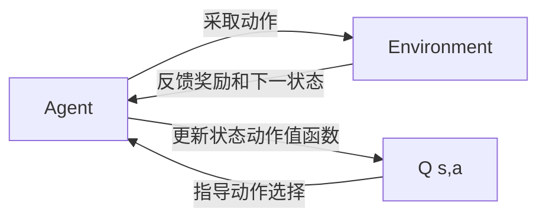
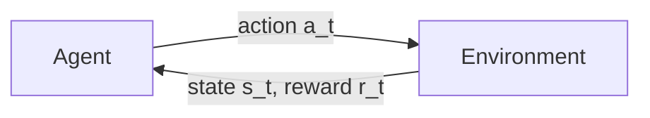

# Q-学习(Q-Learning) - 原理与代码实例讲解

关键词：强化学习, Q-Learning, 状态-动作值函数, ε-贪心策略, 马尔可夫决策过程

## 1. 背景介绍
### 1.1  问题的由来
在人工智能和机器学习领域,强化学习(Reinforcement Learning)是一个重要的研究方向。与监督学习和非监督学习不同,强化学习旨在通过智能体(Agent)与环境的交互,学习最优策略以获得最大累积奖励。在这其中,Q-Learning 作为一种经典的无模型、异策略的强化学习算法,因其简洁高效而备受关注。

### 1.2  研究现状
Q-Learning 自上世纪90年代被提出以来,在理论和应用层面都取得了丰硕的成果。在理论研究方面,学者们对算法的收敛性、复杂度、改进方法等进行了深入探讨。在应用领域,Q-Learning 被广泛用于智能控制、自动驾驶、推荐系统、机器人等诸多领域,展现出强大的适应性和实用价值。

### 1.3  研究意义
深入理解 Q-Learning 的原理和实现,对于掌握强化学习的核心思想,开展相关理论研究,解决实际应用问题都具有重要意义。通过学习 Q-Learning,我们可以建立对马尔可夫决策过程、值函数近似、探索利用平衡等关键概念的认识,为进一步学习深度强化学习打下基础。同时,Q-Learning 也是理解和实现其他强化学习算法的基石。

### 1.4  本文结构
本文将从以下几个方面对 Q-Learning 展开详细论述:

1. 介绍强化学习的背景知识和 Q-Learning 的核心概念
2. 阐述 Q-Learning 算法的原理和具体步骤
3. 推导和分析 Q-Learning 涉及的数学模型与公式
4. 通过代码实例和注释讲解 Q-Learning 的编程实现
5. 探讨 Q-Learning 的实际应用场景
6. 总结全文,展望 Q-Learning 的未来发展方向和挑战
7. 提供学习资源、开发工具等有价值的参考信息

## 2. 核心概念与联系

要掌握 Q-Learning,首先需要理解几个核心概念:

- 智能体(Agent):可以感知环境状态并做出动作的实体,其目标是最大化累积奖励。
- 环境(Environment):智能体所处的世界,对智能体的动作做出反馈(下一状态和奖励)。
- 状态(State):智能体所处环境的完整描述,记为 s。
- 动作(Action):智能体可以采取的行为选择,记为 a。
- 奖励(Reward):环境对智能体动作的即时反馈,引导智能体学习,记为 r。
- 策略(Policy):智能体的行为准则,即在给定状态下应该采取的动作。通常用 π 表示。
- 状态-动作值函数 Q(s,a):表示在状态 s 下采取动作 a 的长期价值,考虑了当前奖励和未来奖励。

Q-Learning 的核心思想是:通过不断更新状态-动作值函数 Q(s,a),使其收敛到最优值函数 Q*(s,a),进而得到最优策略 π*。

下图展示了 Q-Learning 涉及的核心概念之间的关系:



## 3. 核心算法原理 & 具体操作步骤
### 3.1  算法原理概述
Q-Learning 的主要原理可以概括为:基于 Q 表(Q-table)存储和更新每个状态-动作对的价值估计,通过 TD 误差(Temporal-Difference error)来更新 Q 值,最终使 Q 函数收敛到最优值函数。

具体而言,Q-Learning 在每个时间步执行以下两个关键步骤:
1. 根据当前 Q 表,使用 ε-贪心策略选择一个动作执行。
2. 根据观察到的即时奖励 r 和下一状态 s',更新 Q 表中的 Q(s,a)值。

通过大量的探索和利用,Q 表最终将收敛到最优值函数 Q*,此时贪心策略就是最优策略。

### 3.2  算法步骤详解
Q-Learning 的具体步骤如下:

1. 初始化 Q 表,对所有的 Q(s,a) 赋初值(一般为0)。
2. 对每一个 episode:
   1. 初始化起始状态 s
   2. 对每一个 step:
      1. 使用 ε-贪心策略,根据当前状态 s 选择一个动作 a
      2. 执行动作 a,观察奖励 r 和下一状态 s'
      3. 根据 Q-Learning 的更新公式,更新 Q(s,a):
         $$Q(s,a) \leftarrow Q(s,a) + \alpha [r + \gamma \max_{a'} Q(s',a') - Q(s,a)]$$
         其中,α 是学习率,γ 是折扣因子。
      4. 将当前状态更新为下一状态,即 s←s'
   3. 当 s 为终止状态时,结束当前 episode
3. 当多个 episode 的平均回报收敛或达到预设的训练轮数时,结束训练。

### 3.3  算法优缺点
Q-Learning 的主要优点包括:
- 简单易实现,对环境的建模要求低
- 能够在不完全知道环境动力学的情况下学习最优策略
- 通过非策略(off-policy)学习,可以利用历史经验数据,提高样本效率
- 在一定条件下,Q 函数能够收敛到最优值函数

但 Q-Learning 也存在一些局限性:
- 大规模状态空间下,Q 表难以存储和更新
- 对奖励函数的设计要求较高,容易出现稀疏奖励问题
- 探索与利用的平衡是一个难题,ε-贪心策略的探索效率有限
- 对部分可观察马尔可夫决策过程(POMDP)问题,表现不佳

### 3.4  算法应用领域
Q-Learning 在许多领域得到了成功应用,例如:
- 智能体寻路与导航
- 游戏人工智能(如 Atari 游戏)
- 机器人控制
- 资源调度与优化
- 推荐系统
- 自然语言处理中的对话策略学习

## 4. 数学模型和公式 & 详细讲解 & 举例说明
### 4.1  数学模型构建
Q-Learning 建立在马尔可夫决策过程(MDP)的数学模型之上。一个 MDP 由以下元素组成:
- 状态空间 $\mathcal{S}$
- 动作空间 $\mathcal{A}$ 
- 状态转移概率函数 $\mathcal{P}(s'|s,a)$
- 奖励函数 $\mathcal{R}(s,a)$
- 折扣因子 $\gamma \in [0,1]$

在 MDP 中,智能体与环境交互的过程可以用下图表示:



Q-Learning 的目标是学习一个最优策略 π*,使得从任意状态 s 开始,执行该策略能够获得最大的期望累积奖励:

$$V^{\pi^*}(s)=\max_{\pi} \mathbb{E}\left[\sum_{t=0}^{\infty} \gamma^t r_t | s_0=s,\pi \right]$$

为达成学习目标,Q-Learning 引入了状态-动作值函数 Q(s,a),表示在状态 s 下采取动作 a 的长期价值:

$$Q^{\pi}(s,a)=\mathbb{E}\left[\sum_{t=0}^{\infty} \gamma^t r_t | s_0=s,a_0=a,\pi \right]$$

在最优策略 π* 下,最优状态-动作值函数 Q*(s,a) 满足贝尔曼最优方程:

$$Q^*(s,a)=\mathcal{R}(s,a)+\gamma \sum_{s' \in \mathcal{S}} \mathcal{P}(s'|s,a) \max_{a'} Q^*(s',a')$$

Q-Learning 的核心思想是:通过不断更新 Q(s,a) 使其收敛到 Q*(s,a),然后根据 Q* 得到最优策略 π*。

### 4.2  公式推导过程
Q-Learning 的更新公式可以从贝尔曼最优方程推导得到。我们将 Q(s,a) 视为 Q*(s,a) 的估计,并利用 TD 误差来更新估计值。

对于转移 (s,a,r,s'),Q(s,a) 的更新量为:

$$\Delta Q(s,a) = \alpha [r + \gamma \max_{a'} Q(s',a') - Q(s,a)]$$

其中,TD 误差为:

$$\delta = r + \gamma \max_{a'} Q(s',a') - Q(s,a)$$

TD 误差反映了当前估计值 Q(s,a) 和基于即时奖励 r 与下一状态最优动作值 $\max_{a'} Q(s',a')$ 估计值之间的差距。

将更新量应用于 Q(s,a),得到 Q-Learning 的更新公式:

$$Q(s,a) \leftarrow Q(s,a) + \alpha [r + \gamma \max_{a'} Q(s',a') - Q(s,a)]$$

重复应用该更新公式,Q(s,a) 最终将收敛到 Q*(s,a)。

### 4.3  案例分析与讲解
下面以一个简单的迷宫寻路问题为例,说明 Q-Learning 的工作原理。

考虑一个 3x4 的网格世界,智能体的目标是从起点(0,0)移动到终点(2,3),同时避开障碍。

```
+---+---+---+---+
| S |   |   |   |
+---+---+---+---+
|   | X |   |   |
+---+---+---+---+
|   |   |   | G |
+---+---+---+---+
```

- 状态空间:各网格的坐标(i,j),共 3x4=12 个状态
- 动作空间:上、下、左、右,共 4 个动作
- 奖励函数:到达终点 G 时奖励为+10,撞到障碍物 X 时奖励为-5,其他情况奖励为-1
- 折扣因子:γ=0.9

Q-Learning 的目标是学习一个最优策略,使智能体能够以最短路径到达终点,同时避开障碍物。

初始时,Q 表为全 0 矩阵。在每个 episode 中:
1. 智能体随机选择一个起点,例如(1,0)
2. 根据 ε-贪心策略选择动作,例如 ε=0.1,有 10% 的概率随机探索
3. 执行动作,观察下一状态和奖励,例如向右移动,到达(1,1),奖励为-1
4. 根据 Q-Learning 公式更新 Q 表,例如:
   $$Q((1,0),右) \leftarrow Q((1,0),右) + \alpha [-1 + 0.9 \max_{a'} Q((1,1),a') - Q((1,0),右)]$$
5. 重复步骤 2-4,直到到达终点
6. 开始下一个 episode,重复步骤 1-5

经过足够多的训练,Q 表将收敛,得到最优策略。此时,对于任意状态,选择 Q 值最大的动作即可获得最优路径。

### 4.4  常见问题解答
Q: Q-Learning 能否处理连续状态和动作空间?
A: 原始的 Q-Learning 只适用于离散状态和动作空间。对于连续情况,可以使用函数近似(如神经网络)来表示 Q 函数,称为 Deep Q-Network(DQN)。

Q: Q-Learning 的收敛性如何保证?
A: 在适当的条件下(例如所有状态-动作对无限次访问),Q 函数能够以概率 1 收敛到最优值函数 Q*。但实践中,收敛到次优解也很常见。

Q: ε-贪心策略中的 ε 如何选择?
A: ε 控制了探索和利用的平衡。较大的 ε 有助于探索,但可能降