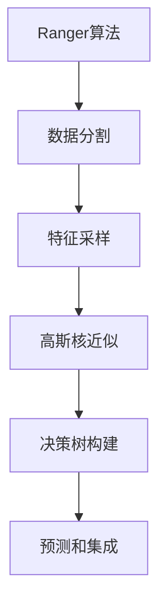

# Ranger原理与代码实例讲解

## 1. 背景介绍

### 1.1 问题的由来

在机器学习和数据挖掘领域中,决策树算法因其简单、高效且易于理解的特点而备受青睐。然而,传统的决策树算法在处理高维数据和大规模数据集时存在一些缺陷,例如过拟合、计算效率低下等问题。为了解决这些问题,研究人员提出了一种新的决策树算法——Ranger。

### 1.2 研究现状

Ranger算法是一种基于随机森林的高效决策树算法,它结合了随机森林和高斯核近似的优点,在保持高精度的同时,大幅提高了计算效率。Ranger算法已经在多个领域得到了广泛应用,包括计算机视觉、自然语言处理、生物信息学等,并取得了优异的性能表现。

### 1.3 研究意义

Ranger算法的提出为机器学习和数据挖掘领域带来了新的发展机遇。它不仅解决了传统决策树算法在处理高维数据和大规模数据集时存在的问题,而且具有更高的计算效率和更好的泛化能力。研究Ranger算法的原理和实现,有助于我们更好地理解和应用这一先进的算法,从而推动相关领域的进一步发展。

### 1.4 本文结构

本文将全面介绍Ranger算法的背景、原理、实现和应用。首先,我们将探讨Ranger算法的核心概念和与其他算法的联系。接下来,详细阐述Ranger算法的原理和具体操作步骤,包括算法的数学模型和公式推导。然后,我们将通过代码实例和详细解释,展示Ranger算法的实际应用。最后,讨论Ranger算法在实际场景中的应用,并对其未来发展趋势和面临的挑战进行展望。

## 2. 核心概念与联系

Ranger算法是一种基于随机森林的高效决策树算法,它结合了随机森林和高斯核近似的优点。下面我们将介绍Ranger算法的核心概念和与其他算法的联系。

### 2.1 随机森林

随机森林(Random Forest)是一种集成学习算法,它通过构建多个决策树,并将它们的预测结果进行组合,从而提高模型的准确性和鲁棒性。随机森林算法具有以下优点:

1. 能够有效处理高维数据和大规模数据集。
2. 不容易过拟合,具有良好的泛化能力。
3. 可以处理缺失值和异常值。
4. 可解释性强,易于理解和解释。

然而,随机森林算法也存在一些缺点,例如计算效率较低、对于某些数据集的性能不佳等。Ranger算法正是为了解决这些问题而提出的。

### 2.2 高斯核近似

高斯核近似(Gaussian Kernel Approximation)是一种用于近似核函数的技术。在机器学习中,核函数被广泛应用于支持向量机(SVM)和高斯过程(GP)等算法中。然而,传统的核函数计算效率较低,尤其是在处理大规模数据集时。

高斯核近似技术通过随机特征映射(Random Feature Mapping)将原始数据映射到一个新的特征空间,从而近似原始的核函数。这种方法不仅可以大幅提高计算效率,而且还能保持较高的精度。Ranger算法采用了这种高斯核近似技术,从而实现了高效的计算。

### 2.3 Ranger算法与其他算法的联系

Ranger算法结合了随机森林和高斯核近似的优点,因此它与这两种算法都有密切的联系。与传统的随机森林算法相比,Ranger算法具有更高的计算效率和更好的泛化能力。与基于核函数的算法(如SVM和GP)相比,Ranger算法可以更高效地处理大规模数据集,同时保持较高的精度。

此外,Ranger算法还与其他一些算法有一定的联系,例如梯度提升决策树(GBDT)、极端梯度提升(XGBoost)等。这些算法都是基于决策树的集成学习算法,但它们在具体实现和优化策略上有所不同。

## 3. 核心算法原理 & 具体操作步骤

### 3.1 算法原理概述

Ranger算法的核心思想是将随机森林和高斯核近似技术相结合,从而实现高效的决策树构建和预测。具体来说,Ranger算法包括以下几个关键步骤:

1. **数据分割**: 将原始数据集随机划分为多个子集,每个子集用于构建一棵决策树。
2. **特征采样**: 对于每个决策树,从所有特征中随机选择一部分特征,用于节点分裂。这种特征采样策略可以减少决策树之间的相关性,提高模型的泛化能力。
3. **高斯核近似**: 对于每个节点,Ranger算法使用高斯核近似技术来近似原始的数据分布,从而加速节点分裂过程。
4. **决策树构建**: 基于上述步骤,构建多棵决策树,形成随机森林模型。
5. **预测和集成**: 在预测阶段,将多棵决策树的预测结果进行集成,得到最终的预测结果。

下面我们将详细介绍Ranger算法的具体操作步骤。

### 3.2 算法步骤详解

#### 3.2.1 数据分割

Ranger算法首先将原始数据集随机划分为多个子集,每个子集用于构建一棵决策树。这种数据分割策略可以减少决策树之间的相关性,从而提高模型的泛化能力。

具体来说,假设原始数据集包含$N$个样本,Ranger算法将其随机划分为$M$个子集,每个子集包含$N/M$个样本。这种划分方式通常使用bootstrap抽样(有放回抽样)来实现,即每次从原始数据集中随机抽取一个样本,直到抽取到$N/M$个样本为止。

#### 3.2.2 特征采样

对于每棵决策树,Ranger算法从所有特征中随机选择一部分特征,用于节点分裂。这种特征采样策略可以进一步减少决策树之间的相关性,提高模型的泛化能力。

具体来说,假设原始数据集包含$P$个特征,Ranger算法在构建每棵决策树时,从$P$个特征中随机选择$p$个特征,其中$p \ll P$。在节点分裂过程中,只考虑这$p$个特征,而忽略其他特征。这种特征采样策略类似于随机森林中的做法,但Ranger算法采用了更高效的实现方式。

#### 3.2.3 高斯核近似

在节点分裂过程中,Ranger算法使用高斯核近似技术来近似原始的数据分布,从而加速计算。具体来说,Ranger算法将原始数据映射到一个新的特征空间,在这个特征空间中,原始的核函数可以被近似为线性函数。

设$\phi(x)$为将数据$x$映射到新特征空间的函数,则原始的核函数$k(x, x')$可以近似为:

$$k(x, x') \approx \phi(x)^T \phi(x')$$

其中$\phi(x)$和$\phi(x')$是$x$和$x'$在新特征空间中的表示。

Ranger算法使用随机特征映射(Random Feature Mapping)来实现$\phi(x)$,具体方法如下:

1. 随机生成一个向量$\omega$,其元素服从标准高斯分布。
2. 对于每个数据点$x$,计算$\phi(x) = \sqrt{2/D} \cos(\omega^T x + b)$,其中$D$是新特征空间的维度,$b$是一个随机偏移量。
3. 将$\phi(x)$作为$x$在新特征空间中的表示。

通过这种方式,Ranger算法可以高效地近似原始的核函数,从而加速节点分裂过程。

#### 3.2.4 决策树构建

基于上述步骤,Ranger算法构建多棵决策树,形成随机森林模型。具体来说,对于每个子集,Ranger算法执行以下步骤:

1. 从所有特征中随机选择$p$个特征。
2. 对于每个节点,使用高斯核近似技术计算分裂gain,选择gain最大的特征及其分裂点进行分裂。
3. 重复步骤2,直到满足停止条件(如最大深度、最小样本数等)。
4. 构建完一棵决策树后,重复步骤1-3,构建下一棵决策树。

通过这种方式,Ranger算法可以高效地构建多棵决策树,形成随机森林模型。

#### 3.2.5 预测和集成

在预测阶段,Ranger算法将多棵决策树的预测结果进行集成,得到最终的预测结果。具体来说,对于一个新的数据点$x$,Ranger算法执行以下步骤:

1. 将$x$输入到每棵决策树中,得到每棵树的预测结果$y_i$。
2. 对所有树的预测结果进行平均或投票,得到最终的预测结果$y$。

对于回归问题,Ranger算法将多棵树的预测结果进行平均:

$$y = \frac{1}{M} \sum_{i=1}^M y_i$$

对于分类问题,Ranger算法将多棵树的预测结果进行投票:

$$y = \text{majority\_vote}(y_1, y_2, \ldots, y_M)$$

通过这种集成策略,Ranger算法可以提高模型的准确性和鲁棒性。

### 3.3 算法优缺点

#### 优点

1. **高计算效率**: 通过高斯核近似技术,Ranger算法可以大幅提高决策树构建和预测的计算效率,尤其是在处理大规模数据集时。
2. **良好的泛化能力**: 由于采用了随机森林和特征采样策略,Ranger算法具有很好的泛化能力,不容易过拟合。
3. **易于并行化**: Ranger算法的决策树构建过程可以很容易地并行化,从而进一步提高计算效率。
4. **可解释性强**: 作为基于决策树的算法,Ranger算法具有很好的可解释性,模型的预测结果可以被解释和理解。

#### 缺点

1. **对异常值敏感**: 虽然Ranger算法比传统的决策树算法更加鲁棒,但它仍然对异常值比较敏感,异常值可能会影响模型的性能。
2. **对缺失值处理不够好**: Ranger算法目前对缺失值的处理方式还不够完善,需要进行额外的预处理。
3. **对非线性数据的处理能力有限**: 虽然Ranger算法采用了高斯核近似技术,但它对非线性数据的处理能力仍然有限,在某些情况下可能无法获得理想的性能。

### 3.4 算法应用领域

Ranger算法作为一种高效的决策树算法,可以应用于多个领域,包括但不限于:

1. **计算机视觉**: 在图像分类、目标检测、语义分割等任务中,Ranger算法可以作为特征提取器或分类器使用。
2. **自然语言处理**: 在文本分类、情感分析、机器翻译等任务中,Ranger算法可以用于构建高效的语言模型。
3. **生物信息学**: 在基因表达数据分析、蛋白质结构预测、药物设计等任务中,Ranger算法可以用于建模和预测。
4. **推荐系统**: 在个性化推荐、协同过滤等任务中,Ranger算法可以用于构建高效的推荐模型。
5. **金融风险管理**: 在信用评分、欺诈检测、市场预测等任务中,Ranger算法可以用于构建风险模型。
6. **其他领域**: Ranger算法还可以应用于工业控制、物流优化、气象预报等多个领域。

总的来说,Ranger算法凭借其高效性和良好的泛化能力,在多个领域都有广阔的应用前景。

## 4. 数学模型和公式 & 详细讲解 & 举例说明

### 4.1 数学模型构建

在介绍Ranger算法的