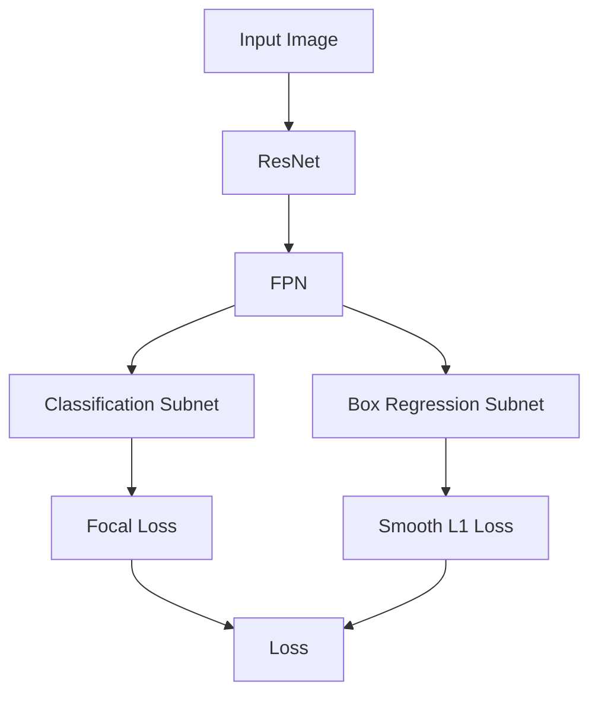
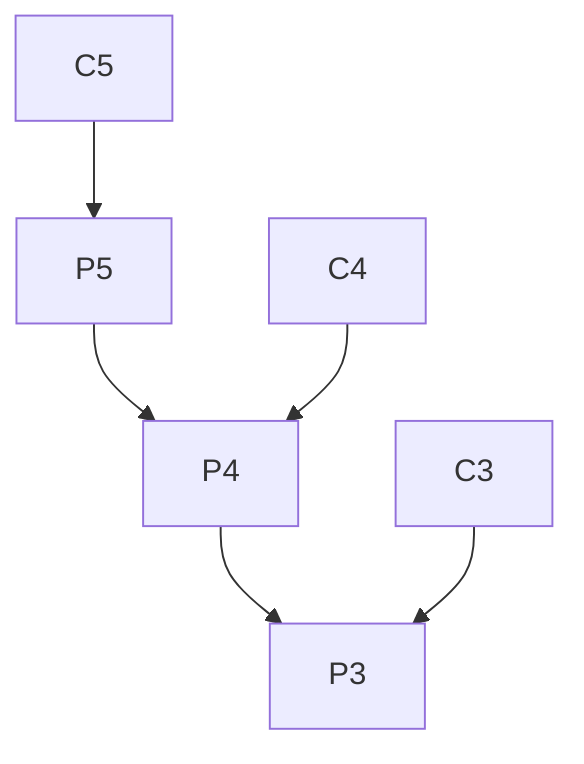

# RetinaNet原理与代码实例讲解

关键词：目标检测, RetinaNet, Focal Loss, FPN, 深度学习, 计算机视觉

## 1. 背景介绍 

### 1.1 问题的由来
近年来，随着深度学习技术的飞速发展，计算机视觉领域取得了巨大的进步。目标检测作为计算机视觉的一个重要分支，在自动驾驶、安防监控、医学影像等诸多领域有着广泛的应用。传统的目标检测算法如 Faster R-CNN、SSD 等虽然取得了不错的效果，但仍然存在一些问题，如小目标检测效果差、检测速度慢等。

### 1.2 研究现状
2017年，Focal Loss 的提出为解决目标检测中的类别不平衡问题提供了新的思路。在此基础上，RetinaNet 算法应运而生。RetinaNet 在 COCO 数据集上实现了当时最优的单阶段目标检测性能，引起了学术界和工业界的广泛关注。此后，众多研究者对 RetinaNet 进行了改进和优化，如 Libra R-CNN、GHM 等。

### 1.3 研究意义
RetinaNet 的出现为解决目标检测领域长期存在的问题提供了新的视角。深入研究 RetinaNet 的原理和实现，对于理解单阶段目标检测算法的特点和改进方向具有重要意义。同时，RetinaNet 思想对于解决其他领域的类别不平衡问题也有一定的启发作用。

### 1.4 本文结构
本文将从以下几个方面对 RetinaNet 进行详细阐述：首先介绍 RetinaNet 的核心概念与内在联系；然后重点讲解其核心算法原理与具体实现步骤；接着通过数学模型与公式推导加深理解；项目实践部分给出了详细的代码实例与解读；此外，文章还总结了RetinaNet 的实际应用场景、学习资源与工具推荐，以及对未来发展趋势的展望。

## 2. 核心概念与联系
RetinaNet 是一种单阶段的目标检测算法，其核心是 Focal Loss 和 FPN(Feature Pyramid Network) 两大模块。

Focal Loss 是一种解决类别不平衡问题的损失函数。传统的交叉熵损失函数对于容易分类的样本（置信度高）和难分类的样本（置信度低）赋予了同等的权重，导致容易样本主导了梯度。Focal Loss 通过在交叉熵损失的基础上引入调制因子，降低了容易样本的权重，使得模型更加聚焦在难分类样本上。Focal Loss 的数学形式如下：

$FL(p_t) = -(1-p_t)^{\gamma}log(p_t)$

其中，$p_t$ 表示模型对于类别 $t$ 的预测概率，$\gamma$ 为调制因子。

FPN 借鉴了图像金字塔的思想，通过自底向上和自顶向下的特征融合，构建了一个多尺度的特征金字塔。这使得模型能够在不同尺度下检测目标，提高了小目标的检测效果。

下图展示了 RetinaNet 的整体架构：

可以看出，输入图像经过主干网络 ResNet 提取特征后，通过 FPN 得到多尺度特征图。然后分别通过分类子网络和回归子网络进行目标分类和边界框回归。分类子网络采用 Focal Loss 作为损失函数，而回归子网络采用 Smooth L1 Loss。最终将两个子网络的损失相加得到整体的损失函数。

## 3. 核心算法原理 & 具体操作步骤

### 3.1 算法原理概述
RetinaNet 的算法流程可以概括为以下几个步骤：
1. 使用主干网络 ResNet 提取图像特征
2. 通过 FPN 得到多尺度特征图
3. 在每个特征图上进行密集预测，得到分类和回归结果
4. 使用 Focal Loss 和 Smooth L1 Loss 计算损失函数
5. 通过反向传播更新网络参数

### 3.2 算法步骤详解

#### 3.2.1 特征提取
RetinaNet 使用 ResNet 作为主干网络进行特征提取。ResNet 引入了残差连接，解决了深层网络训练困难的问题。对于目标检测任务，一般使用 ResNet-50 或 ResNet-101 作为主干网络。

#### 3.2.2 特征金字塔构建
在 ResNet 的基础上，RetinaNet 利用 FPN 构建特征金字塔。具体来说，取 ResNet 的 C3-C5 三个阶段的输出作为 FPN 的输入。自顶向下通过上采样和 1x1 卷积进行特征融合，每一层再经过 3x3 卷积得到最终的特征图。

FPN 的特征融合过程如下图所示：

其中，C3-C5 表示 ResNet 的输出，P3-P5 表示 FPN 的输出。

#### 3.2.3 密集预测
在 FPN 得到的每一层特征图上，RetinaNet 会进行密集预测。具体来说，每个特征图先经过一个 3x3 卷积，然后分别接上分类子网络和回归子网络。分类子网络通过 4 个 3x3 卷积和 1 个 3x3 卷积得到 K 个类别的预测结果。回归子网络通过 4 个 3x3 卷积得到 4K 个值，表示 K 个先验框的位置参数。

#### 3.2.4 Focal Loss
传统的交叉熵损失函数为:

$CE(p_t) = -log(p_t)$

Focal Loss 在此基础上引入了调制因子 $(1-p_t)^{\gamma}$，得到:

$FL(p_t) = -(1-p_t)^{\gamma}log(p_t)$

其中 $\gamma$ 是一个超参数，控制调制因子的影响程度。当 $\gamma=0$ 时，Focal Loss 退化为交叉熵损失。

#### 3.2.5 Smooth L1 Loss
位置回归采用 Smooth L1 Loss，其数学形式为:

$$
smooth_{L1}(x) = 
\begin{cases}
0.5x^2 & \text{if } |x| < 1 \\
|x| - 0.5 & \text{otherwise}
\end{cases}
$$

相比于 L2 Loss，Smooth L1 Loss 对离群点更加鲁棒。

### 3.3 算法优缺点
RetinaNet 的主要优点有:
1. 引入 Focal Loss 解决类别不平衡问题，提高了训练效率和精度
2. 使用 FPN 实现多尺度目标检测，对小目标更加友好
3. 单阶段设计，检测速度快

RetinaNet 的主要缺点有:
1. 对于尺度变化非常大的目标，检测效果还有待提高  
2. 超参数 $\gamma$ 需要调试，对训练效果影响较大

### 3.4 算法应用领域
RetinaNet 可以应用于以下领域:
1. 自动驾驶：车辆、行人、交通标志等目标检测
2. 安防监控：人脸、行为检测
3. 医学影像：肿瘤、器官等病变检测
4. 工业视觉：瑕疵检测、目标计数等

## 4. 数学模型和公式 & 详细讲解 & 举例说明

### 4.1 数学模型构建
RetinaNet 的数学模型主要包括三部分：主干网络、FPN 和预测网络。

主干网络 $f(x)$ 将输入图像 $x$ 映射到特征图：

$f(x) = [C_3, C_4, C_5]$

其中 $C_i$ 表示 ResNet 第 $i$ 阶段的输出。

FPN 可以表示为一个特征融合函数 $\phi$：

$\phi(C_3, C_4, C_5) = [P_3, P_4, P_5]$

其中 $P_i$ 表示 FPN 第 $i$ 层的输出。

预测网络包括分类子网络 $h_c$ 和回归子网络 $h_r$。对于特征图 $P_i$ 上的每个位置 $(x, y)$，有：

$h_c(P_i(x,y)) = [\hat{p}_0, \hat{p}_1, ..., \hat{p}_K]$

$h_r(P_i(x,y)) = [\hat{t}_0, \hat{t}_1, ..., \hat{t}_{4K}]$

其中 $\hat{p}_i$ 表示第 $i$ 类的预测概率，$\hat{t}_i$ 表示第 $i$ 个先验框的位置参数。

### 4.2 公式推导过程

#### Focal Loss 推导
Focal Loss 的推导过程如下：

首先，定义二分类交叉熵损失：

$CE(p, y) = 
\begin{cases}
-log(p) & \text{if } y=1 \\
-log(1-p) & \text{if } y=0
\end{cases}$

其中 $y \in \{0,1\}$ 为真实标签，$p \in [0,1]$ 为模型预测概率。

引入调制因子 $(1-p_t)^\gamma$，得到 Focal Loss：

$FL(p_t) = -\alpha_t(1-p_t)^\gamma log(p_t)$

其中 $p_t = p$ if $y=1$ else $1-p$，$\alpha_t$ 为平衡因子，用于调节正负样本的权重。

对于多分类问题，Focal Loss 可以推广为：

$FL(p, y) = -\sum_{i=1}^K \alpha_i(1-p_i)^\gamma y_i log(p_i)$

其中 $K$ 为类别数，$y_i \in \{0,1\}$ 表示样本是否属于第 $i$ 类，$p_i$ 为模型预测的第 $i$ 类概率。

#### Smooth L1 Loss 推导
Smooth L1 Loss 的推导过程如下：

定义误差项：

$\delta = \hat{t} - t$

其中 $\hat{t}$ 为预测值，$t$ 为真实值。

对误差项进行分段，得到 Smooth L1 Loss：

$smooth_{L1}(\delta) =
\begin{cases} 
0.5\delta^2 & \text{if } |\delta| < 1 \\ 
|\delta| - 0.5 & \text{otherwise}
\end{cases}$

可以看出，当误差较小时，Smooth L1 Loss 近似为 L2 Loss；当误差较大时，Smooth L1 Loss 近似为 L1 Loss。这种分段设计使得 Smooth L1 Loss 对离群点更加鲁棒。

### 4.3 案例分析与讲解
下面以一个简单的二分类问题为例，说明 Focal Loss 的作用。

假设有 10 个样本，其中 9 个为负样本（$y=0$），1 个为正样本（$y=1$）。模型对这 10 个样本的预测概率分别为：

$[0.9, 0.92, 0.88, 0.95, 0.93, 0.97, 0.99, 0.98, 0.91, 0.2]$

可以看出，模型对前 9 个负样本的预测概率都很高，而对最后一个正样本的预测概率较低。

如果使用交叉熵损失，则总损失为：

$CE = -log(0.9) - log(0.92) - ... - log(0.91) - log(0.2) = 2.303$

可以发现，尽管模型对正样本的预测不准确，但由于负样本数量占优，总损失依然很小。这表明交叉熵损失被易分类样本主导。

现在使用 Focal Loss，取 $\gamma=2$，则总损失为：

$FL = -(1-0.9)^2log(0.9) - ... - (1-0.91)^2log(0.91) - (1-0.2)^2log(0.2) = 0.708$  

可以看出，Focal Loss 显著提高了对正样本的关注度，使得总损失主要由难分类样本贡献。这有助于模型聚焦在难分类样本上，提高训练效率和精度。

### 4.