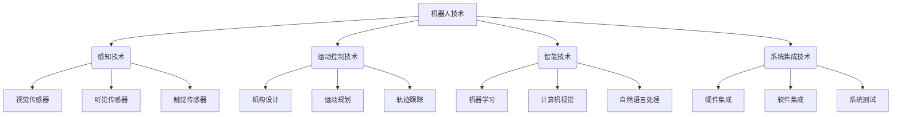
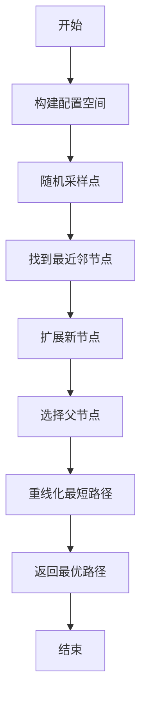
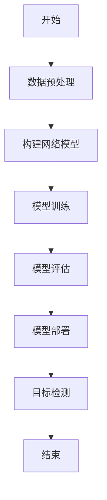

好的,我会严格按照要求,以《Robotics 原理与代码实战案例讲解》为题,撰写一篇逻辑严谨、内容丰富、结构完整的专业技术博客文章。

# Robotics 原理与代码实战案例讲解

## 1. 背景介绍

### 1.1 问题的由来

在当今科技飞速发展的时代,机器人技术已经广泛应用于各个领域,从工业制造到医疗服务,从航空航天到家庭服务,机器人正在改变着人类的生活方式。然而,机器人技术的发展也带来了诸多挑战,例如如何实现机器人的自主控制、如何提高机器人的智能化水平、如何确保机器人系统的安全性和可靠性等。因此,深入研究机器人的原理和实践应用,对于推动机器人技术的进步至关重要。

### 1.2 研究现状  

机器人技术的研究可以追溯到20世纪50年代,当时主要集中在工业机器人的开发和应用。随着计算机技术和人工智能技术的不断进步,机器人技术也取得了长足的发展。目前,机器人技术的研究主要集中在以下几个方面:

1. 机器人感知技术:包括视觉、听觉、触觉等传感器技术,用于获取环境信息。
2. 机器人运动控制技术:包括机构设计、运动规划、轨迹跟踪等,用于实现机器人的运动控制。
3. 机器人智能技术:包括机器学习、计算机视觉、自然语言处理等,用于赋予机器人智能化能力。
4. 机器人系统集成技术:将各种技术有机整合,构建完整的机器人系统。

### 1.3 研究意义

机器人技术的研究和发展对于提高生产效率、改善人类生活质量、拓展人类认知边界等方面具有重要意义:

1. 提高生产效率:机器人可以替代人工从事一些危险、重复、高强度的工作,提高生产效率。
2. 改善生活质量:服务型机器人可以为残疾人士、老年人提供生活上的帮助,改善他们的生活质量。
3. 拓展认知边界:机器人可以进入人类难以到达的极端环境,如深海、外太空等,拓展人类的认知边界。

### 1.4 本文结构

本文将从机器人的基本原理出发,介绍机器人技术的核心概念、算法原理、数学模型,并结合实际代码案例,深入探讨机器人技术的实践应用。最后,本文将对机器人技术的发展趋势和面临的挑战进行展望和分析。

## 2. 核心概念与联系

在深入探讨机器人技术的细节之前,我们需要先了解一些核心概念及其相互关系。这些概念构成了机器人技术的基础框架,对于理解后续内容至关重要。

1. **感知技术**:机器人需要通过各种传感器获取环境信息,如视觉、听觉、触觉等,这是机器人感知外界世界的基础。
2. **运动控制技术**:机器人需要根据感知到的信息,合理规划运动轨迹,并精确控制机构的运动,以完成特定任务。
3. **智能技术**:赋予机器人一定的智能化能力,如机器学习、计算机视觉、自然语言处理等,使其能够自主决策和行为。
4. **系统集成技术**:将上述各项技术有机整合,构建出完整的机器人系统,并进行测试和优化。

这四大技术领域相互依赖、相互影响,共同推动着机器人技术的发展。只有将它们有机结合,才能构建出真正智能化的机器人系统。

## 3. 核心算法原理与具体操作步骤

### 3.1 算法原理概述

机器人技术涉及多种算法,本节将重点介绍其中两种核心算法:运动规划算法和视觉识别算法。

1. **运动规划算法**

运动规划算法是机器人运动控制技术的核心,其目标是为机器人生成一条从起点到终点的、无碰撞的、满足各种约束条件的最优运动轨迹。常见的运动规划算法包括采样优化算法(如RRT、RRT*)、网格搜索算法(如A*算法)、人工势场法等。

2. **视觉识别算法**  

视觉识别算法是机器人感知技术的关键,通过对图像或视频数据进行处理和分析,机器人可以识别目标物体、估计物体位置、跟踪运动目标等。常见的视觉识别算法有基于特征的算法(如SIFT、SURF)、基于模板匹配的算法、基于深度学习的算法(如卷积神经网络)等。

### 3.2 算法步骤详解  

#### 3.2.1 运动规划算法步骤

以RRT*算法为例,其基本步骤如下:

1. 构建配置空间
2. 随机采样点
3. 找到最近邻节点
4. 扩展新节点
5. 选择父节点
6. 重线化最短路径
7. 返回最优路径

#### 3.2.2 视觉识别算法步骤  

以基于深度学习的目标检测算法为例,其基本步骤如下:

1. 数据预处理
2. 构建网络模型 
3. 模型训练
4. 模型评估
5. 模型部署
6. 目标检测

### 3.3 算法优缺点

#### 3.3.1 运动规划算法

**优点**:
- 能够有效解决高维空间的路径规划问题
- 算法简单,易于实现和扩展
- 可以处理各种约束条件

**缺点**:
- 计算效率较低,尤其是在高维空间中
- 存在局部最优解的问题
- 对于动态环境的适应性较差

#### 3.3.2 视觉识别算法

**优点**:
- 深度学习算法具有强大的特征提取和模式识别能力
- 可以处理复杂的视觉任务,如目标检测、语义分割等
- 算法通用性强,可以迁移到不同的视觉任务中

**缺点**:
- 需要大量的标注数据进行训练
- 模型训练过程计算量大,时间较长
- 存在黑盒问题,决策过程缺乏可解释性

### 3.4 算法应用领域

#### 3.4.1 运动规划算法应用

- 工业机器人:用于工业机器人的路径规划和运动控制
- 无人驾驶:用于无人驾驶汽车的路径规划和决策
- 机器人手术:用于手术机器人的运动规划和避障
- 空间探索:用于航天器和行星探测车的航路规划

#### 3.4.2 视觉识别算法应用

- 工业视觉检测:用于产品质量检测和缺陷识别
- 安防监控:用于人脸识别、行为分析等
- 智能驾驶:用于交通标志、行人、障碍物的识别
- 机器人导航:用于环境感知和路标识别
- 医疗影像分析:用于疾病诊断和手术导航

## 4. 数学模型和公式详细讲解与举例说明

### 4.1 数学模型构建  

在机器人技术中,我们需要构建数学模型来描述和解决实际问题。以运动规划问题为例,我们可以将其建模为一个优化问题:

$$
\begin{aligned}
\min\limits_{x(t)} &\quad J(x(t)) \\
\text{s.t.} &\quad x(t_0) = x_0, x(t_f) = x_f \\
&\quad \dot{x}(t) = f(x(t), u(t)) \\
&\quad g(x(t), u(t)) \leq 0
\end{aligned}
$$

其中:
- $x(t)$是机器人的状态变量,如位置、速度等
- $u(t)$是控制输入,如关节转矩等
- $J(x(t))$是需要优化的目标函数,如最短路径或最小能耗
- $f(x(t), u(t))$描述了机器人的运动方程
- $g(x(t), u(t))$描述了约束条件,如障碍物避障、关节极限等

通过求解这个优化问题,我们可以得到满足各种约束条件的最优运动轨迹。

### 4.2 公式推导过程

在机器人技术中,我们常常需要推导一些公式来描述机器人的运动或者求解优化问题。以机器人的运动学公式为例,我们可以通过几何关系和矩阵变换推导出机器人的正向运动学和逆向运动学公式。

#### 4.2.1 正向运动学公式推导

考虑一个n自由度的机器人臂,其每个关节的位置可以用一个齐次变换矩阵$T_i$表示,则从基坐标系到末端执行器的变换矩阵为:

$$
T = T_1 T_2 \cdots T_n
$$

其中$T_i$可以由D-H参数计算得到:

$$
T_i = \begin{bmatrix}
\cos\theta_i & -\sin\theta_i\cos\alpha_i & \sin\theta_i\sin\alpha_i & a_i\cos\theta_i\\
\sin\theta_i & \cos\theta_i\cos\alpha_i & -\cos\theta_i\sin\alpha_i & a_i\sin\theta_i\\
0 & \sin\alpha_i & \cos\alpha_i & d_i\\
0 & 0 & 0 & 1
\end{bmatrix}
$$

通过这种方式,我们可以计算出末端执行器的位置和姿态。

#### 4.2.2 逆向运动学公式推导

已知末端执行器的位置和姿态$T$,我们需要求解每个关节的角度$\theta_i$,这就是逆向运动学问题。对于一般情况,我们可以将$T$分解为位置和姿态两部分,分别求解:

$$
T = \begin{bmatrix}
R & p\\
0 & 1
\end{bmatrix}
$$

其中$R$是旋转矩阵,描述了末端执行器的姿态;$p$是位移向量,描述了末端执行器的位置。

我们可以利用几何关系和三角函数等数学知识,推导出每个关节角度$\theta_i$的解析解或者数值解。

### 4.3 案例分析与讲解

#### 4.3.1 运动规划案例

考虑一个六自由度的工业机器人臂,需要从初始位置$x_0$运动到目标位置$x_f$,同时避开工作空间中的障碍物。我们可以使用RRT*算法来求解这个运动规划问题。

1. 构建配置空间$\mathcal{C}$,包括机器人臂的自由度和障碍物信息。
2. 在$\mathcal{C}$中随机采样点$x_\text{rand}$。
3. 找到$x_\text{rand}$在当前树中的最近邻节点$x_\text{nearest}$。
4. 从$x_\text{nearest}$向$x_\text{rand}$扩展一个新节点$x_\text{new}$,检