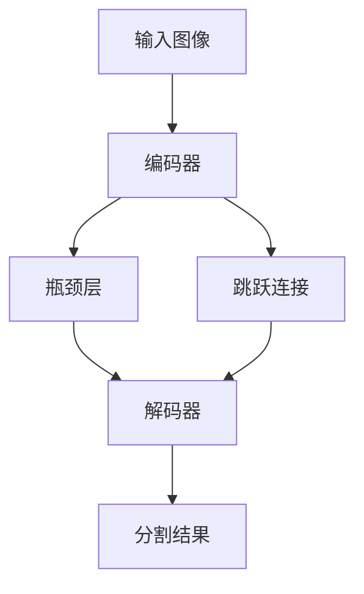

# Semantic Segmentation原理与代码实例讲解

## 1. 背景介绍

### 1.1 问题的由来

在计算机视觉和图像处理领域中,语义分割(Semantic Segmentation)是一项关键技术。它旨在将数字图像中的每个像素与某个语义类别(如人、汽车、树木等)相关联。与传统的图像分类和目标检测任务不同,语义分割需要对整个图像进行像素级别的分类,从而获得更加精细和全面的理解。

传统的图像处理方法,如基于阈值、边缘检测和区域生长等,通常只能获取图像的低级特征,很难准确理解图像中复杂的语义信息。随着深度学习技术的发展,基于卷积神经网络(CNN)的语义分割模型展现出了强大的性能,能够从原始像素数据中自动学习到高级语义特征,从而实现更加准确的像素级分类。

### 1.2 研究现状

近年来,受益于大规模标注数据集的出现、深度学习模型的创新以及计算能力的提升,语义分割技术取得了长足的进步。著名的语义分割模型有全卷积网络(FCN)、U-Net、Mask R-CNN、DeepLab等。这些模型通过编码器-解码器架构、空洞卷积、注意力机制等技术,显著提高了分割精度和效率。

然而,现有的语义分割模型仍然面临一些挑战,如对小目标、边缘细节的分割精度不足、对遮挡和形变的鲁棒性较差、对少数类别的识别能力有限等。此外,如何在保证分割精度的同时降低计算复杂度,以满足实时应用的需求,也是一个亟待解决的问题。

### 1.3 研究意义

语义分割技术在许多领域具有广泛的应用前景,如无人驾驶、医学影像分析、机器人视觉、增强现实等。准确的语义分割能够为这些系统提供精细的环境理解,从而支持更加智能和安全的决策。

此外,语义分割也是发展通用人工智能(AGI)的关键一环。通过对图像进行精细的语义理解,计算机系统能够更好地感知和理解复杂的视觉世界,为实现人类水平的智能奠定基础。

### 1.4 本文结构

本文将全面介绍语义分割的核心概念、算法原理、数学模型、代码实现和应用场景。我们将从浅入深地探讨这一领域的关键技术,并通过实例代码和案例分析,帮助读者深入理解语义分割的实现细节和实践技巧。文章最后,我们还将展望语义分割技术的未来发展趋势和挑战。

## 2. 核心概念与联系

语义分割技术涉及多个相关的核心概念,包括:

1. **像素级分类(Pixel-level Classification)**:语义分割的本质是将图像中的每个像素与一个语义类别相关联,因此像素级分类是其核心任务。

2. **编码器-解码器架构(Encoder-Decoder Architecture)**:大多数语义分割模型采用编码器-解码器架构,其中编码器用于提取图像特征,解码器则将这些特征解码为像素级预测。

3. **上采样(Upsampling)**:由于编码器会逐步降低特征图的分辨率,因此需要在解码器中进行上采样操作,将低分辨率的特征图恢复到原始图像尺寸。

4. **跳跃连接(Skip Connections)**:为了融合不同尺度的特征信息,许多模型采用了跳跃连接,将编码器中的高分辨率特征直接传递给解码器。

5. **空洞卷积(Dilated Convolutions)**:空洞卷积能够在不增加参数的情况下扩大卷积核的感受野,从而捕获更大范围的上下文信息,对提高分割精度有重要作用。

6. **注意力机制(Attention Mechanism)**:注意力机制可以自适应地聚焦于图像中的关键区域,从而提高模型对重要特征的关注度,进一步提升分割性能。

7. **条件随机场(Conditional Random Fields, CRF)**:CRF是一种常用的后处理技术,可以利用像素之间的空间相关性,平滑分割结果并细化目标边缘。

这些核心概念相互关联、相辅相成,共同构建了语义分割技术的理论和实践基础。下一节,我们将深入探讨语义分割的核心算法原理和具体实现步骤。

## 3. 核心算法原理 & 具体操作步骤

### 3.1 算法原理概述

语义分割算法的核心思想是利用深度卷积神经网络(CNN)自动学习图像的语义特征表示,并基于这些特征进行像素级分类。典型的语义分割模型通常采用编码器-解码器架构,如下图所示:

1. **编码器(Encoder)**:编码器通常由一系列卷积层和下采样层(如池化层)组成,用于从输入图像中提取语义特征。随着网络深度的增加,特征图的分辨率逐渐降低,但语义信息越来越丰富。

2. **瓶颈层(Bottleneck)**:瓶颈层位于编码器和解码器之间,通常由一些卷积层组成。它的作用是进一步融合和整合来自编码器的特征信息。

3. **解码器(Decoder)**:解码器的目标是将瓶颈层输出的低分辨率特征图逐步上采样,恢复到原始图像的分辨率,并进行像素级分类。解码器通常包含上采样层(如反卷积层)和卷积层。

4. **跳跃连接(Skip Connections)**:为了融合不同尺度的特征信息,编码器中的高分辨率特征通常会通过跳跃连接直接传递给解码器,从而提高分割的精度和细节。

5. **最终分类层**:解码器的输出通常会经过一个分类层(如softmax层),将每个像素与语义类别相关联,生成最终的分割结果。

该架构的关键在于,编码器能够自动学习图像的高级语义特征表示,而解码器则利用这些特征进行像素级分类和上采样,从而实现精细的语义分割。

### 3.2 算法步骤详解

下面,我们将详细介绍语义分割算法的具体实现步骤:

1. **数据准备**:首先需要准备标注好的图像数据集,其中每个像素都被赋予了语义类别标签。常用的数据集包括PASCAL VOC、Cityscapes、COCO等。

2. **数据预处理**:对图像进行标准化、数据增强等预处理操作,以提高模型的泛化能力。常见的数据增强方法包括随机裁剪、翻转、旋转、颜色变换等。

3. **模型构建**:根据所选的语义分割架构(如FCN、U-Net、DeepLab等)构建深度卷积神经网络模型。模型通常包括编码器、解码器、跳跃连接和最终分类层等组件。

4. **模型训练**:使用预处理后的数据集对模型进行训练。常用的损失函数包括交叉熵损失、Dice损失、Focal损失等。可以采用随机梯度下降、Adam等优化算法进行参数更新。

5. **模型评估**:在验证集或测试集上评估模型的分割性能,常用的指标包括像素准确率(Pixel Accuracy)、平均交并比(Mean IoU)、Dice系数等。

6. **后处理**:对模型输出的原始分割结果进行后处理,以提高分割质量。常见的后处理方法包括条件随机场(CRF)、小目标增强等。

7. **模型微调**:根据评估结果和实际需求,对模型进行微调和优化,如调整超参数、修改网络结构、加入注意力机制等。

8. **模型部署**:将训练好的模型部署到实际应用系统中,如无人驾驶、医学影像分析等。需要考虑模型的计算效率、内存占用等实际应用约束。

上述步骤是语义分割算法的典型实现流程。在实际应用中,还需要根据具体场景和需求进行调整和优化。

### 3.3 算法优缺点

语义分割算法具有以下优点:

1. **像素级精度**:与传统的图像分类和目标检测相比,语义分割能够对图像进行像素级别的精细分析,获得更加全面和细致的理解。

2. **端到端学习**:基于深度学习的语义分割模型能够自动从原始像素数据中学习到高级语义特征,无需手工设计特征提取器。

3. **泛化能力强**:通过在大规模数据集上训练,语义分割模型能够学习到丰富的视觉概念,并具有较强的泛化能力,可以应用于各种复杂场景。

4. **多任务扩展**:语义分割模型可以与其他任务(如实例分割、深度估计等)相结合,形成多任务学习框架,进一步提高性能。

但同时,语义分割算法也存在一些缺点和挑战:

1. **计算复杂度高**:语义分割模型通常包含大量参数,计算量和内存占用较大,对硬件资源要求较高。

2. **标注成本高**:训练语义分割模型需要大量像素级别的标注数据,标注工作耗时耗力。

3. **小目标分割困难**:对于图像中的小目标,由于分辨率限制,语义分割模型往往难以准确分割。

4. **遮挡和形变敏感**:语义分割模型对目标遮挡和形变的鲁棒性还有待提高。

5. **实时性能有待提升**:在一些实时应用场景(如无人驾驶)中,语义分割模型的推理速度仍需进一步优化。

总的来说,语义分割算法展现出了强大的能力,但也面临着一些挑战和局限性,需要持续的研究和创新来加以解决。

### 3.4 算法应用领域

语义分割技术在多个领域都有广泛的应用前景,包括但不限于:

1. **无人驾驶**:语义分割可以为自动驾驶系统提供精细的道路环境理解,如识别车辆、行人、道路标志等,是实现智能驾驶的关键技术之一。

2. **医学影像分析**:在医学影像(如CT、MRI等)中,语义分割可以自动分割出不同的器官和病变区域,为疾病诊断和手术规划提供重要支持。

3. **机器人视觉**:语义分割技术可以帮助机器人更好地理解和感知环境,实现精确的目标识别和运动规划。

4. **增强现实(AR)**:语义分割可以实时分割出场景中的各个物体,为增强现实应用提供精确的虚实融合基础。

5. **遥感图像分析**:在卫星遥感图像中,语义分割可以自动分割出城市、农田、水体等不同地物,为城市规划、农业监测等提供支持。

6. **视频监控和安防**:语义分割可以实时分析监控视频中的人物、车辆等目标,用于智能监控和安防系统。

7. **人机交互**:通过语义分割技术,计算机系统可以更好地理解人体姿态、手势等,实现自然的人机交互。

8. **虚拟现实(VR)**:语义分割可以帮助虚拟现实系统实现更加逼真的场景重建和渲染。

总的来说,语义分割技术为各个领域提供了精细的视觉理解能力,是实现智能系统的关键基础技术之一。随着算法性能的不断提升和应用场景的拓展,语义分割将发挥越来越重要的作用。

## 4. 数学模型和公式 & 详细讲解 & 举例说明

语义分割算法的核心是利用深度卷积神经网络从原始像素数据中学习到高级语义特征表示,并基于这些特征进行像素级分类。下面,我们将详细介绍语义分割的数学模型和公式