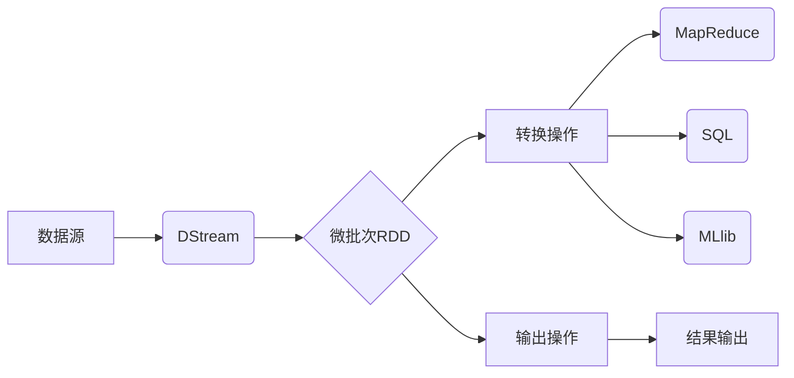

# Spark Streaming原理与代码实例讲解

## 1. 背景介绍
### 1.1  问题的由来
在当今大数据时代，数据正以前所未有的速度和规模不断产生。企业和组织需要实时处理和分析海量的流式数据，以便及时洞察业务状况，快速响应市场变化。传统的批处理模式已经无法满足实时性要求，亟需一种高效、可扩展的流式数据处理框架。
### 1.2  研究现状
目前，流式数据处理已成为大数据领域的研究热点。业界出现了多种流式计算框架，如Storm、Flink、Samza等。其中，Spark Streaming作为Apache Spark生态系统的重要组成部分，凭借其易用性、高性能、容错性等优势，受到越来越多开发者和企业的青睐。
### 1.3  研究意义
深入研究Spark Streaming的原理和应用，对于掌握大数据实时处理技术、提升个人技能、解决企业实际问题都具有重要意义。通过系统学习Spark Streaming，可以理解其核心概念、工作机制、编程模型，并能够开发出高质量的流式应用程序，为实时数据处理提供有力支撑。
### 1.4  本文结构
本文将全面讲解Spark Streaming的原理和应用实践。第2部分介绍Spark Streaming的核心概念；第3部分重点剖析其工作原理；第4部分建立数学模型加以分析；第5部分通过代码实例演示Spark Streaming编程；第6部分探讨其典型应用场景；第7部分推荐相关工具和学习资源；第8部分总结全文并展望未来。

## 2. 核心概念与联系
Spark Streaming是建立在Spark之上的分布式实时流处理框架。它通过将连续的数据流切分成一系列微小的批次(batch)，并使用Spark引擎进行快速处理，从而实现了低延迟、高吞吐的流式计算。下面介绍几个核心概念：

- 数据流(DStream)：Spark Streaming的基本抽象，表示连续的数据流。DStream由一系列RDD(弹性分布式数据集)组成，每个RDD包含一个时间间隔内的数据。
- 微批次(micro-batch)：将数据流按照一定的时间间隔(如1秒)划分成一个个微小的批次进行处理，每个批次都是一个RDD。这种微批次方式使得Spark Streaming兼顾了实时性和吞吐量。
- 窗口操作(window)：在DStream上进行的聚合操作，如滑动窗口计数。窗口大小和滑动间隔可以灵活设置。

下图展示了Spark Streaming的核心概念之间的关系：



## 3. 核心算法原理 & 具体操作步骤
### 3.1  算法原理概述
Spark Streaming接收实时输入数据流，并将其划分成多个微批次RDD，然后使用Spark引擎对每个微批次进行计算处理，最后生成结果数据流输出。内部采用DAG(有向无环图)描述RDD之间的依赖关系，实现了高效的容错和数据恢复。
### 3.2  算法步骤详解
1. 数据摄入：Spark Streaming以微批次的方式接收输入数据流，数据源可以是Kafka、Flume、HDFS等。
2. 创建DStream：通过调用StreamingContext的相关API，如socketTextStream、kafkaStream等，将输入数据转换为DStream。
3. 转换操作：对DStream执行各种转换操作，如map、filter、reduce、join等，生成新的DStream。转换操作是延迟执行的，只在输出操作触发时才真正计算。
4. 窗口操作：对DStream进行窗口化操作，如reduceByKeyAndWindow、countByWindow等，对一段时间内的数据进行聚合。
5. 输出操作：调用DStream的输出方法，如print、saveAsTextFiles、foreachRDD等，触发实际计算并将结果输出到外部系统。
6. 启动流式作业：调用StreamingContext的start方法，启动Spark Streaming作业。作业将一直运行，持续处理数据，直到手动停止或发生异常。

### 3.3  算法优缺点
优点：
- 易用性：Spark Streaming继承了Spark简洁友好的API风格，开发者可以使用Scala、Java、Python等语言快速编写流式应用。
- 高性能：得益于Spark的内存计算和DAG执行引擎，Spark Streaming能够实现低至秒级的延迟和每秒数百万条记录的吞吐量。
- 容错性：Spark Streaming基于Spark的RDD容错机制，能够自动从故障中恢复，保证数据处理的可靠性。
- 集成性：Spark Streaming与Spark生态系统无缝集成，可以与Spark SQL、MLlib等组件协同工作，实现复杂的流批一体化计算。

缺点：
- 微批次粒度：Spark Streaming以微批次方式处理数据，虽然延迟较低，但不是真正的毫秒级实时。对于极低延迟的场景，还需要考虑其他方案，如Storm、Flink等。
- 吞吐量瓶颈：Spark Streaming的吞吐量很大程度上取决于Spark引擎和底层集群的性能。在数据量极大的情况下，可能需要对集群进行扩容优化。

### 3.4  算法应用领域
Spark Streaming适用于多种实时数据处理场景，如：
- 实时日志分析：收集应用程序、服务器的日志数据，实时进行统计分析，及时发现异常情况。
- 实时推荐系统：根据用户的实时行为数据，动态更新用户画像，实时推送个性化内容。
- 欺诈检测：对交易数据流进行实时分析，识别异常行为，防范金融欺诈。
- 物联网数据处理：对传感器、设备产生的海量数据进行实时采集、清洗、聚合分析。

## 4. 数学模型和公式 & 详细讲解 & 举例说明
### 4.1  数学模型构建
我们可以使用流水线模型来描述Spark Streaming的工作过程。设输入数据流为$S$，DStream为$D$，RDD为$R$，转换操作为$T$，输出结果为$O$。则Spark Streaming的数学模型可表示为：

$$S \rightarrow D \rightarrow R_1 \rightarrow R_2 \rightarrow ... \rightarrow R_n \rightarrow O$$

其中，$D$由一系列的$R$组成，即$D = \{R_1, R_2, ..., R_n\}$，每个$R$代表一个微批次。转换操作$T$作用于$D$上，生成新的$D'$：

$$T(D) \rightarrow D'$$

### 4.2  公式推导过程
以词频统计为例，假设输入数据流$S$中的每个元素为一行文本，需要统计每个单词的出现频率。设$S = \{s_1, s_2, ..., s_m\}$，$m$为流中的文本行数。对于每个微批次$R_i$，执行以下操作：

1. 将$R_i$中的每行文本拆分成单词，生成新的RDD $R_i'$：

$$map(R_i) \rightarrow R_i'$$

2. 对$R_i'$中的每个单词计数，生成新的RDD $R_i''$，其中每个元素为(单词, 1)：

$$map(R_i') \rightarrow R_i''$$

3. 对$R_i''$按单词进行聚合，累加出现次数：

$$reduceByKey(R_i'') \rightarrow R_i'''$$

最后，将所有微批次的结果$R_i'''$合并，得到整个数据流的单词频率统计结果$O$。

### 4.3  案例分析与讲解
下面以一个具体的例子说明Spark Streaming的词频统计过程。假设输入数据流$S$如下：

```
hello world
hello spark 
hello hadoop
```

设批次大小为2，则$S$被划分为两个微批次$R_1$和$R_2$：

$$R_1 = \{hello\ world,\ hello\ spark\}$$
$$R_2 = \{hello\ hadoop\}$$

对$R_1$执行上述三个步骤，得到结果$R_1'''$：

$$R_1''' = \{(hello, 2),\ (world, 1),\ (spark, 1)\}$$

对$R_2$执行相同操作，得到$R_2'''$：

$$R_2''' = \{(hello, 1),\ (hadoop, 1)\}$$

最后将$R_1'''$和$R_2'''$合并，得到最终的词频统计结果$O$：

$$O = \{(hello, 3),\ (world, 1),\ (spark, 1),\ (hadoop, 1)\}$$

可以看出，Spark Streaming通过将连续的数据流切分成多个微批次，并对每个微批次进行分布式计算，最终得到整个数据流的处理结果。这种微批次方式既保证了较低的延迟，又能够实现高吞吐量。

### 4.4  常见问题解答
1. Q: Spark Streaming的实时性如何？
   A: Spark Streaming采用微批次方式处理数据，延迟通常在秒级别。如果需要毫秒级的实时性，可以考虑使用Storm、Flink等纯实时流处理框架。

2. Q: Spark Streaming如何保证数据处理的exactly-once语义？
   A: Spark Streaming提供了以下机制来保证exactly-once语义：
   - 数据源端：使用可重放的数据源，如Kafka，并开启幂等写入。
   - 数据处理端：使用Spark的预写日志(WAL)机制，将每个微批次的操作写入到容错存储，失败时可重放。
   - 数据输出端：使用幂等或事务性的输出操作，如幂等写入MySQL，或使用事务性的文件系统如HDFS。

3. Q: Spark Streaming能否与Spark其他组件集成？
   A: 当然可以。Spark Streaming与Spark生态系统无缝集成，可以与Spark Core、SQL、MLlib等组件协同工作，实现复杂的流批一体化计算，如流式ETL、流式机器学习等。

## 5. 项目实践：代码实例和详细解释说明
下面通过一个完整的Spark Streaming代码实例，演示如何使用Scala API开发单词计数应用。

### 5.1  开发环境搭建
- 安装JDK 8+和Scala 2.12+。
- 下载并解压Spark 3.0+发布包。
- 使用IDEA或Scala IDE创建Scala/SBT工程，并添加Spark依赖。

### 5.2  源代码详细实现
```scala
import org.apache.spark.SparkConf
import org.apache.spark.streaming.{Seconds, StreamingContext}

object WordCount {
  def main(args: Array[String]): Unit = {
    // 创建SparkConf对象
    val conf = new SparkConf().setAppName("WordCount").setMaster("local[2]")
    // 创建StreamingContext，批次间隔为5秒
    val ssc = new StreamingContext(conf, Seconds(5))

    // 从指定端口创建DStream
    val lines = ssc.socketTextStream("localhost", 9999)
    // 对DStream执行词频统计
    val words = lines.flatMap(_.split(" "))
    val pairs = words.map(word => (word, 1))
    val wordCounts = pairs.reduceByKey(_ + _)

    // 打印每个批次的结果
    wordCounts.print()

    // 启动作业
    ssc.start()
    ssc.awaitTermination()
  }
}
```

### 5.3  代码解读与分析
1. 首先创建SparkConf对象，设置应用名称和部署模式。这里使用local[2]模式，表示在本地运行，使用2个线程。
2. 创建StreamingContext对象，传入SparkConf和批次间隔。StreamingContext是Spark Streaming的主入口。
3. 通过socketTextStream方法创建基于socket的DStream，并指定监听主机和端口。这里从本机9999端口接收数据。
4. 对DStream执行一系列转换操作，包括：
   - flatMap：将每行文本拆分成单词。
   - map：将每个单词映射为(word, 1)形式的元组。
   - reduceByKey：按单词聚合，对出现次数进行累加。
5. 调用print方法，打印每个批次的计算结果。这是一个输出操作，会触发实际计算。
6. 调用start