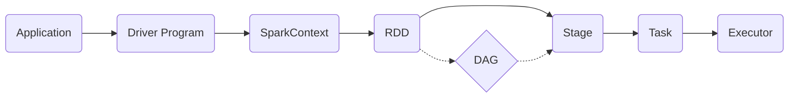
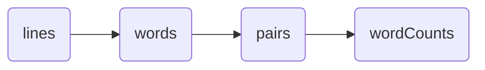

# Spark原理与代码实例讲解

关键词：Spark、大数据处理、RDD、DAG、内存计算、分布式计算

## 1. 背景介绍
### 1.1 问题的由来
随着大数据时代的到来,传统的数据处理方式已经无法满足海量数据的实时计算和处理需求。Hadoop作为早期的大数据处理框架,虽然具有良好的扩展性和容错性,但在迭代式计算和实时计算方面存在明显的性能瓶颈。
### 1.2 研究现状
Spark作为新一代大数据处理引擎,凭借其快速、通用、易用等特点,在实时计算、机器学习、图计算等领域得到了广泛应用。目前已成为大数据领域最为活跃的开源项目之一,众多互联网公司都在生产环境中大规模使用Spark。
### 1.3 研究意义
深入理解Spark的核心原理和工作机制,对于更好地应用Spark解决实际问题,优化Spark程序性能,以及参与Spark生态系统的建设都具有重要意义。同时对于学习和研究大数据处理技术也大有裨益。
### 1.4 本文结构
本文将分为9个部分,首先介绍Spark的核心概念和基本原理,然后详细讲解RDD、DAG等核心机制的工作原理,并给出数学模型和代码实例。接着分析Spark的实际应用场景,推荐相关工具和学习资源,最后总结Spark的发展趋势和面临的挑战。

## 2. 核心概念与联系
Spark的核心是一个计算引擎,主要由以下几个核心概念构成:  

- RDD(Resilient Distributed Dataset):Spark的基本计算单元,是一个不可变、可分区、里面的元素可并行计算的集合。RDD之间通过转换(Transformation)操作建立依赖关系。

- DAG(Directed Acyclic Graph):反映RDD之间的依赖关系,根据DAG划分Stage,决定哪些RDD要重新计算,哪些可以复用。

- Executor:运行在工作节点(Worker Node)上的一个进程,负责运行Task,执行计算,存储RDD等。

- Application:用户编写的Spark应用程序,一个Application包含一个Driver Program和多个Executor。

- Driver Program:运行Application的main()函数并创建SparkContext,是Spark程序的入口点。

- Stage:一组关联的、相互之间没有Shuffle依赖的Task组成的任务集,代表了一个计算阶段。

- Task:被送到某个Executor上的工作单元。

- Shuffle:Spark将一个Stage的计算结果需要分发到下一个Stage时,就需要执行Shuffle。

下图展示了Spark核心概念之间的关系:



## 3. 核心算法原理 & 具体操作步骤
### 3.1 算法原理概述
Spark的核心是RDD,提供了一组丰富的操作算子如map、filter、reduce等,通过算子的组合来表达复杂的计算逻辑。RDD采用了惰性计算模式,只有在Action操作时才会触发真正的计算。多个RDD形成DAG有向无环图,根据宽窄依赖关系划分Stage。
### 3.2 算法步骤详解
1. 创建RDD:从数据源、内存集合或其他RDD经过转换操作生成RDD。
2. 转换RDD:通过一系列转换算子如map、filter、groupBy等将RDD转换为新的RDD,转换操作是惰性的,不会立即执行。
3. 生成DAG:根据RDD之间的转换关系生成DAG图,DAG描述了RDD的计算过程和依赖关系。
4. 划分Stage:根据宽依赖(Shuffle)将DAG划分为多个Stage,每个Stage包含一组窄依赖的RDD及其转换操作。
5. 生成Task:Stage根据分区数和并行度生成一组Task,每个Task对应数据的一个分区。
6. 提交Task:将Task以TaskSet的形式提交到集群管理器如YARN、Mesos,分发到各个工作节点的Executor进程。
7. 执行计算:Executor接收Task后,从分布式存储或其他RDD读取分区数据,执行计算逻辑,生成新的RDD分区。
8. 结果输出:计算结果通过Action操作输出,如collect、reduce、saveAsTextFile等,将结果返回Driver程序或写入外部存储。

### 3.3 算法优缺点
优点:
- 基于内存计算,中间结果可缓存,避免了重复计算,计算速度快。
- DAG模型和延迟计算,优化了任务调度和执行过程,减少了不必要的Shuffle。  
- 容错性好,RDD的血统(Lineage)记录了完整的转换过程,可以容错重建。
- 支持多种数据源,HDFS、Hive、HBase、Cassandra等,适用场景广泛。

缺点:
- 不适合流式小批量数据处理,Spark Streaming是基于微批次的,不是真正的流计算。  
- 对内存依赖大,需要大量内存资源,对硬件要求较高。
- 调优难度大,需要对Spark原理有较深入的理解。

### 3.4 算法应用领域  
Spark在众多领域得到广泛应用,典型的应用场景包括:
- 离线数据处理:ETL、数据分析、报表生成等。
- 实时流处理:日志分析、欺诈检测、系统监控等。
- 机器学习:特征工程、模型训练、参数调优等。
- 图计算:社交网络分析、PageRank、标签传播等。

## 4. 数学模型和公式 & 详细讲解 & 举例说明
### 4.1 数学模型构建
Spark的数学模型可以用有向无环图DAG $G=(V,E)$ 来表示:
- 顶点 $V$ 表示RDD及其转换操作。初始的RDD是源顶点,经过一系列转换后生成新的RDD顶点。
- 有向边 $E$ 表示RDD之间的依赖关系。窄依赖(一对一)包括map、filter等,宽依赖(Shuffle)包括groupByKey、reduceByKey等。

假设有 $n$ 个顶点,每个顶点 $v_i$ 代表一个RDD $R_i$,则图 $G$ 定义为:

$$G = \{v_1, v_2, ..., v_n\}$$

其中,如果 $R_j$ 依赖于 $R_i$,则存在一条有向边:

$$(v_i, v_j) \in E$$

### 4.2 公式推导过程
根据DAG模型,可以推导出以下关系:

(1) 如果 $R_j$ 是 $R_i$ 经过一次转换 $f$ 得到,即 $R_j = f(R_i)$,则有:

$$R_j = f(R_i) = \{f(x) | x \in R_i\}$$

(2) 如果 $R_i$ 先经过转换 $f$,再经过转换 $g$,则复合转换为 $g(f(R_i))$,即:

$$R_k = g(f(R_i)) = g(\{f(x) | x \in R_i\})$$

(3) 多个RDD可以并行转换,如 $R_i$ 和 $R_j$ 分别转换为 $R_p$ 和 $R_q$,然后进行合并操作 $h$:

$$R_k = h(R_p, R_q) = h(f(R_i), g(R_j))$$

### 4.3 案例分析与讲解
下面以词频统计WordCount为例,讲解Spark的工作流程。

输入数据为一个文本文件,每行表示一个句子,需要统计每个单词出现的次数。Scala代码如下:

```scala
val lines = sc.textFile("input.txt")
val words = lines.flatMap(_.split(" "))  
val pairs = words.map(word => (word, 1))
val wordCounts = pairs.reduceByKey(_ + _)
wordCounts.collect().foreach(println)
```

对应的DAG如下:



1. textFile读取文本文件生成lines RDD。
2. flatMap将每行句子split切分为单词,生成words RDD。这是一次一对多的窄依赖转换。
3. map将每个单词映射为(word, 1)形式的键值对,生成pairs RDD。这是一次一对一的窄依赖转换。
4. reduceByKey按单词进行分组,对每组的计数执行求和,生成wordCounts RDD。这是一次Shuffle宽依赖。
5. collect将结果RDD拉取到Driver端,输出每个单词的统计次数。这是一次Action操作,触发实际计算。

### 4.4 常见问题解答
Q: 什么是窄依赖和宽依赖?  
A: 窄依赖是指每个父RDD的分区只被一个子RDD的分区使用,如map、filter等。宽依赖是指多个子RDD分区依赖同一个父RDD分区,会引起Shuffle,如groupByKey、reduceByKey等。

Q: RDD的容错机制是怎样的?  
A: RDD具有天然的容错性。RDD不保存数据,而是保存数据的来源以及转换关系(血统),一旦出错,可以根据血统重新计算出丢失的分区。Spark会在内存不足或节点失效时自动重算丢失的数据。

Q: RDD为什么比MapReduce快?
A: 1)RDD基于内存存储,减少了磁盘IO开销;2)RDD的lazy特性和DAG机制,减少了不必要计算和Shuffle;3)RDD的容错机制省去了检查点的开销;4)基于线程的任务调度比进程快。

## 5. 项目实践：代码实例和详细解释说明
### 5.1 开发环境搭建
首先需要搭建Spark开发环境,主要步骤如下:
1. 安装JDK,推荐JDK 8。
2. 安装Scala,推荐2.12版本。
3. 下载Spark,推荐2.4及以上版本。
4. 设置SPARK_HOME环境变量。
5. 安装IDE,推荐Intellij IDEA。
6. 创建Maven或SBT工程,添加Spark依赖。
7. 编写Spark应用程序,本地或集群运行。

### 5.2 源代码详细实现
以下是一个经典的Spark PageRank的Scala实现:

```scala
object SparkPageRank {
  def main(args: Array[String]): Unit = {
    val spark = SparkSession.builder.appName("PageRank").getOrCreate()
    val lines = spark.read.textFile("data/web-Google.txt").rdd
    val links = lines.map{ s =>
      val parts = s.split("\\s+")
      (parts(0), parts(1))
    }.distinct().groupByKey().cache()
    var ranks = links.mapValues(v => 1.0)
    
    for (i <- 1 to 10) {
      val contribs = links.join(ranks).values.flatMap{ case (urls, rank) =>
        val size = urls.size
        urls.map(url => (url, rank / size))
      }
      ranks = contribs.reduceByKey(_ + _).mapValues(0.15 + 0.85 * _)
    }
    
    val output = ranks.collect()
    output.foreach(tup => println(s"${tup._1} has rank:  ${tup._2} ."))
    
    spark.stop()
  }
}
```

### 5.3 代码解读与分析
1. 创建SparkSession,是Spark程序的入口。
2. 读取保存网页链接关系的文件,生成lines RDD。
3. 对lines进行map转换,提取源网页ID和目标网页ID,生成links RDD。
4. 对links进行groupByKey操作,将相同源网页的目标网页放在一起,并用cache缓存。
5. 初始化ranks RDD,赋予每个网页初始的PageRank值1.0。
6. 迭代计算PageRank:
   - 使用join操作,将links和ranks两个RDD关联,得到(源网页,([目标网页],rank))。
   - 对join后的RDD进行flatMap操作,将每个源网页的rank值平均分配给其目标网页。
   - 使用reduceByKey进行分组求和,得到每个网页新的rank值。
   - 进行mapValues操作,对rank值进行平滑处理,避免陷入死循环。
7. 迭代多次后,ranks RDD收敛,保存了每个网页的最终PageRank值。
8. 使用collect将结果拉取到Driver,打印输出。
9. 关闭SparkSession。

### 5.4 运行结果展