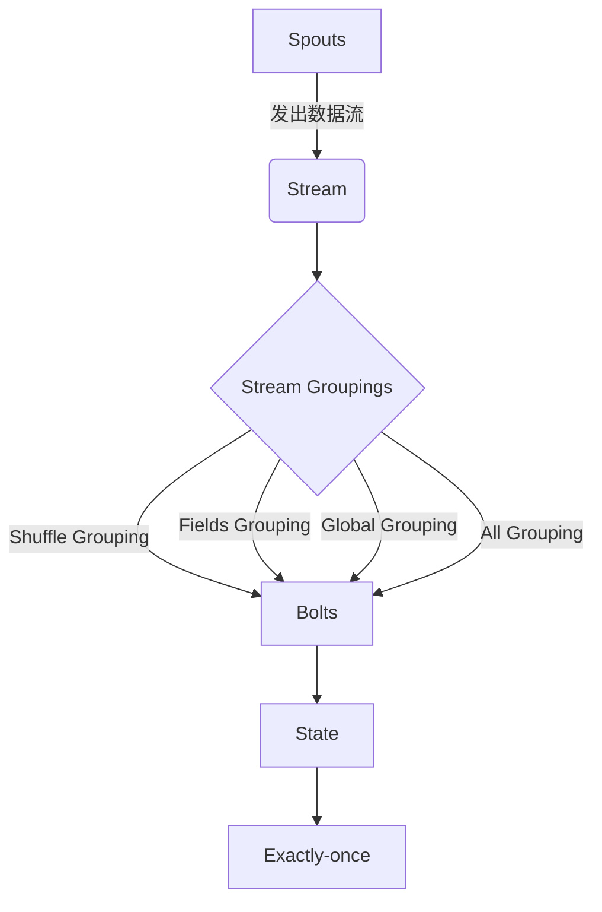

# Storm Trident原理与代码实例讲解

## 1. 背景介绍

### 1.1 问题的由来

在当今大数据时代,实时数据处理已经成为许多企业和组织的核心需求。传统的批处理系统无法满足对实时性的要求,因此出现了流式计算框架。Apache Storm是一个分布式、高度可扩展的实时计算系统,它能够可靠地处理海量的高速数据流。然而,原生的Storm存在一些缺陷,例如处理流水线(pipeline)的API过于底层和繁琐、缺乏有状态计算的支持等。为了解决这些问题,Storm Trident应运而生。

### 1.2 研究现状

Storm Trident是Apache Storm的一个高级抽象,它提供了更高级的API,使开发人员能够更加轻松地构建实时数据处理应用程序。Trident引入了一些新的概念,如流分组(Stream Groupings)、有状态持久化(State Persistence)、exactly-once处理语义等,极大地简化了开发流程。目前,越来越多的公司和组织开始采用Storm Trident进行实时数据处理,如Yahoo!、Spotify、Alibaba等。

### 1.3 研究意义

深入理解Storm Trident的原理和实现细节,对于构建高性能、可靠的实时数据处理系统至关重要。本文将全面探讨Trident的核心概念、算法原理、数学模型、代码实现等,旨在帮助读者掌握Trident的本质,并能够在实际项目中熟练地应用Trident进行实时数据处理。

### 1.4 本文结构

本文首先介绍Trident的核心概念和它们之间的关系,然后深入探讨Trident的算法原理和数学模型,接着通过代码实例详细解释Trident的实现细节。最后,本文将讨论Trident在实际应用场景中的使用,并总结Trident的发展趋势和面临的挑战。

## 2. 核心概念与联系



Trident的核心概念包括:

1. **Spouts**: 数据源,用于发出数据流。
2. **Stream**: 数据流,由Spout发出或Bolt处理后产生。
3. **Stream Groupings**: 流分组策略,决定如何将数据流分发到下游Bolt。
4. **Bolts**: 处理数据流的组件,可以执行过滤、函数操作、聚合等。
5. **State**: 有状态持久化,允许Bolt存储和访问状态数据。
6. **Exactly-once**: 确保每条消息只被处理一次的语义。

这些概念相互关联,构成了Trident的核心架构。Spouts发出数据流,经过Stream Groupings分发到Bolts进行处理。Bolts可以访问State存储状态数据,并通过Exactly-once语义保证消息处理的准确性。

## 3. 核心算法原理 & 具体操作步骤

### 3.1 算法原理概述

Trident的核心算法是一种有向无环图(DAG)的拓扑结构,由Spouts、Bolts和它们之间的数据流组成。算法的主要目标是高效地将数据流从Spouts传递到Bolts,并在Bolts中执行相应的处理操作。

算法的关键点在于如何将数据流分发到下游Bolts,以及如何保证消息处理的准确性。Trident采用了流分组(Stream Groupings)和exactly-once语义来解决这些问题。

### 3.2 算法步骤详解

Trident算法的执行步骤如下:

1. **初始化**: 创建Trident拓扑,包括定义Spouts、Bolts和它们之间的数据流。

2. **数据发出**: Spouts开始发出数据流。

3. **流分组**: 根据预定义的Stream Groupings策略,将数据流分发到下游Bolts。

4. **数据处理**: Bolts接收数据流,执行相应的处理操作,如过滤、函数操作、聚合等。

5. **状态存储**: 如果Bolt需要存储状态数据,则将状态数据持久化到State中。

6. **消息确认**: 通过exactly-once语义,确保每条消息只被处理一次。

7. **结果输出**: 处理后的数据流可以输出到下游系统,如数据库、消息队列等。

8. **故障恢复**: 如果发生故障,Trident会自动重新启动失败的任务,并从最后一个检查点(checkpoint)恢复状态,保证数据处理的准确性。

### 3.3 算法优缺点

**优点**:

- 高吞吐量和低延迟,能够实时处理海量数据流。
- 提供了高级API,简化了实时数据处理应用程序的开发。
- 支持有状态计算和exactly-once语义,保证数据处理的准确性。
- 具有良好的容错性和自动故障恢复能力。

**缺点**:

- 对于某些类型的数据处理任务,如机器学习、图计算等,Trident可能不太适合。
- 配置和调优Trident集群需要一定的专业知识和经验。
- 与Apache Spark等新兴的流式计算框架相比,Trident的社区活跃度和发展速度相对较慢。

### 3.4 算法应用领域

Trident算法适用于以下场景:

- 实时数据处理,如网络日志分析、用户行为跟踪、实时推荐系统等。
- 流式数据处理,如社交媒体数据分析、物联网数据处理等。
- 有状态计算,如实时计算滑动窗口、会话管理等。
- 需要exactly-once语义保证的数据处理任务。

## 4. 数学模型和公式 & 详细讲解 & 举例说明

### 4.1 数学模型构建

为了更好地理解Trident的核心算法原理,我们可以构建一个数学模型。

假设Trident拓扑由一个有向无环图$G=(V, E)$表示,其中$V$是顶点集合(包括Spouts和Bolts),而$E$是边集合(表示数据流)。

对于每条边$e=(u, v) \in E$,我们定义一个权重函数$w(e)$,表示该数据流的分组策略。常见的分组策略包括:

- Shuffle Grouping: $w(e) = 1$,表示数据流被随机分发到下游Bolt。
- Fields Grouping: $w(e) = hash(f_1, f_2, \ldots, f_n)$,其中$f_1, f_2, \ldots, f_n$是指定的字段,数据流根据这些字段的哈希值分发到下游Bolt。
- Global Grouping: $w(e) = 0$,表示所有数据流都被分发到同一个下游Bolt。
- All Grouping: $w(e) = replicate$,表示数据流被复制到所有下游Bolt。

此外,我们定义一个状态函数$s(v)$,表示顶点$v$的状态数据。对于Spouts,状态函数为空;对于Bolts,状态函数表示该Bolt需要存储和访问的状态数据。

### 4.2 公式推导过程

基于上述数学模型,我们可以推导出Trident算法的一些重要公式。

**数据分发公式**:

对于任意一条边$e=(u, v) \in E$,数据流从顶点$u$分发到顶点$v$的概率为:

$$P(u \rightarrow v) = \frac{w(e)}{\sum_{(u, v') \in E} w(e)}$$

**状态更新公式**:

假设Bolt $v$接收到一条数据流$x$,并执行处理操作$f(x, s(v))$,其中$s(v)$是Bolt $v$的当前状态。则Bolt $v$的新状态为:

$$s'(v) = g(f(x, s(v)), s(v))$$

其中$g$是一个状态更新函数,用于将处理结果合并到当前状态中。

**Exactly-once语义公式**:

为了保证每条消息只被处理一次,Trident采用了一种基于元组追踪(Tuple Tracking)的机制。对于每条消息元组$t$,我们定义一个处理状态函数$p(t)$,取值为以下三种状态之一:

- $p(t) = 0$: 元组$t$尚未被处理。
- $p(t) = 1$: 元组$t$正在被处理。
- $p(t) = 2$: 元组$t$已被成功处理。

Trident算法保证对于任意一条消息元组$t$,在整个处理过程中,处理状态函数$p(t)$的值只会从0转换到1,再转换到2,并且这个转换过程是原子的。也就是说,如果$p(t) = 2$,则说明元组$t$已被成功处理且只被处理了一次。

### 4.3 案例分析与讲解

为了更好地理解上述数学模型和公式,我们来分析一个实际案例。

假设我们需要构建一个实时用户行为分析系统,统计每个用户在过去1小时内的点击次数。我们可以使用Trident来实现这个需求。

1. **定义Spouts和Bolts**:

   - Spouts: 从Kafka消费实时的用户点击日志数据。
   - Bolt 1: 过滤无效的日志数据。
   - Bolt 2: 根据用户ID进行分组,统计每个用户的点击次数。
   - Bolt 3: 实现滑动窗口计算,输出每个用户在过去1小时内的点击次数。

2. **构建Trident拓扑**:

   ```mermaid
   graph LR
       A[Spouts] -->|Shuffle Grouping| B[Bolt 1]
       B -->|Fields Grouping 按用户ID| C[Bolt 2]
       C -->|All Grouping| D[Bolt 3]
       D -->|输出结果|
   ```

   在这个拓扑中,我们使用了Shuffle Grouping和Fields Grouping策略。Bolt 2需要存储每个用户的点击次数作为状态数据。

3. **数据分发和状态更新**:

   - 数据流从Spouts随机分发到Bolt 1。
   - 经过Bolt 1过滤后的数据流,根据用户ID分发到不同的Bolt 2实例。
   - Bolt 2更新每个用户的点击次数状态。
   - 所有Bolt 2实例的输出被复制到Bolt 3。
   - Bolt 3基于滑动窗口计算,输出每个用户在过去1小时内的点击次数。

4. **Exactly-once语义**:

   在这个案例中,我们需要确保每条用户点击日志只被统计一次。Trident的Exactly-once语义可以保证这一点。如果在处理过程中发生故障,Trident会自动从最后一个检查点恢复状态,并重新处理未完成的消息,避免重复计算或数据丢失。

通过这个案例,我们可以看到Trident数学模型和公式的实际应用,以及如何利用Trident构建实时数据处理应用程序。

### 4.4 常见问题解答

1. **为什么需要Exactly-once语义?**

   在分布式系统中,由于网络故障、机器宕机等原因,可能会导致消息重复处理或丢失。Exactly-once语义可以确保每条消息只被处理一次,从而保证数据处理的准确性和一致性。

2. **Trident的State是如何实现持久化的?**

   Trident支持多种State后端,如Redis、Memcached、HDFS等。开发者可以根据需求选择合适的后端存储,将Bolt的状态数据持久化到这些存储系统中。

3. **Trident和原生Storm相比,有什么优缺点?**

   Trident提供了更高级的API,简化了实时数据处理应用程序的开发。同时,Trident支持有状态计算和Exactly-once语义,提高了数据处理的准确性和可靠性。但是,Trident也引入了一些额外的开销,在某些场景下可能会影响性能。

4. **如何选择合适的Stream Grouping策略?**

   选择Stream Grouping策略时,需要考虑数据分布、计算负载均衡、状态存储等因素。一般来说,如果下游Bolt需要访问全局状态,可以使用Global Grouping或All Grouping;如果下游Bolt需要基于某些字段进行分组计算,可以使用Fields