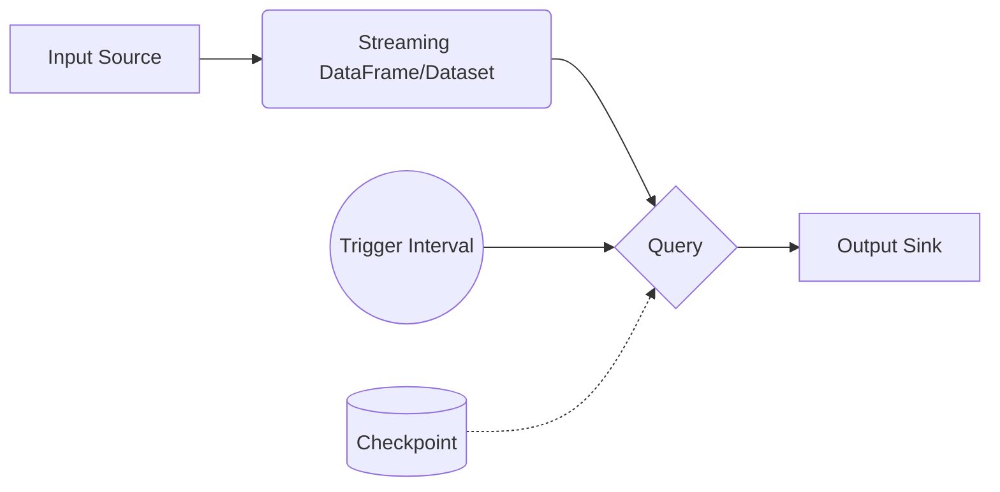

# Structured Streaming原理与代码实例讲解

## 1. 背景介绍
### 1.1  问题的由来
在大数据时代,海量数据的实时处理和分析变得越来越重要。传统的批处理模式已经无法满足实时性要求,因此流式计算应运而生。Spark Streaming是Apache Spark生态系统中的流式处理框架,但它是基于微批次(micro-batch)模型,在某些场景下实时性还不够。为了进一步提升Spark的流式处理能力,Databricks在Spark 2.0中引入了Structured Streaming。
### 1.2  研究现状
目前业界主流的流式计算框架有Apache Storm、Apache Flink和Spark Streaming等。其中Storm和Flink是基于原生流模型,而Spark Streaming基于微批次模型。Structured Streaming正是在Spark Streaming基础上,融合了Spark SQL的优势,提供了更高层次的抽象。目前越来越多的公司开始采用Structured Streaming构建端到端的实时流式应用。
### 1.3  研究意义 
Structured Streaming是Spark的新一代流式处理引擎,具有声明式API、端到端exactly-once保证、毫秒级延迟等优点。深入研究Structured Streaming的原理和实现,对于构建大规模实时流式应用,提升Spark流式处理能力具有重要意义。同时有助于我们理解流式计算的发展趋势。
### 1.4  本文结构
本文将重点介绍Structured Streaming的核心原理、使用方法和代码实例。内容安排如下:
- 第2节介绍Structured Streaming的核心概念和编程模型
- 第3节介绍Structured Streaming的工作原理和容错机制  
- 第4节介绍Structured Streaming的API使用和代码实例
- 第5节介绍Structured Streaming的一些高级主题,如Event Time处理、Watermark机制等
- 第6节总结全文,并展望Structured Streaming的未来发展

## 2. 核心概念与联系
Structured Streaming的核心概念主要有:
- 输入源(Input Source):产生流式数据的数据源,如Kafka、套接字等 
- 数据帧/数据集(DataFrame/Dataset):Spark SQL的数据抽象,代表一个静态的结构化数据
- 流式数据帧/数据集(Streaming DataFrame/Dataset):代表连续不断的数据流,数据模式固定
- 查询(Query):对流式数据帧/数据集的计算操作,如select、where、groupBy等  
- 输出接收器(Output Sink):接收流式计算结果的输出目标,如文件、数据库等
- 触发间隔(Trigger Interval):每次触发计算的时间间隔,如每5秒触发一次  
- 检查点(Checkpoint):用于容错恢复的状态存储位置

下图描述了Structured Streaming的编程模型和各个组件之间的关系:



从上图可以看出,Structured Streaming的数据处理遵循 Source -> Transformation -> Sink 的模式。输入源产生的流式数据抽象为流式DataFrame/Dataset,然后定义查询对数据进行转换,并指定输出接收器。Trigger定义了查询计算的频率,Checkpoint用于保存状态数据。

## 3. 核心算法原理 & 具体操作步骤
### 3.1  算法原理概述
Structured Streaming在原理上融合了Spark SQL的批处理引擎。它将流式数据看做一张不断添加新行的表(Unbounded Table)。查询操作会在新行到来时不断执行,每次执行只处理新到的行,并更新结果。

具体来说,Structured Streaming的工作流程如下:
1. 从输入源读取流式数据,并将其转换为流式DataFrame/Dataset
2. 用户定义查询操作,Structured Streaming会生成逻辑计划和优化的物理计划
3. 在Trigger到来时,从输入源获取一个Batch,并执行物理计划
4. 物理计划执行结束后,将增量结果写入输出接收器,并更新状态(State)
5. 整个过程不断循环,直到手动停止或发生错误

### 3.2  算法步骤详解
下面详细讲解Structured Streaming的关键算法步骤:

1.逻辑计划生成:
- 将用户定义的查询操作解析为Unresolved Logical Plan
- 使用分析器(Analyzer)将Unresolved Logical Plan解析为Resolved Logical Plan
- 使用Catalyst优化器对Resolved Logical Plan进行优化,生成Optimized Logical Plan

2.物理计划生成: 
- 使用QueryPlanner将逻辑计划转换为物理计划
- 物理计划是一个DAG,由很多可执行的Spark原语(RDD操作)组成
- 对物理计划进行进一步的Rule Based优化和Cost Based优化

3.Batch数据获取:
- 从输入源读取一个Batch数据,追加到流式DataFrame/Dataset中
- 每个Batch都有一个唯一的Id(Batch Id)标识
- Batch的范围由Trigger间隔决定,如每5秒一个Batch

4.物理计划执行:
- 触发间隔到来时,调度执行优化后的物理计划
- 物理计划在Spark集群上执行,生成任务(Task)并行处理数据
- 只处理本次Batch新到的数据,充分利用增量处理优化性能

5.结果输出与状态更新:
- 将物理计划执行后的结果(Result)写入输出接收器
- 将物理计划执行过程中的状态(State)数据进行Checkpoint持久化存储
- 状态数据用于支持带状态的流式计算,如Window、GroupBy Aggregation等

6.容错恢复:
- 如果节点失败,Spark会从上一个成功的Checkpoint恢复状态数据
- 从Checkpoint恢复后,重新处理丢失的Batch数据,保证exactly-once语义
- 将Checkpoint和WAL(Write Ahead Log)相结合,进一步提升容错性能

### 3.3  算法优缺点
Structured Streaming在原理上具有以下优点:
- 声明式API:用户只需定义查询逻辑,不用关心底层的执行细节,易用性更好
- 端到端exactly-once:利用Checkpoint和WAL,从输入到输出提供端到端的exactly-once保证
- 低延迟:每次只处理新到的Batch数据,延迟可达毫秒级
- 基于Spark SQL引擎:复用Spark SQL的执行优化,如Catalyst优化器、Code Generation等

同时,Structured Streaming也存在一些局限性:
- 不支持某些流式场景:如Side Output、自定义状态存储等
- 状态数据受内存限制:超大状态可能会导致OOM,需借助外部存储
- 吞吐量不及原生流框架:如Apache Flink在吞吐量上略胜一筹

### 3.4  算法应用领域  
Structured Streaming是一个通用的流式处理框架,可应用于多个领域:
- 事件驱动应用:如实时报表、监控告警等
- 数据管道:构建端到端的ETL数据管道,实现准实时数据同步 
- 机器学习:接入实时数据流,进行模型训练、预测和更新

## 4. 数学模型和公式 & 详细讲解 & 举例说明
### 4.1  数学模型构建
Structured Streaming的数学模型可以表示如下:

$StreamingDataFrame = \sum_{i=0}^{n-1} D_i$

其中:
- $StreamingDataFrame$代表流式DataFrame/Dataset
- $D_i$代表第i个Batch的数据集合,$D_0$代表初始数据
- $n$代表当前的Batch数,会随着时间不断增加

查询$Q$定义了$StreamingDataFrame$上的转换操作,如:

$Q(StreamingDataFrame) = StreamingDataFrame.select(...).where(...).groupBy(...).agg(...)$

$Result_i$代表第i次触发查询后的结果数据集:

$Result_i = Q(D_i)$

所以流式结果$StreamingResult$可以表示为所有$Result_i$的集合:

$StreamingResult = \{Result_0, Result_1, ..., Result_{n-1}\}$

### 4.2  公式推导过程
对于带状态的流式查询,如GroupBy Aggregation,需要在公式中引入状态$S$。

定义$S_i$为第i次触发后的状态,$S_0$为初始状态,则有:

$S_i = S_{i-1} \otimes Q(D_i)$

其中$\otimes$代表基于上一次状态$S_{i-1}$和本次Batch结果$Q(D_i)$更新得到新状态$S_i$的操作。

将状态引入查询$Q$,可得:

$Q(StreamingDataFrame, S_{i-1}) = (Result_i, S_i)$

即查询$Q$在第i次触发时,基于流式DataFrame和上一次状态$S_{i-1}$,得到本次结果$Result_i$和新状态$S_i$。

### 4.3  案例分析与讲解
下面以WordCount为例,讲解带状态查询的执行过程。

假设输入数据流包含三个Batch,每个Batch包含一些单词:

$D_0 = \{hello, world\}$
$D_1 = \{hello, spark\}$  
$D_2 = \{structured, streaming\}$

定义查询$Q$为按单词分组并计数:

$Q(StreamingDataFrame) = StreamingDataFrame.groupBy("word").count()$

初始状态$S_0$为空,执行过程如下:

1. 触发$Q(D_0, S_0)$得到:
$Result_0 = \{(hello, 1), (world, 1)\}$
$S_1 = \{(hello, 1), (world, 1)\}$

2. 触发$Q(D_1, S_1)$得到:
$Result_1 = \{(hello, 2), (spark, 1)\}$ 
$S_2 = \{(hello, 2), (world, 1), (spark, 1)\}$

3. 触发$Q(D_2, S_2)$得到:
$Result_2 = \{(structured, 1), (streaming, 1)\}$
$S_3 = \{(hello, 2), (world, 1), (spark, 1), (structured, 1), (streaming, 1)\}$

最终$StreamingResult$为:

$StreamingResult = \{Result_0, Result_1, Result_2\}$
$= \{(hello, 1), (world, 1), (hello, 2), (spark, 1), (structured, 1), (streaming, 1)\}$

### 4.4  常见问题解答
1.Q:Structured Streaming的状态存储在哪里?
  A:状态数据默认存储在内存中,同时也支持Checkpoint到外部可靠存储,如HDFS。

2.Q:Structured Streaming会保留所有历史状态吗?
  A:不会,为了防止状态无限增长,Structured Streaming提供了状态清理机制,可以定期清理过期的状态数据。

3.Q:Structured Streaming支持Exactly-once语义吗?
  A:支持,Structured Streaming利用Checkpoint和预写日志(Write Ahead Log)实现端到端的Exactly-once语义。

## 5. 项目实践：代码实例和详细解释说明
### 5.1  开发环境搭建
首先需要搭建Structured Streaming的开发环境,主要包括:
- JDK 8+
- Scala 2.12+
- Spark 2.4+ 
- Kafka(用于测试)

可以选择Local模式或Standalone集群模式运行Spark应用。

### 5.2  源代码详细实现
下面给出一个完整的Structured Streaming WordCount示例:

```scala
import org.apache.spark.sql.SparkSession
import org.apache.spark.sql.functions._
import org.apache.spark.sql.streaming.Trigger

object StructuredWordCount {
  def main(args: Array[String]): Unit = {
    val spark = SparkSession
      .builder
      .appName("StructuredWordCount")
      .getOrCreate()
    
    import spark.implicits._
    
    // 从Kafka读取数据
    val lines = spark
      .readStream
      .format("kafka")
      .option("kafka.bootstrap.servers", "localhost:9092")
      .option("subscribe", "wordcount")
      .load()
      .selectExpr("CAST(value AS STRING)")
      .as[String]
      
    // 定义流式WordCount查询  
    val wordCounts = lines.flatMap(_.split(" "))
      .groupBy("value")
      .count()
      
    // 将结果输出到控制台  
    val query = wordCounts.writeStream
      .outputMode("complete")
      .format("console")
      .trigger(Trigger.ProcessingTime("5 seconds"))
      .start()
      
    query.awaitTermination()
  }
}
```

### 5.3  代码解读与分析
1. 首先创建一个SparkSession,作为Spark应用的入口。

2. 使用`spark.readStream`从Kafka读取流式数据,并转换为DataFrame。其中:
- `format("kafka")`