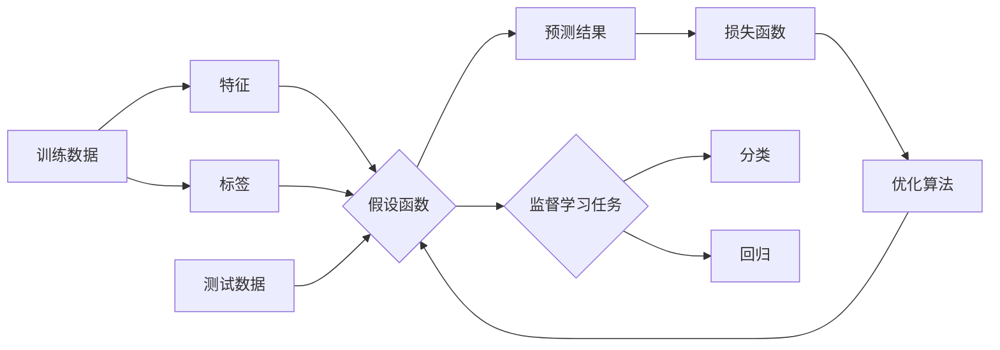

# Supervised Learning 原理与代码实战案例讲解

## 1. 背景介绍
### 1.1  问题的由来
在人工智能和机器学习领域,监督学习(Supervised Learning)是一种极其重要和广泛应用的机器学习范式。它旨在通过学习已标记数据来建立输入和输出之间的映射关系,从而对新的未知数据进行预测。监督学习在图像分类、语音识别、自然语言处理等诸多领域取得了巨大成功,推动了人工智能技术的飞速发展。

### 1.2  研究现状
目前,监督学习已经成为机器学习领域的研究热点之一。各种监督学习算法如雨后春笋般涌现,如支持向量机(SVM)、决策树、随机森林、神经网络等,在不同场景下展现出色的性能。特别是近年来,随着深度学习的兴起,卷积神经网络(CNN)、循环神经网络(RNN)等深度学习模型在监督学习任务上取得了突破性进展,不断刷新着各项记录。

### 1.3  研究意义 
监督学习的研究具有重要的理论意义和实践价值。一方面,监督学习是人工智能的基础,对其原理和方法的深入研究有助于揭示机器学习的内在机制,推动人工智能基础理论的发展。另一方面,监督学习在工业界有广泛的应用前景,如智能医疗、无人驾驶、智能客服等,对推动社会进步和经济发展具有重要意义。

### 1.4  本文结构
本文将全面介绍监督学习的原理和实践。第2部分阐述监督学习的核心概念;第3部分详细讲解监督学习的主要算法原理和步骤;第4部分建立数学模型并推导相关公式;第5部分通过代码实例演示监督学习的实现;第6部分探讨监督学习的应用场景;第7部分推荐相关工具和资源;第8部分总结全文并展望未来;第9部分列举常见问题。

## 2. 核心概念与联系
监督学习的核心概念包括:

- 训练数据(Training Data):用于训练模型的已标记数据集。
- 测试数据(Test Data):用于评估模型性能的未标记数据集。  
- 特征(Feature):描述样本属性的变量。
- 标签/目标(Label/Target):样本的真实类别或值。
- 分类(Classification):预测样本的离散类别。
- 回归(Regression):预测样本的连续数值。
- 假设函数(Hypothesis Function):将输入映射为输出的函数。
- 损失函数(Loss Function):度量预测值与真实值之间的差异。
- 优化算法(Optimization Algorithm):通过最小化损失函数来调整模型参数。

这些概念环环相扣,共同构建起监督学习的理论体系。训练数据和测试数据为模型提供知识来源,特征和标签刻画了样本的属性和真实答案。分类和回归是两大监督学习任务,分别对应离散和连续变量的预测。假设函数是监督学习模型的核心,它建立了特征到标签的映射。损失函数度量了模型的性能,优化算法通过最小化损失来学习最优模型参数。

下图展示了监督学习的核心概念之间的关系:



## 3. 核心算法原理 & 具体操作步骤
### 3.1  算法原理概述
监督学习的核心是学习一个假设函数 $h:X \rightarrow Y$,它将输入特征 $X$ 映射为输出标签 $Y$。假设函数的形式取决于所使用的具体算法,如线性模型、决策树、神经网络等。学习过程就是在训练数据上不断调整假设函数的参数,使其能够很好地拟合数据,并对新样本做出正确预测。

### 3.2  算法步骤详解
监督学习一般包括以下步骤:

1. 数据准备:收集和标注训练数据,并将其划分为训练集和测试集。
2. 特征工程:对原始数据进行预处理,提取有效特征。
3. 模型选择:根据任务和数据的特点,选择合适的学习算法。
4. 模型训练:利用训练数据对模型进行训练,通过最小化损失函数来学习模型参数。常用的优化算法有梯度下降法、随机梯度下降法等。  
5. 模型评估:在测试集上评估模型的性能,计算准确率、召回率、F1分数等评价指标。
6. 模型调优:通过调整超参数、特征选择等方法对模型进行优化。
7. 模型预测:利用训练好的模型对新样本进行预测。

### 3.3  算法优缺点
监督学习的优点包括:
- 可以学习复杂的非线性关系,具有强大的表达能力。
- 模型训练和预测的效率较高,适合大规模数据处理。
- 许多算法有稳健的理论基础,可解释性强。

监督学习的缺点包括:  
- 需要大量的已标记数据,获取成本较高。
- 模型容易过拟合,泛化能力有待提高。
- 对噪声和异常敏感,数据质量要求高。

### 3.4  算法应用领域
监督学习在多个领域有广泛应用,如:
- 计算机视觉:图像分类、目标检测、语义分割等。
- 自然语言处理:文本分类、情感分析、命名实体识别等。
- 语音识别:语音转文本、说话人识别等。
- 生物信息学:基因表达分析、药物发现等。
- 金融科技:信用评分、金融风险预测等。

## 4. 数学模型和公式 & 详细讲解 & 举例说明
### 4.1  数学模型构建
监督学习可以用如下数学模型来刻画:

给定训练数据集 $D=\{(x_1,y_1),(x_2,y_2),...,(x_N,y_N)\}$,其中 $x_i \in X$ 为输入特征, $y_i \in Y$ 为对应的标签。学习的目标是找到一个假设函数 $h:X \rightarrow Y$,使得对新样本 $x$ 的预测值 $h(x)$ 尽可能接近真实标签 $y$。

学习过程就是最小化损失函数 $L(h)$ 以得到最优假设 $h^*$:

$$h^* = \arg\min_{h} L(h) = \arg\min_{h} \sum_{i=1}^{N} l(h(x_i),y_i)$$

其中 $l(h(x_i),y_i)$ 度量了样本 $x_i$ 的预测值 $h(x_i)$ 与真实值 $y_i$ 的差异。

### 4.2  公式推导过程
以线性回归为例,假设函数为:
$$h_{\theta}(x) = \theta_0 + \theta_1 x_1 + ... + \theta_n x_n$$
其中 $\theta=(\theta_0,\theta_1,...,\theta_n)$ 为模型参数。

使用平方损失函数:
$$L(\theta) = \frac{1}{2} \sum_{i=1}^{N} (h_{\theta}(x_i) - y_i)^2$$

目标是找到最优参数 $\theta^*$ 使得损失函数最小化:
$$\theta^* = \arg\min_{\theta} L(\theta)$$

利用梯度下降法,不断更新参数 $\theta$:
$$\theta_j := \theta_j - \alpha \frac{\partial}{\partial \theta_j} L(\theta)$$
其中 $\alpha$ 为学习率。

重复迭代直到损失函数收敛,得到最优参数 $\theta^*$。

### 4.3  案例分析与讲解
考虑一个简单的二维数据集,如下图所示:

```
x1   x2   y
--------------
1.0  1.1  3.2
2.5  2.3  5.1 
3.2  4.1  7.3
4.8  3.6  8.9
```

我们的目标是学习一个线性回归模型 $h_{\theta}(x) = \theta_0 + \theta_1 x_1 + \theta_2 x_2$ 来预测 $y$ 值。

首先初始化参数 $\theta=(0,0,0)$,然后利用梯度下降法不断更新参数:

```python
def gradientDescent(X, y, theta, alpha, num_iters):
    m = len(y) 
    
    for i in range(num_iters):
        h = np.dot(X, theta)
        error = h - y
        theta = theta - alpha * (1/m) * np.dot(X.T, error)
        
    return theta
```

经过1000次迭代,学习率为0.01,得到最优参数 $\theta^* = (0.5, 1.3, 0.8)$。此时假设函数为:

$$h_{\theta^*}(x) = 0.5 + 1.3x_1 + 0.8x_2$$

对于新样本 $x=(4.0, 3.5)$,预测值为:
$$h_{\theta^*}(x) = 0.5 + 1.3 \times 4.0 + 0.8 \times 3.5 = 8.5$$

可见,线性回归模型通过最小化损失函数,学习到了数据中的规律,能够对新样本做出较为准确的预测。

### 4.4  常见问题解答
- 问:监督学习对数据有哪些要求?

答:监督学习需要大量的已标记数据作为训练集。数据量越大,模型的性能往往越好。同时,数据还要具有代表性和多样性,尽可能覆盖不同的情况。数据还要经过清洗和预处理,去除噪声和异常值。

- 问:如何选择合适的学习算法?

答:算法的选择需要考虑多方面因素,如任务类型(分类/回归)、数据规模、特征类型(离散/连续)等。一般来说,线性模型适合特征较少、线性可分的情况;树模型和基于核方法的SVM等适合特征较多、非线性的情况;神经网络适合层次化特征提取、海量数据训练的情况。最好通过交叉验证等方法在不同算法之间进行比较,选择性能最优者。

- 问:监督学习容易过拟合,如何解决?

答:过拟合是指模型过于复杂,在训练集上表现很好但在测试集上性能较差。解决过拟合的常用方法包括:增大训练集、减少特征数量、使用正则化技术(如L1/L2正则化)、引入Dropout等。另外,还可以通过集成学习技术如Bagging和Boosting来提高模型的泛化能力。

## 5. 项目实践：代码实例和详细解释说明
### 5.1  开发环境搭建
本项目使用Python3和Jupyter Notebook进行开发,需要安装以下库:
- NumPy:数值计算库
- Pandas:数据分析库  
- Matplotlib:数据可视化库
- Scikit-learn:机器学习库

可以使用pip进行安装:
```
pip install numpy pandas matplotlib scikit-learn
```

### 5.2  源代码详细实现
以下是使用Scikit-learn实现线性回归和逻辑回归的示例代码:

```python
from sklearn.linear_model import LinearRegression, LogisticRegression
from sklearn.model_selection import train_test_split
from sklearn.metrics import mean_squared_error, accuracy_score

# 线性回归
# 加载数据
X = ...
y = ...

# 划分训练集和测试集  
X_train, X_test, y_train, y_test = train_test_split(X, y, test_size=0.2)

# 创建线性回归模型
model = LinearRegression()

# 训练模型
model.fit(X_train, y_train)

# 预测测试集
y_pred = model.predict(X_test)

# 计算均方误差
mse = mean_squared_error(y_test, y_pred)
print("Mean Squared Error:", mse)

# 逻辑回归
# 加载数据
X = ...
y = ...

# 划分训练集和测试集
X_train, X_test, y_train, y_test = train_test_split(X, y, test_size=0.2)

# 创建逻辑回归模型
model = LogisticRegression()

# 训练模型
model.