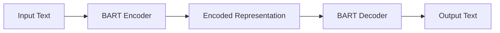

# Transformer大模型实战 BART模型的架构

## 1. 背景介绍
### 1.1 问题的由来
近年来，随着深度学习技术的快速发展，自然语言处理(NLP)领域取得了突破性的进展。Transformer作为一种革命性的神经网络架构，在机器翻译、文本摘要、问答系统等多个NLP任务上都取得了显著的效果提升。而BART(Bidirectional and Auto-Regressive Transformers)作为Transformer家族的新成员，通过引入双向编码器和自回归解码器，进一步增强了模型的表征能力和生成能力，在许多NLP任务上都取得了最先进的性能表现。

### 1.2 研究现状
目前业界主流的预训练语言模型如BERT、GPT等，都是基于Transformer架构构建的。其中BERT采用双向编码器结构，主要用于自然语言理解类任务；而GPT系列则采用单向解码器结构，主要应用于文本生成类任务。BART的创新之处在于，它将BERT的双向编码器和GPT的自回归解码器巧妙地结合在一起，构建出一个功能更加强大的统一架构，可以同时完成自然语言理解和生成两大类任务。

### 1.3 研究意义
BART模型的提出，为NLP领域带来了新的突破。一方面，它继承了BERT的优秀思想，利用大规模无监督预训练来学习通用的语言表征；另一方面，它又吸收了GPT的精髓，引入自回归解码器来增强文本生成能力。BART的统一架构使得它在许多下游任务上都取得了最先进的性能，并且大大简化了模型训练和应用的流程。深入研究BART的内部机制和实现细节，对于推动NLP技术的进一步发展具有重要意义。

### 1.4 本文结构
本文将重点介绍BART模型的整体架构和核心原理。首先，我们将介绍BART模型的核心概念以及各个组件之间的联系。接下来，我们将详细阐述BART的编码器-解码器结构以及预训练和微调过程中的关键算法和步骤。然后，我们将给出BART的数学模型和公式推导，并结合具体案例进行详细讲解。此外，我们还将提供BART的代码实现示例，以帮助读者更好地理解和掌握该模型。最后，我们将总结BART的研究成果和应用前景，并展望其未来的发展方向和挑战。

## 2. 核心概念与联系

BART模型的核心思想是将Transformer的双向编码器(Bidirectional Encoder)和自回归解码器(Auto-Regressive Decoder)组合在一起，形成一个统一的Seq2Seq架构。下图展示了BART模型的总体架构：

其中，编码器负责对输入文本进行特征提取和语义编码，将输入转换为一个低维的语义向量表示；解码器则根据编码器的输出，通过自回归方式逐步生成目标文本序列。

BART的编码器采用了与BERT类似的双向Transformer结构，利用掩码语言模型(Masked Language Model, MLM)和句子排列(Sentence Permutation)等预训练任务来学习文本的上下文信息和语义知识。不同于BERT，BART在预训练阶段引入了更多的噪声函数，如Token Masking、Token Deletion、Text Infilling等，以增强模型的鲁棒性和泛化能力。

BART的解码器采用了与GPT类似的自回归Transformer结构，根据编码器的输出表示和已生成的文本片段，预测下一个单词的概率分布。在生成过程中，BART还引入了Beam Search和Top-k Sampling等解码策略，以平衡生成质量和多样性。

通过将编码器和解码器无缝衔接，BART实现了端到端的Seq2Seq建模，可以灵活地应用于各种NLP任务，如机器翻译、文本摘要、对话生成等。同时，得益于预训练和微调范式，BART在多个下游任务上都取得了最先进的性能表现。

## 3. 核心算法原理 & 具体操作步骤
### 3.1 算法原理概述
BART模型的训练过程主要分为两个阶段：预训练阶段和微调阶段。

在预训练阶段，BART采用了Denoising Autoencoder的思想，通过引入各种噪声函数来破坏输入文本，然后训练模型将其恢复为原始文本。这一过程可以帮助BART学习到文本的语法、语义、结构等关键信息。常见的噪声函数包括：

- Token Masking：随机将部分单词替换为[MASK]特殊符号；
- Token Deletion：随机删除部分单词；
- Text Infilling：随机替换连续的文本片段为单个[MASK]符号；
- Sentence Permutation：随机打乱多个句子的顺序。

在微调阶段，BART在下游任务的有标注数据上进行监督学习，通过端到端的Seq2Seq建模来完成特定任务。微调过程通常采用Teacher Forcing的训练方式，即在每个时间步使用真实的目标Token作为解码器的输入，而不是使用模型自己生成的Token。

### 3.2 算法步骤详解

BART的训练流程可以总结为以下几个关键步骤：

**Step 1: 输入文本预处理**
将原始文本进行分词、编码等预处理操作，转换为模型可以接受的数值化表示。

**Step 2: 构建输入噪声**
根据预先定义的噪声函数(如Token Masking、Text Infilling等)，对输入文本施加随机噪声，生成破坏后的文本序列。

**Step 3: Encoder过程**
将施加噪声后的输入文本送入BART的Encoder，通过多层Transformer的Self-Attention和Feed-Forward计算，得到输入序列的上下文编码表示。

**Step 4: Decoder过程**
将Encoder的输出表示作为Decoder的输入，并结合真实的目标序列(Teacher Forcing)或之前生成的Token，通过多层Transformer的Self-Attention、Encoder-Decoder Attention和Feed-Forward计算，逐步生成目标序列。

**Step 5: 计算损失函数**
将Decoder生成的序列与真实的目标序列进行比较，计算交叉熵损失函数。在预训练阶段，损失函数衡量了模型重构原始文本的能力；在微调阶段，损失函数衡量了模型完成下游任务的性能。

**Step 6: 反向传播与参数更新**
根据损失函数计算梯度，并通过反向传播算法更新模型的参数，使模型朝着最小化损失函数的方向优化。常见的优化算法包括Adam、AdamW等。

**Step 7: 迭代训练**
重复Step 1到Step 6的过程，直到模型收敛或达到预设的训练轮数。

### 3.3 算法优缺点

BART算法的主要优点包括：

1. 统一的Seq2Seq架构，可以灵活应用于各种NLP任务；
2. 引入噪声函数增强了模型的鲁棒性和泛化能力；
3. 继承了BERT和GPT的优秀特性，在多个任务上取得了最先进的性能。

但BART也存在一些局限性，例如：

1. 模型参数量大，训练和推理成本较高；
2. 对于一些特定领域的任务，可能需要引入额外的先验知识；
3. 生成的文本可能存在不连贯、重复等问题，需要进一步优化解码策略。

### 3.4 算法应用领域
BART在许多NLP任务上都取得了出色的表现，主要应用领域包括：

- 机器翻译：将一种语言的文本翻译成另一种语言，如英译中、中译英等；
- 文本摘要：将长文本压缩成简短的摘要，同时保留关键信息；
- 对话生成：根据上下文生成连贯、自然的对话回复；
- 问答系统：根据给定的问题和背景知识生成准确的答案；
- 文本纠错：自动检测并纠正文本中的语法、拼写等错误；
- 情感分析：判断文本所表达的情感倾向，如正面、负面、中性等。

## 4. 数学模型和公式 & 详细讲解 & 举例说明
### 4.1 数学模型构建
BART的数学模型建立在Transformer的编码器-解码器框架之上。我们定义编码器和解码器的输入序列分别为$\mathbf{x}=(x_1,\cdots,x_n)$和$\mathbf{y}=(y_1,\cdots,y_m)$，其中$x_i$和$y_j$表示输入和输出的单个Token。

编码器的计算过程可以表示为：

$$
\begin{aligned}
\mathbf{h}_0 &= \mathrm{Embedding}(\mathbf{x}) \\
\mathbf{h}_l &= \mathrm{TransformerBlock}(\mathbf{h}_{l-1}), l=1,\cdots,L
\end{aligned}
$$

其中，$\mathrm{Embedding}$表示将离散的Token映射为连续的向量表示，$\mathrm{TransformerBlock}$表示Transformer的编码器块，主要包括Multi-Head Self-Attention和Feed-Forward Network两个子层。$L$为编码器的层数。

解码器的计算过程可以表示为：

$$
\begin{aligned}
\mathbf{s}_0 &= \mathrm{Embedding}(\mathbf{y}) \\
\mathbf{s}_l &= \mathrm{TransformerBlock}(\mathbf{s}_{l-1}, \mathbf{h}_L), l=1,\cdots,L
\end{aligned}
$$

其中，$\mathbf{s}_l$表示解码器第$l$层的隐状态，$\mathrm{TransformerBlock}$表示Transformer的解码器块，主要包括Masked Multi-Head Self-Attention、Multi-Head Cross-Attention和Feed-Forward Network三个子层。解码器的输入除了自身的Embedding外，还包括编码器的最高层输出$\mathbf{h}_L$。

在预训练阶段，BART通过最小化以下损失函数来学习文本重构：

$$
\mathcal{L}_{\mathrm{reconstruct}} = -\sum_{t=1}^m \log P(y_t|\mathbf{y}_{<t},\mathbf{x})
$$

其中，$P(y_t|\mathbf{y}_{<t},\mathbf{x})$表示在给定输入$\mathbf{x}$和已生成序列$\mathbf{y}_{<t}$的条件下，生成下一个Token $y_t$的概率。

在微调阶段，BART根据下游任务的类型，选择合适的损失函数进行优化，如交叉熵损失、平方误差损失等。

### 4.2 公式推导过程
以下我们以BART在文本摘要任务上的应用为例，推导生成摘要的概率公式。

假设输入文档为$\mathbf{x}$，目标摘要为$\mathbf{y}$，BART的目标是最大化以下条件概率：

$$
P(\mathbf{y}|\mathbf{x}) = \prod_{t=1}^m P(y_t|\mathbf{y}_{<t},\mathbf{x})
$$

根据Transformer解码器的计算过程，我们有：

$$
\begin{aligned}
P(y_t|\mathbf{y}_{<t},\mathbf{x}) &= \mathrm{softmax}(\mathbf{W}_o\mathbf{s}_L^t + \mathbf{b}_o) \\
\mathbf{s}_L^t &= \mathrm{TransformerBlock}(\mathbf{s}_{L-1}^t, \mathbf{h}_L) \\
&\cdots \\
\mathbf{s}_1^t &= \mathrm{TransformerBlock}(\mathbf{s}_0^t, \mathbf{h}_L) \\
\mathbf{s}_0^t &= \mathrm{Embedding}(y_{t-1})
\end{aligned}
$$

其中，$\mathbf{W}_o$和$\mathbf{b}_o$为输出层的权重矩阵和偏置向量，$\mathbf{s}_l^t$表示解码器第$l$层在时间步$t$的隐状态。

将上述公式代入条件概率公式，我们可以得到：

$$
\begin{aligned}
P(\mathbf{y}|\mathbf{x}) &= \prod_{t=1}^m P(y_t|\mathbf{y}_{<t},\mathbf{x}) \\
&= \prod_{t=1}^m