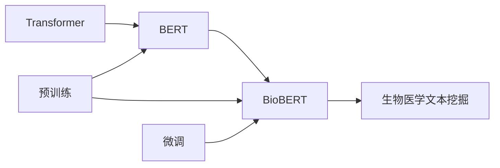

# Transformer大模型实战 BioBERT模型

## 1. 背景介绍 

### 1.1 问题的由来
近年来,随着深度学习技术的飞速发展,自然语言处理(NLP)领域也迎来了一次重大的突破。特别是Transformer模型的出现,更是掀起了NLP领域的一场革命。Transformer作为一种全新的神经网络结构,摒弃了传统的RNN和CNN结构,完全依靠注意力机制(Attention Mechanism)来实现序列到序列的建模。它的出现,不仅大大提高了机器翻译、文本分类、命名实体识别等NLP任务的性能,也为后续的BERT、GPT等大模型的诞生奠定了基础。

然而,尽管Transformer在通用NLP任务上取得了瞩目的成绩,但在一些特定领域如生物医学文本处理上,其性能还有待进一步提升。这主要是因为通用的Transformer模型缺乏对领域知识的建模和利用。为了解决这一问题,研究者们提出了将预训练语言模型与领域知识相结合的思路,BioBERT就是这一思路下的代表性成果。

### 1.2 研究现状
BioBERT是在BERT的基础上,通过在大规模生物医学文本语料上进行预训练得到的。与通用的BERT相比,BioBERT在生物医学命名实体识别、关系抽取、问答等任务上取得了显著的性能提升。目前,BioBERT已经成为生物医学NLP领域的标准baseline模型,受到学术界和工业界的广泛关注。

但BioBERT仍存在一些局限性。首先,BioBERT主要依赖预训练阶段的无监督学习来获取领域知识,而忽略了大量结构化的知识库资源。其次,BioBERT缺乏对生物医学本体、医学概念间层次关系的显式建模。此外,当前的BioBERT模型在处理长文本时也面临一定挑战。因此,BioBERT在建模领域知识、融合结构化知识库、处理长文本等方面还有进一步改进的空间。

### 1.3 研究意义
生物医学领域蕴含着大量重要的科学发现和医疗应用价值。然而,这些知识大多隐藏在海量的文献和临床数据中,人工提取和利用的效率非常有限。因此,发展智能化的生物医学文本挖掘技术,对于加速生物医学研究、辅助临床决策、促进精准医疗都具有重要意义。

BioBERT的研究,是将前沿的NLP技术应用到生物医学领域的一次有益尝试。一方面,BioBERT的突破性进展,证明了语言模型预训练范式在生物医学NLP中的有效性,为后续研究指明了方向。另一方面,BioBERT在关键生物医学NLP任务上的性能飞跃,将极大地推动智慧医疗、辅助诊疗、药物研发等应用的发展。可以预见,BioBERT必将在未来智能医疗体系中扮演重要角色。

### 1.4 本文结构
本文将全面介绍BioBERT模型的原理、实现和应用。第2部分阐述BioBERT涉及的核心概念。第3部分详细讲解BioBERT的核心算法。第4部分给出BioBERT相关的数学模型和公式推导。第5部分通过代码实例演示BioBERT的实现细节。第6部分展望BioBERT的实际应用场景。第7部分推荐BioBERT相关的学习资源。第8部分总结全文并展望未来。第9部分列出常见问题解答。

## 2. 核心概念与联系

- **Transformer**: 一种基于自注意力机制(Self-Attention)的神经网络结构,摒弃了传统的RNN和CNN结构,在并行计算和长程依赖建模上具有优势。Transformer是BERT的基础架构。

- **BERT**: 基于Transformer的双向语言表示模型。通过在大规模无标注文本语料上进行Masked Language Model和Next Sentence Prediction的预训练,BERT可以学习到上下文相关的词语表示。预训练后的BERT可以迁移到下游NLP任务,并实现显著的性能提升。

- **BioBERT**: 在BERT的基础上,利用生物医学领域文本进行预训练得到的领域特异性语言表示模型。相比通用BERT,BioBERT更能捕捉和理解生物医学概念、实体和关系,在生物医学NLP任务上取得了SOTA表现。

- **预训练**:指在大规模无标注语料上,通过自监督学习任务来学习通用的语言表示的过程。预训练是BERT和BioBERT的关键,使模型能够学习到语义丰富的上下文表示。预训练通常采用Masked Language Model和Next Sentence Prediction等任务。

- **微调**: 指在预训练的基础上,利用任务特定的标注数据,通过有监督学习来优化模型在目标任务上的性能。对于BioBERT,我们通常使用生物医学NLP任务的标注数据进行微调,如命名实体识别、关系抽取等。微调使BioBERT能够适应具体任务。

- **生物医学文本挖掘**: 旨在从非结构化的生物医学文献、电子病历等文本数据中,自动抽取结构化信息(如实体、关系、事件)并进行分析和推理的技术。BioBERT通过强大的语义理解和知识捕捉能力,极大地推动了生物医学文本挖掘的发展。

下图展示了上述核心概念间的关系:

## 3. 核心算法原理 & 具体操作步骤

### 3.1 算法原理概述
BioBERT的核心算法可以分为两个阶段:预训练和微调。

在预训练阶段,BioBERT采用了与BERT相同的Masked Language Model(MLM)和Next Sentence Prediction(NSP)任务。MLM任务通过随机Mask掉部分词语,并让模型预测被Mask词语来学习上下文表示。NSP任务则通过预测两个句子是否前后相邻来学习句子级别的表示。与BERT不同的是,BioBERT在生物医学领域语料(如PubMed摘要、PMC全文)上进行预训练,以学习领域特异性知识。

在微调阶段,BioBERT在下游生物医学NLP任务的标注数据上进行有监督微调。对于不同任务,BioBERT采用不同的输入表示和输出层设计。以命名实体识别(NER)为例,BioBERT将每个词语的表示向量输入到一个线性分类层,预测其实体标签。通过端到端的监督学习,BioBERT可以适应具体NLP任务。

### 3.2 算法步骤详解

BioBERT的训练分为两步:预训练和微调。

**预训练步骤**:
1. 准备生物医学领域语料,如PubMed摘要、PMC全文等。
2. 对语料进行预处理,包括分词、词性标注等。
3. 构建输入序列。对于MLM任务,随机Mask掉15%的词语;对于NSP任务,随机选择50%的句子对为正例,50%为负例。
4. 将输入序列转化为BioBERT的输入表示,包括词嵌入、位置嵌入和段嵌入。
5. 将输入表示送入BioBERT模型,通过多层Transformer Encoder学习上下文表示。
6. 对于MLM任务,使用最后一层的隐层状态预测被Mask词语;对于NSP任务,使用[CLS]标记的最终隐层状态预测两个句子是否相邻。
7. 计算MLM和NSP任务的损失,并通过反向传播更新模型参数。
8. 重复步骤3-7,直到模型收敛或达到预设的训练轮数。

**微调步骤**:
1. 将预训练好的BioBERT模型应用到目标生物医学NLP任务。
2. 根据任务类型,设计合适的输入表示和输出层。如对于NER任务,输出层为线性分类层;对于关系抽取任务,输出层为多层感知机。  
3. 使用任务的标注数据对BioBERT进行微调。将标注数据转化为BioBERT的输入表示,送入模型进行前向传播,并计算任务的损失函数。
4. 通过反向传播更新BioBERT的参数,使其适应目标任务。根据任务的不同,可以选择性地固定部分层的参数。
5. 重复步骤3-4,直到模型在目标任务上达到最优性能或满足预设的停止条件。
6. 使用微调后的BioBERT模型对测试集进行预测,并评估其在目标任务上的性能。

### 3.3 算法优缺点

**优点**:
- 通过在生物医学领域语料上预训练,BioBERT可以学习到领域特异性知识,显著提升了生物医学NLP任务的性能。
- BioBERT继承了BERT的优势,如双向上下文建模、深层网络结构、注意力机制等,使其能够更好地理解语义信息。
- BioBERT采用预训练+微调的范式,具有很好的迁移学习能力。预训练使BioBERT学习到通用的语言表示,微调使其适应具体任务。
- 相比传统的人工特征工程,BioBERT可以自动学习任务相关的特征表示,减少了人工设计特征的成本。

**缺点**:
- BioBERT对计算资源要求较高,预训练和微调都需要大量的GPU资源和训练时间。这在一定程度上限制了其应用范围。
- BioBERT主要依赖无监督预训练来学习领域知识,而忽略了大量结构化知识库。如何将知识库显式融入BioBERT中是一个有待解决的问题。
- BioBERT对长文本的建模能力有限,主要原因是其输入长度受限于Transformer的位置嵌入。如何扩展BioBERT以处理长文本是另一个挑战。
- 尽管BioBERT在多个生物医学NLP基准任务上取得了SOTA性能,但其在实际应用中的泛化能力和鲁棒性还有待进一步验证。

### 3.4 算法应用领域
BioBERT在生物医学领域有广泛的应用前景,主要包括:

- **命名实体识别**: 识别文本中的生物医学实体,如基因、蛋白质、疾病、药物等。BioBERT可以显著提高NER任务的F1值。
- **关系抽取**: 从文本中抽取生物医学实体间的关系,如基因-疾病关联、药物-药物相互作用等。BioBERT可以有效捕捉实体间的语义关系。  
- **文本分类**: 对生物医学文献进行主题分类,如将文献分为癌症、遗传学等不同类别。BioBERT可以学习到更好的文本表示用于分类。
- **问答系统**: 根据用户的自然语言问题,从大规模生物医学文献中检索答案。BioBERT可以用于问题表示和答案匹配。
- **文本推理**: 根据给定的生物医学前提,预测某个假设是否成立。BioBERT可以用于建模前提和假设之间的逻辑关系。
- **文本生成**: 自动生成生物医学领域的文本,如诊疗报告、药物说明书等。BioBERT可以作为文本生成模型的预训练初始化。

未来,BioBERT有望在更多生物医学场景得到应用,如辅助文献检索、临床决策支持、药物研发等,为智慧医疗赋能。

## 4. 数学模型和公式 & 详细讲解 & 举例说明

### 4.1 数学模型构建
BioBERT的数学模型主要包括两部分:Transformer Encoder和预训练任务。

**Transformer Encoder**:
Transformer Encoder是BioBERT的核心组件,由多个相同的层堆叠而成。每一层包括两个子层:Multi-Head Self-Attention和Position-wise Feed-Forward Network。

Multi-Head Self-Attention子层通过计算序列中任意两个位置之间的注意力权重,实现了对长程依赖的建模。其数学表达为:

$$
\text{MultiHead}(Q, K, V) = \text{Concat}(\text{head}_1, ..., \text{head}_h)W^O
$$

其中