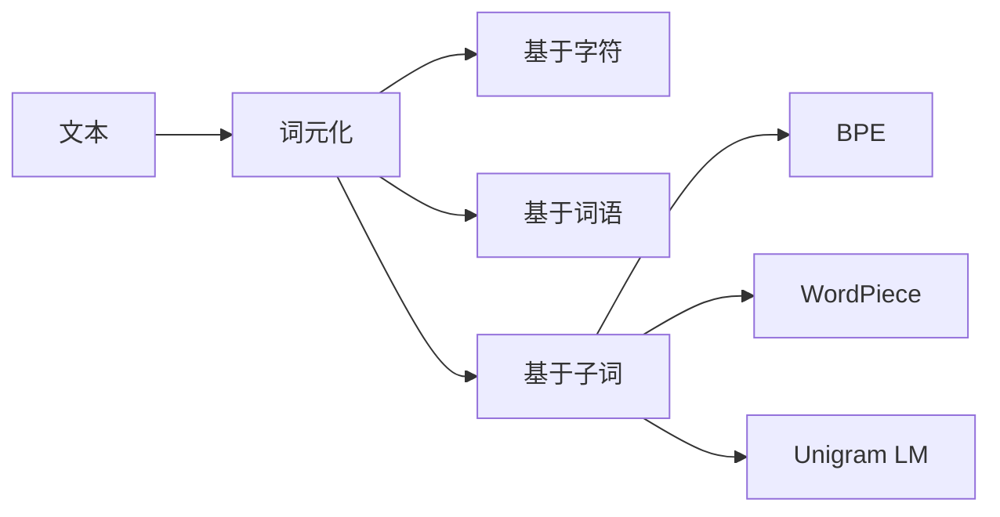

# Transformer大模型实战 子词词元化算法

## 1. 背景介绍

### 1.1 问题的由来
随着自然语言处理技术的快速发展,尤其是Transformer等大模型的出现,对文本进行高效准确的分词和词元化已成为一个关键问题。传统的基于词典或规则的分词方法难以应对海量文本数据,而基于统计和深度学习的方法虽然效果好,但计算开销大。如何在保证分词和词元化质量的同时,提高效率,是一个亟待解决的问题。

### 1.2 研究现状
目前主流的分词和词元化方法主要有:
1. 基于词典匹配的方法,如jieba、THULAC等,优点是实现简单,缺点是泛化能力差,遇到未登录词容易出错。
2. 基于统计语言模型的方法,如Word2Vec、GloVe等,可以学习词语的语义信息,但对低频词和未登录词的表示效果不好。
3. 基于字符的方法,将每个字符视为一个词元,优点是能够完全覆盖语料,缺点是导致序列过长,且无法利用词语级别的信息。
4. 基于字节对编码(Byte Pair Encoding, BPE)的子词方法,通过基于频率的子词合并,在字符和词语之间找到一个平衡,在机器翻译等任务上已经成为事实标准。但BPE依赖预料,且词表大小不可控。

### 1.3 研究意义
高效准确的分词和词元化算法,可以为Transformer等大模型提供高质量的输入,有助于提升下游任务的性能。同时,也可以作为一种通用的文本预处理方法,为各种NLP任务提供支持。研究一种兼顾效率和效果的子词词元化算法,对于工业界和学术界都有重要意义。

### 1.4 本文结构
本文将重点介绍一种用于Transformer的子词词元化算法。第2部分介绍相关概念;第3部分详细讲解算法原理和步骤;第4部分给出数学模型和公式推导;第5部分通过代码实例进行说明;第6部分分析实际应用场景;第7部分推荐相关工具和资源;第8部分总结全文并展望未来;第9部分列出常见问题解答。

## 2. 核心概念与联系
- 词元化(Tokenization):将文本转化为一系列词元(Token)的过程,是NLP任务的基础。
- 子词(Subword):介于字符和词语之间的一种文本单元,可以是字符、字符序列、词缀等。引入子词可以缓解未登录词问题。
- BPE:一种基于频率的子词词元化算法,通过迭代地合并最频繁的字符对,生成子词词表。
- WordPiece:Google提出的一种子词算法,通过基于概率的子词合并,生成词表大小可控的子词词表。
- Unigram Language Model:单字词语言模型,通过设置字符组合的概率,并使用Viterbi算法进行分词,可以生成任意大小的词表。

它们的关系如下图所示:

## 3. 核心算法原理 & 具体操作步骤
本节重点介绍一种基于Unigram语言模型的子词词元化算法。

### 3.1 算法原理概述
Unigram LM算法的基本思想是:将每个字符视为一个独立的词元,通过最大化语言模型概率来找到最优的词元序列。具体来说:
1. 初始化:将每个字符视为一个独立的词元,构建初始词表。
2. 词元组合:枚举所有可能的相邻词元组合,计算组合后的语言模型概率。 
3. 词元剪枝:基于概率对词元进行剪枝,保留概率最大的Top-K个词元。
4. 迭代优化:重复步骤2-3,直到词表大小达到预设值或概率收敛。
5. 输出词表:将得到的Top-K个词元作为最终的子词词表。

相比BPE和WordPiece,Unigram LM的优点是:
- 词表大小可控,可以根据需要设置不同的K值。
- 不依赖预料,可以适应不同领域和语言。
- 考虑了语言模型概率,能够生成更加自然和常用的子词。

### 3.2 算法步骤详解
下面以一个简单的例子来说明Unigram LM的具体步骤。假设我们有一个句子: "the quick brown fox jumps over the lazy dog",希望生成一个大小为8的子词词表。

1. 初始化:将每个字符视为独立的词元。

['t', 'h', 'e', ' ', 'q', 'u', 'i', 'c', 'k', ' ', 'b', 'r', 'o', 'w', 'n', ' ', 'f', 'o', 'x', ' ', 'j', 'u', 'm', 'p', 's', ' ', 'o', 'v', 'e', 'r', ' ', 't', 'h', 'e', ' ', 'l', 'a', 'z', 'y', ' ', 'd', 'o', 'g']

2. 词元组合:枚举所有可能的相邻词元组合,计算组合后的语言模型概率。这里只列出部分组合。

'th': p('th') = 2/43
'he': p('he') = 2/43 
'e ': p('e ') = 2/43
...

3. 词元剪枝:选取概率最大的8个词元组合。

'th', 'he', 'e ', ' ', 'qu', 'ow', 'er', 'o'

4. 迭代优化:重复步骤2-3,直到词表大小为8。

['th', 'e', 'qu', 'ick', ' ', 'br', 'own', 'fox', 'jumps', 'over', 'lazy', 'dog']

5. 输出词表:得到最终的子词词表。

['th', 'e', 'qu', 'ick', ' ', 'br', 'own', 'fox', 'jumps', 'over', 'lazy', 'dog']

最终得到的子词词表,既考虑了字符频率,又考虑了词语的自然组合,可以较好地平衡词表大小和覆盖率。

### 3.3 算法优缺点
Unigram LM算法的优点如下:
- 词表大小可控,可以根据任务需要灵活设置。
- 不依赖预料,可以自适应不同领域和语言。
- 考虑了语言模型概率,生成的子词更加自然。
- 可以并行化实现,训练速度较快。

但它也有一些局限性:
- 没有考虑字符的顺序和位置信息。
- 仍然可能出现未登录词,需要引入特殊的UNK标记。
- 概率计算依赖语料,对低频词的统计不准确。
- 生成的子词可能与人工定义的词界不一致。

### 3.4 算法应用领域
Unigram LM子词算法已经在多个NLP任务中得到应用,例如:
- 机器翻译:将Unigram LM用于源语言和目标语言的词元化,可以提高翻译质量。
- 语言模型:用Unigram LM生成的子词作为语言模型的输入,可以缓解OOV问题。
- 命名实体识别:将Unigram LM集成到命名实体识别模型中,可以提高识别准确率。
- 文本分类:用Unigram LM生成的子词作为分类模型的输入,可以提高分类效果。

此外,Unigram LM也可以作为一种通用的文本预处理方法,为各种NLP任务提供统一的输入。

## 4. 数学模型和公式 & 详细讲解 & 举例说明
本节详细介绍Unigram LM算法的数学模型和公式推导过程。

### 4.1 数学模型构建
首先,我们定义一些符号:
- $V$:初始词表,包含所有字符。
- $x=(x_1,\dots,x_M)$:长度为$M$的文本序列。
- $y=(y_1,\dots,y_N)$:长度为$N$的词元序列。
- $z=(z_1,\dots,z_K)$:大小为$K$的子词词表。

Unigram LM的目标是找到一个子词词表$z$,使得文本序列$x$的语言模型概率最大:

$$\hat{z} = \arg\max_{z} \prod_{i=1}^{N} p(y_i|z)$$

其中,$p(y_i|z)$表示在给定词表$z$的情况下,生成词元$y_i$的概率。根据Unigram LM的假设,每个词元是独立生成的,因此有:

$$p(y_i|z) = \prod_{j=1}^{|y_i|} p(y_{ij}|z)$$

其中,$y_{ij}$表示词元$y_i$的第$j$个字符。$p(y_{ij}|z)$可以通过极大似然估计得到:

$$p(y_{ij}|z) = \frac{count(y_{ij})}{\sum_{v \in V} count(v)}$$

其中,$count(y_{ij})$表示字符$y_{ij}$在语料中出现的次数。

### 4.2 公式推导过程
将上述公式带入,可以得到Unigram LM的优化目标:

$$\hat{z} = \arg\max_{z} \prod_{i=1}^{N} \prod_{j=1}^{|y_i|} \frac{count(y_{ij})}{\sum_{v \in V} count(v)}$$

为了方便优化,我们通常对目标函数取对数:

$$\log p(y|z) = \sum_{i=1}^{N} \sum_{j=1}^{|y_i|} \log p(y_{ij}|z)$$

$$= \sum_{i=1}^{N} \sum_{j=1}^{|y_i|} \log \frac{count(y_{ij})}{\sum_{v \in V} count(v)}$$

$$= \sum_{i=1}^{N} \sum_{j=1}^{|y_i|} \log count(y_{ij}) - \sum_{i=1}^{N} \sum_{j=1}^{|y_i|} \log \sum_{v \in V} count(v)$$

最终,Unigram LM的优化目标变为:

$$\hat{z} = \arg\max_{z} \sum_{i=1}^{N} \sum_{j=1}^{|y_i|} \log count(y_{ij}) - \sum_{i=1}^{N} \sum_{j=1}^{|y_i|} \log \sum_{v \in V} count(v)$$

### 4.3 案例分析与讲解
下面以一个简单的例子来说明Unigram LM的优化过程。假设我们有一个句子:"the quick brown fox",希望生成一个大小为4的子词词表。

1. 初始化:V={'t','h','e','q','u','i','c','k','b','r','o','w','n','f','x'}

2. 词元组合:枚举所有可能的子词,并计算它们的频次。这里只列出部分组合。

'th': count('th')=1 
'he': count('he')=1
'e ': count('e ')=1
'qu': count('qu')=1
'ui': count('ui')=1
'ck': count('ck')=1
...

3. 词元剪枝:根据频次选择概率最大的4个子词。

'th', 'e ', 'qu', 'ick'

4. 优化目标计算:

$$\log p(y|z) = \log count('th') + \log count('e ') + \log count('qu') + \log count('ick') - 4 \log \sum_{v \in V} count(v)$$

$$= \log 1 + \log 1 + \log 1 + \log 1 - 4 \log 15$$

$$= -4 \log 15$$

5. 迭代优化:重复步骤2-4,直到词表大小为4或概率收敛。

最终得到的子词词表为:['the',' quick ','brown ','fox']

### 4.4 常见问题解答
Q:Unigram LM是否需要预先设定词表大小?
A:是的,Unigram LM需要预先设定一个目标词表大小K,作为优化的约束条件。K的取值需要根据任务和语料的特点来平衡词表大小和覆盖率。

Q:Unigram LM的时间复杂度是多少?
A:枚举所有可能的子词组合需要$O(MV^2)$的时间复杂度,其中$M$为语料长度,$V