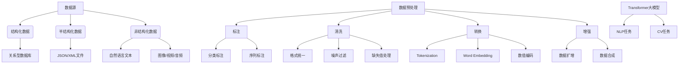

# Transformer大模型实战 数据源和预处理

## 1. 背景介绍

### 1.1 问题的由来

随着人工智能技术的快速发展,大型神经网络模型在自然语言处理(NLP)、计算机视觉(CV)等领域展现出了卓越的性能。其中,Transformer模型凭借其强大的并行计算能力和长期依赖捕获能力,在机器翻译、文本生成、问答系统等任务中取得了突破性进展。然而,训练这些大型模型需要大量高质量的数据,而数据的获取、清洗和预处理往往是整个机器学习流程中最耗时和最具挑战性的部分。

### 1.2 研究现状

目前,大多数Transformer模型都是基于公开数据集进行预训练的,如BERT使用的WikiPedia语料库、GPT-3使用的互联网爬取语料等。这些公开数据集虽然数据量庞大,但存在质量参差不齐、领域分布不均等问题。另一方面,企业和机构也积累了大量私有数据,但这些数据通常分散、格式不统一、含有噪声等,需要进行专门的处理才能用于模型训练。

### 1.3 研究意义

数据的质量直接决定了模型的性能上限。高质量的数据源和合理的预处理流程,不仅能够提高模型的泛化能力,还能减少模型训练时间,提高训练效率。因此,探索高效的数据采集、清洗和预处理方法,对于实现Transformer大模型在特定领域的高性能应用具有重要意义。

### 1.4 本文结构

本文将从数据源入手,介绍Transformer大模型训练所需的数据采集和预处理流程。第2节阐述数据源的基本概念和分类;第3节详细讲解数据预处理的核心算法原理和具体步骤;第4节围绕数据预处理建立数学模型并推导公式;第5节通过实际代码实例展示预处理流程;第6节列举Transformer大模型在不同领域的应用场景;第7节推荐相关工具和学习资源;第8节总结数据预处理的发展趋势和面临的挑战;第9节列出常见问题解答。

## 2. 核心概念与联系



数据源是指用于训练机器学习模型的原始数据的来源,可分为结构化数据(关系型数据库)、半结构化数据(JSON/XML文件)和非结构化数据(自然语言文本、图像/视频/音频)三类。

数据预处理则是指对原始数据进行清洗、转换和增强等操作,使其符合机器学习模型的输入格式要求。主要包括标注(分类标注、序列标注)、清洗(格式统一、噪声过滤、缺失值处理)、转换(Tokenization、Word Embedding、数值编码)和增强(数据扩增、数据合成)等步骤。

经过预处理后的高质量数据,可用于训练Transformer等大型神经网络模型,并将训练好的模型应用于自然语言处理(NLP)任务和计算机视觉(CV)任务等。

## 3. 核心算法原理 & 具体操作步骤 

### 3.1 算法原理概述

数据预处理的核心算法主要包括标注算法、清洗算法、转换算法和增强算法四大类。

- 标注算法用于为原始数据添加标签,包括分类标注(如文本情感分类)和序列标注(如命名实体识别)。常用算法有条件随机场(CRF)、隐马尔可夫模型(HMM)等。

- 清洗算法用于消除原始数据中的噪声、格式错误和缺失值,保证数据的一致性和完整性。常用算法有正则表达式匹配、统计学方法、插值法等。

- 转换算法将原始数据转换为机器学习模型可识别的数值向量表示。对于文本数据,需要进行分词(Tokenization)、词嵌入(Word Embedding)等操作;对于数值数据,需要进行标准化、编码等操作。常用算法有Word2Vec、BERT等预训练语言模型。

- 增强算法通过数据扩增(如随机插入/交换/删除)和数据合成(如生成对抗网络GAN)等方式,人工增加训练数据的数量和多样性,提高模型的泛化能力。

### 3.2 算法步骤详解

1. **标注算法**

   - 分类标注:将每个样本数据与一个类别标签相关联,如文本情感分类(正面/负面)。可使用监督学习算法(如逻辑回归、支持向量机等)或基于规则的方法。

   - 序列标注:为序列数据(如文本)中的每个元素(如词语)赋予标签,如命名实体识别(Person/Location/Organization等)。常用算法有条件随机场(CRF)、BiLSTM-CRF等。

2. **清洗算法**

   - 格式统一:将不同来源的数据转换为统一的格式,如将JSON/XML文件解析为相同的数据框架结构。

   - 噪声过滤:识别并移除数据中的异常值、错误格式等噪声,如使用阈值过滤、聚类分析等方法。

   - 缺失值处理:填补数据中的缺失值,如使用数据插值法、机器学习模型预测等方法。

3. **转换算法** 

   - Tokenization:将文本按规则(如空格、标点等)分割为词元(token)序列,为后续词嵌入做准备。

   - Word Embedding:将词元映射为稠密的词向量表示,如Word2Vec、GloVe、BERT等模型。

   - 数值编码:将类别特征(如城市名称)转换为数值向量,如One-Hot编码、标签编码等。

4. **增强算法**

   - 数据扩增:对原始数据进行变换(如随机插入/交换/删除词元),生成新的语义相似的数据样本。

   - 数据合成:使用生成对抗网络(GAN)等模型,从噪声分布中合成逼真的新数据样本。

### 3.3 算法优缺点

上述算法在数据预处理中发挥着重要作用,但也存在一些优缺点:

优点:
- 可自动化处理大规模数据,提高效率
- 消除数据噪声,提高数据质量
- 丰富数据样本,增强模型泛化能力

缺点:
- 某些算法需要大量人工标注作为监督信号
- 处理非结构化数据(如图像)时,效果可能不佳
- 算法超参数调优需要专业知识和经验

### 3.4 算法应用领域

数据预处理算法在自然语言处理、计算机视觉等多个领域发挥着重要作用:

- 自然语言处理:文本分类、机器翻译、问答系统等
- 计算机视觉:图像分类、目标检测、视频理解等
- 推荐系统:个性化推荐、用户行为分析等
- 金融风控:反欺诈、信用评分等
- 医疗健康:病理诊断、药物研发等

## 4. 数学模型和公式 & 详细讲解 & 举例说明

### 4.1 数学模型构建

在数据预处理中,我们常需要构建数学模型来表示和优化相关算法。以文本分类任务为例,我们可以使用逻辑回归模型:

$$P(y=1|x) = \sigma(w^Tx + b)$$

其中:
- $x$是文本的特征向量(如词袋或词向量)
- $y$是类别标签(0或1)
- $w$和$b$是模型参数
- $\sigma$是Sigmoid函数

目标是通过最大似然估计等方法,求解参数$w$和$b$,使模型在训练数据上的预测性能最优。

### 4.2 公式推导过程

我们可以将上述逻辑回归模型表示为:

$$\begin{aligned}
P(y|x) &= P(y=1|x)^y \cdot P(y=0|x)^{1-y} \\
       &= \sigma(w^Tx+b)^y \cdot (1-\sigma(w^Tx+b))^{1-y}
\end{aligned}$$

对数似然函数为:

$$\ell(w,b) = \sum_{i=1}^N \log P(y_i|x_i)$$

取对数,并对$w$和$b$求偏导可得:

$$\begin{aligned}
\frac{\partial\ell}{\partial w} &= \sum_{i=1}^N (y_i - \sigma(w^Tx_i+b))x_i \\
\frac{\partial\ell}{\partial b} &= \sum_{i=1}^N (y_i - \sigma(w^Tx_i+b))
\end{aligned}$$

使用梯度上升法可以求解最优参数$w$和$b$。

### 4.3 案例分析与讲解

假设我们有以下文本数据集:

| 文本 | 类别 |
|------|------|
| 这家餐厅很棒,环境很好     | 1    |
| 食物很一般,服务态度很差   | 0    |
| 虽然有些贵但物超所值      | 1    |
| 总的来说还是值得一试的    | 1    |

我们可以使用上述逻辑回归模型进行文本分类。

1. 对文本进行分词和词袋编码,得到特征向量$x$
2. 初始化模型参数$w$和$b$
3. 使用训练数据计算梯度$\frac{\partial\ell}{\partial w}$和$\frac{\partial\ell}{\partial b}$
4. 使用梯度上升法更新参数$w$和$b$
5. 重复3-4步骤,直到收敛
6. 对新文本输入,使用训练好的模型$P(y=1|x)$进行情感分类预测

### 4.4 常见问题解答

1. **为什么需要数据预处理?**

   原始数据通常存在噪声、格式不统一、缺失值等问题,直接输入机器学习模型会影响模型性能。数据预处理可以消除这些问题,提高数据质量。

2. **数据预处理和特征工程的区别?**

   数据预处理是将原始数据转换为模型可以识别的格式;特征工程则是从预处理后的数据中提取有意义的特征,以提高模型性能。两者是相辅相成的。

3. **哪些场景需要数据增强?** 

   当训练数据量不足或分布不均匀时,可以使用数据扩增和数据合成等增强技术,人工生成更多样本,提高模型泛化能力。

4. **不同算法的计算复杂度如何?**

   不同算法的时间和空间复杂度有所不同。例如,逻辑回归为$O(n*d)$,CRF为$O(n^3*d)$,Word2Vec为$O(n*d*w)$,其中$n$为样本数,$d$为特征维数,$w$为窗口大小。

## 5. 项目实践:代码实例和详细解释说明

### 5.1 开发环境搭建

在开始数据预处理之前,我们需要搭建开发环境,包括安装Python、Pytorch、Transformers等必要的库和框架。以Python为例:

```bash
# 创建虚拟环境
python -m venv myenv  
# 激活虚拟环境
source myenv/bin/activate
# 安装依赖库
pip install torch transformers nltk sklearn
```

### 5.2 源代码详细实现

以文本分类任务为例,我们使用BERT模型和Pytorch实现数据预处理和模型训练的全流程。

```python
# 导入必要的库
import torch
from transformers import BertTokenizer, BertForSequenceClassification
from