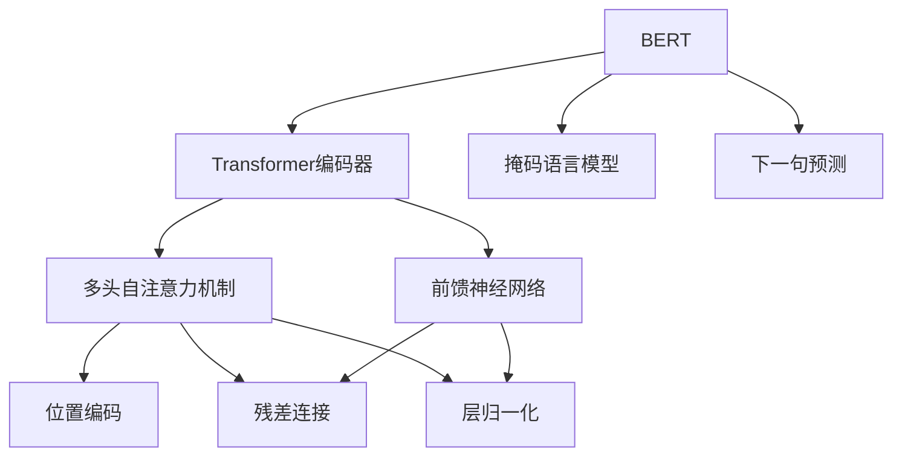

# Transformer大模型实战 特定语言的BERT模型

## 1. 背景介绍

### 1.1 问题的由来

在自然语言处理(NLP)领域,Transformer模型的出现彻底改变了深度学习在NLP任务中的应用。传统的序列模型如RNN和LSTM由于存在梯度消失、不能完全并行化等缺陷,在处理长序列时表现不佳。2017年,Transformer被提出,它完全基于注意力机制,摆脱了RNN的递归计算,能够高效并行训练,在机器翻译等任务上取得了突破性进展。

随后,Transformer在NLP各种下游任务中大放异彩,BERT(Bidirectional Encoder Representations from Transformers)就是其中一个杰出代表。BERT是一种通用的预训练语言表示模型,它在大规模无标注语料上进行自监督训练,学习到了丰富的语义和语法知识,然后可以在各种NLP任务上进行微调(fine-tuning),大幅提升了模型性能。

### 1.2 研究现状

BERT模型在英文等主流语言上取得了卓越成绩,但对于低资源语言,由于缺乏足够的语料,BERT的表现往往不尽如人意。因此,针对特定语言训练BERT模型成为一个热门研究方向。目前,已有多个语种的BERT模型问世,如谷歌的多语种BERT、百度的中文BERT等。

这些语种BERT模型通过预训练获得了对应语言的语义和语法知识,在下游任务中表现优异,推动了NLP在特定语言的应用。但由于语料、算力等资源的限制,训练高质量的语种BERT模型仍然是一个挑战,需要更多的研究和探索。

### 1.3 研究意义 

训练出高质量的语种BERT模型,对于推动NLP在特定语言的发展至关重要。它可以为下游任务提供强大的语义表示能力,提高模型的性能和泛化能力。同时,语种BERT模型也是构建多语种NLP系统的基石,有助于打破语言壁垒,实现语言的互联互通。

此外,针对低资源语言训练BERT模型,还有助于保护语言多样性,挖掘语言的内在规律,促进语言的传承和发展。因此,研究特定语言的BERT模型,不仅有重要的理论价值,也具有广阔的应用前景。

### 1.4 本文结构

本文将全面介绍如何针对特定语言训练BERT模型。首先阐述BERT模型的核心概念和原理,包括Transformer编码器、自注意力机制等。然后详细讲解BERT模型的预训练过程,包括数据预处理、掩码语言模型和下一句预测等。接着介绍如何使用BERT进行微调,并在下游任务中取得优异表现。最后总结BERT模型在特定语言中的应用现状,并展望未来的发展趋势和挑战。

## 2. 核心概念与联系

BERT模型的核心是Transformer编码器,它由多个相同的层组成,每层包含两个子层:多头自注意力机制和前馈神经网络。

1. **多头自注意力机制**:允许每个单词同时关注其他单词,捕捉长距离依赖关系。
2. **位置编码**:因为Transformer没有递归结构,位置编码用于注入单词在序列中的位置信息。
3. **残差连接**:将子层的输入与输出相加,有助于梯度传播和模型优化。
4. **层归一化**:对输入进行归一化处理,加速收敛,提高模型性能。

BERT在Transformer编码器的基础上,引入了两个无监督预训练任务:

1. **掩码语言模型**:随机掩码部分单词,模型需要根据上下文预测被掩码的单词。
2. **下一句预测**:判断两个句子是否相邻,捕捉句子间的关系。

通过在大规模语料上预训练,BERT学习到了丰富的语义和语法知识,成为通用的语言表示模型。在下游任务中,只需对BERT进行少量微调,即可获得良好的性能。

## 3. 核心算法原理 & 具体操作步骤

### 3.1 算法原理概述

BERT的核心算法是基于Transformer的自注意力机制和预训练任务。我们首先介绍自注意力机制的原理:

$$\mathrm{Attention}(Q, K, V) = \mathrm{softmax}(\frac{QK^T}{\sqrt{d_k}})V$$

其中 $Q$ 为查询(Query)向量、$K$ 为键(Key)向量、$V$ 为值(Value)向量。自注意力机制通过计算查询与所有键的相似性,得到一个注意力分数向量,然后对值向量加权求和,作为输出。

多头注意力机制是将注意力机制运用到不同的子空间,并将结果拼接,从而捕捉不同位置的信息。

$$\mathrm{MultiHead}(Q, K, V) = \mathrm{Concat}(head_1, ..., head_h)W^O$$
$$\text{where } head_i = \mathrm{Attention}(QW_i^Q, KW_i^K, VW_i^V)$$

接下来是BERT的两个预训练任务:

1. **掩码语言模型**:将输入序列中的部分单词随机用特殊标记[MASK]替换,然后训练模型预测被掩码的单词。这样可以捕捉双向上下文信息。

2. **下一句预测**:在训练样本中,50%的时候将两个句子连接作为输入,另外50%则是随机挑选两个句子连接。模型需要判断两个句子是否相邻,从而捕捉句子间的关系。

通过上述两个无监督任务的联合预训练,BERT学习到了丰富的语义和语法知识,成为通用的语言表示模型。

### 3.2 算法步骤详解

1. **输入表示**:将输入序列切分为单词(或词元),每个单词映射为一个embedding向量。然后加入两个特殊标记[CLS]和[SEP],前者用于下一句预测,后者用于分隔两个句子。最后加入位置编码,以注入位置信息。

2. **掩码语言模型预训练**:对输入序列中的15%单词随机进行掩码,即用特殊标记[MASK]替换。然后输入到BERT模型,训练模型预测被掩码的单词。对于掩码的单词,有80%的概率用[MASK]替换,10%随机替换为其他单词,10%保持不变。这种策略可以使模型学习到更多语义和语法信息。

3. **下一句预测预训练**:对于一个训练样本,50%的时候将两个相邻的句子连接作为输入,另外50%则是随机挑选两个句子连接。输入到BERT模型,训练模型判断两个句子是否相邻。通过这个任务,BERT可以捕捉句子间的关系。

4. **微调**:在下游任务上,将BERT模型的输出[CLS]向量通过一个分类层,得到任务的标签概率。根据任务目标设计损失函数,对BERT进行微调。由于BERT已经在大规模语料上预训练,只需要少量的微调就可以获得良好的性能。

5. **推理**:在推理阶段,将输入数据输入到微调后的BERT模型,通过分类层得到预测的标签或概率。

### 3.3 算法优缺点

**优点**:

1. **通用性强**:BERT作为无监督预训练的语言表示模型,可以在各种NLP任务上进行微调,获得出色的性能。

2. **捕捉长距离依赖**:自注意力机制使BERT能够有效捕捉长距离的语义和语法依赖关系。

3. **双向编码**:BERT的掩码语言模型任务使其能够同时利用左右上下文,获得更丰富的语义表示。

4. **并行计算**:Transformer结构使BERT可以高效并行训练,加速模型收敛。

**缺点**:

1. **训练成本高**:BERT模型巨大,预训练需要消耗大量的算力和时间成本。

2. **推理速度慢**:BERT的自注意力机制需要大量计算,推理速度较慢,不利于部署。

3. **输入长度限制**:由于自注意力机制的计算复杂度与输入长度的平方成正比,BERT对输入长度有一定限制。

4. **缺乏归纳偏置**:BERT作为一种数据驱动的模型,缺乏一定的归纳偏置,难以捕捉一些语言的内在规律。

### 3.4 算法应用领域

BERT模型作为一种通用的语言表示模型,可以应用于NLP的各种下游任务,主要包括:

1. **文本分类**:情感分析、新闻分类、垃圾邮件检测等。

2. **序列标注**:命名实体识别、词性标注、关系抽取等。

3. **问答系统**:阅读理解、开放域问答等。

4. **机器翻译**:利用BERT作为编码器,与Transformer解码器结合。

5. **文本生成**:利用BERT作为编码器,结合生成模型如GPT等。

6. **其他领域**:如代码理解、知识图谱构建、对话系统等。

总的来说,BERT模型为NLP领域带来了革命性的进展,在各种任务中都有广泛的应用前景。

## 4. 数学模型和公式 & 详细讲解 & 举例说明

### 4.1 数学模型构建

BERT模型的核心是Transformer编码器,我们先介绍其中的自注意力机制(Scaled Dot-Product Attention):

$$\mathrm{Attention}(Q, K, V) = \mathrm{softmax}(\frac{QK^T}{\sqrt{d_k}})V$$

其中 $Q$ 为查询(Query)向量、$K$ 为键(Key)向量、$V$ 为值(Value)向量,它们的维度分别为 $Q \in \mathbb{R}^{n \times d_k}, K \in \mathbb{R}^{n \times d_k}, V \in \mathbb{R}^{n \times d_v}$。

1) 首先计算查询 $Q$ 与所有键 $K$ 的点积得分: $QK^T \in \mathbb{R}^{n \times n}$。
2) 将点积分数除以缩放因子 $\sqrt{d_k}$,以防止过大的值导致softmax函数饱和。
3) 对每个查询,通过softmax函数得到所有键的注意力分数向量。
4) 将注意力分数向量与值向量 $V$ 相乘,得到注意力加权的值向量。

多头注意力机制(Multi-Head Attention)是将注意力机制应用到不同的子空间,并将结果拼接:

$$\mathrm{MultiHead}(Q, K, V) = \mathrm{Concat}(head_1, ..., head_h)W^O$$
$$\text{where } head_i = \mathrm{Attention}(QW_i^Q, KW_i^K, VW_i^V)$$

其中 $W_i^Q \in \mathbb{R}^{d_{model} \times d_k}, W_i^K \in \mathbb{R}^{d_{model} \times d_k}, W_i^V \in \mathbb{R}^{d_{model} \times d_v}$ 是可训练的投影矩阵,将查询/键/值映射到不同的子空间。$W^O \in \mathbb{R}^{hd_v \times d_{model}}$ 则是将多头注意力的结果拼接并映射回原始空间。

对于BERT的预训练任务,掩码语言模型(Masked Language Model)和下一句预测(Next Sentence Prediction),我们可以将它们统一表示为:

$$\mathcal{L} = \mathcal{L}_{MLM} + \lambda \mathcal{L}_{NSP}$$

其中 $\mathcal{L}_{MLM}$ 为掩码语言模型的损失函数,通常使用交叉熵损失;$\mathcal{L}_{NSP}$ 为下一句预测的损失函数,使用二分类交叉熵损失;$\lambda$ 为平衡两个任务的超参数。

### 4.2 公式推