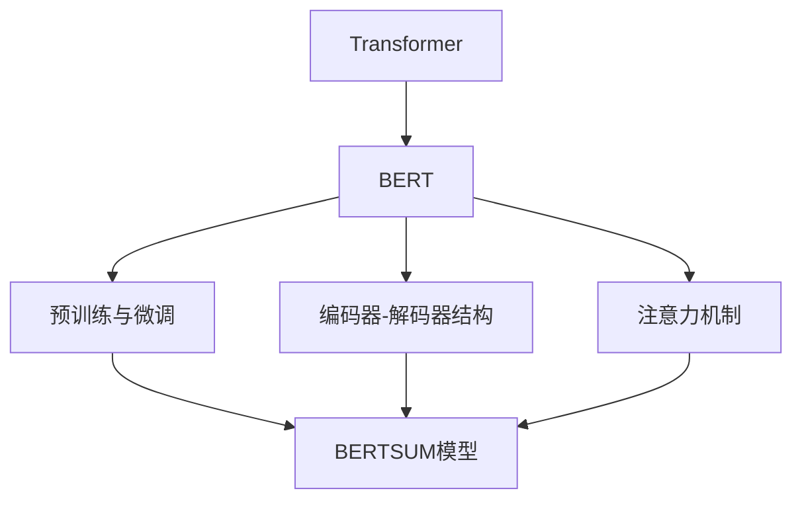
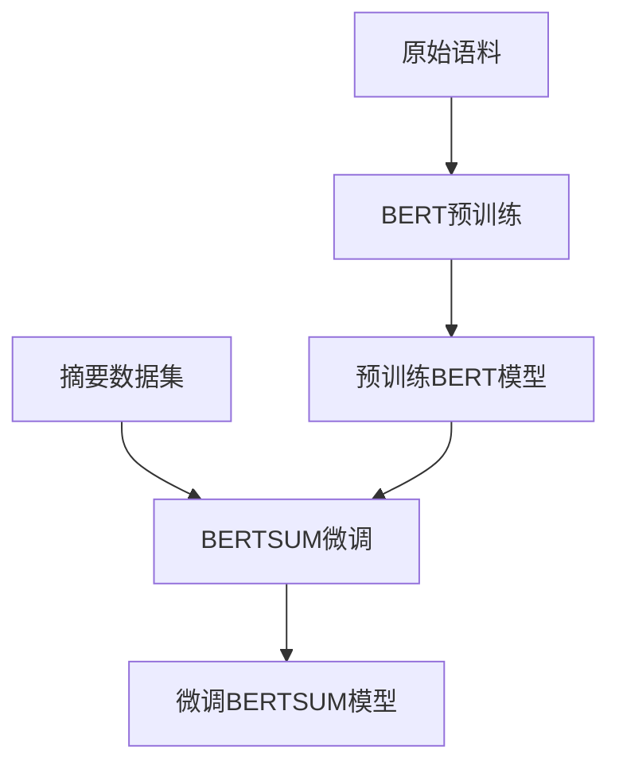

以下是关于《Transformer大模型实战 训练BERTSUM 模型》的技术博客文章正文部分：

# Transformer大模型实战 训练BERTSUM 模型

## 1. 背景介绍

### 1.1 问题的由来

在自然语言处理(NLP)领域中,文本摘要任务一直是一个具有挑战性的问题。随着信息时代的到来,海量的文本数据不断涌现,人们越来越需要高效地获取文本的核心内容。然而,手动撰写摘要不仅耗时耗力,而且难以保证质量的一致性。因此,自动文本摘要技术应运而生,旨在利用机器学习算法自动生成高质量的文本摘要。

### 1.2 研究现状  

传统的文本摘要方法主要包括提取式摘要和生成式摘要两大类。提取式摘要直接从原文中抽取重要的句子或词语作为摘要,优点是结果易于理解,但缺乏连贯性。生成式摘要则是基于原文语义,利用自然语言生成模型生成新的摘要文本,具有更好的连贯性和可读性,但常常存在失真或偏差的问题。

近年来,benefing式摘要取得了长足进步,尤其是基于Transformer的大型语言模型(如BERT、GPT等)展现出了优异的性能。其中,BERTSUM是一种基于BERT的抽象生成式摘要模型,通过预训练和微调两阶段训练,能够生成高质量的文本摘要。

### 1.3 研究意义

掌握BERTSUM模型的训练过程,不仅能够应用于文本摘要任务,更重要的是理解了基于Transformer的大型语言模型微调的通用方法,为解决其他NLP任务奠定基础。此外,BERTSUM模型的训练过程也揭示了预训练与微调、编码器-解码器结构、注意力机制等核心概念,对于深入理解大型语言模型的原理至关重要。

### 1.4 本文结构

本文将从以下几个方面全面介绍BERTSUM模型的训练过程:
1. 核心概念与联系
2. 核心算法原理与具体操作步骤 
3. 数学模型和公式详细讲解与案例分析
4. 项目实践:代码实例和详细解释
5. 实际应用场景
6. 工具和资源推荐
7. 总结:未来发展趋势与挑战
8. 附录:常见问题与解答

## 2. 核心概念与联系

在深入探讨BERTSUM模型的训练细节之前,我们有必要先了解以下几个核心概念及其内在联系:

1. **Transformer**:Transformer是一种全新的基于注意力机制的序列到序列(Seq2Seq)模型,不同于传统的RNN/LSTM结构。它完全基于注意力机制,允许输入和输出之间的任何位置建立直接连接,极大地并行化了模型训练过程。Transformer模型在机器翻译等任务上取得了突破性的进展,为后来的大型语言模型奠定了基础。

2. **BERT(Bidirectional Encoder Representations from Transformers)**:BERT是一种基于Transformer的双向编码器语言模型,通过大规模无监督预训练,学习到了深层次的语义表示。BERT在多项NLP任务上取得了state-of-the-art的表现,成为后续大型语言模型的基石。

3. **预训练与微调**:预训练(Pre-training)是指在大规模无标注语料上进行通用语言表示学习,而微调(Fine-tuning)是指在有标注的特定任务数据上进一步调整模型参数。这种"预训练+微调"的范式被广泛应用于大型语言模型,能够极大提高模型的泛化性能。

4. **编码器-解码器(Encoder-Decoder)结构**:编码器将输入序列(如原文)编码为语义向量表示,解码器则根据语义向量生成目标序列(如摘要文本)。编码器-解码器结构广泛应用于序列到序列的生成任务,如机器翻译、文本摘要等。

5. **注意力机制(Attention Mechanism)**:注意力机制赋予模型"注意力"的能力,使其能够对输入序列中不同位置的信息赋予不同的权重,从而更好地捕捉长距离依赖关系。注意力机制是Transformer模型的核心,也是BERTSUM模型生成高质量摘要的关键所在。

上述概念相互关联、环环相扣,共同构建了BERTSUM模型的理论基础。理解这些概念不仅有助于掌握BERTSUM模型的训练细节,也为进一步探索大型语言模型的奥秘奠定了坚实的基础。

## 3. 核心算法原理与具体操作步骤

### 3.1 算法原理概述

BERTSUM模型的训练过程可以分为两个阶段:预训练(Pre-training)和微调(Fine-tuning)。

**预训练阶段**:BERTSUM模型首先在大规模无监督语料(如Wikipedia)上进行预训练,目标是学习通用的语言表示能力。预训练采用了BERT模型中的两个任务:
1. **Masked Language Model(MLM)**: 随机遮蔽输入序列中的部分单词,模型需要根据上下文预测被遮蔽单词的词元。
2. **Next Sentence Prediction(NSP)**: 判断两个输入句子是否为连续的句子对。

通过上述两个任务的联合训练,BERT模型学习到了双向的上下文表示,能够捕捉单词和句子级别的语义信息。

**微调阶段**:在预训练的基础上,BERTSUM模型需要在特定的文本摘要数据集上进行微调,以适应摘要生成任务。微调过程中,BERTSUM模型采用了编码器-解码器的Seq2Seq结构:
1. **编码器(Encoder)**: 利用预训练好的BERT模型对输入文本进行编码,获取其语义向量表示。
2. **解码器(Decoder)**: 基于Transformer的解码器结构,根据编码器的输出生成摘要文本。解码器中的注意力机制能够有效捕捉输入文本和生成摘要之间的长距离依赖关系。

在微调过程中,BERTSUM模型的编码器参数基于预训练进行微调,而解码器部分则是从头开始训练。通过端到端的训练,BERTSUM模型能够学习到生成高质量摘要所需的能力。

### 3.2 算法步骤详解

BERTSUM模型的训练过程可以概括为以下几个主要步骤:

1. **数据预处理**:
   - 构建训练集和验证集,包括原始文本和对应的参考摘要。
   - 对原始文本和摘要进行分词、词元化等预处理操作。
   - 构建词元到索引的映射字典。
   - 填充/截断序列,使其等长。

2. **BERT预训练**:
   - 加载预训练好的BERT模型权重。
   - 在大规模无监督语料上进行MLM和NSP任务的联合训练。
   - 保存预训练好的BERT模型参数。

3. **BERTSUM微调**:
   - 初始化BERTSUM模型,包括编码器(BERT)和解码器(Transformer)部分。
   - 加载预训练好的BERT模型权重作为编码器初始化参数。
   - 在文本摘要数据集上进行端到端的训练,优化目标是最小化生成摘要与参考摘要之间的损失。
   - 对编码器(BERT)部分进行微调,解码器部分从头开始训练。
   - 采用教师强制(Teacher Forcing)等策略提高训练效率。
   - 在验证集上评估模型性能,选择最优模型参数。

4. **摘要生成**:
   - 利用训练好的BERTSUM模型对新的文本进行摘要生成。
   - 编码器对输入文本进行编码,获取语义向量表示。
   - 解码器根据语义向量自回归地生成摘要文本。
   - 采用束搜索(Beam Search)等策略提高生成质量。

5. **评估**:
   - 使用ROUGE等指标评估生成摘要与参考摘要之间的相似度。
   - 对模型性能进行全面评估和分析。

总的来说,BERTSUM模型的训练过程融合了BERT的强大语义表示能力和Transformer的高效序列生成能力,通过预训练与微调的范式实现了出色的文本摘要性能。

### 3.3 算法优缺点

**优点**:

1. **强大的语义表示能力**:BERTSUM模型基于BERT的双向编码器,能够学习到深层次的语义表示,为高质量摘要生成奠定基础。

2. **长距离依赖建模**:Transformer解码器中的注意力机制,能够有效捕捉输入文本和生成摘要之间的长距离依赖关系,提高了摘要质量。

3. **泛化性能好**:通过预训练和微调的范式,BERTSUM模型能够在大规模无监督数据上学习通用知识,再转移到特定的摘要任务,提高了模型的泛化能力。

4. **端到端训练**:BERTSUM模型的编码器和解码器部分是端到端联合训练的,能够充分利用两者之间的相互作用,提高整体性能。

5. **生成质量高**:实验结果表明,BERTSUM模型生成的摘要质量优于多数提取式和生成式基线模型,能够生成高度相关、信息丰富且行文流畅的摘要。

**缺点**:

1. **训练耗时耗力**:BERTSUM模型包含大量参数,需要在海量数据上进行预训练和微调,训练过程耗时耗力。

2. **推理效率较低**:生成式模型的推理过程是自回归的,无法完全并行化,导致推理效率较低,难以应用于低延迟的实时场景。

3. **生成不确定性**:由于生成过程的非确定性,BERTSUM模型对同一输入,每次生成的摘要可能有所不同,缺乏稳定性。

4. **参数量大**:BERTSUM模型包含BERT和Transformer两部分,参数量极其庞大,对计算资源和存储空间的要求很高。

5. **解释性较差**:作为一种黑盒模型,BERTSUM的内部工作机制较为复杂,缺乏足够的解释性和可解释性。

总的来说,BERTSUM模型展现出了出色的文本摘要性能,但也存在一些需要进一步改进和优化的不足之处。

### 3.4 算法应用领域

BERTSUM模型作为一种先进的文本摘要技术,具有广泛的应用前景:

1. **新闻摘要**:自动生成高质量的新闻摘要,帮助用户快速获取新闻要点,提高信息获取效率。

2. **论文摘要**:根据论文全文自动生成摘要,方便研究人员快速了解论文核心内容。

3. **商品评论摘要**:对海量的商品评论进行摘要,帮助电商平台和用户快速把握产品的优缺点。

4. **会议纪要**:根据会议记录自动生成会议纪要,提高工作效率。

5. **知识问答**:将文档内容自动摘要,为知识问答系统提供高质量的知识源。

6. **文本分类**:利用生成的摘要作为文档的高级语义表示,辅助文本分类任务。

7. **机器翻译**:将源语言文本先生成摘要,再将摘要翻译为目标语言,提高翻译效率和质量。

8. **多文档摘要**:融合多个文档的内容,生成跨文档的综合摘要。

9. **可解释AI**:通过分析生成摘要的注意力权重,提高模型的可解释性。

10. **文本数据分析**:对大规模文本数据进行自动摘要,辅助数据分析和决策支持。

总的来说,BERTSUM模型为文本摘要任务提供了强大的技术支持,在