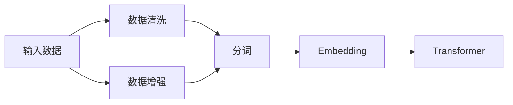

# Transformer大模型实战 输入数据

作者：禅与计算机程序设计艺术 / Zen and the Art of Computer Programming

## 1. 背景介绍
### 1.1 问题的由来
随着人工智能技术的飞速发展,尤其是自然语言处理领域的突破性进展,Transformer大模型已经成为当前最为前沿和热门的研究方向之一。Transformer模型自2017年由Google提出以来,凭借其强大的特征提取和建模能力,在机器翻译、文本分类、问答系统、对话生成等多个任务上取得了state-of-the-art的表现,引领了NLP领域的发展潮流。

然而,训练一个高质量的Transformer模型离不开大规模、高质量的训练数据。如何高效地准备和处理海量的输入数据,成为了Transformer实践中的一个关键问题。输入数据的质量直接影响模型的性能表现,因此深入探讨Transformer的输入数据处理技术具有重要意义。

### 1.2 研究现状
目前,学术界和工业界已经围绕Transformer的输入数据展开了广泛研究。一方面,研究人员提出了多种数据增强技术,如回译、同义词替换、插入/删除等,以扩充训练数据的规模和多样性。另一方面,大量的数据清洗和预处理方法被应用,以提高数据质量,如去除噪声、规范化、分词等。

此外,一些研究还关注到了输入数据的表示方式。除了传统的one-hot和word embedding,一些更为先进的文本表示技术如BERT的Embedding、ELMo等也被引入Transformer的训练中,以期获得更加丰富和有效的输入特征。

### 1.3 研究意义
深入研究Transformer的输入数据处理技术,对于提升Transformer模型的性能和应用价值具有重要意义:

1. 高质量的输入数据是训练出色模型的前提和基础,直接决定了模型的上限。系统地总结和创新数据处理方法,有助于构建更加强大的Transformer模型。

2. 输入数据往往来源广泛,形式多样,如何从海量异构数据中提取知识一直是NLP的难点。探索面向Transformer的数据融合和表示技术,将促进NLP算法的进一步发展。 

3. 实践中,训练数据的获取成本较高,输入数据的自动化处理可以极大提升开发效率,降低人力投入,具有显著的工程价值。

4. 输入数据的处理涉及隐私保护、公平性等诸多伦理问题,需要在技术创新的同时兼顾道德规范,这也是当前NLP研究的重要方向之一。

### 1.4 本文结构
本文将围绕Transformer的输入数据处理技术展开系统而深入的探讨。第2部分介绍相关的核心概念;第3部分重点阐述数据处理的核心算法原理和具体步骤;第4部分给出算法所依赖的数学模型和公式推导;第5部分通过代码实例演示技术实现细节;第6部分讨论输入数据处理在实际场景中的应用;第7部分推荐相关的学习资源和工具;第8部分总结全文,并展望未来的研究方向。

## 2. 核心概念与联系
在探讨Transformer输入数据处理之前,首先需要明确以下几个核心概念:

- Transformer:一种基于自注意力机制的神经网络模型,广泛应用于NLP任务。它通过Encoder-Decoder结构,对输入文本进行特征提取和序列建模。

- 输入数据:指输入给Transformer模型进行训练或推理的文本数据。通常以字符、分词、句子等形式组织,需经过一系列预处理步骤转换为模型可以接受的张量格式。

- Embedding:一种将离散变量(如词语)映射为连续向量表示的技术。通过Embedding,可以将高维、稀疏的one-hot表示转换为低维、稠密的分布式表示,更利于模型学习。

- 数据增强:一类人工扩充训练数据规模和多样性的技术,如回译、同义词替换、插入/删除等。数据增强可以一定程度上缓解训练数据不足的问题,提高模型的泛化性能。

- 数据清洗:指去除输入数据中的噪声、错误、不一致等,提高数据质量的过程。常见的操作如去除特殊字符、规范化文本格式、纠正拼写错误等。

- 分词:将连续的文本切分为最小语义单元(通常是词)的过程。分词粒度的选择直接影响到Transformer的输入表示,是数据处理的重要环节。

- BPE(byte-pair encoding):一种基于统计的分词算法,可以自动识别出频繁共现的字符组合,将其合并为一个"词"。BPE能够在字符和词之间自适应地选择合适的粒度,在Transformer中被广泛采用。

下图展示了这些概念之间的关联:



可以看出,输入数据经过数据增强扩充规模,再通过清洗、分词、Embedding等步骤进行预处理,最终输入到Transformer模型中进行训练或推理。这个过程中,每个环节的选择都会影响到最终的模型性能。

## 3. 核心算法原理 & 具体操作步骤
### 3.1 算法原理概述
Transformer的输入数据处理可以概括为以下几个主要步骤:

1. 数据清洗:去除原始文本数据中的噪声,如特殊字符、HTML标签、不合法字符等,规范化文本格式。

2. 分词:将清洗后的文本切分为最小语义单元。常用的分词算法有基于规则的(如Moses)、基于统计的(如BPE)和基于词典的(如Jieba)等。

3. Embedding:将分词后的文本映射为连续的向量表示。可以选择随机初始化Embedding矩阵,也可以使用预训练的词向量如Word2Vec、GloVe等。

4. 位置编码:由于Transformer不包含RNN这种天然的序列建模机制,需要显式地为每个词添加位置信息。常用的位置编码方法有正弦/余弦函数、可学习的位置Embedding等。

5. 数据增强:在上述基础上,可以采用回译、同义词替换、插入/删除等数据增强技术,进一步扩充训练数据的规模和多样性。

6. 构建训练数据:将处理后的文本数据转换为模型可接受的张量格式,如Numpy Array或PyTorch Tensor。同时需要构建词表,将词映射为唯一的整数ID。

### 3.2 算法步骤详解
下面以BPE分词算法为例,详细说明Transformer输入数据处理的具体步骤。

输入:原始文本数据,如"Hello world, this is a test!"

1. 数据清洗
   
   去除特殊字符,转换为小写,得到"hello world this is a test"

2. 分词初始化
   
   将文本转换为字符序列,添加起始符和终止符:"<start> h e l l o w o r l d t h i s i s a t e s t <end>"

3. 统计字符频率
   
   统计每个字符和字符对的出现频率,如:
   ```
   (' ', 's') : 2
   ('s', ' ') : 2
   ('l', 'l') : 1 
   ...
   ```

4. 合并高频字符对
   
   选择出现频率最高的字符对,将其合并为一个新的"词",如将"l l"替换为"ll":
   ```
   <start> h e ll o w o r l d t h i s i s a t e s t <end>
   ```
   重复该过程,直到达到预设的词表大小或字符对最小频率阈值。

5. 应用BPE分词
   
   使用学习到的合并规则,对新的文本进行分词:
   ```
   <start> hell o w or l d th i s i s a te s t <end>
   ```

6. Embedding&位置编码
   
   为每个词构建词向量,如随机初始化或使用预训练Embedding。同时添加位置编码,如:
   $$PE_{(pos,2i)} = sin(pos/10000^{2i/d_{model}})$$
   $$PE_{(pos,2i+1)} = cos(pos/10000^{2i/d_{model}})$$
   其中$pos$为位置,$i$为维度,$d_{model}$为Embedding维度。

7. 数据增强(可选)
   
   对分词后的文本进行数据增强,如随机替换为同义词、随机插入/删除词等,得到增强后的文本。

8. 构建训练数据
   
   将处理后的文本转换为张量格式,同时构建词表,将每个词映射为唯一的整数ID:
   ```
   # 原始文本
   <start> hell o w or l d th i s i s a te s t <end>

   # 词表
   {'<start>': 0, '<end>': 1, 'hell': 2, 'o': 3, 'w': 4, 'or': 5, 'l': 6, 'd': 7, 'th': 8, 'i': 9, 's': 10, 'a': 11, 'te': 12, 't': 13} 

   # 张量表示
   [ 0  2  3  4  5  6  7  8  9 10  9 10 11 12 13  1]
   ```

至此,原始的文本数据就被转换为了Transformer可以接受的格式,可以用于模型的训练和推理了。

### 3.3 算法优缺点
以上介绍的基于BPE的输入数据处理流程具有以下优点:

1. 可以自适应地在字符和词之间选择合适的粒度,在保留语义的同时控制词表大小,避免OOV问题。

2. 算法简单,规则透明,易于实现和并行化。

3. 可以通过调整词表大小和字符对频率阈值,灵活控制分词粒度。

4. 广泛适用于不同语言和领域,无需预定义词典和规则。

但同时也存在一些局限性:

1. 基于频率的合并规则有时会导致错误的分词,如将"to"和"ken"合并为"token"。

2. 对低频词和未登录词的建模能力有限。

3. 难以充分利用语言学知识,如词性、句法等。

4. 字符粒度的建模会带来更大的计算开销。

### 3.4 算法应用领域
BPE算法及其变体在Transformer的输入数据处理中得到了广泛应用,主要场景包括:

1. 机器翻译:BPE可以有效控制NMT模型的词表大小,在保证翻译质量的同时显著降低计算复杂度,被广泛用于Transformer等NMT模型中。

2. 预训练语言模型:BPE可以帮助BERT、GPT等预训练模型更好地建模子词信息,在多个下游任务上取得了SOTA结果。

3. 文本生成:BPE有助于提高Transformer生成模型的流畅度和连贯性,广泛用于对话生成、写作助手等应用中。

4. 语音识别:将语音转录文本视为序列到序列任务,BPE可以帮助建模发音和语义单元之间的对应关系,改善语音识别的性能。

此外,BPE还被用于情感分析、文本分类、信息抽取、问答系统等多个NLP任务中,是Transformer时代最常用的分词算法之一。

## 4. 数学模型和公式 & 详细讲解 & 举例说明
### 4.1 数学模型构建
BPE算法可以用如下数学模型来形式化描述:

给定一个字符集$V$,一个分词结果可以表示为$V$的一个子集$S$。我们的目标是在所有可能的$S$中找到一个最优的$S^*$,使得$S^*$能够最大限度地还原原始语料中的词分布,即:

$$S^* = \arg\max_{S} P(S)$$

其中$P(S)$表示语料库中出现$S$中词的概率。根据Bayes公式,可以将$P(S)$分解为:

$$P(S) = \prod_{i=1}^{|S|} P(w_i|w_1,...,w_{i-1})$$

其中$w_i$表示$S$中的第$i$个词。为了计算$P(w_i|w_1,...,w_{i-1})$,我们可以引入一个n-gram模型:

$$