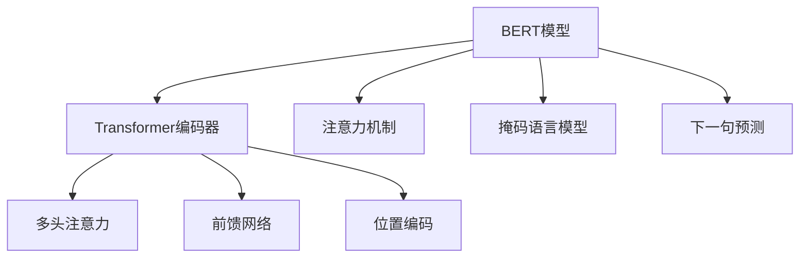

好的,我会严格遵守您提出的约束条件,以专业的技术语言撰写这篇文章。下面是正文部分:

# Transformer架构原理详解：BERT 基于Transformer编码器的双向语言模型

## 1. 背景介绍

### 1.1 问题的由来

在自然语言处理(NLP)领域,语言模型一直是核心的基础模块之一。传统的语言模型通常基于n-gram统计方法或神经网络,用于捕捉语言的局部规律,但在处理长距离依赖关系时存在困难。此外,大多数语言模型都是单向的,即在生成句子时只考虑了上文信息,而忽略了下文的信息。

随着深度学习技术的不断发展,Transformer模型应运而生,它利用Self-Attention机制有效捕获长距离依赖关系,大大提高了语言模型的性能。2018年,谷歌的AI研究人员在Transformer的基础上提出了BERT(Bidirectional Encoder Representations from Transformers)模型,这是第一个真正意义上的双向语言表示模型,可同时利用上下文信息,取得了突破性进展。

### 1.2 研究现状  

BERT模型在推出后立即引起了学术界和工业界的广泛关注。无数研究人员在BERT的基础上进行了改进和扩展,诞生了一系列优秀的预训练语言模型,如XLNet、RoBERTa、ALBERT等。这些模型在自然语言理解、机器翻译、对话系统等多个领域取得了领先的表现。

与此同时,BERT模型也受到了一些批评和质疑,如模型庞大导致推理效率低下、对长文本建模能力有限、缺乏解释性等。研究人员正在努力解决这些问题,以期获得更加高效、通用和可解释的语言模型。

### 1.3 研究意义

深入理解BERT模型的核心架构和原理,对于设计和改进未来的语言模型至关重要。BERT模型将注意力机制与Transformer编码器相结合,提出了全新的双向语言表示方法,这种创新思路值得我们仔细研究和借鉴。

本文将全面解析BERT模型的理论基础、核心算法、数学原理、代码实现等,旨在帮助读者透彻理解这一里程碑式的模型,并为未来的语言模型研究提供有价值的参考。

### 1.4 本文结构

本文首先介绍BERT模型的核心概念和基本原理,包括Transformer编码器、注意力机制、掩码语言模型等。接下来详细阐述BERT模型的数学表达和训练目标函数,并给出具体的算法步骤。

然后,我们将通过开源代码实战,一步步实现BERT模型的训练和微调过程,讲解关键代码细节。最后,总结BERT模型在自然语言处理领域的应用现状,并展望其未来的发展方向和挑战。

## 2. 核心概念与联系

BERT模型的核心思想是"预训练-微调"范式。它首先在大规模无标注语料上进行自监督训练,学习通用的语言表示;然后将预训练的模型参数迁移到下游的自然语言任务上,只需在特定数据上进行少量微调,即可取得优异的性能表现。

BERT模型的基础架构源于Transformer,全称是"Transformer Encoder Representations from Bidirectional Transformers"。它包含以下几个关键组成部分:

1. **Transformer编码器(Encoder)**: 用于捕获输入序列的上下文信息,生成对应的序列表示。
2. **Multi-Head Self-Attention**: 注意力机制的核心,能够有效建模长距离依赖关系。
3. **前馈神经网络(Feed-Forward NN)**: 对每个位置的表示进行非线性变换,增强表达能力。
4. **位置编码(Positional Encoding)**: 因为Self-Attention无法直接获取序列的位置信息,需要显式地编码位置信息。
5. **掩码语言模型(Masked LM)**: 通过随机遮挡部分输入Token,并以此作为监督信号,学习双向语言表示。
6. **下一句预测(Next Sentence Prediction)**: 判断两个句子是否相邻,用于学习跨句表示。

上述组件有机结合,构成了BERT的核心架构。在训练过程中,BERT模型会在海量语料上最大化掩码语言模型和下一句预测两个目标函数,获得通用的语义表示。而在应用时,只需将BERT模型的参数迁移到下游任务,并在特定数据上进行少量微调,即可完成知识迁移并取得优异表现。

BERT模型的创新之处在于首次将Transformer编码器应用于语言表示学习,并提出了掩码语言模型的训练目标,实现了真正意义上的双向语言建模。这一思路为后续的预训练语言模型奠定了基础。

## 3. 核心算法原理 & 具体操作步骤

### 3.1 算法原理概述

BERT算法的核心思想是利用Transformer编码器结构和掩码语言模型的训练目标,学习通用的双向语言表示。具体来说:

1. 将输入序列按一定比例随机遮挡部分Token,作为"遮挡词"。
2. 利用Transformer编码器的Self-Attention机制,从上下文中捕获遮挡词的信息。
3. 对遮挡词的词汇进行预测,并将预测值与原词汇进行交叉熵损失计算。
4. 最小化遮挡词的预测损失,从而学习到融合了上下文信息的双向语言表示。

此外,BERT还引入了"下一句预测"的辅助训练目标,用于捕获跨句语义关系。在训练时,BERT会以一定概率将两个相邻句子进行连接,或将两个无关句子拼接,然后预测它们是否为连续句子。

通过掩码语言模型和下一句预测两个训练目标的共同作用,BERT模型能够在大规模无标注语料上学习到丰富的语义和句法知识,获得通用的语言表示能力。

### 3.2 算法步骤详解

BERT的训练算法可以分为以下几个主要步骤:

**输入处理**:
1) 将输入序列按WordPiece算法切分为Token序列
2) 在序列头部添加特殊Token [CLS]作为句子表示
3) 在序列尾部添加特殊Token [SEP]作为分隔符
4) 对部分Token按概率随机进行遮挡,替换为特殊Token [MASK]
5) 为每个Token添加位置编码和Segment编码

**Transformer编码器**:
6) 将处理后的输入序列输入到Transformer编码器
7) 利用Multi-Head Self-Attention机制捕获序列的上下文信息
8) 通过前馈神经网络对每个Token的表示进行非线性变换
9) 重复7-8步骤,获得最终的序列表示

**掩码语言模型**:
10) 对含有[MASK]Token的位置,使用其输出表示与词汇表计算点积得分
11) 使用交叉熵损失函数,最小化[MASK]Token的预测误差

**下一句预测**:
12) 使用[CLS]Token的输出表示,通过分类器预测两个句子是否相邻
13) 使用交叉熵损失函数,最小化句子关系的预测误差  

**模型优化**:
14) 将掩码语言模型和下一句预测的损失函数加权求和
15) 使用Adam优化器对模型参数进行更新

重复以上步骤,直至模型在开发集上的指标不再提升为止,即可得到在大规模语料上预训练好的BERT模型。

### 3.3 算法优缺点

**优点**:

1. 双向建模:BERT是第一个真正意义上的双向语言表示模型,能够同时利用上下文信息。
2. 长距离依赖:Transformer中的Self-Attention机制能够有效捕获长距离依赖关系。
3. 通用语义表示:在大规模无标注语料上预训练,获得通用的语义和句法知识。
4. 迁移能力强:只需少量微调即可迁移到下游任务,取得优异表现。

**缺点**:

1. 模型庞大:BERT的参数量高达数亿,推理效率较低,不利于部署。
2. 序列长度受限:由于Self-Attention的内存消耗高,输入序列长度受到限制。
3. 缺乏解释性:注意力机制的"黑盒"性质使得BERT缺乏可解释性。
4. 训练成本高:需要大量算力和GPU资源进行预训练。

### 3.4 算法应用领域

由于BERT模型在自然语言理解和生成任务上表现卓越,因此被广泛应用于多个领域:

1. **文本分类**: 新闻分类、情感分析、垃圾邮件检测等。
2. **序列标注**: 命名实体识别、关系抽取、事件检测等。
3. **问答系统**: 机器阅读理解、开放域问答等。
4. **文本摘要**: 自动生成文本摘要。
5. **机器翻译**: 利用BERT的多语言版本提升翻译质量。
6. **对话系统**: 用于对话意图识别、语义理解等。
7. **其他领域**: 如代码理解、蛋白质结构预测等。

## 4. 数学模型和公式 & 详细讲解 & 举例说明

### 4.1 数学模型构建

BERT模型的核心是基于Transformer编码器结构,引入了掩码语言模型和下一句预测两个训练目标。我们将从以下几个方面构建BERT的数学模型:

**输入表示**:

给定一个Token序列 $X = (x_1, x_2, ..., x_n)$, 我们首先将其映射为词嵌入序列:

$$\mathbf{X} = (\mathbf{x}_1, \mathbf{x}_2, ..., \mathbf{x}_n)$$

其中 $\mathbf{x}_i \in \mathbb{R}^{d_{model}}$ 是第i个Token的词嵌入向量。

然后,我们为每个Token添加位置编码和Segment编码:

$$\tilde{\mathbf{X}} = \mathbf{X} + \mathbf{P} + \mathbf{S}$$

其中 $\mathbf{P} \in \mathbb{R}^{n \times d_{model}}$ 是位置编码矩阵, $\mathbf{S} \in \mathbb{R}^{n \times d_{model}}$ 是Segment编码矩阵。

**Transformer编码器**:

BERT使用了标准的Transformer编码器结构,包含多层Multi-Head Self-Attention和前馈神经网络:

$$\begin{aligned}
\mathbf{Z}^0 &= \tilde{\mathbf{X}} \\
\mathbf{Z}^l &= \text{Transformer-Block}(\mathbf{Z}^{l-1}), \quad l=1,...,L
\end{aligned}$$

其中 $\mathbf{Z}^l \in \mathbb{R}^{n \times d_{model}}$ 是第l层的输出表示, $L$ 是Transformer编码器的层数。

**掩码语言模型**:

对于遮挡的Token位置 $\mathcal{M} \subseteq \{1, 2, ..., n\}$, BERT需要基于上下文预测它们的词汇。我们定义掩码语言模型的损失函数为:

$$\mathcal{L}_{MLM} = -\sum_{i \in \mathcal{M}} \log P(x_i | \mathbf{z}_i^L, \theta)$$

其中 $\theta$ 是模型参数, $\mathbf{z}_i^L$ 是第i个Token在最终层的表示向量。$P(x_i | \mathbf{z}_i^L, \theta)$ 是基于 $\mathbf{z}_i^L$ 预测词汇 $x_i$ 的条件概率分布,通常使用词汇表上的Softmax运算计算。

**下一句预测**:

BERT还需要预测两个句子是否相邻。我们定义下一句预测的二分类损失函数为:

$$\mathcal{L}_{NSP} = -\log P(y | \mathbf{c}^L, \phi)$$

其中 $y \in \{0, 1\}$ 表示