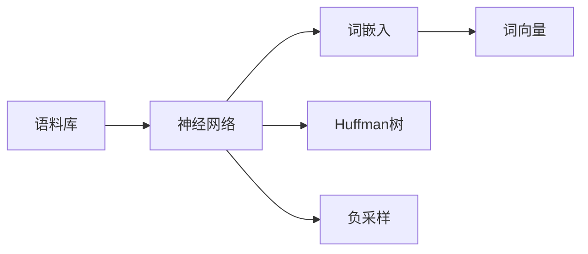

# Word2Vec：CBOW模型和Skip-Gram模型

关键词：Word2Vec，CBOW模型，Skip-Gram模型，词嵌入，自然语言处理，神经网络

## 1. 背景介绍

### 1.1 问题的由来

在自然语言处理（NLP）领域，如何有效地表示词语一直是一个核心问题。传统的词表示方法如one-hot编码，存在维度灾难和无法刻画词语间关系的缺陷。为解决这些问题，Mikolov等人于2013年提出了Word2Vec模型，开创了词嵌入（Word Embedding）技术的新纪元。

### 1.2 研究现状

Word2Vec模型自提出以来，迅速成为NLP领域的研究热点。众多研究者在此基础上进行了改进和扩展，如GloVe、FastText等。同时，Word2Vec也被广泛应用于各类NLP任务，如文本分类、情感分析、机器翻译等，并取得了显著效果。

### 1.3 研究意义

Word2Vec模型的意义在于：

1. 解决了传统词表示方法的缺陷，用低维稠密向量表示词语，克服了维度灾难问题。
2. 词向量蕴含了丰富的语义信息，词语间的语义相似性可通过向量间距离计算。
3. 为深度学习模型处理文本数据提供了更优质的输入，提升了模型性能。
4. 为词语关系的研究和挖掘提供了新的思路和工具。

### 1.4 本文结构

本文将重点介绍Word2Vec的两个核心模型：CBOW（Continuous Bag-of-Words）模型和Skip-Gram模型。内容安排如下：

- 第2部分介绍Word2Vec涉及的核心概念及其联系。
- 第3部分详细阐述CBOW和Skip-Gram模型的算法原理及操作步骤。
- 第4部分建立数学模型并推导相关公式，并通过案例进行讲解。
- 第5部分给出CBOW和Skip-Gram模型的代码实现，并解释关键代码。
- 第6部分探讨Word2Vec模型的实际应用场景及未来应用展望。
- 第7部分推荐Word2Vec相关的学习资源、开发工具和文献。
- 第8部分总结全文，分析Word2Vec的发展趋势、面临的挑战及未来研究方向。
- 第9部分列举Word2Vec的常见问题，并给出解答。

## 2. 核心概念与联系

Word2Vec模型涉及的核心概念包括：

- 词向量（Word Vector）：用一个固定维度的实数向量表示词语。词向量捕捉了词语的语义信息，语义相近的词语对应的向量在空间中更接近。

- 词嵌入（Word Embedding）：将词语映射为词向量的过程。通过词嵌入，可将所有词语嵌入到一个低维连续空间中。

- 语料库（Corpus）：训练词向量的大规模文本数据集。语料库的质量和规模直接影响词向量的质量。

- 神经网络（Neural Network）：Word2Vec模型本质上是一个浅层神经网络。网络结构因CBOW和Skip-Gram而异。

- Huffman树（Huffman Tree）：一种用于加速训练的二叉树结构。通过Huffman编码可将复杂度由$O(N)$降至$O(logN)$。

- 负采样（Negative Sampling）：一种用于近似计算复杂目标函数的技巧。通过采样负样本可大幅提升训练速度。

这些概念间的联系可用下图表示：



## 3. 核心算法原理 & 具体操作步骤

### 3.1 算法原理概述

Word2Vec包含两个模型：CBOW和Skip-Gram。它们的核心思想是利用词语的上下文信息学习词语的分布式表示。两个模型的区别在于，CBOW根据上下文词语预测中心词，而Skip-Gram根据中心词预测上下文词语。

### 3.2 算法步骤详解

#### 3.2.1 CBOW模型

给定上下文词语$w_{i-2},w_{i-1},w_{i+1},w_{i+2}$，CBOW模型的目标是最大化如下条件概率：

$$P(w_i|w_{i-2},w_{i-1},w_{i+1},w_{i+2})$$

其步骤为：

1. 生成词汇表，统计各词频，并用哈希表存储。
2. 将上下文词语通过词嵌入矩阵映射为词向量。
3. 将上下文词向量取平均，得到上下文特征。
4. 上下文特征经隐藏层和Softmax输出层，生成中心词的概率分布。
5. 通过梯度下降法更新词嵌入矩阵，不断重复步骤2-5直至收敛。


#### 3.2.2 Skip-Gram模型

给定中心词语$w_i$，Skip-Gram模型的目标是最大化如下条件概率：

$$P(w_{i-2},w_{i-1},w_{i+1},w_{i+2}|w_i)$$

其步骤为：

1. 生成词汇表，统计各词频，并用哈希表存储。
2. 将中心词语通过词嵌入矩阵映射为词向量。
3. 中心词向量经隐藏层，生成每个上下文词语的概率分布。
4. 通过梯度下降法更新词嵌入矩阵，不断重复步骤2-4直至收敛。


### 3.3 算法优缺点

CBOW和Skip-Gram模型的优点有：

1. 相比传统词表示方法，大幅降低了维度，提高了计算效率。
2. 词向量蕴含了丰富的语义信息，可刻画词语间的语义相似性。
3. 为NLP下游任务提供了高质量的词语表示。

它们的缺点包括：

1. 需要大规模语料进行训练，对计算资源要求较高。
2. 对低频词和未登录词的表示效果欠佳。
3. 难以表示词语的多义性，一词多义的现象较为普遍。

### 3.4 算法应用领域

Word2Vec在NLP领域有广泛应用，主要包括：

1. 文本分类：将词向量作为输入，可提升分类模型的性能。
2. 情感分析：用词向量表示词语，可更好地捕捉情感倾向。
3. 命名实体识别：将词向量作为模型输入，可提高识别准确率。
4. 机器翻译：用词向量初始化编码器和解码器，可提升翻译质量。
5. 问答系统：通过词向量计算问题和候选答案的相似度。

## 4. 数学模型和公式 & 详细讲解 & 举例说明

### 4.1 数学模型构建

#### 4.1.1 CBOW模型

假设词汇表大小为$V$，词向量维度为$N$。定义词嵌入矩阵为$W \in R^{V \times N}$，上下文词语$w_{i-2},w_{i-1},w_{i+1},w_{i+2}$的词向量为$v_{i-2},v_{i-1},v_{i+1},v_{i+2} \in R^N$，中心词$w_i$的词向量为$u_i \in R^N$。CBOW模型的目标函数为：

$$J_{CBOW} = -\log P(w_i|w_{i-2},w_{i-1},w_{i+1},w_{i+2})$$

其中，$P(w_i|w_{i-2},w_{i-1},w_{i+1},w_{i+2})$的计算公式为：

$$P(w_i|w_{i-2},w_{i-1},w_{i+1},w_{i+2}) = \frac{\exp(u_i^T \cdot \hat v)}{\sum_{j=1}^V \exp(u_j^T \cdot \hat v)}$$

其中，$\hat v$为上下文词向量的平均值：

$$\hat v = \frac{v_{i-2}+v_{i-1}+v_{i+1}+v_{i+2}}{4}$$

#### 4.1.2 Skip-Gram模型

Skip-Gram模型的目标函数为：

$$J_{Skip-Gram} = -\log P(w_{i-2},w_{i-1},w_{i+1},w_{i+2}|w_i)$$

假设上下文词语是相互独立的，则有：

$$P(w_{i-2},w_{i-1},w_{i+1},w_{i+2}|w_i) = \prod_{j \in \{i-2,i-1,i+1,i+2\}} P(w_j|w_i)$$

其中，$P(w_j|w_i)$的计算公式为：

$$P(w_j|w_i) = \frac{\exp(u_j^T \cdot v_i)}{\sum_{k=1}^V \exp(u_k^T \cdot v_i)}$$

### 4.2 公式推导过程

以CBOW模型为例，对目标函数$J_{CBOW}$求导，可得词向量$u_i$和$v_j$的梯度：

$$\frac{\partial J_{CBOW}}{\partial u_i} = (\sigma(u_i^T \cdot \hat v) - 1) \cdot \hat v$$

$$\frac{\partial J_{CBOW}}{\partial v_j} = \frac{1}{4} \cdot (\sigma(u_i^T \cdot \hat v) - 1) \cdot u_i, j \in \{i-2,i-1,i+1,i+2\}$$

其中，$\sigma(x)$为Sigmoid函数：

$$\sigma(x) = \frac{1}{1+\exp(-x)}$$

Skip-Gram模型的推导过程与之类似，不再赘述。

### 4.3 案例分析与讲解

以句子"The quick brown fox jumps over the lazy dog"为例，展示CBOW模型的训练过程。

假设上下文窗口大小为2，即预测单词"fox"时，上下文词语为"quick"、"brown"、"jumps"、"over"。

首先，将上下文词语映射为词向量，并取平均：

$$\hat v = \frac{v_{quick}+v_{brown}+v_{jumps}+v_{over}}{4}$$

然后，计算单词"fox"的条件概率：

$$P(fox|quick,brown,jumps,over) = \frac{\exp(u_{fox}^T \cdot \hat v)}{\sum_{j=1}^V \exp(u_j^T \cdot \hat v)}$$

最后，通过梯度下降法更新词向量$u_{fox}$和$v_{quick},v_{brown},v_{jumps},v_{over}$，不断重复以上步骤直至收敛。

### 4.4 常见问题解答

Q1: CBOW和Skip-Gram模型的区别是什么？
A1: 两者的区别在于预测的方向不同。CBOW根据上下文词语预测中心词，Skip-Gram根据中心词预测上下文词语。

Q2: 词向量的维度如何选择？
A2: 词向量的维度是一个超参数，需要根据任务和数据集进行调整。一般来说，维度越高，表示能力越强，但也更容易过拟合。常见的取值范围为50-300。

Q3: 哪些因素会影响词向量的质量？
A3: 主要有以下几个因素：
- 语料库的质量和规模。高质量、大规模的语料有助于学习更准确的词向量。
- 词向量的维度。维度过小会丢失信息，过大则易过拟合。
- 上下文窗口的大小。窗口过小会损失长距离依赖，过大则引入噪声。
- 训练算法的超参数，如学习率、迭代次数等。

## 5. 项目实践：代码实例和详细解释说明

本节将给出CBOW和Skip-Gram模型的Python实现，并对关键代码进行解释。

### 5.1 开发环境搭建

- Python 3.6+
- NumPy
- Matplotlib

可通过以下命令安装依赖库：

```bash
pip install numpy matplotlib
```

### 5.2 源代码详细实现

#### 5.2.1 CBOW模型

```python
import