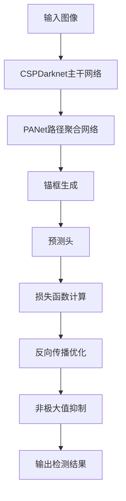

# YOLOv5原理与代码实例讲解

## 1. 背景介绍

### 1.1 问题的由来

在计算机视觉领域中，目标检测是一项非常重要和具有挑战性的任务。它旨在从图像或视频中定位并识别感兴趣的对象。传统的目标检测方法通常基于滑动窗口和手工设计的特征,效率低下且精度有限。近年来,随着深度学习技术的快速发展,基于深度卷积神经网络(CNN)的目标检测算法取得了巨大的进展,在精度和速度方面都有了显著的提升。

### 1.2 研究现状

目前,主流的基于深度学习的目标检测算法可分为两大类:两阶段检测器(Two-Stage Detectors)和单阶段检测器(One-Stage Detectors)。两阶段检测器如R-CNN系列算法(R-CNN、Fast R-CNN、Faster R-CNN等)首先生成候选区域proposals,然后对这些候选区域进行分类和精细化。这种方法精度较高,但速度较慢。单阶段检测器如YOLO(You Only Look Once)、SSD(Single Shot MultiBox Detector)等则直接在输入图像上进行端到端的目标检测,速度更快但精度略低于两阶段检测器。

### 1.3 研究意义

YOLO系列算法作为单阶段检测器的代表,以其高效和实时性而备受关注。尽管早期版本的YOLO在精度上略逊色于两阶段检测器,但最新的YOLOv5算法通过一系列改进,在保持高效的同时,精度已经接近乃至超过了Faster R-CNN等算法。本文将重点介绍YOLOv5的原理、实现细节以及代码解析,希望能为读者提供深入理解该算法的途径。

### 1.4 本文结构

本文首先介绍YOLOv5的核心概念和基本原理,包括网络架构、损失函数等。然后详细阐述算法的数学模型及公式推导过程。接下来通过代码实例和应用场景说明,帮助读者更好地掌握该算法。最后,探讨YOLOv5的未来发展趋势和面临的挑战。

## 2. 核心概念与联系

YOLOv5是YOLO系列算法的最新版本,它是一种基于单阶段的端到端目标检测器。与传统的基于滑动窗口或候选区域的方法不同,YOLOv5将整个图像划分为SxS个网格,每个网格单元直接预测该区域内的目标边界框(bounding box)和置信度(confidence)。这种方法虽然简单高效,但由于网格的存在,对于较小目标的检测效果会受到一定影响。

为了解决这个问题,YOLOv5采用了一些创新技术,包括:

1. **CSPDarknet骨干网络**: 这是一种新型的主干网络,融合了DenseNet和ResNet的优点,具有更强的特征提取能力。

2. **PANet路径聚合**: 通过从不同层级的特征图中采样和融合信息,增强了对不同尺度目标的检测能力。

3. **自适应锚框(Anchor Boxes)**: 根据训练数据自适应地生成先验锚框,提高了对不同形状目标的检测效果。

4. **焦点损失(Focal Loss)**: 一种改进的损失函数,旨在解决训练过程中正负样本不平衡的问题。

5. **模型压缩和加速**: 采用如深度可分离卷积、模型剪枝等技术,在保持精度的同时减小模型大小,提高推理速度。

总的来说,YOLOv5在保持YOLO系列算法简单高效的同时,通过一系列创新,显著提升了检测精度和鲁棒性,成为目前公认的最佳实时目标检测算法之一。

## 3. 核心算法原理与具体操作步骤

### 3.1 算法原理概述

YOLOv5的核心思想是将目标检测任务转化为一个回归问题。具体来说,网络将输入图像划分为SxS个网格单元,每个网格单元负责预测该区域内的目标边界框和置信度。如果一个目标的中心落在某个网格单元内,那么该网格单元就负责预测该目标。每个网格单元会产生N个边界框预测,其中N是预设的锚框数量。

对于每个预测的边界框,网络会同时输出以下几个向量:

- 边界框坐标 $(t_x, t_y, t_w, t_h)$: 相对于网格单元左上角的偏移量
- 目标置信度 $\text{conf}$: 该边界框包含目标的置信度得分
- 条件类别概率 $p(c_i|obj)$: 假设该边界框包含目标,则该目标属于第i类的概率

在训练阶段,网络会根据预测值和真实值之间的差异,计算一个加权损失函数,并通过反向传播算法不断调整网络参数,使得损失函数值最小化。

在推理阶段,对于每个网格单元的N个预测边界框,会根据置信度得分和类别概率对它们进行排序和筛选,并使用非极大值抑制(NMS)算法去除重复的检测框,最终输出检测结果。

### 3.2 算法步骤详解

YOLOv5算法的具体步骤如下:

1. **网络架构**

   YOLOv5采用了一种新型的CSPDarknet主干网络,由一个Stem模块、几个CSPDarknet模块和一个SPP模块组成。这种架构融合了DenseNet和ResNet的优点,具有更强的特征提取能力。

2. **特征金字塔**

   在主干网络的最后一个CSPDarknet模块之后,YOLOv5使用了PANet路径聚合网络(Path Aggregation Network)。它从不同层级的特征图中采样和融合信息,形成一个特征金字塔,增强了对不同尺度目标的检测能力。

3. **锚框生成**

   YOLOv5会根据训练数据自适应地生成先验锚框(Anchor Boxes),而不是使用手工设计的锚框。这种方法能够更好地捕捉不同形状和比例的目标。

4. **预测头**

   在特征金字塔的每一层,YOLOv5都会预测一组边界框、置信度和类别概率。这些预测值会被编码为一个张量,作为网络的输出。

5. **损失函数**

   YOLOv5使用了一种改进的焦点损失函数(Focal Loss),旨在解决训练过程中正负样本不平衡的问题。该损失函数对于难以分类的样本给予更高的权重,从而使网络更加关注这些困难样本。

6. **非极大值抑制**

   在推理阶段,对于每个网格单元的N个预测边界框,YOLOv5会根据置信度得分和类别概率对它们进行排序和筛选。然后使用非极大值抑制(NMS)算法去除重复的检测框,最终输出检测结果。

7. **模型压缩和加速**

   为了提高推理速度,YOLOv5采用了一些模型压缩和加速技术,如深度可分离卷积、模型剪枝等。这些技术在保持精度的同时,显著减小了模型的大小和计算量。

下面是YOLOv5算法的流程图:

### 3.3 算法优缺点

**优点:**

1. **高效实时**: 作为单阶段检测器,YOLOv5具有很高的推理速度,能够实现实时目标检测。

2. **端到端训练**: YOLOv5采用端到端的训练方式,无需复杂的后处理步骤,训练和部署都非常简单。

3. **精度较高**: 通过一系列创新技术,YOLOv5在保持高效的同时,检测精度已经接近乃至超过了两阶段检测器。

4. **鲁棒性强**: YOLOv5能够较好地检测不同尺度、形状和姿态的目标,具有较强的鲁棒性。

**缺点:**

1. **对小目标检测效果一般**: 由于网格划分的存在,YOLOv5对于较小目标的检测效果仍有待提高。

2. **需要大量GPU资源**: 训练YOLOv5模型需要消耗大量的GPU计算资源,对硬件要求较高。

3. **对遮挡目标检测效果差**: 当目标被严重遮挡时,YOLOv5的检测效果会显著下降。

4. **对密集目标群检测效果差**: 在目标密集分布的场景中,YOLOv5的检测精度会受到一定影响。

### 3.4 算法应用领域

由于YOLOv5具有高效实时和较高精度的特点,它在以下领域有着广泛的应用:

1. **安防监控**: 用于实时监测和检测可疑目标、人员或车辆。

2. **智能交通**: 应用于交通场景的车辆检测、行人检测和交通标志识别等。

3. **机器人视觉**: 用于机器人的目标检测和跟踪,实现智能导航和操作。

4. **无人机/自动驾驶**: 用于无人机/自动驾驶汽车的实时目标检测和避障。

5. **人脸检测**: 用于人脸检测和识别,应用于安防、考勤等场景。

6. **工业缺陷检测**: 用于产品质量检测,检测产品表面的缺陷和异常。

7. **医疗影像分析**: 用于医学图像中病灶、肿瘤等目标的检测和定位。

8. **农业智能化**: 用于农作物病虫害检测、果蔬分拣等农业领域的应用。

总的来说,YOLOv5作为一种高效实时的目标检测算法,在各种需要实时视觉处理的场景下都有着广泛的应用前景。

## 4. 数学模型和公式详细讲解与举例说明

### 4.1 数学模型构建

YOLOv5的数学模型主要包括以下几个部分:

1. **边界框编码**

   对于每个预测的边界框,YOLOv5会输出其相对于所在网格单元左上角的偏移量$(t_x, t_y, t_w, t_h)$,其中$t_x$和$t_y$表示边界框中心相对于网格单元左上角的偏移量,而$t_w$和$t_h$表示边界框的宽度和高度。具体计算公式如下:

   $$
   \begin{aligned}
   t_x &= \frac{(x - x_c)}{w_a} \\
   t_y &= \frac{(y - y_c)}{h_a} \\
   t_w &= \log\left(\frac{w}{w_a}\right) \\
   t_h &= \log\left(\frac{h}{h_a}\right)
   \end{aligned}
   $$

   其中$(x, y)$是边界框中心的绝对坐标,$(w, h)$是边界框的宽度和高度。$(x_c, y_c)$是所在网格单元的左上角坐标,$(w_a, h_a)$是对应锚框的宽度和高度。

2. **目标置信度**

   对于每个预测的边界框,YOLOv5会输出一个目标置信度得分$\text{conf}$,表示该边界框包含目标的置信程度。它是通过预测的边界框与真实边界框之间的交并比(IoU)计算得到的,公式如下:

   $$
   \text{conf} = \text{IoU}_\text{pred}^\text{truth} \times \text{Obj}_\text{mask}
   $$

   其中$\text{Obj}_\text{mask}$是一个掩码,用于区分包含目标和不包含目标的情况。如果该网格单元内存在目标,则$\text{Obj}_\text{mask} = 1$,否则为0。

3. **类别概率**

   对于每个预测的边界框,YOLOv5还会输出一个条件类别概率向量$p(c_i|\text{obj})$,表示假设该边界框包含目标,则该目标属于第i类的概率。这个向量的维度