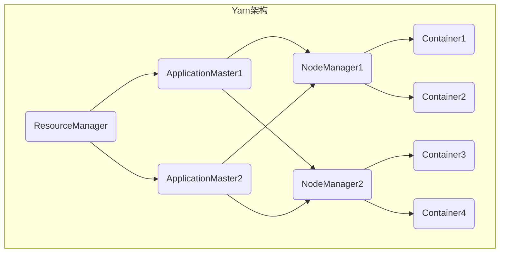

好的,我会按照您提供的要求和模板,以专业的技术语言写一篇关于Yarn资源管理和任务调度原理与代码实例讲解的深度技术博客文章。

# Yarn资源管理和任务调度原理与代码实例讲解

## 1. 背景介绍

### 1.1 问题的由来

随着大数据时代的到来,海量的数据需要被高效处理和分析。传统的单机系统已经无法满足日益增长的计算需求,因此分布式计算框架应运而生。Apache Hadoop作为开源的分布式系统,能够在廉价的硬件集群上可靠地存储和处理大规模数据集,成为大数据处理的主流解决方案之一。

然而,Hadoop 1.x版本中的MapReduce计算框架存在一些缺陷,例如:

1. **资源利用率低**:每个作业独占一组固定的节点资源,导致资源利用率低下。
2. **局部性差**:作业任务调度时无法考虑数据位置,导致大量的数据传输开销。
3. **资源管理粗糙**:对CPU、内存等资源的管理粗糙,无法精细化调度。

为了解决这些问题,Apache Hadoop 2.x版本引入了全新的资源管理和任务调度框架Yarn(Yet Another Resource Negotiator),从而大幅提高了集群资源利用率和任务执行效率。

### 1.2 研究现状

Yarn作为Hadoop 2.x版本的核心组件,在学术界和工业界都得到了广泛的研究和应用。目前,Yarn已经成为大数据生态系统中事实上的资源管理和任务调度标准,被广泛应用于Spark、Flink、Hive、HBase等众多大数据组件中。

研究人员从多个角度对Yarn进行了深入研究,主要包括:

- **资源管理策略**:基于公平、容量、优先级等多种调度策略的研究。
- **任务调度算法**:最大化数据局部性、最小化任务延迟等调度算法优化。
- **系统扩展性**:提高Yarn在异构环境、云环境等场景下的扩展能力。
- **安全性和隔离性**:增强Yarn在多租户环境下的安全性和资源隔离能力。

此外,一些公司和开源社区也在持续推动Yarn的发展,例如Hadoop官方社区、Cloudera、Hortonworks等。

### 1.3 研究意义

深入理解Yarn资源管理和任务调度原理,对于构建高效、可扩展的大数据处理平台至关重要。研究Yarn的意义主要包括:

1. **提高集群资源利用率**:优化资源分配和任务调度策略,最大化利用集群资源。
2. **降低任务执行延迟**:通过数据局部性等优化,减少不必要的数据传输开销。  
3. **支持多种计算框架**:Yarn为多种计算框架提供统一的资源管理和调度能力。
4. **实现多租户资源隔离**:增强Yarn在多用户、多应用场景下的安全性和隔离性。
5. **提高系统扩展能力**:使Yarn能够高效运行在异构环境、云环境等多种部署场景。

通过对Yarn进行深入研究,不仅可以提升大数据处理的效率和可靠性,也为未来构建智能化资源管理和调度系统奠定基础。

### 1.4 本文结构  

本文将全面介绍Yarn资源管理和任务调度的核心原理,并结合代码实例进行详细讲解,主要内容包括:

1. Yarn核心概念及其关系
2. 资源管理和任务调度的核心算法原理
3. 相关数学模型及公式推导过程  
4. 基于Yarn的实践项目代码实例讲解
5. Yarn在实际应用场景中的运用
6. Yarn相关工具和学习资源推荐
7. Yarn的发展趋势、面临的挑战及未来展望

## 2. 核心概念与联系

在深入探讨Yarn的原理之前,我们需要先了解一些核心概念及其内在联系。Yarn的设计理念是将资源管理和任务监控调度相互分离,从而更好地共享和利用集群资源。Yarn的核心组件包括:ResourceManager、ApplicationMaster、NodeManager和Container等。

1. **ResourceManager(RM)**:整个Yarn集群的资源管理者和调度器,负责资源分配和任务调度决策。
2. **NodeManager(NM)**:运行在每个节点上的资源和任务监控代理,负责容器的生命周期管理。
3. **ApplicationMaster(AM)**:每个应用程序的"大脑",负责向RM申请资源并与NM协调任务执行。  
4. **Container**:资源抽象的基本单位,封装了CPU、内存等多维度资源,任务实际运行在容器中。

RM作为全局资源管理者,接收来自AM的资源请求,并根据现有资源情况和调度策略进行分配。AM则管理应用的执行过程,与NM协调任务在容器中的运行。NM负责容器生命周期管理,并将容器使用情况汇报给RM,以供进一步调度决策。

通过将资源管理和任务监控分离,Yarn不仅提高了资源利用率,也增强了系统的扩展性和容错能力。接下来我们将深入探讨Yarn资源管理和任务调度的核心算法原理。

## 3. 核心算法原理与具体操作步骤

### 3.1 算法原理概述

Yarn的资源管理和任务调度算法主要包括:资源管理器调度器、容量调度器、公平调度器和延迟调度器等。这些调度器基于不同的策略来分配资源和调度任务,以满足不同场景下的需求。

1. **资源管理器调度器(RM Scheduler)**

   资源管理器调度器是Yarn的默认调度器,它根据FIFO(先进先出)策略对应用程序进行资源分配。当有新的资源请求到来时,调度器会按照请求顺序依次分配资源。这种策略简单直观,但无法满足更复杂的调度需求。

2. **容量调度器(Capacity Scheduler)**

   容量调度器引入了队列的概念,将集群资源根据配置划分为多个队列。每个队列被分配一定的资源容量,用户可以将应用程序提交到不同的队列中运行。容量调度器支持多种策略,如FIFO、fair等,并提供了资源预留和弹性资源共享等高级功能。

3. **公平调度器(Fair Scheduler)** 

   公平调度器的目标是为所有运行的应用程序分配公平的资源份额。它会根据应用程序的资源需求动态调整资源分配,并支持资源加权、资源预留等功能,以确保资源的合理分配。

4. **延迟调度器(Delay Scheduler)**

   延迟调度器旨在最大化任务的数据局部性,从而减少数据传输开销。它会延迟调度那些无法访问所需数据的任务,直到有足够的本地节点资源可用时再进行调度。这种策略可以显著降低任务执行延迟。

上述调度器均实现了Yarn的核心调度接口,用户可以根据实际需求进行选择和配置。接下来,我们将重点介绍容量调度器和公平调度器的核心算法原理。

### 3.2 算法步骤详解

#### 3.2.1 容量调度器算法

容量调度器的核心思想是将集群资源划分为多个队列,每个队列被分配一定的资源容量。当应用程序提交时,调度器会根据队列的资源使用情况和调度策略,决定将应用程序分配到哪个队列并分配相应的资源。

容量调度器算法的主要步骤如下:

1. **队列资源容量配置**

   管理员需要预先配置每个队列的资源容量,包括最大和最小资源限制。这些配置决定了队列可以使用的资源上限和保证的最小资源量。

2. **应用程序提交**

   当应用程序提交时,调度器会根据队列的资源使用情况和调度策略(如FIFO或fair),决定将应用程序分配到哪个队列。

3. **资源分配**

   调度器会遍历所有队列,按照队列的优先级顺序,依次为每个队列分配资源。对于每个队列,调度器会根据队列内部的调度策略(如FIFO或fair)为队列中的应用程序分配资源。

4. **资源回收与共享**

   如果某个队列未使用完分配的资源,这些空闲资源可以暂时共享给其他需要资源的队列使用,从而提高资源利用率。当原队列需要资源时,共享出去的资源会被回收。

5. **资源预留**

   容量调度器支持为特定队列或应用程序预留一定量的资源,以确保它们能够获得足够的资源运行。这对于运行关键任务或服务非常有用。

6. **队列优先级调整**

   管理员可以动态调整队列的优先级,以响应不同的资源需求变化。高优先级队列将获得更多的资源分配。

通过上述步骤,容量调度器可以实现基于队列的资源分配和共享,满足不同用户和应用程序的资源需求,提高整体资源利用率。

#### 3.2.2 公平调度器算法

公平调度器的目标是为所有运行的应用程序分配公平的资源份额,并根据应用程序的资源需求动态调整资源分配。公平调度器算法的主要步骤如下:

1. **资源池初始化**

   公平调度器维护一个资源池,包含集群中所有可用的资源。初始时,资源池中的所有资源都是可用的。

2. **应用程序提交**

   当应用程序提交时,调度器会为其创建一个资源池,并从全局资源池中分配一定的资源份额。

3. **资源分配**

   调度器会遍历所有应用程序的资源池,根据应用程序的资源需求和已分配的资源份额,计算每个应用程序应该获得的理想资源份额。如果应用程序的当前资源份额小于理想份额,则从全局资源池中分配更多资源给该应用程序。

4. **资源回收与共享**

   如果某个应用程序未使用完分配的资源,这些空闲资源会被回收到全局资源池中,供其他应用程序使用。

5. **资源加权**

   公平调度器支持为不同的应用程序或队列设置不同的资源权重,从而实现加权公平分配。高权重的应用程序或队列将获得更多的资源份额。

6. **资源预留**

   公平调度器也支持为特定应用程序或队列预留一定量的资源,以确保它们能够获得足够的资源运行。

7. **动态资源调整**

   公平调度器会持续监控应用程序的资源使用情况,并动态调整资源分配,以确保资源的公平分配和高效利用。

通过上述步骤,公平调度器可以根据应用程序的实际资源需求动态调整资源分配,实现资源的公平共享和高效利用。

### 3.3 算法优缺点

#### 容量调度器

**优点**:

- 支持多租户,可以根据队列对资源进行隔离和限制。
- 支持资源预留,确保关键应用程序获得足够资源。
- 支持hierarchical模式,允许队列嵌套以模拟组织架构。
- 支持资源共享,提高资源利用率。

**缺点**:

- 配置复杂,需要预先配置每个队列的资源限制。
- 资源利用不均衡,空闲资源无法自动重新分配给需求较大的队列。
- 无法根据应用程序的实际需求动态调整资源分配。

#### 公平调度器

**优点**:

- 资源分配公平,根据应用程序需求动态调整资源份额。
- 支持资源加权,可以