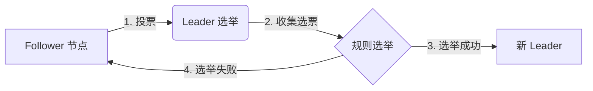
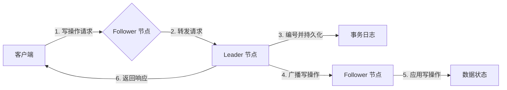
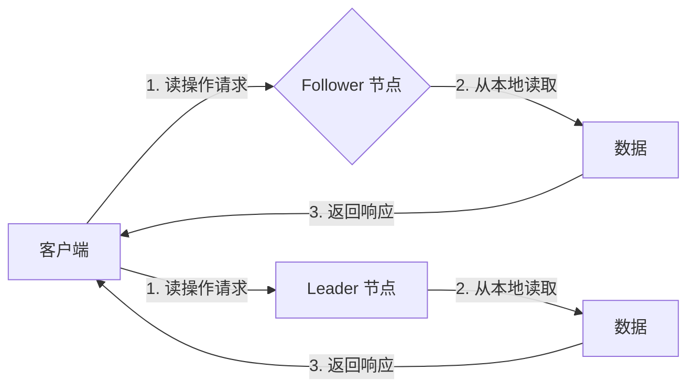
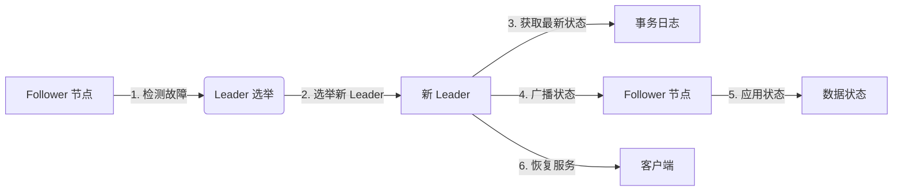

# Zookeeper原理与代码实例讲解

## 1. 背景介绍

### 1.1 问题的由来

在分布式系统中，协调分布在多个节点上的进程以实现同步数据访问是一个巨大的挑战。传统的客户端-服务器架构在可扩展性和高可用性方面存在局限性。随着分布式应用程序的日益复杂,需要一种可靠、高效的协调服务来管理分布式环境中的数据。

Apache ZooKeeper 应运而生,旨在解决分布式应用中数据管理的问题。它提供了一种高性能、高可用的分布式协调服务,使分布式进程能够可靠地协调彼此的操作和状态。

### 1.2 研究现状

ZooKeeper 已被广泛应用于各种分布式系统中,如 Apache Hadoop、Apache HBase、Apache Kafka 等。它为分布式应用提供了一种简单且高效的协调机制,使得开发人员能够专注于业务逻辑的实现,而不必过多关注分布式环境下的复杂性。

然而,ZooKeeper 的设计和实现涉及了许多复杂的概念和算法,如 Zab 原子广播协议、Paxos 算法、树形层次命名空间等。这些概念对于初学者来说可能难以理解,因此需要深入探讨 ZooKeeper 的原理和实现细节。

### 1.3 研究意义

深入理解 ZooKeeper 的原理和实现细节对于以下几个方面具有重要意义:

1. **分布式系统设计**: ZooKeeper 的设计思想和实现技术可以为构建其他分布式系统提供借鉴和指导。
2. **性能优化**: 了解 ZooKeeper 的内部工作原理有助于优化其性能,满足特定场景的需求。
3. **故障排查**: 掌握 ZooKeeper 的原理有助于快速定位和解决分布式环境下的问题。
4. **学习和研究**: ZooKeeper 涉及了分布式系统、并发控制、一致性协议等多个领域的知识,对于学习和研究这些领域具有重要意义。

### 1.4 本文结构

本文将从以下几个方面深入探讨 ZooKeeper 的原理和实现:

1. 核心概念与联系
2. 核心算法原理与具体操作步骤
3. 数学模型和公式详细讲解与举例说明
4. 项目实践:代码实例和详细解释说明
5. 实际应用场景
6. 工具和资源推荐
7. 总结:未来发展趋势与挑战
8. 附录:常见问题与解答

## 2. 核心概念与联系

在深入探讨 ZooKeeper 的原理和实现之前,我们需要先了解一些核心概念及它们之间的联系。

### 2.1 数据模型

ZooKeeper 使用一种树形层次的命名空间来组织数据,类似于文件系统中的目录结构。每个节点在命名空间中有一个唯一的路径,可以存储数据和元数据(如访问控制列表等)。

```mermaid
graph TD
    A[ZooKeeper 命名空间] --> B[/znode1]
    A --> C[/znode2]
    B --> D[/znode1/znode1_1]
    B --> E[/znode1/znode1_2]
    C --> F[/znode2/znode2_1]
```

### 2.2 会话

客户端需要先与 ZooKeeper 服务器建立会话,才能进行后续的操作。会话在一定时间内保持有效,如果会话超时,则所有相关的临时节点将被自动删除。

### 2.3 Watcher(事件监听器)

Watcher 是 ZooKeeper 的一个重要特性,它允许客户端在指定的 ZNode 上注册监听器,一旦该节点发生变化(数据变更、节点删除等),就会通知客户端。这种通知机制使得分布式系统能够及时响应数据变化。

### 2.4 版本

每个 ZNode 都有一个版本号,用于实现乐观锁机制。在更新数据时,客户端需要提供当前版本号,如果版本号不匹配,则更新操作将失败。这有助于检测并防止并发更新问题。

### 2.5 ACL(访问控制列表)

ZooKeeper 支持基于 ACL 的权限控制,可以为每个 ZNode 设置不同的权限,如读、写、创建子节点等。这确保了数据的安全性和访问控制。

### 2.6 ZAB 协议

ZAB(ZooKeeper Atomic Broadcast) 协议是 ZooKeeper 的核心,它是一种原子广播协议,用于在集群中保证数据的一致性和可靠性。ZAB 协议基于 Paxos 算法,但做了一些优化和简化。

### 2.7 Leader 和 Follower

在 ZooKeeper 集群中,有一个节点被选举为 Leader,负责处理所有写操作。其他节点称为 Follower,只负责处理读操作和将写操作请求转发给 Leader。当 Leader 节点出现故障时,Follower 节点将重新进行 Leader 选举。

## 3. 核心算法原理与具体操作步骤

### 3.1 算法原理概述

ZooKeeper 的核心算法是 ZAB(ZooKeeper Atomic Broadcast) 协议,它是一种原子广播协议,用于在集群中保证数据的一致性和可靠性。ZAB 协议基于 Paxos 算法,但做了一些优化和简化。

ZAB 协议的主要思想是:

1. 选举一个唯一的 Leader 节点,由它来接收并处理所有写操作请求。
2. 所有写操作请求都会被 Leader 节点按顺序编号(称为 Zxid),并以事务日志的形式持久化存储。
3. Leader 节点将编号后的写操作请求广播给所有 Follower 节点。
4. 当超过半数的 Follower 节点确认已经成功应用了该写操作,Leader 节点会向客户端返回成功响应。
5. 如果 Leader 节点出现故障,Follower 节点将重新进行 Leader 选举。

这种设计确保了所有写操作都是原子的、有序的,并且能够在节点故障时自动恢复。

### 3.2 算法步骤详解

下面我们将详细介绍 ZAB 协议的工作流程:

#### 3.2.1 Leader 选举

当 ZooKeeper 集群启动或者 Leader 节点出现故障时,集群中的 Follower 节点将进行 Leader 选举。Leader 选举过程如下:

1. 每个节点都会给自己投一张选票,选票包含了节点的 myid 和 Zxid(事务编号)。
2. 节点将自己的选票发送给集群中的其他节点。
3. 每个节点收集其他节点的选票,并根据一定规则选出最大的选票,将其对应的节点视为新的 Leader 节点。
4. 如果有过半节点选出了相同的 Leader 节点,则选举成功,否则继续进行新一轮选举。

Leader 选举规则如下:

1. 优先选择 Zxid 最大的节点作为 Leader。
2. 如果 Zxid 相同,则选择 myid 最大的节点作为 Leader。

这种规则确保了在任何情况下,都能选出一个唯一的 Leader 节点。



#### 3.2.2 写操作流程

当客户端发起一个写操作请求时,ZAB 协议的工作流程如下:

1. 客户端将写操作请求发送给任意一个 ZooKeeper 节点。
2. 如果该节点是 Follower 节点,则将请求转发给 Leader 节点。
3. Leader 节点对写操作请求进行编号(Zxid),并将其以事务日志的形式持久化存储。
4. Leader 节点将编号后的写操作请求广播给所有 Follower 节点。
5. 当超过半数的 Follower 节点确认已经成功应用了该写操作,Leader 节点会向客户端返回成功响应。



#### 3.2.3 读操作流程

当客户端发起一个读操作请求时,ZAB 协议的工作流程如下:

1. 客户端将读操作请求发送给任意一个 ZooKeeper 节点。
2. 如果该节点是 Follower 节点,则直接从本地数据库中读取数据并返回给客户端。
3. 如果该节点是 Leader 节点,则从本地数据库中读取数据并返回给客户端。

由于所有写操作都是通过 Leader 节点进行广播和复制的,因此 Follower 节点的数据与 Leader 节点是完全一致的。这种设计使得读操作可以在任意节点上执行,提高了读操作的性能和可用性。



#### 3.2.4 数据恢复

如果 Leader 节点出现故障,ZAB 协议会自动进行数据恢复和新 Leader 选举。具体流程如下:

1. 当 Follower 节点检测到 Leader 节点出现故障时,将进行新一轮的 Leader 选举。
2. 新选举出的 Leader 节点会从所有 Follower 节点中找出最新的事务日志,并将其作为新的数据状态。
3. 新 Leader 节点将新的数据状态广播给所有 Follower 节点,以确保数据一致性。
4. 集群恢复正常工作状态,继续处理客户端的读写操作请求。



这种设计确保了 ZooKeeper 集群在节点故障时仍能保证数据的一致性和可用性,提高了系统的可靠性和容错能力。

### 3.3 算法优缺点

ZAB 协议作为 ZooKeeper 的核心算法,具有以下优点:

1. **数据一致性**:通过原子广播和多数派协议,确保了写操作的原子性和数据的一致性。
2. **高可用性**:集群模式下,能够自动进行 Leader 选举和数据恢复,提高了系统的可用性。
3. **读写分离**:读操作可以在任意节点上执行,提高了读操作的性能和可用性。
4. **简单可靠**:ZAB 协议基于 Paxos 算法,但做了一些优化和简化,使得实现更加简单和可靠。

同时,ZAB 协议也存在一些缺点:

1. **写操作性能**:所有写操作都需要经过 Leader 节点,在高写入负载下可能会成为性能瓶颈。
2. **数据冗余**:为了保证数据一致性,每个 Follower 节点都需要维护完整的数据副本,导致存储空间的浪费。
3. **单点故障**:虽然能够自动进行 Leader 选举,但在选举过程中会存在单点故障的风险。

### 3.4 算法应用领域

ZAB 协议及其衍生算法广泛应用于分布式系统中,尤其是需要保证数据一致性和可靠性的场景。一些典型应用领域包括:

1. **分布式协调服务**:如 ZooKeeper、et