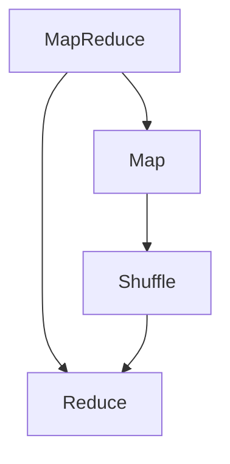

# 【AI大数据计算原理与代码实例讲解】MapReduce

## 1. 背景介绍

### 1.1 问题的由来

在当今大数据时代，海量的数据正以前所未有的规模和速度不断产生。传统的数据处理方式很难满足对大规模数据集的高效处理需求。MapReduce作为一种分布式计算模型应运而生,它能够有效地处理大规模数据集,成为解决大数据挑战的关键技术之一。

随着数据量的激增,单机系统已经无法满足计算和存储需求。MapReduce提供了一种可扩展、高性能的并行计算解决方案,可以在廉价的商用硬件集群上运行,实现海量数据的高效处理。

### 1.2 研究现状

MapReduce最初由Google提出,并在2004年发表了著名的论文《MapReduce: Simplified Data Processing on Large Clusters》。该论文描述了MapReduce编程模型,以及Google在Web索引和数据挖掘等应用中的实践。

此后,Apache Hadoop作为MapReduce的开源实现,成为大数据处理的事实标准。除了Hadoop,还出现了其他MapReduce实现,如Apache Spark、Apache Flink等,它们在保留MapReduce核心思想的同时,进行了各种优化和扩展。

目前,MapReduce已被广泛应用于搜索引擎、推荐系统、机器学习、基因组学等诸多领域,成为大数据处理的核心技术之一。

### 1.3 研究意义

MapReduce的重要性主要体现在以下几个方面:

1. **高效处理大规模数据集**:MapReduce可以将大型计算任务分解为多个小任务并行执行,从而实现对海量数据的高效处理。

2. **良好的可扩展性**:MapReduce采用了分布式计算架构,可以通过增加计算节点来线性扩展计算能力,满足不断增长的数据处理需求。

3. **容错性和可靠性**:MapReduce具有自动故障恢复和重新执行失败任务的能力,确保了计算的可靠性和容错性。

4. **编程模型简单**:MapReduce提供了简单的编程接口,开发人员只需要关注Map和Reduce两个函数的实现,而无需关心分布式计算的细节。

5. **适用于多种场景**:MapReduce可以应用于各种数据密集型应用场景,如网页索引、数据挖掘、机器学习、科学计算等。

总之,MapReduce为解决大数据挑战提供了一种高效、可扩展、容错的分布式计算模型,对于推动大数据技术发展具有重要意义。

### 1.4 本文结构

本文将全面介绍MapReduce的核心概念、原理和实践。主要内容包括:

1. MapReduce的核心概念和工作原理
2. MapReduce的数学模型和公式推导
3. MapReduce的实现细节和代码实例
4. MapReduce在实际应用场景中的案例分析
5. MapReduce的发展趋势和面临的挑战

通过对MapReduce的深入剖析,读者可以全面掌握这一核心大数据处理技术,为实际应用奠定坚实基础。

## 2. 核心概念与联系

MapReduce是一种软件架构,用于在大规模计算集群上并行处理大量数据。它由两个核心操作组成:Map和Reduce。



1. **Map**:Map操作将输入数据集切分为多个块,并对每个块进行处理,生成中间结果。Map操作通常执行过滤、转换等操作。

2. **Shuffle**:Shuffle阶段对Map操作的输出进行合并和分组,为Reduce操作做准备。

3. **Reduce**:Reduce操作对Shuffle后的数据进行合并和处理,生成最终结果。Reduce操作通常执行聚合、统计等操作。

MapReduce的核心思想是将大型计算任务分解为多个小任务,并行执行这些小任务,最后将结果合并得到最终结果。这种思想源于函数式编程中的Map和Reduce操作。

MapReduce的优势在于:

1. **高度并行化**:通过将任务划分为多个Map和Reduce任务,可以在大规模计算集群上并行执行,充分利用集群资源。

2. **容错性**:MapReduce具有自动容错和重试机制,可以在节点故障时自动重新执行失败任务,确保计算的可靠性。

3. **可扩展性**:MapReduce采用分布式架构,可以通过增加计算节点来线性扩展计算能力,满足不断增长的数据处理需求。

4. **编程模型简单**:开发人员只需要关注Map和Reduce函数的实现,而无需关注分布式计算的细节,大大降低了编程复杂度。

MapReduce已成为大数据处理的核心技术之一,被广泛应用于搜索引擎、推荐系统、机器学习、基因组学等诸多领域。

## 3. 核心算法原理 & 具体操作步骤

### 3.1 算法原理概述

MapReduce算法的核心思想是将大型计算任务分解为多个小任务,并行执行这些小任务,最后将结果合并得到最终结果。整个过程可以分为以下几个主要阶段:

1. **输入数据切分**:将输入数据集切分为多个数据块,每个数据块作为一个Map任务的输入。

2. **Map阶段**:每个Map任务对其输入数据块进行处理,生成中间结果。Map操作通常执行过滤、转换等操作。

3. **Shuffle阶段**:对Map任务的输出进行合并和分组,为Reduce任务做准备。

4. **Reduce阶段**:每个Reduce任务对Shuffle后的数据进行合并和处理,生成最终结果。Reduce操作通常执行聚合、统计等操作。

5. **输出结果**:将Reduce任务的输出写入文件系统或其他存储系统。

MapReduce算法的核心优势在于:

1. **高度并行化**:通过将任务划分为多个Map和Reduce任务,可以在大规模计算集群上并行执行,充分利用集群资源。

2. **容错性**:MapReduce具有自动容错和重试机制,可以在节点故障时自动重新执行失败任务,确保计算的可靠性。

3. **可扩展性**:MapReduce采用分布式架构,可以通过增加计算节点来线性扩展计算能力,满足不断增长的数据处理需求。

4. **编程模型简单**:开发人员只需要关注Map和Reduce函数的实现,而无需关注分布式计算的细节,大大降低了编程复杂度。

### 3.2 算法步骤详解

MapReduce算法的具体执行步骤如下:

1. **输入数据切分**

   MapReduce框架将输入数据集切分为多个数据块,每个数据块作为一个Map任务的输入。数据块的大小通常为64MB或128MB,可以根据实际情况进行调整。

2. **Map阶段**

   每个Map任务对其输入数据块进行处理,生成中间结果。Map操作通常执行过滤、转换等操作。Map任务的输出格式为<key, value>对。

   Map任务的执行过程如下:

   ```mermaid
   graph TD
       A[输入数据块] --> B[Map函数]
       B --> C[中间结果<key, value>对]
   ```

3. **Shuffle阶段**

   Shuffle阶段对Map任务的输出进行合并和分组,为Reduce任务做准备。具体步骤如下:

   a. **Partition**:根据Partition函数将Map任务的输出<key, value>对分配给不同的Reduce任务。

   b. **Sort**:对每个Reduce任务的输入进行排序,按照key进行排序。

   c. **Combine(可选)**:对相同key的value进行局部合并,减少数据传输量。

4. **Reduce阶段**

   每个Reduce任务对Shuffle后的数据进行合并和处理,生成最终结果。Reduce操作通常执行聚合、统计等操作。

   Reduce任务的执行过程如下:

   ```mermaid
   graph TD
       A[Shuffle后的<key, value>对] --> B[Reduce函数]
       B --> C[最终结果]
   ```

5. **输出结果**

   将Reduce任务的输出写入文件系统或其他存储系统,作为MapReduce计算的最终结果。

需要注意的是,MapReduce框架会自动处理任务调度、容错、数据传输等细节,开发人员只需要关注Map和Reduce函数的实现即可。

### 3.3 算法优缺点

MapReduce算法的优点:

1. **高度并行化**:通过将任务划分为多个Map和Reduce任务,可以在大规模计算集群上并行执行,充分利用集群资源。

2. **容错性**:MapReduce具有自动容错和重试机制,可以在节点故障时自动重新执行失败任务,确保计算的可靠性。

3. **可扩展性**:MapReduce采用分布式架构,可以通过增加计算节点来线性扩展计算能力,满足不断增长的数据处理需求。

4. **编程模型简单**:开发人员只需要关注Map和Reduce函数的实现,而无需关注分布式计算的细节,大大降低了编程复杂度。

5. **适用于批处理**:MapReduce非常适合批量处理大规模数据集,可以高效地执行离线数据处理任务。

MapReduce算法的缺点:

1. **延迟高**:MapReduce的计算过程涉及多个阶段,包括Map、Shuffle和Reduce,导致整体延迟较高,不适合需要低延迟的实时计算场景。

2. **不擅长迭代计算**:MapReduce更适合一次性批处理任务,对于需要多次迭代的机器学习算法等,性能较差。

3. **中间数据存储**:MapReduce需要将中间结果写入磁盘,导致磁盘I/O开销较大。

4. **小任务开销大**:对于小规模数据集,MapReduce的启动和调度开销可能会超过实际计算开销,效率较低。

5. **不支持有状态计算**:MapReduce采用无状态计算模型,不适合需要维护状态的流式计算场景。

总的来说,MapReduce是一种高效的大规模数据处理模型,适合批量处理海量数据集,但也存在一些局限性。针对这些局限性,后续出现了一些优化和扩展,如Apache Spark、Apache Flink等新一代大数据处理框架。

### 3.4 算法应用领域

MapReduce算法由于其高度并行化、容错性和可扩展性等优势,已被广泛应用于各种数据密集型应用场景,包括但不限于:

1. **网页索引和搜索引擎**:MapReduce可以高效地构建和更新网页索引,支持大规模网页数据的处理和搜索。

2. **数据挖掘和机器学习**:MapReduce可以用于处理海量数据,支持数据挖掘和机器学习算法的并行执行,如聚类分析、关联规则挖掘、推荐系统等。

3. **日志分析和网络分析**:MapReduce可以高效地处理大规模日志数据和网络流量数据,用于日志分析、网络监控和安全分析等应用。

4. **生物信息学和基因组学**:MapReduce可以用于处理基因序列数据、蛋白质结构数据等生物信息学数据,支持基因组测序、蛋白质折叠等计算密集型任务。

5. **科学计算和模拟**:MapReduce可以应用于天文学、物理学、化学等领域的科学计算和模拟,如气候模拟、粒子物理模拟等。

6. **多媒体处理**:MapReduce可以用于处理大规模图像、视频和音频数据,如图像识别、视频转码、音频处理等。

7. **金融和商业智能**:MapReduce可以应用于金融风险分析、欺诈检测、客户行为分析等金融和商业智能领域。

8. **物联网和传感器数据处理**:MapReduce可以高效地处理来自物联网设备和传感器的海量数据,支持实时监控和数据分析。

总之,MapReduce作为一种通用的大数据处理框架,可以应用于各种需要处理海量数据的领域,为解决大数据挑战提供了有力支持。

## 4. 数学模型和公式 & 详细讲解 & 举例说明

### 4.1 数学模