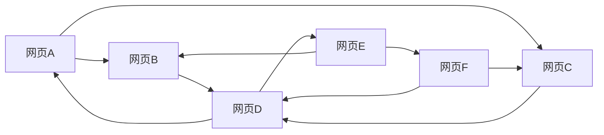

好的,我会尽力撰写一篇高质量的技术博客文章。以下是标题为《【AI大数据计算原理与代码实例讲解】PageRank》的正文内容:

# 【AI大数据计算原理与代码实例讲解】PageRank

## 1. 背景介绍

### 1.1 问题的由来

在当今的信息时代,互联网上的网页数量呈指数级增长。作为最大的信息来源,网络世界中蕴含着海量的有价值信息,但同时也存在大量的无用、重复、垃圾信息。如何高效地从海量网页中快速找到高质量、相关的信息,一直是搜索引擎公司所面临的核心挑战。

传统的搜索引擎主要依赖网页内容的文本匹配来判断网页与查询的相关性,但这种方式很容易受到垃圾信息的干扰。1998年,谷歌公司的两位创始人拉里·佩奇和谢尔盖·布林推出了 PageRank 算法,通过分析网页之间的链接结构来评估网页的重要性和质量,从而极大地提高了搜索结果的相关性。

### 1.2 研究现状  

PageRank 算法的提出,彻底改变了搜索引擎的运作方式,使得基于链接分析的排名算法成为搜索引擎领域的主流技术。目前,PageRank 及其改进算法已广泛应用于商业搜索引擎、学术文献分析、社交网络分析等多个领域。

PageRank 的核心思想是通过网页之间的链接结构来建模网页的重要性。一个高质量网页往往会受到其他重要网页的多次引用和链接,因此可以利用链接的传递性来评估网页的权重和重要程度。PageRank 算法将互联网视为一个有向图,每个网页是图中的一个节点,链接则是连接节点的有向边。通过迭代计算,算法可以收敛到一个稳定的状态,得到每个网页的 PageRank 值。

### 1.3 研究意义

PageRank 算法的提出,不仅解决了搜索引擎面临的网页质量评估问题,更重要的是开创了将链接分析应用于网络挖掘的新思路。该算法体现了将图论与概率论相结合的数学思想,具有简单、高效、健壮等优点,被公认为是20世纪90年代最重要的科学发明之一。

PageRank 算法的成功不仅为谷歌公司带来了商业上的巨大成功,更为互联网时代的信息检索和数据挖掘奠定了重要的理论基础。该算法的核心思想已被广泛应用于多个领域,例如社交网络影响力分析、学术论文引用评估、知识图谱构建等,对推动人工智能和大数据技术的发展产生了深远的影响。

### 1.4 本文结构

本文将全面介绍 PageRank 算法的原理、数学模型、实现细节和实际应用。文章首先阐述算法的核心概念和链接分析的思路,然后深入探讨算法的数学模型、公式推导和案例分析。接下来,我们将通过代码实例讲解算法的具体实现细节。最后,文章将总结算法在多个领域的应用现状,并展望其未来的发展趋势和挑战。

通过本文的学习,读者将全面掌握 PageRank 算法的理论基础和实现细节,并了解其在人工智能和大数据领域的广泛应用,为进一步的研究和实践奠定坚实的基础。

## 2. 核心概念与联系

PageRank 算法的核心思想是通过网页之间的链接结构来评估网页的重要性和质量。该算法将互联网视为一个有向图,每个网页是图中的一个节点,链接则是连接节点的有向边。算法基于以下两个核心概念:

1. **链接投票 (Link Voting)**: 一个高质量的网页往往会受到其他重要网页的多次引用和链接,因此可以利用链接的传递性来评估网页的权重和重要程度。每个指向某个网页的链接可以看作是对该网页的一次"投票"。

2. **随机游走 (Random Walk)**: 算法假设一个随机游走的浏览器在网页之间随机游走,并以某种概率从当前网页跳转到其他链接网页。通过建模这个随机游走过程,可以计算出每个网页被随机访问的概率,即该网页的重要性。

PageRank 算法将上述两个概念结合起来,通过迭代计算的方式,最终收敛到一个稳定的状态,得到每个网页的 PageRank 值。该值反映了网页在整个网络中的重要程度,可以作为搜索引擎排名的重要依据。

算法的核心思路可以用下图直观地表示:



在上图中,网页之间的链接表示"投票"关系。例如,网页 A 链接到网页 B 和 C,可以看作是对 B 和 C 的两次"投票"。通过分析整个网络中所有网页之间的链接关系,PageRank 算法可以计算出每个网页的重要性得分。

值得注意的是,PageRank 不仅考虑了链接的数量,还将链接源的重要性也纳入了计算。一个重要网页的"投票"权重会更高,对其他网页的影响也就更大。这种"富者更富"的特性,使得 PageRank 算法能够很好地区分出真正的高质量网页。

## 3. 核心算法原理与具体操作步骤  

### 3.1 算法原理概述

PageRank 算法的核心原理是通过建模网页之间的链接关系,将整个互联网抽象为一个巨大的有向图。在这个有向图中,每个网页是一个节点,链接则是连接节点的有向边。算法的目标是计算出每个网页在整个网络中的重要性得分,即 PageRank 值。

算法的基本思路是,将一个随机游走的浏览器放在网络中。该浏览器会随机地从当前网页跳转到其他链接网页,并以某种概率从当前网页跳出。通过建模这个随机游走过程,我们可以计算出每个网页被随机访问的概率,即该网页的 PageRank 值。

具体来说,PageRank 算法将每个网页的 PageRank 值定义为其他网页通过链接投递给它的 PageRank 值之和。也就是说,一个网页的 PageRank 值取决于链接到它的所有其他网页的 PageRank 值。这种递归关系可以用一个线性方程组来表示,通过迭代计算的方式,最终会收敛到一个稳定的解,得到每个网页的 PageRank 值。

### 3.2 算法步骤详解

PageRank 算法的具体步骤如下:

1. **构建有向图**

   首先,将整个互联网抽象为一个巨大的有向图 G=(V,E)。其中,V 是所有网页的集合,E 是所有链接的集合。如果网页 A 链接到网页 B,则在图中存在一条有向边 A->B。

2. **计算出链接矩阵**

   对于每个网页 u,定义 N(u) 为链接到网页 u 的所有网页集合。则网页 u 的 PageRank 值 PR(u) 可以表示为:

   $$PR(u) = (1-d) + d \sum_{v \in N(u)} \frac{PR(v)}{L(v)}$$

   其中,d 是一个阻尼系数(damping factor),通常取值 0.85。L(v) 表示网页 v 的出链接数量。

   将所有网页的 PageRank 值表示为一个向量 $\vec{PR}$,则上式可以用矩阵形式表示为:

   $$\vec{PR} = (1-d) \vec{e} + d M \vec{PR}$$

   其中,$\vec{e}$是全1向量,M 是链接矩阵,元素 $M_{uv} = \frac{1}{L(v)}$ 如果网页 v 链接到网页 u,否则为 0。

3. **迭代计算**

   由于 PageRank 值是未知的,我们无法直接求解上面的线性方程组。相反,我们可以通过迭代的方式计算 PageRank 值,直到收敛到一个稳定的状态。

   具体做法是,初始化所有网页的 PageRank 值为 $\frac{1}{N}$ (N 为网页总数),然后反复计算:

   $$\vec{PR}_{k+1} = (1-d) \vec{e} + d M \vec{PR}_k$$

   其中 $\vec{PR}_k$ 表示第 k 次迭代时的 PageRank 值向量。当 $\vec{PR}_{k+1}$ 和 $\vec{PR}_k$ 之间的差异小于某个阈值时,算法收敛,得到最终的 PageRank 值。

4. **结果处理**

   最终,我们得到了每个网页的 PageRank 值。这些值可以直接用于搜索引擎的网页排名,或者作为特征输入到更复杂的排名算法中。

下面是 PageRank 算法流程的 Mermaid 图示:

```mermaid
graph TD
A[构建有向图G(V,E)] --> B[计算链接矩阵M]
B --> C[初始化PageRank值]
C --> D{是否收敛?}
D -->|否| E[迭代计算PageRank值]
E --> D
D -->|是| F[输出PageRank值]
```

### 3.3 算法优缺点

PageRank 算法具有以下优点:

1. **简单高效**: 算法思路简单直观,计算过程高效,可以较好地应对大规模网络。
2. **健壮性强**: 算法对网页的内容并不敏感,只依赖于网页之间的链接结构,因此具有很强的健壮性。
3. **查准率高**: 通过链接分析的方式,能够较好地发现高质量网页,提高搜索结果的相关性。

但是,PageRank 算法也存在一些不足:

1. **新网页难以获得高分**: 新建立的高质量网页由于缺乏其他网页的链接,很难获得高的 PageRank 值。
2. **对链接农场敏感**: 一些网站通过构建大量内部链接或链接交换的方式,试图人为提高自身网页的 PageRank 值。
3. **未考虑网页内容**: 算法只依赖于链接结构,未能充分利用网页内容信息,在某些情况下可能会影响结果的准确性。

为了解决这些问题,后续研究提出了许多改进版本的 PageRank 算法,例如考虑网页内容、用户查询、主题相关性等因素,以提高算法的准确性和鲁棒性。

### 3.4 算法应用领域

PageRank 算法最初是为了解决网页排名问题而提出的,但由于其简单高效的特点,该算法及其改进版本已被广泛应用于多个领域:

1. **搜索引擎排名**: 这是 PageRank 最初和最主要的应用场景。主流搜索引擎如谷歌、必应等都在使用基于链接分析的排名算法。

2. **学术文献分析**: 将学术论文视为网页,引用关系视为链接,可以用 PageRank 算法评估论文的重要性和影响力。

3. **社交网络分析**: 在社交网络中,用户之间的关注、互动关系可以建模为网络链接,用 PageRank 算法发现网络中的重要节点和影响力用户。

4. **知识图谱构建**: 知识图谱中的实体及其关系可以抽象为网络结构,PageRank 算法可以用于发现重要实体和语义链接。

5. **垃圾邮件检测**: 将发送垃圾邮件的服务器视为网页,服务器之间的邮件流视为链接,可以用 PageRank 算法识别出垃圾邮件发送的重要源头。

6. **推荐系统**: 在推荐系统中,可以将物品或用户建模为网络节点,将评分或购买记录视为链接,用 PageRank 发现重要物品或用户。

总的来说,PageRank 算法为处理大规模网络数据提供了一种简单而有效的解决