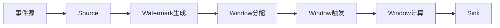

# 【AI大数据计算原理与代码实例讲解】事件时间

关键词：事件时间、大数据计算、Flink、Watermark、数据流处理

## 1. 背景介绍
### 1.1 问题的由来
在大数据流处理中,数据往往是连续不断地产生和到达的。这些数据携带着时间信息,如事件发生时间、数据产生时间等。然而,由于现实世界的复杂性和不确定性,数据流中的事件时间可能是乱序、延迟或者缺失的。这给基于事件时间进行计算和处理带来了挑战。

### 1.2 研究现状
目前,主流的大数据流处理框架如Apache Flink、Spark Streaming等都提供了对事件时间的支持。这些框架引入了Watermark机制来处理乱序事件,同时提供了灵活的窗口操作和时间语义。学术界和工业界也在不断探索更高效、更智能的事件时间处理方法。

### 1.3 研究意义
准确高效地处理事件时间对于实时数据分析、异常检测、决策优化等应用至关重要。深入理解事件时间的原理和算法,有助于我们设计和实现更加智能、鲁棒的流处理系统,从海量实时数据中及时洞察价值。

### 1.4 本文结构
本文将从事件时间的核心概念出发,详细阐述事件时间处理的算法原理。我们将推导相关的数学模型和公式,并给出具体的代码实例。同时,本文也会讨论事件时间处理在实际场景中的应用和面临的挑战。

## 2. 核心概念与联系
在流处理中,有三个关键的时间概念:
- 事件时间(Event Time):事件实际发生的时间。
- 处理时间(Processing Time):事件被处理的时间,也就是数据到达流处理系统的时间。
- 摄取时间(Ingestion Time):事件进入流处理系统的时间。

事件时间是最重要也是最复杂的,它反映了事件的本质。处理时间和摄取时间虽然易于获取和使用,但无法处理数据乱序、延迟等问题。因此,我们需要以事件时间为基准进行流式计算。

为了处理事件时间,引入了Watermark的概念。Watermark是一种衡量事件时间进展的机制,本质上是一个时间戳,用来表示"事件时间已经达到了Watermark所指示的时间,之后再到达的事件都将被认为是迟到的"。

Watermark与窗口息息相关。窗口根据事件时间将数据划分为有界的数据集,如滚动窗口、滑动窗口、会话窗口等。每个窗口都有自己的触发和关闭条件。当Watermark越过窗口结束时间时,窗口将被触发计算并关闭,不再接受新的数据。

下图展示了事件时间、Watermark和窗口之间的关系:



## 3. 核心算法原理 & 具体操作步骤
### 3.1 算法原理概述
事件时间处理的核心是Watermark机制和窗口操作。Watermark用于衡量事件时间的进展,解决数据乱序问题。窗口根据事件时间对数据进行划分和聚合。二者相互配合,实现了基于事件时间的流式计算。

### 3.2 算法步骤详解
1. Watermark生成:根据事件时间和预定义的延迟阈值,生成Watermark。常见的生成方式有周期性生成和标记点生成。
2. Watermark传播:将生成的Watermark插入到数据流中,与数据事件一起向下游传播。
3. 窗口分配:根据事件时间将数据分配到对应的窗口中。每个数据事件可能属于多个窗口。
4. 窗口触发:当Watermark越过窗口结束时间时,触发窗口的计算。
5. 窗口计算:对窗口内的数据进行聚合计算,如求和、平均、最大值等。
6. 窗口关闭:窗口计算完成后,关闭窗口,释放资源。后续到达的数据将被丢弃。

### 3.3 算法优缺点
优点:
- 能够处理乱序、延迟、缺失等问题,保证了计算的正确性和一致性。
- 提供了灵活的窗口操作,支持各种复杂的数据处理需求。
- 与实际业务语义紧密结合,易于理解和使用。

缺点:
- Watermark的生成和传播会引入一定的开销和延迟。
- 对于严重乱序或者延迟很大的数据,可能难以得到理想的处理效果。
- 需要用户对业务有深入理解,合理设置Watermark和窗口参数。

### 3.4 算法应用领域 
事件时间处理被广泛应用于以下领域:
- 实时数据分析:如实时统计、指标监控、异常检测等。
- 复杂事件处理:如事件关联、模式匹配等。
- 数据管道和ETL:如数据清洗、转换、集成等。

## 4. 数学模型和公式 & 详细讲解 & 举例说明
### 4.1 数学模型构建
我们可以将事件时间处理抽象为一个数学模型。设数据流为一个事件序列 $E=\{e_1,e_2,...,e_n\}$,每个事件 $e_i$ 包含时间戳 $t_i$ 和数据值 $v_i$,即 $e_i=(t_i,v_i)$。

Watermark可以定义为一个递增的时间序列 $W=\{w_1,w_2,...,w_m\}$,其中 $w_i$ 表示在时刻 $i$ 的Watermark值。

窗口可以定义为一个时间区间 $[start,end)$,其中 $start$ 和 $end$ 分别为窗口的起始和结束时间。

### 4.2 公式推导过程
对于一个事件 $e_i=(t_i,v_i)$,它会被分配到满足 $start \leq t_i < end$ 的所有窗口中。

当Watermark $w_j \geq end$ 时,对应的窗口将被触发计算。窗口计算可以表示为一个函数 $f$,将窗口内的所有事件值 $v_i$ 进行聚合:

$$result = f(\{v_i | e_i \in window\})$$

常见的聚合函数有:
- 求和:$sum(\{v_i\}) = \sum_{i=1}^{n} v_i$
- 平均值:$avg(\{v_i\}) = \frac{\sum_{i=1}^{n} v_i}{n}$
- 最大值:$max(\{v_i\}) = \max_{i=1}^{n} v_i$

### 4.3 案例分析与讲解
假设我们有一个温度传感器,每秒产生一个温度读数。我们希望每分钟计算一次平均温度。

我们可以设置一个1分钟的滚动窗口,窗口的起始时间为每分钟的整点,例如 [09:00, 09:01), [09:01, 09:02) 等。

当传感器产生的事件流进入系统时,每个事件将被分配到对应的窗口中。例如,事件(09:00:15,25.3)将被分配到窗口[09:00, 09:01)。

假设我们设置Watermark的延迟为5秒,即 $w_i = max(t_j) - 5s, j<i$。那么在09:01:05时,Watermark将达到09:01,触发窗口[09:00, 09:01)的计算。

设窗口内的温度事件为 $\{25.3, 25.6, 24.9, ...\}$,则平均温度为:

$$avg = \frac{25.3 + 25.6 + 24.9 + ...}{n}$$

其中 $n$ 为窗口内事件的数量。

### 4.4 常见问题解答
Q: 如何设置Watermark的延迟阈值?
A: 延迟阈值取决于数据的特性和业务需求。一般可以通过分析数据的延迟分布,选择一个合适的百分位数作为阈值,例如99%的数据延迟在5秒以内,则可以设置延迟为5秒。

Q: 如何处理迟到的数据?
A: 对于迟到的数据,可以选择丢弃或者更新之前的计算结果。如果更新,需要保留一定的历史数据,并重新触发计算。

## 5. 项目实践：代码实例和详细解释说明
### 5.1 开发环境搭建
我们以Apache Flink为例,演示如何进行事件时间处理。首先需要搭建Flink开发环境:
- 安装Java 8或以上版本
- 下载Flink发行版,解压缩到本地目录
- 在IDE中创建一个Maven项目,添加Flink依赖

### 5.2 源代码详细实现
下面是一个基于事件时间的温度平均值计算的Flink代码示例:

```java
// 定义温度事件的POJO类
public class TemperatureEvent {
    public String sensorId;
    public long timestamp;
    public double temperature;
    
    // 构造函数、getter和setter方法
}

// 定义Watermark生成器
class TemperatureWatermark implements WatermarkGenerator<TemperatureEvent> {
    private long maxTimestamp = Long.MIN_VALUE;
    private long delay = 5000; // 5秒延迟
    
    @Override
    public void onEvent(TemperatureEvent event, long eventTimestamp, WatermarkOutput output) {
        maxTimestamp = Math.max(maxTimestamp, event.timestamp);
    }

    @Override
    public void onPeriodicEmit(WatermarkOutput output) {
        output.emitWatermark(new Watermark(maxTimestamp - delay));
    }
}

// 主函数
public class TemperatureAverage {
    public static void main(String[] args) throws Exception {
        StreamExecutionEnvironment env = StreamExecutionEnvironment.getExecutionEnvironment();
        
        // 从Kafka读取温度事件
        DataStream<TemperatureEvent> tempStream = env
            .addSource(new FlinkKafkaConsumer<>("temperature", new JSONDeserializer<>(TemperatureEvent.class), properties))
            .assignTimestampsAndWatermarks(new TemperatureWatermark());
        
        // 定义1分钟滚动窗口,并计算平均温度
        DataStream<Double> avgTemp = tempStream
            .keyBy(event -> event.sensorId)
            .window(TumblingEventTimeWindows.of(Time.minutes(1)))
            .aggregate(new AvgTempAggregateFunction());
        
        // 打印结果
        avgTemp.print();
        
        env.execute("Temperature Average");
    }
    
    // 自定义聚合函数
    public static class AvgTempAggregateFunction implements AggregateFunction<TemperatureEvent, Tuple2<Double, Integer>, Double> {
        @Override
        public Tuple2<Double, Integer> createAccumulator() {
            return new Tuple2<>(0.0, 0);
        }

        @Override
        public Tuple2<Double, Integer> add(TemperatureEvent value, Tuple2<Double, Integer> accumulator) {
            return new Tuple2<>(accumulator.f0 + value.temperature, accumulator.f1 + 1);
        }

        @Override
        public Double getResult(Tuple2<Double, Integer> accumulator) {
            return accumulator.f0 / accumulator.f1;
        }

        @Override
        public Tuple2<Double, Integer> merge(Tuple2<Double, Integer> a, Tuple2<Double, Integer> b) {
            return new Tuple2<>(a.f0 + b.f0, a.f1 + b.f1);
        }
    }
}
```

### 5.3 代码解读与分析
- 首先定义了温度事件的POJO类`TemperatureEvent`,包含传感器ID、时间戳和温度值。
- 然后定义了一个自定义的Watermark生成器`TemperatureWatermark`,用于生成事件时间的Watermark。它会记录观察到的最大时间戳,并根据延迟阈值生成Watermark。
- 在主函数中,首先创建了执行环境,然后从Kafka读取温度事件流,并分配时间戳和Watermark。
- 接着使用`keyBy`算子按照传感器ID对流进行分区,然后使用`window`算子定义了一个1分钟的滚动事件时间窗口。
- 在窗口上应用自定义的聚合函数`AvgTempAggregateFunction`,用于计算窗口内的平均温度。
- 最后将计算结果打印输出,并启动执行。

### 5.4 运行结果展示
假设我们有如下的