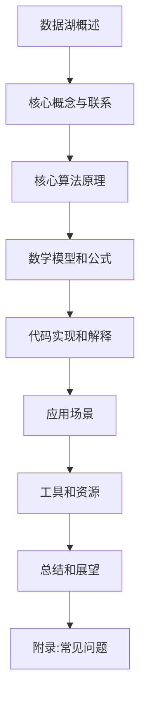
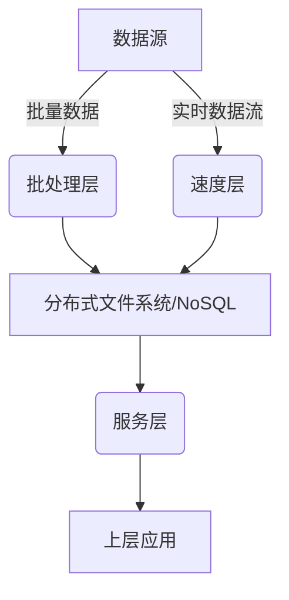
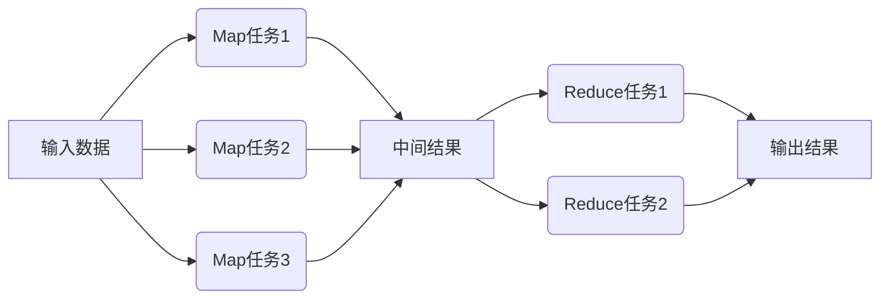
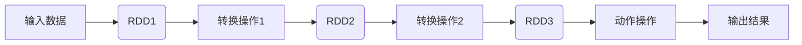

# 【AI大数据计算原理与代码实例讲解】数据湖

## 1. 背景介绍

### 1.1 问题的由来

在当今大数据时代，企业和组织面临着海量异构数据的挑战。传统的数据存储和处理方式已经无法满足现代数据密集型应用的需求。随着数据量的指数级增长和多样化,有效管理和利用这些数据资产成为了一个紧迫的问题。

### 1.2 研究现状  

为了解决这一问题,数据湖(Data Lake)的概念应运而生。数据湖是一种新兴的大数据存储和处理架构,旨在提供一个集中式的存储库,用于存储各种类型的原始数据,包括结构化、半结构化和非结构化数据。与传统的数据仓库不同,数据湖不需要预先定义数据模式,可以灵活地存储任何类型的数据,并在需要时进行处理和分析。

### 1.3 研究意义

数据湖的引入为企业带来了诸多好处:

1. **数据集中存储**:数据湖提供了一个集中式的存储库,使得企业可以将来自不同来源的数据集中存储,避免了数据孤岛的问题。

2. **灵活性和可扩展性**:数据湖可以存储各种类型的数据,无需预先定义数据模式,这使得它具有很高的灵活性和可扩展性。

3. **降低存储成本**:数据湖通常使用廉价的对象存储,可以大幅降低数据存储成本。

4. **支持多种分析工作负载**:数据湖可以支持批处理、交互式查询、实时分析等多种分析工作负载,满足不同业务需求。

5. **促进数据民主化**:数据湖使得企业内部的各个部门和用户都可以访问和利用数据,促进了数据民主化。

### 1.4 本文结构

本文将全面介绍数据湖的核心概念、架构、算法原理、数学模型、代码实现、应用场景等内容。文章结构如下:

## 2. 核心概念与联系

数据湖涉及多个核心概念,它们之间存在密切联系。我们先来了解这些核心概念:

### 2.1 数据湖架构

数据湖通常采用lambda架构,由三个主要层次组成:

1. **批处理层(Batch Layer)**: 用于处理大量历史数据,通常使用Apache Hadoop、Apache Spark等大数据框架进行离线批处理。

2. **速度层(Speed Layer)**: 用于处理实时数据流,通常使用Apache Kafka、Apache Flink等流处理框架进行实时数据处理。

3. **服务层(Serving Layer)**: 将批处理层和速度层处理后的数据存储在分布式文件系统(如HDFS)或NoSQL数据库中,为上层应用提供数据服务。

### 2.2 数据摄取(Data Ingestion)

数据摄取是指从各种数据源(如日志文件、传感器、网络流量等)收集数据,并将其存储到数据湖中的过程。常用的数据摄取工具包括Apache Kafka、Apache NiFi、Apache Flume等。

### 2.3 数据存储

数据湖通常使用廉价的对象存储(如AWS S3、Azure Blob Storage、Apache HDFS等)来存储原始数据。对象存储具有高可扩展性、高持久性和低成本的特点,非常适合存储大量非结构化数据。

### 2.4 数据处理

数据湖中的数据需要经过处理才能为上层应用提供服务。常用的数据处理框架包括:

- **批处理框架**:Apache Hadoop、Apache Spark
- **流处理框架**:Apache Kafka、Apache Flink、Apache Storm
- **SQL查询引擎**:Apache Hive、Apache Impala、Apache Spark SQL

### 2.5 数据治理

随着数据量的不断增长,数据治理变得越来越重要。数据治理包括数据质量管理、元数据管理、数据安全性和隐私保护等方面,旨在确保数据湖中的数据具有高质量、安全性和可访问性。

### 2.6 数据可视化和分析

数据湖的最终目标是为上层应用提供数据服务,支持数据可视化和分析。常用的可视化和分析工具包括Apache Superset、Apache Zeppelin、Tableau等。

## 3. 核心算法原理与具体操作步骤

数据湖中涉及多种核心算法,如数据摄取算法、数据处理算法、数据压缩算法等。我们将重点介绍两种核心算法:MapReduce算法和Spark RDD算法。

### 3.1 算法原理概述

#### 3.1.1 MapReduce算法

MapReduce是一种用于大规模数据处理的编程模型,由Google提出。它将计算过程分为两个阶段:Map阶段和Reduce阶段。

1. **Map阶段**:输入数据被分割成多个数据块,每个数据块由一个Map任务处理。Map任务将输入数据转换为一系列<key,value>对,并将这些中间结果写入本地磁盘。

2. **Reduce阶段**:框架对Map阶段产生的中间结果进行合并和排序,然后将具有相同key的<key,value>对分配给同一个Reduce任务。Reduce任务对这些值进行合并操作,生成最终结果。

#### 3.1.2 Spark RDD算法

Spark RDD(Resilient Distributed Dataset)是Spark的核心数据结构,是一种分布式内存数据集。RDD支持两种类型的操作:转换(Transformation)和动作(Action)。

1. **转换操作**:对RDD进行转换,生成一个新的RDD。转换操作是惰性的,只有在执行动作操作时才会真正计算。

2. **动作操作**:对RDD进行计算,并返回结果。动作操作会触发实际的计算过程。

### 3.2 算法步骤详解

#### 3.2.1 MapReduce算法步骤

1. **输入分割**:输入数据被划分为多个数据块,每个数据块由一个Map任务处理。

2. **Map阶段**:每个Map任务读取输入数据块,对数据进行处理(如过滤、投影等),生成<key,value>对作为中间结果,并将这些中间结果写入本地磁盘。

3. **洗牌和排序**:框架对Map阶段产生的中间结果进行合并和排序,将具有相同key的<key,value>对分配给同一个Reduce任务。

4. **Reduce阶段**:每个Reduce任务读取分配给它的<key,value>对,对具有相同key的值进行合并操作(如求和、连接等),生成最终结果。

5. **输出**:Reduce任务将最终结果写入HDFS或其他存储系统。

#### 3.2.2 Spark RDD算法步骤

1. **创建RDD**:从外部数据源(如HDFS、Hive表等)创建初始RDD,或者通过并行化集合创建RDD。

2. **转换操作**:对RDD执行一系列转换操作(如map、filter、join等),生成新的RDD。转换操作是惰性的,只记录应用于RDD的操作,而不会立即执行。

3. **动作操作**:执行动作操作(如count、collect、saveAsTextFile等),触发实际的计算过程。Spark会根据RDD的血统关系构建有向无环图(DAG),并按照有向无环图执行计算任务。

4. **计算**:Spark将计算任务分发到集群的Executor进程中执行,并对RDD进行分区,实现并行计算。

5. **结果**:计算结果可以保存到外部存储系统(如HDFS)中,或者在驱动程序中进一步处理。

### 3.3 算法优缺点

#### 3.3.1 MapReduce算法

**优点**:

- 编程模型简单,易于理解和使用。
- 具有良好的容错性和可扩展性。
- 适合处理大规模数据集。

**缺点**:

- 每个作业需要读写大量中间数据到磁盘,效率较低。
- 不适合迭代计算和交互式数据分析。
- 不支持内存计算,无法充分利用内存资源。

#### 3.3.2 Spark RDD算法

**优点**:

- 支持内存计算,可以充分利用内存资源,提高计算效率。
- 支持迭代计算和交互式数据分析。
- 提供了丰富的高级API,如Spark SQL、Spark Streaming等。
- 具有良好的容错性和可扩展性。

**缺点**:

- 编程模型相对复杂,需要一定的学习成本。
- 对内存资源的需求较高,可能会导致内存不足的问题。
- 小型作业的性能可能不如MapReduce。

### 3.4 算法应用领域

MapReduce和Spark RDD算法广泛应用于大数据处理领域,包括但不限于:

- 网络日志分析
- 推荐系统
- 机器学习
- 图计算
- 科学计算
- 金融分析
- ...

## 4. 数学模型和公式详细讲解举例说明

在数据湖中,常常需要使用数学模型和公式来描述和解决实际问题。本节将介绍两种常见的数学模型:线性回归模型和逻辑回归模型,并详细讲解相关公式及案例分析。

### 4.1 数学模型构建

#### 4.1.1 线性回归模型

线性回归模型旨在找到一个最佳拟合直线,使得数据点到直线的距离之和最小。线性回归模型的数学表达式为:

$$y = \theta_0 + \theta_1x_1 + \theta_2x_2 + ... + \theta_nx_n$$

其中:

- $y$是因变量(目标变量)
- $x_1, x_2, ..., x_n$是自变量(特征变量)
- $\theta_0, \theta_1, ..., \theta_n$是模型参数(需要通过训练数据估计)

线性回归模型的目标是找到最优参数$\theta$,使得预测值$\hat{y}$与实际值$y$之间的误差平方和最小化:

$$\min_\theta \sum_{i=1}^{m}(y^{(i)} - \hat{y}^{(i)})^2$$

其中$m$是训练数据的样本数。

#### 4.1.2 逻辑回归模型

逻辑回归模型用于解决分类问题,即根据特征变量预测输入数据属于哪个类别。逻辑回归模型的数学表达式为:

$$h_\theta(x) = \frac{1}{1 + e^{-\theta^Tx}}$$

其中:

- $h_\theta(x)$是预测输入$x$属于正类的概率
- $\theta$是模型参数向量
- $\theta^Tx$是参数向量$\theta$与特征向量$x$的内积

逻辑回归模型的目标是找到最优参数$\theta$,使得训练数据的对数似然函数最大化:

$$\max_\theta \sum_{i=1}^{m}[y^{(i)}\log h_\theta(x^{(i)}) + (1 - y^{(i)})\log(1 - h_\theta(x^{(i)}))]$$

其中$y^{(i)}$是第$i$个训练样本的真实标签(0或1)。

### 4.2 公式推导