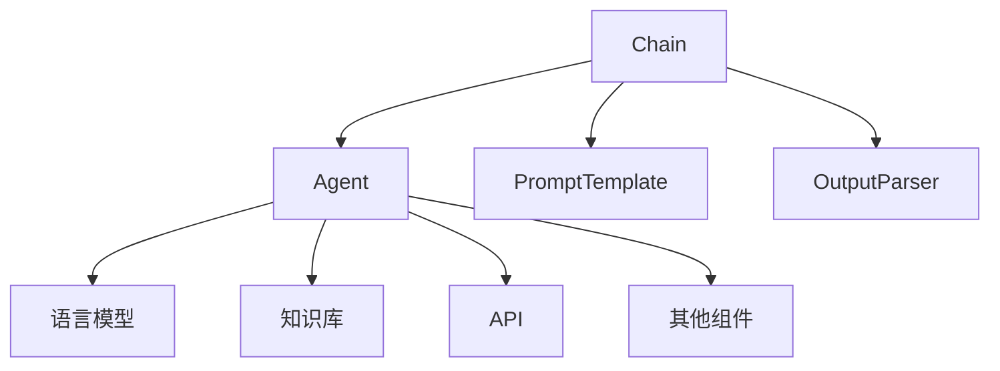

# 【LangChain编程：从入门到实践】Chain接口调用

## 1. 背景介绍

### 1.1 问题的由来

在现代软件开发中,我们经常需要处理复杂的任务,这些任务通常需要将多个组件或服务组合在一起才能完成。例如,在自然语言处理(NLP)领域,我们可能需要将文本提取、实体识别、关系提取和知识库查询等多个步骤组合在一起,以实现智能问答系统。传统的编程方式通常需要手动编写大量的样板代码,将这些组件连接在一起,这不仅耗时耗力,而且容易出错,难以维护和扩展。

### 1.2 研究现状

为了解决这个问题,近年来出现了一种新的编程范式,称为链式编程(Chain Programming)。链式编程的核心思想是将复杂的任务分解为一系列较小的步骤或组件,然后使用一种声明式的方式将它们链接在一起。这种方式不仅可以提高代码的可读性和可维护性,而且还能够更好地利用现有的组件和服务,加快开发速度。

LangChain是一个基于Python的开源框架,旨在简化链式编程在自然语言处理和人工智能领域的应用。它提供了一种统一的接口,允许开发人员轻松地将各种组件(如语言模型、知识库、API等)链接在一起,构建复杂的应用程序。

### 1.3 研究意义

LangChain的出现为自然语言处理和人工智能领域带来了新的编程范式,极大地简化了复杂任务的开发过程。通过使用LangChain,开发人员可以更加专注于业务逻辑,而不必过多地关注底层细节,从而提高开发效率和代码质量。此外,LangChain还提供了丰富的预构建组件和示例,使得开发人员可以快速上手,加速项目的交付。

### 1.4 本文结构

本文将全面介绍LangChain中的Chain接口,包括其核心概念、算法原理、数学模型、代码实现、实际应用场景等。我们将从理论和实践两个角度深入探讨Chain接口,帮助读者掌握这一强大工具,并能够在实际项目中灵活应用。

## 2. 核心概念与联系

Chain接口是LangChain中的核心概念之一,它定义了一种将多个组件链接在一起的方式。在LangChain中,每个组件都被称为一个"Agent",它可以是一个语言模型、知识库、API或任何其他可执行的函数。Chain接口提供了一种机制,将这些Agent按照特定的顺序或逻辑组合在一起,从而实现复杂的任务。

Chain接口的核心思想是将复杂的任务分解为一系列较小的步骤,每个步骤由一个Agent负责执行。这些Agent通过Chain接口连接在一起,形成一个链条。当输入数据进入Chain时,它会依次经过每个Agent的处理,直到最终产生所需的输出结果。

Chain接口的设计灵感来自于函数式编程中的"管道"概念,它允许开发人员以一种声明式的方式定义数据流,而不必关注底层的控制流细节。这种编程范式不仅提高了代码的可读性和可维护性,而且还能够更好地利用现有的组件和服务,加快开发速度。

在LangChain中,Chain接口与其他核心概念密切相关,例如Agent、PromptTemplate、OutputParser等。这些概念共同构成了LangChain的基础架构,为开发人员提供了一种统一的方式来构建自然语言处理和人工智能应用程序。

上图展示了Chain接口与其他核心概念之间的关系。Chain接口将多个Agent连接在一起,每个Agent可以是语言模型、知识库、API或其他组件。PromptTemplate用于定义输入数据的格式,而OutputParser则负责解析Agent的输出结果。这些概念相互配合,共同实现了复杂任务的链式编程。

## 3. 核心算法原理 & 具体操作步骤

### 3.1 算法原理概述

Chain接口的核心算法原理是基于有向无环图(Directed Acyclic Graph, DAG)的思想。在LangChain中,每个Agent都被视为一个节点,而Chain则定义了这些节点之间的连接关系。当输入数据进入Chain时,它会按照预定义的路径依次经过每个Agent的处理,直到产生最终的输出结果。

Chain接口的算法可以概括为以下几个步骤:

1. **初始化**: 根据用户定义的配置,创建Chain对象并初始化所需的Agent。
2. **输入处理**: 对输入数据进行预处理,例如使用PromptTemplate格式化输入。
3. **执行链路**: 按照预定义的路径,依次执行每个Agent的操作,并将上一个Agent的输出作为下一个Agent的输入。
4. **输出解析**: 使用OutputParser解析最后一个Agent的输出结果,将其转换为所需的格式。
5. **返回结果**: 返回最终的输出结果。

在执行链路的过程中,Chain接口还支持一些高级特性,例如条件分支、循环执行、异常处理等,这使得它能够处理更加复杂的场景。

### 3.2 算法步骤详解

下面我们将详细解释Chain接口算法的每一个步骤:

1. **初始化**

   在这个步骤中,LangChain会根据用户提供的配置创建Chain对象。配置信息通常包括要使用的Agent列表、Agent之间的连接关系、输入和输出的格式等。LangChain提供了多种预定义的Chain类型,例如`SequentialChain`、`ConstituentChain`、`VectorDBQAChain`等,用户可以选择合适的Chain类型,或者自定义Chain的行为。

2. **输入处理**

   在处理输入数据之前,Chain接口通常会使用`PromptTemplate`对输入数据进行格式化。`PromptTemplate`是LangChain中的另一个核心概念,它定义了一种模板语言,用于描述输入数据的结构。通过使用`PromptTemplate`,开发人员可以轻松地将不同格式的输入数据转换为Agent可以理解的格式。

3. **执行链路**

   这是Chain接口算法的核心步骤。在这个步骤中,Chain会按照预定义的路径依次执行每个Agent的操作。具体的执行顺序取决于Chain的类型和配置。

   例如,在`SequentialChain`中,Agent会按照指定的顺序依次执行,每个Agent的输出将作为下一个Agent的输入。而在`ConstituentChain`中,则允许根据某些条件选择不同的执行路径。

   在执行链路的过程中,Chain接口还支持一些高级特性,例如条件分支、循环执行、异常处理等。这使得它能够处理更加复杂的场景,例如基于上下文动态调整执行路径、重试失败的操作等。

4. **输出解析**

   当所有Agent都执行完毕后,Chain接口会使用`OutputParser`解析最后一个Agent的输出结果。`OutputParser`是另一个核心概念,它定义了如何将Agent的原始输出转换为所需的格式。

   例如,在问答系统中,我们可能需要将Agent的输出解析为一个结构化的对象,包含问题、答案和相关性分数等信息。通过使用`OutputParser`,开发人员可以轻松地自定义输出格式,而不必手动解析原始输出。

5. **返回结果**

   最后,Chain接口会将解析后的输出结果返回给调用方。这个结果可以是任何Python对象,例如字符串、列表、字典等,具体取决于`OutputParser`的实现。

通过上述步骤,Chain接口算法实现了将多个Agent组合在一起执行复杂任务的目标。它提供了一种声明式的编程方式,使得开发人员可以更加专注于业务逻辑,而不必关注底层的控制流细节。

### 3.3 算法优缺点

Chain接口算法具有以下优点:

1. **模块化**: 将复杂的任务分解为多个独立的Agent,每个Agent只负责完成一个较小的子任务。这种模块化设计提高了代码的可读性、可维护性和可重用性。

2. **灵活性**: Chain接口支持多种预定义的Chain类型,并允许开发人员自定义Chain的行为。这种灵活性使得Chain接口可以应用于广泛的场景,满足不同的需求。

3. **可扩展性**: 由于Agent是独立的模块,因此可以轻松地添加、替换或修改Agent,而无需改变整个系统的架构。这使得系统具有良好的可扩展性,能够适应不断变化的需求。

4. **提高开发效率**: Chain接口提供了声明式的编程范式,开发人员只需关注业务逻辑,而不必过多关注底层的控制流细节。这极大地提高了开发效率,加快了项目的交付速度。

5. **利用现有组件**: Chain接口可以轻松地集成各种现有的组件,例如语言模型、知识库、API等。这使得开发人员可以充分利用现有资源,避免重复劳动。

然而,Chain接口算法也存在一些缺点和限制:

1. **性能overhead**: 由于Chain接口需要在多个Agent之间传递数据,因此可能会引入一定的性能开销。在处理大量数据或需要实时响应的场景中,这可能会成为一个瓶颈。

2. **调试困难**: 由于Chain涉及多个Agent的交互,因此调试和排查问题可能会变得更加困难。开发人员需要花费更多的精力来追踪数据流和执行路径。

3. **上下文管理**: Chain接口需要在多个Agent之间传递上下文信息,以确保每个Agent都能够访问所需的数据。管理这些上下文信息可能会增加开发的复杂性。

4. **Agent依赖**: Chain的执行过程依赖于每个Agent的正确实现。如果某个Agent存在缺陷或错误,可能会导致整个Chain出现问题。因此,开发人员需要确保每个Agent都经过充分的测试和验证。

5. **配置复杂性**: 随着Chain的复杂度增加,配置Chain的过程也可能变得更加复杂。开发人员需要仔细设计和管理Agent之间的连接关系,以避免出现逻辑错误或死循环。

总的来说,Chain接口算法为开发人员提供了一种强大的工具,可以简化复杂任务的开发过程。但同时,开发人员也需要权衡其优缺点,并采取适当的措施来解决潜在的问题和限制。

### 3.4 算法应用领域

Chain接口算法可以应用于广泛的领域,特别是那些需要将多个组件或服务组合在一起完成复杂任务的场景。以下是一些典型的应用领域:

1. **自然语言处理(NLP)**

   在自然语言处理领域,Chain接口可以用于构建智能问答系统、文本摘要、情感分析等应用程序。例如,我们可以将文本提取、实体识别、关系提取和知识库查询等多个Agent链接在一起,实现一个端到端的问答系统。

2. **机器学习和数据处理**

   Chain接口可以用于构建机器学习管道,将数据预处理、特征工程、模型训练和模型评估等步骤组合在一起。它还可以应用于数据清洗、数据转换和数据集成等数据处理任务。

3. **业务流程自动化**

   在业务流程自动化领域,Chain接口可以用于定义和执行复杂的业务流程。每个Agent可以代表一个特定的任务或服务,而Chain则定义了这些任务或服务之间的执行顺序和依赖关系。

4. **智能助手和聊天机器人**

   Chain接口可以用于构建智能助手和聊天机器人,将自然语言理解、对话管理、知识库查询和响应生成等多个组件链接在一起,实现智能对话交互。

5. **科学计算和数据分析**

   在科学计算和数据分析领域,Chain接口可以用于构建复杂的数据处理管道,将数据采集、数据清洗、特征提取、建模和可视化等步骤组合在一起。

6. **物联网和边缘计算**

   在物联网和边