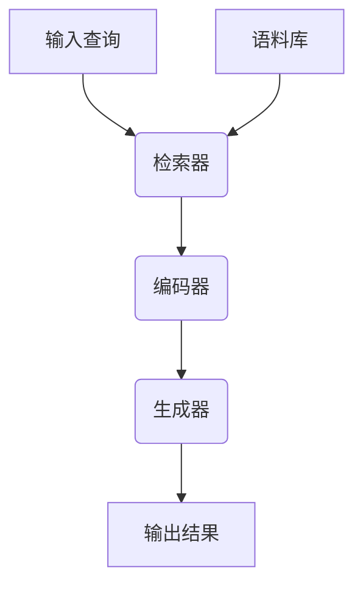

好的,我会按照您的要求,以专业的技术语言撰写这篇博客文章。

# 【LangChain编程:从入门到实践】RAG技术概述

## 1. 背景介绍

### 1.1 问题的由来

在当今信息时代,海量的非结构化文本数据随处可见,如网页、文档、电子邮件等。如何高效地从这些庞大的文本数据中提取有价值的信息,一直是人工智能领域的一大挑战。传统的信息检索方法通常依赖于关键词匹配,难以深入理解文本的语义,导致检索结果的准确性和相关性不高。

### 1.2 研究现状 

为了解决这一问题,研究人员提出了各种自然语言处理(NLP)技术,如语义搜索、问答系统等。其中,检索增强生成(Retrieval Augmented Generation,RAG)模型是一种新兴的方法,它结合了检索和生成两种范式的优点,旨在提高问答系统的准确性和可解释性。

### 1.3 研究意义

RAG技术在诸多领域具有广泛的应用前景,如智能问答系统、知识库构建、自动文本摘要等。它可以帮助用户更高效地获取所需信息,提高工作效率。同时,RAG模型的可解释性也有助于提高人工智能系统的可信度和透明度。

### 1.4 本文结构

本文将全面介绍RAG技术的核心概念、算法原理、数学模型、实现细节和应用场景。我们将从理论和实践两个层面剖析RAG,帮助读者深入理解这项前沿技术。

## 2. 核心概念与联系

RAG技术的核心思想是将检索(Retrieval)和生成(Generation)两个过程有机结合,充分利用现有的大规模文本语料库。具体来说,RAG模型包括以下三个主要组件:

1. **检索器(Retriever)**: 根据输入的查询,从海量文本语料库中检索出最相关的文本片段。
2. **编码器(Encoder)**: 将检索出的文本片段编码为机器可理解的向量表示。
3. **生成器(Generator)**: 基于编码器的输出,生成最终的答案或文本。

上图展示了RAG模型的基本工作流程。当用户输入一个查询时,检索器会从语料库中找出最相关的文本片段。然后,编码器将这些文本片段编码为向量表示,作为生成器的输入。最后,生成器根据编码器的输出,生成最终的答案或文本。

RAG技术与传统的信息检索和自然语言生成方法有着本质的区别。它不仅利用了大规模语料库中的知识,还能够生成新的、与语料库中不存在的内容。这使得RAG模型在理解和生成自然语言方面具有更强的能力。

## 3. 核心算法原理与具体操作步骤

### 3.1 算法原理概述

RAG算法的核心思想是将检索和生成两个过程有机结合,充分利用现有的大规模文本语料库。具体来说,RAG算法包括以下几个主要步骤:

1. **查询编码(Query Encoding)**: 将用户的查询编码为向量表示。
2. **语料库检索(Corpus Retrieval)**: 根据查询向量,从语料库中检索出最相关的文本片段。
3. **上下文编码(Context Encoding)**: 将检索出的文本片段编码为向量表示,作为生成器的输入。
4. **答案生成(Answer Generation)**: 生成器根据查询向量和上下文向量,生成最终的答案或文本。

### 3.2 算法步骤详解

1. **查询编码(Query Encoding)**

   在这一步骤中,我们需要将用户的自然语言查询转换为机器可理解的向量表示。常用的方法是使用预训练的语言模型(如BERT、RoBERTa等)对查询进行编码。

   $$q = \text{Encoder}_Q(x)$$

   其中,$x$表示查询的文本,$q$表示查询的向量表示,$\text{Encoder}_Q$是查询编码器模型。

2. **语料库检索(Corpus Retrieval)**

   根据查询向量$q$,我们需要从语料库中检索出最相关的文本片段。这一步骤通常采用向量相似性搜索(Vector Similarity Search)的方法,如余弦相似度、内积等。

   $$C = \text{Retriever}(q, D)$$

   其中,$D$表示语料库,$C$表示检索出的相关文本片段集合,$\text{Retriever}$是检索器模型。

3. **上下文编码(Context Encoding)**

   将检索出的文本片段$C$编码为向量表示$c$,作为生成器的输入。这一步骤通常采用与查询编码器相同的语言模型进行编码。

   $$c = \text{Encoder}_C(C)$$

   其中,$\text{Encoder}_C$是上下文编码器模型。

4. **答案生成(Answer Generation)**

   生成器模型根据查询向量$q$和上下文向量$c$,生成最终的答案或文本$y$。

   $$y = \text{Generator}(q, c)$$

   其中,$\text{Generator}$是生成器模型。

在实际应用中,上述步骤可能会有一些变化和优化,如引入注意力机制、多轮检索等。但总的思路是一致的,即通过检索和生成两个过程的有机结合,充分利用语料库中的知识,生成高质量的自然语言输出。

### 3.3 算法优缺点

**优点**:

- 充分利用了现有的大规模文本语料库,可以生成更准确、更丰富的自然语言内容。
- 结合了检索和生成两种范式的优点,在理解和生成自然语言方面具有更强的能力。
- 生成的内容具有较好的可解释性,可以追溯到原始语料库中的相关文本片段。

**缺点**:

- 算法复杂度较高,需要同时训练和优化检索器、编码器和生成器三个模型。
- 对语料库的质量和覆盖面有较高要求,语料库不全面可能导致检索结果不准确。
- 生成的内容可能存在一定程度的偏差和错误,需要进一步的人工审核和修正。

### 3.4 算法应用领域

RAG算法可以应用于多个领域,包括但不限于:

- **智能问答系统**: 根据用户的自然语言查询,从知识库中检索相关信息并生成答案。
- **知识库构建**: 从大规模文本语料库中自动提取知识三元组,构建结构化的知识库。
- **自动文本摘要**: 根据原始文本,生成准确、简洁的文本摘要。
- **机器翻译**: 将源语言文本翻译为目标语言,可以利用双语语料库提高翻译质量。
- **对话系统**: 根据上下文,生成自然、连贯的对话响应。

## 4. 数学模型和公式详细讲解与举例说明

在RAG算法中,查询编码、语料库检索、上下文编码和答案生成这四个步骤都涉及到了数学模型和公式。下面我们将详细介绍其中的数学原理。

### 4.1 数学模型构建

RAG算法中的核心数学模型是基于transformer的序列到序列(Seq2Seq)模型。该模型由编码器(Encoder)和解码器(Decoder)两部分组成。

#### 4.1.1 编码器(Encoder)

编码器的作用是将输入序列(如查询或上下文文本)映射为一系列向量表示。常用的编码器模型有BERT、RoBERTa等。

假设输入序列为$X = (x_1, x_2, \dots, x_n)$,编码器将其映射为一系列向量$H = (h_1, h_2, \dots, h_n)$,其中$h_i$是第$i$个词的向量表示。编码器的数学表达式如下:

$$H = \text{Encoder}(X)$$

#### 4.1.2 解码器(Decoder)

解码器的作用是根据编码器的输出$H$和目标序列的前缀$Y_{<t}$,预测下一个词$y_t$的概率分布。常用的解码器模型有GPT、GPT-2等。

解码器的数学表达式如下:

$$P(y_t | Y_{<t}, H) = \text{Decoder}(Y_{<t}, H)$$

其中,$Y_{<t}$表示目标序列的前缀,$H$是编码器的输出。

在RAG算法中,编码器用于查询编码和上下文编码,而解码器用于答案生成。

### 4.2 公式推导过程

#### 4.2.1 查询编码

查询编码的目标是将查询$x$映射为向量表示$q$。我们可以使用预训练的编码器模型(如BERT)来实现这一过程。

$$q = \text{Encoder}_Q(x)$$

其中,$\text{Encoder}_Q$是查询编码器模型。

#### 4.2.2 语料库检索

语料库检索的目标是根据查询向量$q$,从语料库$D$中检索出最相关的文本片段集合$C$。我们可以使用向量相似性搜索的方法,如余弦相似度:

$$\text{sim}(q, d) = \frac{q \cdot d}{\|q\| \|d\|}$$

其中,$d$是语料库中的一个文本片段的向量表示。

我们选择与查询向量$q$最相似的$k$个文本片段作为检索结果$C$:

$$C = \text{TopK}_{d \in D}(\text{sim}(q, d))$$

其中,$\text{TopK}$是选取相似度最高的$k$个元素的操作。

#### 4.2.3 上下文编码

上下文编码的目标是将检索出的文本片段集合$C$编码为向量表示$c$,作为生成器的输入。我们可以使用与查询编码器相同的编码器模型来实现这一过程。

$$c = \text{Encoder}_C(C)$$

其中,$\text{Encoder}_C$是上下文编码器模型。

#### 4.2.4 答案生成

答案生成的目标是根据查询向量$q$和上下文向量$c$,生成最终的答案或文本$y$。我们可以使用基于transformer的序列到序列(Seq2Seq)模型来实现这一过程。

$$P(y | q, c) = \text{Decoder}([q; c], y)$$

其中,$\text{Decoder}$是解码器模型,$[q; c]$表示将查询向量和上下文向量拼接作为解码器的输入。

通过上述公式推导,我们可以看到RAG算法的数学原理是基于transformer的序列到序列模型,并结合了检索和生成两个过程。

### 4.3 案例分析与讲解

为了更好地理解RAG算法的原理和公式,我们将通过一个具体的案例进行分析和讲解。

假设我们要构建一个智能问答系统,回答有关"机器学习"主题的问题。我们的语料库$D$是一系列关于机器学习的文章和教程。

现在,用户输入了一个查询$x$:"什么是监督学习?"

#### 4.3.1 查询编码

首先,我们使用预训练的BERT模型对查询进行编码,得到查询向量$q$:

$$q = \text{BERT}(x)$$

#### 4.3.2 语料库检索

接下来,我们根据查询向量$q$,从语料库$D$中检索出与查询最相关的$k$个文本片段集合$C$。我们可以使用余弦相似度来计算查询向量与每个文本片段向量之间的相似性:

$$\text{sim}(q, d) = \frac{q \cdot d}{\|q\| \|d\|}$$

假设检索出的最相关文本片段如下:

1. "监督学习是机器学习中的一种重要范式,它的目标是从标记的训练数据中学习一个函数,使得在新的输入数据上也能预测出正确的标记。"
2. "监督学习算法包括线性回归、逻辑回归、支持向量机、决策树、随机森林等。这些算法通过学习训练数据中的模式,建立输入和输出之间的映射关系。"
3. ...

#### 4.3.3 上下文编码

然后,我们使用与查询编码器相同的BERT模型,对检索出的文本片