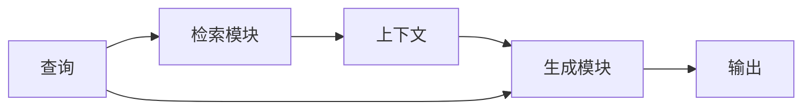

# 【LangChain编程：从入门到实践】RAG技术的关键挑战

## 1. 背景介绍

### 1.1 问题的由来

在当今信息时代,海量的非结构化数据(如文本、图像、视频等)的存在,为人工智能系统带来了巨大的挑战。传统的检索系统往往无法从这些非结构化数据中高效地提取有价值的信息。因此,如何利用人工智能技术来处理和利用这些海量非结构化数据,成为了一个亟待解决的问题。

### 1.2 研究现状

近年来,随着自然语言处理(NLP)和机器学习技术的不断发展,一种新兴的技术——检索增强生成(Retrieval Augmented Generation,RAG)应运而生。RAG技术将检索和生成两种范式相结合,旨在从海量非结构化数据中检索相关信息,并利用生成模型生成高质量的输出。

目前,RAG技术已经在问答系统、文本摘要、内容生成等多个领域展现出了巨大的潜力。但同时,RAG技术也面临着一些关键挑战,如检索效率、信息质量、模型偏差等问题,这些问题亟待解决。

### 1.3 研究意义

RAG技术的研究和应用具有重要的理论和实践意义。从理论层面上,RAG技术将检索和生成两种范式相结合,为人工智能领域带来了新的思路和方法。从实践层面上,RAG技术可以帮助人们更好地利用海量非结构化数据,提高信息检索和内容生成的效率和质量,为各行各业带来巨大的价值。

### 1.4 本文结构

本文将全面介绍RAG技术的核心概念、算法原理、数学模型、项目实践、应用场景、工具资源等内容。同时,本文也将深入探讨RAG技术所面临的关键挑战,并对未来的发展趋势进行展望。

## 2. 核心概念与联系

RAG技术是一种将检索(Retrieval)和生成(Generation)两种范式相结合的新兴技术。其核心思想是利用检索模块从海量非结构化数据中检索相关信息,然后将检索到的信息作为上下文输入到生成模型中,生成高质量的输出。

RAG技术的核心概念包括:

1. **检索模块(Retriever)**:负责从海量非结构化数据中检索与查询相关的信息片段。常用的检索模块包括TF-IDF、BM25、密集检索(Dense Retrieval)等。

2. **生成模块(Generator)**:利用检索到的信息作为上下文,结合查询,生成高质量的输出。常用的生成模块包括GPT、BART、T5等大型语言模型。

3. **上下文(Context)**:由检索模块检索到的相关信息片段,作为生成模块的输入上下文。

4. **查询(Query)**:用户的输入查询,作为检索模块和生成模块的输入。

5. **输出(Output)**:生成模块根据上下文和查询生成的最终输出。

这些核心概念之间的联系如下所示:

RAG技术的核心在于检索模块和生成模块的协同工作。检索模块从海量数据中检索相关信息,生成模块利用这些信息作为上下文,结合查询生成高质量的输出。

## 3. 核心算法原理 & 具体操作步骤

### 3.1 算法原理概述

RAG技术的核心算法原理可以概括为以下几个步骤:

1. **查询理解**:将用户的自然语言查询转换为机器可以理解的表示形式。

2. **信息检索**:利用检索模块从海量非结构化数据中检索与查询相关的信息片段。

3. **上下文构建**:将检索到的信息片段组合成上下文,作为生成模块的输入。

4. **生成输出**:生成模块利用上下文和查询,生成高质量的输出。

5. **输出后处理**:对生成模块的输出进行后处理,如去重、排序、格式化等。

### 3.2 算法步骤详解

1. **查询理解**

   - 将自然语言查询转换为机器可以理解的表示形式,如词向量、句向量等。
   - 常用的查询理解方法包括词袋模型(Bag-of-Words)、词嵌入(Word Embeddings)、预训练语言模型(Pre-trained Language Models)等。

2. **信息检索**

   - 利用检索模块从海量非结构化数据中检索与查询相关的信息片段。
   - 常用的检索模块包括:
     - TF-IDF:基于词频-逆文档频率的传统检索方法。
     - BM25:一种改进的基于概率模型的检索算法。
     - 密集检索(Dense Retrieval):利用深度学习模型将文本映射到密集向量空间,然后基于向量相似性进行检索。

3. **上下文构建**

   - 将检索到的信息片段组合成上下文,作为生成模块的输入。
   - 常用的上下文构建方法包括:
     - 简单拼接:将检索到的信息片段按照相关性排序,拼接成上下文。
     - 重要性加权:根据信息片段的相关性,对它们进行加权,构建加权上下文。
     - 主题聚类:将信息片段按照主题进行聚类,构建多个上下文。

4. **生成输出**

   - 生成模块利用上下文和查询,生成高质量的输出。
   - 常用的生成模块包括:
     - GPT:基于Transformer的自回归生成模型。
     - BART:基于Transformer的序列到序列生成模型。
     - T5:Google推出的统一的文本到文本转换模型。

5. **输出后处理**

   - 对生成模块的输出进行后处理,如去重、排序、格式化等。
   - 常用的后处理方法包括:
     - 去重:去除输出中的重复内容。
     - 排序:根据相关性或其他指标对输出进行排序。
     - 格式化:对输出进行格式化,如添加标题、段落等。

### 3.3 算法优缺点

**优点**:

- 利用检索模块从海量非结构化数据中检索相关信息,可以提高生成输出的准确性和信息丰富度。
- 生成模块可以根据上下文和查询生成高质量的输出,具有很强的生成能力。
- 检索和生成两种范式的结合,为人工智能系统带来了新的思路和方法。

**缺点**:

- 检索模块的性能直接影响到上下文的质量,进而影响生成输出的质量。
- 生成模块可能会产生不一致、不相关或者有偏差的输出。
- 算法的复杂性较高,需要对检索模块和生成模块进行精心设计和优化。

### 3.4 算法应用领域

RAG技术可以应用于多个领域,包括但不限于:

- **问答系统**:利用RAG技术从知识库中检索相关信息,生成高质量的问题回答。
- **文本摘要**:利用RAG技术从长文本中检索关键信息,生成简洁的文本摘要。
- **内容生成**:利用RAG技术从多源数据中检索相关信息,生成高质量的内容,如新闻报道、文案、故事等。
- **知识图谱构建**:利用RAG技术从非结构化数据中提取实体、关系等信息,构建知识图谱。
- **信息检索**:将RAG技术应用于传统的信息检索任务,提高检索的准确性和recall率。

## 4. 数学模型和公式 & 详细讲解 & 举例说明

### 4.1 数学模型构建

RAG技术中,检索模块和生成模块都可以使用不同的数学模型。下面我们分别介绍这两个模块的数学模型。

**检索模块数学模型**

检索模块的目标是从海量非结构化数据中检索与查询相关的信息片段。常用的检索模型包括:

1. **TF-IDF模型**

TF-IDF模型是一种基于词频-逆文档频率的传统检索模型。对于查询 $q$ 和文档 $d$,它们的相似度可以表示为:

$$\text{sim}(q, d) = \sum_{t \in q \cap d} \text{tf}(t, d) \cdot \text{idf}(t)$$

其中 $\text{tf}(t, d)$ 表示词 $t$ 在文档 $d$ 中的词频, $\text{idf}(t)$ 表示词 $t$ 的逆文档频率,用于衡量词 $t$ 的重要性。

2. **BM25模型**

BM25是一种改进的基于概率模型的检索算法,它考虑了文档长度的影响。对于查询 $q$ 和文档 $d$,它们的相似度可以表示为:

$$\text{sim}_{\text{BM25}}(q, d) = \sum_{t \in q} \text{idf}(t) \cdot \frac{f(t, d) \cdot (k_1 + 1)}{f(t, d) + k_1 \cdot \left(1 - b + b \cdot \frac{|d|}{\text{avgdl}}\right)}$$

其中 $f(t, d)$ 表示词 $t$ 在文档 $d$ 中的词频, $|d|$ 表示文档 $d$ 的长度, $\text{avgdl}$ 表示文档集合的平均长度, $k_1$ 和 $b$ 是超参数。

3. **密集检索模型**

密集检索模型利用深度学习将文本映射到密集向量空间,然后基于向量相似性进行检索。常用的模型包括双塔模型(Dual-Encoder)和交叉模型(Cross-Encoder)。

对于查询 $q$ 和文档 $d$,它们的相似度可以表示为:

$$\text{sim}_{\text{dense}}(q, d) = f(q)^\top g(d)$$

其中 $f(\cdot)$ 和 $g(\cdot)$ 分别表示查询编码器和文档编码器,它们将查询和文档映射到同一个密集向量空间。

**生成模块数学模型**

生成模块的目标是利用检索到的信息作为上下文,结合查询生成高质量的输出。常用的生成模型包括:

1. **GPT模型**

GPT是一种基于Transformer的自回归生成模型。对于输入序列 $X = (x_1, x_2, \dots, x_n)$,它的目标是最大化生成序列 $Y = (y_1, y_2, \dots, y_m)$ 的条件概率:

$$P(Y|X) = \prod_{i=1}^m P(y_i|y_{<i}, X)$$

其中 $y_{<i}$ 表示序列 $Y$ 中位置 $i$ 之前的所有tokens。

2. **BART模型**

BART是一种基于Transformer的序列到序列生成模型。对于输入序列 $X$ 和输出序列 $Y$,它的目标是最大化生成序列 $Y$ 的条件概率:

$$P(Y|X) = \prod_{i=1}^m P(y_i|y_{<i}, X)$$

与GPT不同的是,BART在训练时使用了掩码语言模型(Masked Language Model)和序列到序列的重构任务,使得它具有更强的生成能力。

3. **T5模型**

T5是Google推出的统一的文本到文本转换模型。它将所有的NLP任务都转换为序列到序列的形式,并使用一个统一的模型进行训练和推理。对于输入序列 $X$ 和输出序列 $Y$,T5的目标也是最大化生成序列 $Y$ 的条件概率:

$$P(Y|X) = \prod_{i=1}^m P(y_i|y_{<i}, X)$$

T5在预训练时使用了多种任务,如机器翻译、问答、文本摘要等,使得它具有很强的泛化能力。

### 4.2 公式推导过程

在这一小节,我们将详细推导TF-IDF模型和BM25模型的公式,以加深对这两种检索模型的理解。

**TF-IDF模型公式推导**

TF-IDF模型的核心思想是:一个词在文档中出现的次数越多,该词对于表示文档的主题就越重要;但同时,如果一个词在整个文档集合中出现的频率越高,那么它对于区分