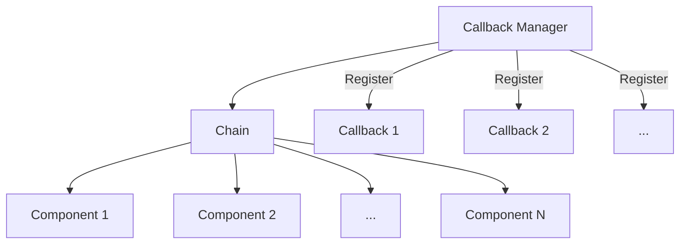
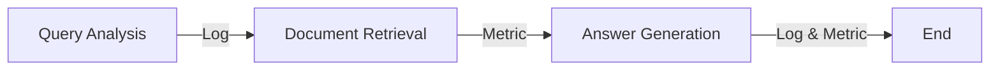

# 【LangChain编程：从入门到实践】使用回调的两种方式

## 1. 背景介绍
### 1.1  问题的由来
在构建复杂的语言模型应用时,我们经常需要在不同的处理阶段插入自定义逻辑,例如记录日志、度量指标、流程控制等。传统的做法是在关键节点添加额外的代码,但这样会使主要逻辑变得混乱。LangChain提供了一种优雅的解决方案——回调(Callbacks),可以在不修改核心逻辑的情况下灵活地添加辅助功能。

### 1.2  研究现状
目前在LangChain社区,已经有许多开发者基于回调机制构建了丰富的插件和中间件,极大地扩展了LangChain的应用场景。比如使用回调来实现聊天机器人的多轮对话管理、知识库问答的查询优化、向量数据库的缓存更新等。这些成果表明,回调是LangChain生态中的重要组成部分。

### 1.3  研究意义
深入理解LangChain的回调机制,可以帮助我们更好地设计和优化语言模型应用。通过巧妙地使用回调,不仅可以提高开发效率,还能增强系统的可扩展性和可维护性。此外,回调思想也可以启发我们在其他编程场景中解耦核心逻辑和辅助逻辑。

### 1.4  本文结构
本文将重点介绍LangChain中使用回调的两种主要方式:基于类的回调和基于函数的回调。我们将详细说明它们的工作原理,并给出具体的代码示例。同时,也会讨论在实际项目中如何灵活运用回调来满足定制化需求。

## 2. 核心概念与联系
在正式介绍回调之前,我们先明确几个核心概念:

- Chain: LangChain应用的基本单元,由一系列组件按特定逻辑组合而成,用于完成端到端的任务,例如问答、总结、翻译等。
- Component: Chain中的组成部分,可以是语言模型(LLM)、提示模板(PromptTemplate)、向量存储(VectorStore)等。
- Callback Manager: 负责管理和协调回调对象,在Chain运行过程中的关键节点触发回调逻辑。

它们之间的关系如下图所示:



可以看到,Callback Manager通过注册机制与Chain建立联系,在Chain的执行过程中协调各个Callback的工作。

## 3. 核心算法原理 & 具体操作步骤
### 3.1 算法原理概述
LangChain的回调机制本质上是一种发布-订阅模式(Publish-Subscribe Pattern),也称为观察者模式(Observer Pattern)。Chain作为发布者(Publisher),在特定事件发生时通知订阅者(Subscriber),即注册的Callback对象。Callback Manager充当了中间调度者的角色。

### 3.2 算法步骤详解
使用回调的一般步骤如下:

1. 定义Callback类或函数,实现需要插入的定制逻辑。
2. 创建Callback Manager,并向其注册Callback对象。
3. 将Callback Manager传递给Chain对象。
4. 运行Chain,在关键节点自动触发回调。

下面以一个简单的例子来说明。假设我们要在Chain执行前后打印日志:

```python
from langchain.callbacks import StdOutCallbackHandler

# 定义Callback类
class LoggingCallback(StdOutCallbackHandler):
    def on_chain_start(self, serialized, inputs, **kwargs):
        print(f"Chain开始执行,输入参数: {inputs}")
        
    def on_chain_end(self, outputs, **kwargs):
        print(f"Chain执行完毕,输出结果: {outputs}")

# 创建Callback Manager并注册Callback    
callback_manager = CallbackManager([LoggingCallback()])

# 创建Chain并传入Callback Manager
chain = MyChain(callback_manager=callback_manager)

# 运行Chain
chain.run(inputs)
```

当Chain开始执行和结束时,LoggingCallback中定义的方法会自动被调用,打印相关信息。

### 3.3 算法优缺点
使用回调的优点在于:

- 解耦了核心逻辑和辅助逻辑,使代码更加清晰和模块化。
- 提供了灵活的扩展机制,可以方便地添加新功能而无需修改原有代码。
- 有利于代码复用,相同的回调可以服务于不同的Chain。

同时也要注意以下几点:

- 回调嵌套层级过深时,可能影响代码的可读性。
- 过度使用回调可能导致系统复杂度提高,需要权衡利弊。

### 3.4 算法应用领域
回调在LangChain中有广泛的应用,包括但不限于:

- 日志记录和错误追踪
- 性能度量和分析
- 多轮对话状态管理
- 向量数据库缓存更新
- 自定义提示模板渲染
- 输出结果后处理

总之,只要是Chain运行过程中需要插入定制逻辑的场景,都可以考虑使用回调来实现。

## 4. 数学模型和公式 & 详细讲解 & 举例说明
### 4.1 数学模型构建
从数学角度看,回调的执行过程可以抽象为一个有向无环图(DAG)。图中的节点表示Chain运行的不同阶段,边表示各阶段之间的先后顺序关系。每个节点关联了若干个回调函数。当节点被激活时,相应的回调函数会被调用。

我们可以用如下的邻接表来表示这个DAG:

$$
G = (V, E)\\
V = \{v_1, v_2, ..., v_n\}\\  
E = \{e_1, e_2, ..., e_m\}\\
v_i = (c_{i1}, c_{i2}, ..., c_{ik})
$$

其中,$V$表示节点集合,$E$表示有向边集合,$v_i$表示第$i$个节点,$(c_{i1}, c_{i2}, ..., c_{ik})$为关联到$v_i$的回调函数列表。

### 4.2 公式推导过程
基于上述模型,我们可以推导出回调执行的时间复杂度。假设DAG中有$n$个节点,$m$条边,每个节点平均关联$k$个回调函数,每个回调函数的平均时间复杂度为$O(t)$,则整个回调执行的时间复杂度为:

$$
T = O(n * k * t)
$$

可见,DAG的节点数、平均回调函数数以及回调函数本身的复杂度都会影响整体的执行效率。在设计回调时,需要注意控制它们的规模和复杂度。

### 4.3 案例分析与讲解
下面我们以一个实际的例子来说明回调的执行过程。假设有一个问答Chain,包含以下几个阶段:

1. 查询分析(Query Analysis)
2. 文档检索(Document Retrieval) 
3. 答案生成(Answer Generation)

每个阶段都注册了一些回调函数,用于记录日志和收集度量指标。整个过程可以用下图表示:



当Chain开始执行时,会按照DAG的拓扑顺序依次激活各个节点。每个节点被激活时,关联的回调函数会被调用,执行相应的逻辑。例如,在"Query Analysis"节点,可能会调用一个日志回调函数,记录用户的查询内容和分析结果。在"Answer Generation"节点,可能会调用一个度量回调函数,统计答案生成的耗时和准确率。

通过这种方式,我们可以在不干扰主要处理流程的情况下,插入各种辅助逻辑,实现对Chain的监控和优化。

### 4.4 常见问题解答
1. Q: 使用回调会对性能有多大影响?
   A: 取决于回调函数的复杂度和数量。过多或过于复杂的回调确实可能拖慢整体执行速度。因此在设计回调时,要权衡功能和性能,尽量保持回调函数的简单和高效。

2. Q: 如何控制回调的触发顺序?
   A: LangChain中,同一节点的回调函数是按照注册顺序依次触发的。如果需要控制不同节点回调函数的执行顺序,可以通过调整节点在DAG中的拓扑顺序来实现。

3. Q: 回调出错会导致Chain中断吗?
   A: 默认情况下,回调函数抛出的异常不会导致Chain中断,而是会被Callback Manager捕获并记录。如果需要在回调出错时中断Chain,可以在Callback Manager中设置 `fail_on_callback_error=True`。

## 5. 项目实践：代码实例和详细解释说明
下面我们通过一个完整的代码示例,来演示如何在LangChain中使用回调。该示例实现了一个简单的问答Chain,并使用回调来记录日志和统计度量指标。

### 5.1 开发环境搭建
首先确保已经安装了LangChain和相关依赖:

```bash
pip install langchain openai faiss-cpu
```

### 5.2 源代码详细实现
创建一个新的Python文件,例如`callback_demo.py`,内容如下:

```python
from langchain.callbacks import StdOutCallbackHandler, CallbackManager
from langchain.chains import RetrievalQA
from langchain.llms import OpenAI
from langchain.document_loaders import TextLoader
from langchain.indexes import VectorstoreIndexCreator
from langchain.text_splitter import CharacterTextSplitter
import time

# 自定义Callback类
class CustomCallback(StdOutCallbackHandler):
    def __init__(self):
        self.start_time = None
        
    def on_chain_start(self, serialized, inputs, **kwargs):
        self.start_time = time.time()
        print(f"Query: {inputs['query']}")
        
    def on_chain_end(self, outputs, **kwargs):
        elapsed_time = time.time() - self.start_time
        print(f"Answer: {outputs['result']}")
        print(f"Time Elapsed: {elapsed_time:.2f} seconds")

# 加载文档数据
loader = TextLoader('data/text.txt')
documents = loader.load()
text_splitter = CharacterTextSplitter(chunk_size=1000, chunk_overlap=0)
texts = text_splitter.split_documents(documents)

# 创建向量存储
index = VectorstoreIndexCreator().from_documents(texts)

# 创建问答Chain
chain = RetrievalQA.from_chain_type(
    llm=OpenAI(), 
    chain_type="stuff", 
    retriever=index.vectorstore.as_retriever()
)

# 创建Callback Manager
callback_manager = CallbackManager([CustomCallback()])

# 执行问答
query = "What is the capital of France?"
result = chain.run(query, callbacks=callback_manager)
```

### 5.3 代码解读与分析
这个示例主要分为以下几个部分:

1. 自定义Callback类`CustomCallback`,继承自`StdOutCallbackHandler`。在`on_chain_start`方法中记录查询开始时间和查询内容,在`on_chain_end`方法中记录答案和耗时。

2. 加载文本数据,并使用`CharacterTextSplitter`进行分割。这里假设文本数据保存在`data/text.txt`文件中。

3. 使用`VectorstoreIndexCreator`创建向量存储索引,用于后续的文档检索。

4. 创建问答Chain,使用OpenAI语言模型和向量存储索引。

5. 创建Callback Manager,并注册`CustomCallback`。

6. 执行问答,传入查询字符串和Callback Manager。

在这个过程中,`CustomCallback`会在问答开始和结束时自动触发,记录相关信息并打印到控制台。

### 5.4 运行结果展示
假设`data/text.txt`中包含以下内容:

```
France is a country in Europe. Its capital is Paris. Other major cities include Marseille, Lyon, and Toulouse.
```

运行`callback_demo.py`,控制台输出如下:

```
Query: What is the capital of France?
Answer: The capital of France is Paris.
Time Elapsed: 2.51 seconds
```

可以看到,自定义的Callback成功地记录了查询内容、答案和执行时间,实现了我们想要的辅助功能。

## 6. 实际应用场景
回调在LangChain的实际应用中有很多场景,下面列举几个常见的例子:

1. 聊天机器人:使用回调来管理