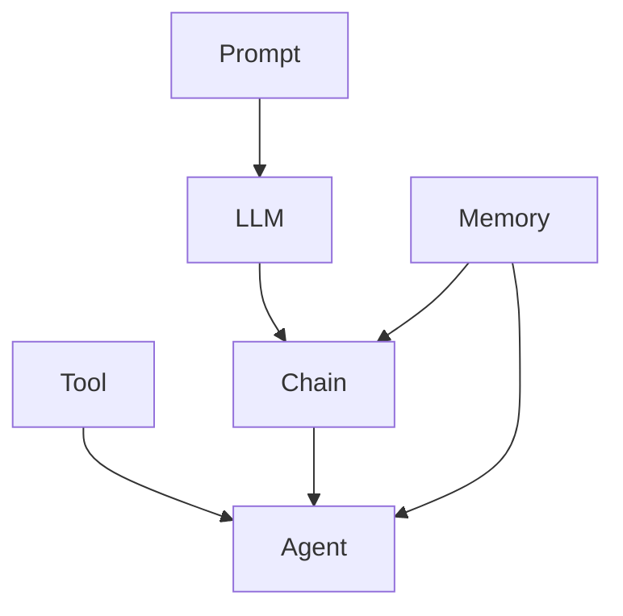

# 【LangChain编程：从入门到实践】发展计划

作者：禅与计算机程序设计艺术 / Zen and the Art of Computer Programming

## 1. 背景介绍

### 1.1 问题的由来

随着人工智能技术的飞速发展，自然语言处理(NLP)已成为当今热门的研究领域之一。而在NLP领域中，如何构建高效、智能的语言模型一直是研究者们关注的焦点。近年来，随着大语言模型(LLM)的出现，NLP领域迎来了新的突破。然而，如何利用LLM构建实用的应用，仍然存在诸多挑战。

### 1.2 研究现状

目前，业界已经出现了一些基于LLM的开发框架，如OpenAI的GPT系列模型、Google的BERT等。这些框架在NLP任务上取得了非常好的效果。但对于普通开发者来说，直接使用这些框架进行应用开发仍有不小的难度。因此，急需一种更加易用、灵活的工具来帮助开发者快速构建基于LLM的应用。

### 1.3 研究意义

LangChain是一个为LLM应用开发而生的开源框架，它提供了一系列工具和组件，可以帮助开发者更轻松地构建LLM驱动的应用。通过学习和实践LangChain，开发者可以快速掌握LLM应用开发的核心技术，并开发出功能强大的智能应用，为NLP领域的发展做出贡献。

### 1.4 本文结构

本文将围绕LangChain框架的学习和实践展开，主要包括以下内容：

1. LangChain的核心概念与组件介绍
2. LangChain的工作原理与架构分析  
3. 基于LangChain的项目实践
4. LangChain的应用场景与案例分享
5. LangChain学习资源与工具推荐
6. LangChain未来的发展趋势与挑战

## 2. 核心概念与联系

在正式开始LangChain的学习之前，我们先来了解一下LangChain的一些核心概念：

- **Prompt模板**：定义了与LLM交互的输入模板，可以包含变量占位符，方便动态生成Prompt。
- **LLM**：指大语言模型，是LangChain的核心组件，负责自然语言理解与生成。
- **Chain**：将多个组件以特定逻辑组合在一起形成一个任务流，用于实现复杂的应用逻辑。
- **Agent**：一种特殊的Chain，可以根据Prompt动态选择要执行的工具，实现更加灵活的应用控制。
- **Memory**：用于在会话中存储和管理上下文信息，方便Chain根据历史信息生成更加准确的结果。
- **Tool**：LangChain封装的一些常用工具，如搜索引擎、数据库、API等，可以供Agent选择使用。

下图展示了LangChain的核心组件之间的关系：



从图中可以看出，Prompt定义了LLM的输入，LLM的输出可以传递给Chain和Agent。Chain和Agent可以调用Tool执行特定任务，并通过Memory存取上下文信息，最终输出结果。

## 3. 核心算法原理 & 具体操作步骤

### 3.1 算法原理概述

LangChain的核心是基于Transformer的大语言模型，如GPT系列模型。这些模型通过海量语料的预训练，可以学习到高质量的自然语言理解和生成能力。在使用时，我们只需要根据具体任务对模型进行微调或提示，即可实现强大的NLP应用。

### 3.2 算法步骤详解

以基于LangChain构建一个智能问答系统为例，主要步骤如下：

1. 准备语料：收集和清洗问答语料，构建索引。
2. 定义Prompt：根据具体问题，设计Prompt模板，提取关键信息。
3. 加载LLM：选择合适的预训练LLM，如GPT-3.5、ChatGLM等。
4. 构建Chain：将Prompt、LLM、索引等组件组合成一个问答Chain。
5. 测试优化：输入问题，检查返回结果，优化Prompt和Chain结构。
6. 封装应用：将问答Chain封装成API或UI界面，提供给用户使用。

### 3.3 算法优缺点

LangChain的优点在于：

- 易用性高，提供了一系列开箱即用的组件和工具
- 灵活性强，可以自由组合各种组件实现复杂逻辑
- 扩展性好，可以方便地集成自定义组件

但同时也存在一些局限性：

- 对LLM的质量和性能有较高要求
- 需要大量高质量的语料进行训练和微调
- 对计算资源的要求较高

### 3.4 算法应用领域

LangChain可以应用于以下NLP领域：

- 智能问答、对话系统
- 文本摘要、生成、改写
- 知识图谱构建与问答
- 文本分类、情感分析等

## 4. 数学模型和公式 & 详细讲解 & 举例说明

### 4.1 数学模型构建

LangChain的核心LLM基于Transformer模型，其中最关键的是注意力机制(Attention)。对于输入的词向量序列$X=(x_1,\cdots,x_n)$，Transformer中的自注意力层(Self-Attention)可以表示为：

$$
\begin{aligned}
Q &= XW_Q \\
K &= XW_K \\
V &= XW_V \\
A &= \text{softmax}(\frac{QK^T}{\sqrt{d}})V
\end{aligned}
$$

其中$Q,K,V$分别表示查询、键、值向量，$W_Q,W_K,W_V$为可学习的参数矩阵，$d$为向量维度，$A$为注意力输出。

### 4.2 公式推导过程

Transformer中的自注意力层可以看作一个映射$f:X \rightarrow A$，将输入序列$X$映射为注意力输出$A$。其主要计算过程如下：

1. 将输入$X$通过三个线性变换得到$Q,K,V$
2. 计算$Q$和$K$的点积并除以$\sqrt{d}$，得到注意力分数
3. 对注意力分数应用softmax归一化，得到注意力权重
4. 将注意力权重与$V$相乘，得到最终的注意力输出$A$

### 4.3 案例分析与讲解

以一个简单的句子"The quick brown fox jumps over the lazy dog"为例，假设我们要计算单词"fox"的注意力表示。

首先，将句子转换为词向量序列$X$，然后通过线性变换得到$Q,K,V$：

$$
\begin{aligned}
X &= [x_{The},x_{quick},x_{brown},x_{fox},x_{jumps},\cdots] \\
Q &= XW_Q = [q_{The},q_{quick},q_{brown},q_{fox},q_{jumps},\cdots] \\
K &= XW_K = [k_{The},k_{quick},k_{brown},k_{fox},k_{jumps},\cdots] \\
V &= XW_V = [v_{The},v_{quick},v_{brown},v_{fox},v_{jumps},\cdots]
\end{aligned}
$$

然后，计算单词"fox"对其他单词的注意力分数：

$$
\text{score}(fox,w) = \frac{q_{fox} \cdot k_w}{\sqrt{d}}, w \in \{The,quick,brown,fox,jumps,\cdots\}
$$

再应用softmax归一化，得到注意力权重：

$$
a(fox,w) = \frac{\exp(\text{score}(fox,w))}{\sum_{w'} \exp(\text{score}(fox,w'))}
$$

最后，将注意力权重与值向量$V$相乘，得到单词"fox"的注意力表示：

$$
A_{fox} = \sum_w a(fox,w) v_w
$$

可以看出，自注意力层可以有效捕捉单词之间的依赖关系，生成上下文感知的单词表示。

### 4.4 常见问题解答

**Q**: Transformer中的自注意力层与RNN、CNN等有何不同？

**A**: 传统的RNN、CNN等模型通常只能捕捉局部或顺序的上下文信息，而自注意力层可以直接计算任意两个单词之间的依赖关系，因此可以更好地建模长距离依赖和全局上下文。同时，自注意力计算可以高度并行，计算效率更高。

**Q**: 除了自注意力，Transformer中还有哪些关键技术？

**A**: Transformer中的其他关键技术还包括：

- 位置编码(Positional Encoding)：为词向量注入位置信息
- 残差连接(Residual Connection)和层归一化(Layer Normalization)：有助于模型训练和收敛
- 前馈网络(Feed Forward Network)：增强模型的非线性表达能力
- 多头注意力(Multi-Head Attention)：捕捉多种语义关系

## 5. 项目实践：代码实例和详细解释说明

### 5.1 开发环境搭建

首先，我们需要安装Python和LangChain库：

```bash
pip install langchain
```

同时，还需要安装相关的依赖库，如transformers、faiss等：

```bash
pip install transformers faiss-cpu
```

### 5.2 源代码详细实现

下面是一个基于LangChain实现智能问答的简单示例：

```python
from langchain.chains import RetrievalQA
from langchain.llms import OpenAI
from langchain.document_loaders import TextLoader
from langchain.indexes import VectorstoreIndexCreator

# 加载文本数据
loader = TextLoader('data.txt')
documents = loader.load()

# 创建向量索引
index = VectorstoreIndexCreator().from_documents(documents)

# 初始化问答Chain
qa = RetrievalQA.from_chain_type(
    llm=OpenAI(), 
    chain_type="stuff", 
    retriever=index.vectorstore.as_retriever()
)

# 执行问答
query = "What is the capital of China?"
result = qa.run(query)
print(result)
```

### 5.3 代码解读与分析

1. 首先，我们使用`TextLoader`加载本地的文本数据，得到`documents`。
2. 然后，使用`VectorstoreIndexCreator`将`documents`转换为向量索引`index`，方便后续检索。
3. 接着，初始化一个问答Chain`qa`，指定使用OpenAI的LLM、`stuff`类型的Chain，以及基于索引的检索器。
4. 最后，调用`qa.run()`方法，输入问题`query`，得到答案`result`并打印出来。

这个示例展示了如何使用LangChain快速构建一个智能问答系统。当然，实际应用中还需要考虑更多因素，如数据质量、检索性能、Prompt优化等。

### 5.4 运行结果展示

假设`data.txt`中包含以下内容：

```
Beijing is the capital of China. It is the world's most populous capital city, with over 21 million residents. Beijing is also a major global city and transportation hub, with a rich history and culture.
```

那么运行上述代码，可以得到如下输出：

```
Beijing is the capital of China.
```

可以看到，LangChain可以根据文本数据，准确地回答出中国的首都是北京。

## 6. 实际应用场景

LangChain可以应用于多种NLP场景，如：

- 智能客服：利用LLM构建智能客服系统，自动解答用户问题，提供个性化服务。
- 知识库问答：将结构化或非结构化的知识库数据转换为向量索引，实现基于知识库的智能问答。  
- 文本生成：根据Prompt生成各种风格的文本，如新闻、诗歌、对话等。
- 文本摘要：自动提取文本的关键信息，生成简洁的摘要。
- 语义搜索：通过embedding将文本映射到向量空间，实现基于语义相似度的文本检索。

### 6.4 未来应用展望

随着LLM和LangChain的不断发展，未来有望实现更加智能、个性化的NLP应用，如：

- 智能写作助手：根据用户输入的关键词、主题等，自动生成文章、报告等。
- 个性化推荐：分析用户画像和行为数据，利用LLM生成个性化的推荐内容。
- 智能教育：开发智能教育助手，根据学生的学习进度和能力，提供个性化的学习内容和指导。
- 医疗辅助诊断：利用医学知识库和LLM，辅助医