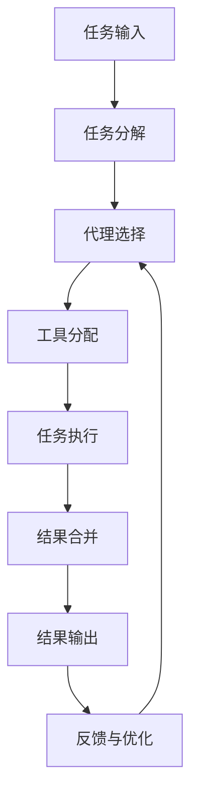

# 【LangChain编程：从入门到实践】大模型原理解释

## 1. 背景介绍

### 1.1 问题的由来

在当今的人工智能领域,大型语言模型(Large Language Models, LLMs)已经成为了一股不可忽视的力量。这些模型通过在海量文本数据上进行训练,展现出了惊人的自然语言理解和生成能力,为各种应用场景带来了新的可能性。然而,如何有效地利用这些庞大的语言模型,并将它们集成到实际应用程序中,仍然是一个巨大的挑战。

### 1.2 研究现状

为了解决这一问题,出现了一些框架和库,旨在简化大型语言模型的使用和集成过程。其中,LangChain就是一个备受关注的开源项目,它为开发人员提供了一种统一的方式来构建基于大型语言模型的应用程序。LangChain支持多种语言模型,包括GPT-3、BERT、RoBERTa等,并提供了一系列工具和组件,使开发人员能够轻松地组合和扩展这些模型的功能。

### 1.3 研究意义

LangChain的出现为开发人员打开了一扇通往大型语言模型世界的大门。通过学习和掌握LangChain,开发人员可以更加高效地利用这些强大的语言模型,构建出各种创新的应用程序,如智能助手、自动化系统、内容生成工具等。同时,LangChain的模块化设计也使得开发人员能够轻松地扩展和定制其功能,满足特定的业务需求。

### 1.4 本文结构

本文将全面介绍LangChain的核心概念、原理和实践应用。我们将从LangChain的背景和架构入手,深入探讨其核心算法和数学模型,并通过实际案例和代码示例,帮助读者掌握LangChain的使用方法。最后,我们还将探讨LangChain的未来发展趋势和挑战,为读者提供更广阔的视野。

## 2. 核心概念与联系

在深入探讨LangChain的核心原理之前,我们首先需要了解一些基本概念和它们之间的联系。

### 2.1 大型语言模型(LLMs)

大型语言模型(Large Language Models, LLMs)是一种基于深度学习技术训练的自然语言处理模型。它们通过在海量文本数据上进行预训练,学习到了丰富的语言知识和上下文信息。常见的LLMs包括GPT-3、BERT、RoBERTa等。这些模型展现出了惊人的自然语言理解和生成能力,但同时也存在一些局限性,如缺乏持久的记忆能力、难以进行多步骤推理等。

### 2.2 LangChain

LangChain是一个旨在简化大型语言模型使用和集成的开源框架。它提供了一系列模块化的组件和工具,使开发人员能够轻松地构建基于LLMs的应用程序。LangChain支持多种LLMs,并提供了一致的接口和工作流,使开发人员能够专注于应用程序的逻辑,而不必过多关注底层模型的细节。

### 2.3 LangChain组件

LangChain由多个核心组件组成,每个组件都扮演着特定的角色。以下是一些主要组件:

- **Agents**:代理是LangChain中的核心概念之一。它们封装了LLMs的功能,并提供了一种结构化的方式来定义和执行任务。代理可以组合多个LLMs和其他工具,实现复杂的任务流程。

- **Prompts**:提示(Prompts)是向LLMs输入的指令或上下文信息。LangChain提供了多种方式来构建和管理提示,以获得更好的模型输出。

- **Chains**:链(Chains)是LangChain中的另一个核心概念。它们将多个组件(如LLMs、代理、工具等)连接在一起,形成一个完整的工作流程。开发人员可以定义自己的链,或使用LangChain提供的预构建链。

- **Memory**:内存组件为LLMs提供了持久的记忆能力,使它们能够跟踪和记住之前的对话和上下文信息。这对于进行多步骤推理和任务执行至关重要。

- **Tools**:工具是LangChain中的一种特殊组件,它们封装了各种外部服务和功能,如Web搜索、数据库查询、计算等。代理可以调用这些工具来完成特定的任务。

这些组件相互协作,为开发人员提供了一种灵活且强大的方式来构建基于LLMs的应用程序。

## 3. 核心算法原理 & 具体操作步骤

### 3.1 算法原理概述

LangChain的核心算法原理基于一种称为"构成性语言模型"(Constitutive Language Model)的概念。这种模型旨在通过组合多个LLMs和其他工具,构建出一个更加智能和强大的系统。

构成性语言模型的核心思想是将复杂的任务分解为多个子任务,并为每个子任务分配合适的LLM或工具。这些子任务可以按照特定的顺序或工作流程执行,并将各自的输出结合起来,形成最终的结果。

为了实现这一目标,LangChain采用了一种称为"代理-工具"(Agent-Tool)的架构。代理扮演着任务协调和决策的角色,而工具则提供了各种功能,如Web搜索、数据库查询、计算等。代理通过与工具交互,完成复杂的任务。

### 3.2 算法步骤详解

LangChain的核心算法可以概括为以下几个步骤:

1. **任务分解**:首先,将复杂的任务分解为多个子任务。这可以通过手动定义或使用LangChain提供的自动任务分解功能来实现。

2. **代理选择**:根据任务的性质和要求,选择合适的代理来协调和执行任务。LangChain提供了多种预构建的代理,如序列代理、反思代理等。

3. **工具分配**:为每个子任务分配合适的工具。这些工具可以是LLMs、Web搜索工具、数据库查询工具等。

4. **任务执行**:代理与分配的工具交互,按照预定义的工作流程执行每个子任务。

5. **结果合并**:将各个子任务的输出结合起来,形成最终的任务结果。

6. **反馈与优化**:根据任务执行的结果和反馈,优化代理的决策策略和工具的使用方式,以提高系统的整体性能。

这种分而治之的方法使LangChain能够灵活地组合和利用多种LLMs和工具,从而解决复杂的任务。同时,代理的决策能力和工具的可扩展性也为系统带来了强大的灵活性和可定制性。

### 3.3 算法优缺点

LangChain的核心算法具有以下优点:

- **模块化设计**:代理、工具和其他组件的模块化设计使得系统具有良好的可扩展性和可定制性。

- **灵活性**:能够灵活地组合和利用多种LLMs和工具,解决复杂的任务。

- **决策能力**:代理具有一定的决策能力,可以根据任务要求选择合适的工具和执行策略。

- **可解释性**:通过分解任务和记录中间结果,系统的决策过程具有一定的可解释性。

然而,LangChain的算法也存在一些局限性和挑战:

- **任务分解困难**:对于某些复杂的任务,合理地分解成多个子任务并非一件容易的事情。

- **决策策略局限**:当前的代理决策策略还相对简单,难以处理一些复杂的场景。

- **工具依赖性**:系统的性能和功能在很大程度上依赖于所使用的LLMs和工具的质量。

- **可解释性挑战**:虽然系统具有一定的可解释性,但对于一些复杂的决策过程,仍然存在解释不足的问题。

### 3.4 算法应用领域

LangChain的核心算法可以应用于各种基于LLMs的应用场景,包括但不限于:

- **智能助手**:构建具有多功能和决策能力的智能助手系统。

- **自动化工作流**:自动化各种复杂的工作流程,如数据处理、内容生成等。

- **问答系统**:基于LLMs和外部知识源构建智能问答系统。

- **内容生成**:利用LLMs生成各种形式的内容,如文章、报告、代码等。

- **决策支持系统**:为决策过程提供智能支持和建议。

- **自然语言接口**:为各种应用程序提供自然语言接口,实现更友好的人机交互。

总的来说,LangChain为开发人员提供了一种灵活和强大的方式,将大型语言模型的能力融入到各种应用程序中,极大地扩展了LLMs的应用范围。

## 4. 数学模型和公式 & 详细讲解 & 举例说明

虽然LangChain主要关注于算法和系统架构方面,但它的核心原理和部分组件也与一些数学模型和公式密切相关。在本节中,我们将探讨一些与LangChain相关的数学模型和公式,并通过详细的讲解和案例分析,帮助读者更好地理解它们的作用和应用。

### 4.1 数学模型构建

#### 4.1.1 语言模型

大型语言模型(LLMs)是LangChain的核心组成部分,它们基于自然语言处理(NLP)领域的一些基础数学模型和算法。

一种常见的语言模型是基于n-gram的统计语言模型,它通过计算单词序列的概率来预测下一个单词。给定一个单词序列 $w_1, w_2, \dots, w_n$,它的概率可以表示为:

$$P(w_1, w_2, \dots, w_n) = \prod_{i=1}^n P(w_i | w_1, \dots, w_{i-1})$$

由于计算完整的条件概率是非常困难的,通常会引入马尔可夫假设,即一个单词的概率只依赖于前面有限个单词。对于n-gram模型,它的概率可以近似为:

$$P(w_1, w_2, \dots, w_n) \approx \prod_{i=1}^n P(w_i| w_{i-n+1}, \dots, w_{i-1})$$

其中,n是n-gram的大小。

虽然n-gram模型相对简单,但它为后来的神经网络语言模型奠定了基础。神经网络语言模型通过使用深度学习技术,能够捕捉更复杂的语言模式和上下文信息。

#### 4.1.2 代理决策模型

在LangChain中,代理扮演着任务协调和决策的角色。它需要根据当前的任务状态和可用的工具,选择合适的行动。这个过程可以建模为一个马尔可夫决策过程(Markov Decision Process, MDP)。

在MDP中,代理的决策过程可以表示为一个元组 $(S, A, P, R, \gamma)$,其中:

- $S$ 是状态集合,表示任务的当前状态。
- $A$ 是行动集合,表示代理可以执行的行动,如选择工具、提供输出等。
- $P(s' | s, a)$ 是状态转移概率,表示在状态 $s$ 下执行行动 $a$ 后,转移到状态 $s'$ 的概率。
- $R(s, a)$ 是即时奖励函数,表示在状态 $s$ 下执行行动 $a$ 所获得的即时奖励。
- $\gamma$ 是折现因子,用于平衡即时奖励和长期奖励的权重。

代理的目标是找到一个策略 $\pi: S \rightarrow A$,使得期望的累积奖励最大化:

$$\max_\pi \mathbb{E}\left[\sum_{t=0}^\infty \gamma^t R(s_t, a_t)\right]$$

其中,$a_t = \pi(s_t)$是代理在状态 $s_t$ 下根据策略 $\pi$ 选择