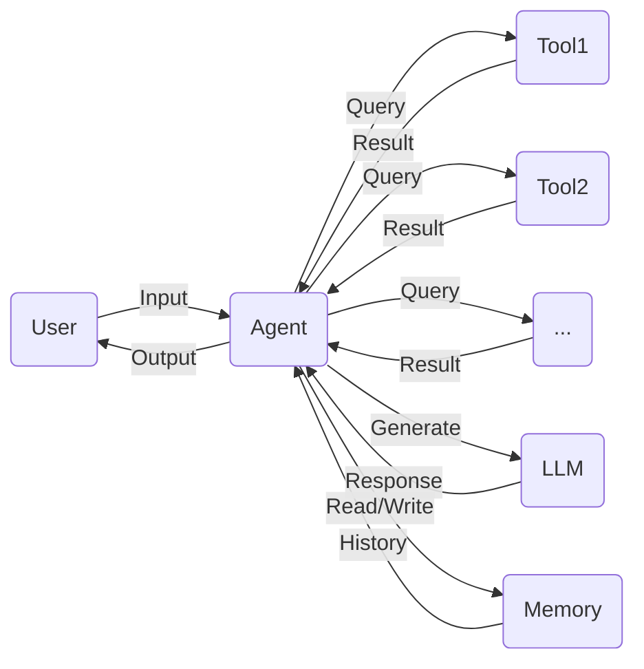

# 【LangChain编程：从入门到实践】将记忆组件接入代理

作者：禅与计算机程序设计艺术 / Zen and the Art of Computer Programming

## 1. 背景介绍

### 1.1 问题的由来

在构建智能对话系统时,我们经常会遇到一个问题:对话系统无法记住之前的对话内容,导致对话缺乏连贯性。用户每次提问时都需要重新描述上下文,这大大降低了用户体验。为了解决这个问题,我们需要为对话系统引入记忆机制,让它能够记住并利用之前的对话信息,从而生成更加自然、连贯的回复。

### 1.2 研究现状 

目前,业界已经提出了多种为对话系统引入记忆机制的方法。比较经典的是基于RNN的Seq2Seq模型,它通过将之前的对话编码成一个固定长度的向量,作为当前时刻的输入,从而将历史信息引入当前的对话生成中。此外还有基于Memory Network、Transformer等方法。

最近,一个名为LangChain的开源项目引起了广泛关注。它提供了一套灵活的组件,可以方便地将外部知识库、本地文档等接入语言模型,并且可以自定义Prompt、Chain等,非常适合用于构建定制化的智能对话系统。特别是它的Memory组件,为引入记忆机制提供了很好的支持。

### 1.3 研究意义

研究LangChain中的Memory组件,对于构建更加智能的对话系统具有重要意义:

1. 提升对话体验:引入记忆机制后,系统可以根据之前的对话信息,生成更加自然、连贯的回复,大大提升用户体验。

2. 个性化服务:记录用户之前的提问和回答,可以分析用户的兴趣爱好、知识水平等,从而提供更加个性化的服务。

3. 知识积累:将之前的对话保存下来,可以作为一种知识积累,供后续的对话学习和分析使用。

4. 应用广泛:记忆机制可以应用于智能客服、个人助理、陪伴聊天等多个领域,具有广阔的应用前景。

### 1.4 本文结构

本文将重点介绍如何使用LangChain提供的Memory组件,为对话系统引入记忆能力。内容安排如下:

- 介绍LangChain中的几种主要Memory类型及其特点
- 详细讲解如何将ConversationBufferMemory接入到对话代理中
- 介绍如何使用ConversationSummaryMemory对话总结记忆
- 探讨如何利用对话记忆实现更加智能的对话系统
- 分享一些实践中的经验和技巧

## 2. 核心概念与联系

在LangChain中,有几个核心概念需要了解:

- `Agent`:代理,由一个或多个`Tool`和`LLM`组成,可以用自然语言与用户进行交互,根据用户输入执行相应的动作。
- `Tool`:工具,执行特定功能的组件,如搜索、数据库查询、数学计算等,可以被`Agent`调用。
- `LLM`:大语言模型,用于理解用户输入和生成自然语言回复。
- `Memory`:记忆组件,用于存储之前的对话信息,供`Agent`调用,生成更加自然、连贯的回复。

它们之间的关系如下:



可以看到,`Agent`是核心组件,它接收用户输入,根据需要调用一个或多个`Tool`执行任务,将结果传给`LLM`生成回复。同时,`Agent`会与`Memory`组件交互,将当前对话写入记忆,并读取历史对话信息,传给`LLM`生成回复。最后将回复返回给用户。

因此,`Memory`组件在这个流程中起到了关键作用,它使得`Agent`能够根据之前的对话信息,生成更加自然、连贯的回复,提升整个对话系统的智能化水平。

## 3. 核心算法原理 & 具体操作步骤

### 3.1 算法原理概述

LangChain提供了多种Memory类型,它们在实现上略有不同,但基本原理是类似的:将当前轮次的对话保存下来,并在之后的对话中,将历史对话信息传入LLM生成回复。

以最常用的`ConversationBufferMemory`为例,其核心是维护一个对话缓冲区`messages`,用于按顺序存储之前的对话信息。每个对话由一个字典表示,包含`"role"`和`"content"`两个字段,分别表示说话者角色(如"human"、"ai")和说话内容。

当`Agent`收到用户输入时,会将其添加到`messages`中,然后将整个`messages`传入LLM生成回复。LLM会根据之前的对话信息,生成一个自然、连贯的回复。`Agent`将LLM生成的回复也添加到`messages`中,构成一个完整的对话轮次。

这个过程不断重复,`messages`中就会累积越来越多的对话信息,形成了一个完整的对话历史。通过将其传入LLM,就可以使得每次生成的回复都考虑了之前的对话上下文,从而得到更加自然、连贯的对话效果。

### 3.2 算法步骤详解

接下来,我们详细讲解如何使用`ConversationBufferMemory`构建一个有记忆功能的对话`Agent`:

1. 首先,创建一个`ConversationBufferMemory`实例,用于存储对话信息:

```python
from langchain.memory import ConversationBufferMemory

memory = ConversationBufferMemory()
```

2. 创建一个`Agent`实例,并将`memory`传入:

```python
from langchain.agents import initialize_agent

agent = initialize_agent(..., memory=memory)  
```

3. 当用户输入一个问题时,`Agent`会自动将其添加到`memory`中:

```python
question = "你好,今天天气怎么样?"
result = agent.run(question)
```

4. `Agent`会将`memory`中存储的历史对话信息传入LLM,生成回复:

```python
# memory.buffer的内容:
# "Human: 你好,今天天气怎么样?\nAssistant: 你好!根据我的数据,今天是晴天,温度适中,非常适合外出活动。不过记得涂些防晒霜哦。祝你今天玩得开心!"

# LLM的输入prompt:
# 你好,今天天气怎么样?
# 你好!根据我的数据,今天是晴天,温度适中,非常适合外出活动。不过记得涂些防晒霜哦。祝你今天玩得开心!
# Human: 谢谢,那我下午准备去公园散散步。公园有什么推荐的活动吗?
# Assistant: 

result = agent.run("谢谢,那我下午准备去公园散散步。公园有什么推荐的活动吗?")
# LLM生成回复,如:
# 公园是散步的好地方,下午阳光正好。我有以下几点建议:
# 1. 沿着湖边散步,欣赏湖光山色,呼吸新鲜空气。
# 2. 在草坪上铺一块野餐垫,享受阳光和美食,放松身心。
# 3. 去儿童游乐区,和孩子们一起玩耍嬉戏。
# 4. 参加公园的团体活动,如瑜伽、太极拳等,强身健体。
# 5. 喂喂公园里的小动物,与大自然亲密接触。
# 不管你选择哪一项,相信都会有一个愉快的下午。记得多喝水,适度运动,玩得开心!
```

5. `Agent`将生成的回复也添加到`memory`中,并返回给用户:

```python
# memory.buffer的内容:
# "Human: 你好,今天天气怎么样?\nAssistant: 你好!根据我的数据,今天是晴天,温度适中,非常适合外出活动。不过记得涂些防晒霜哦。祝你今天玩得开心!\nHuman: 谢谢,那我下午准备去公园散散步。公园有什么推荐的活动吗?\nAssistant: 公园是散步的好地方,下午阳光正好。我有以下几点建议:..."
```

通过上述步骤,我们就可以利用`ConversationBufferMemory`构建一个具有记忆功能的对话`Agent`。可以看到,每次对话时,`Agent`都会将历史对话信息传入LLM生成回复,使得整个对话流程更加自然、连贯。

### 3.3 算法优缺点

使用`ConversationBufferMemory`进行对话管理有以下优点:

1. 简单易用:只需创建一个`ConversationBufferMemory`实例,传入`Agent`即可,无需额外的配置。

2. 连贯自然:通过将历史对话传入LLM,可以生成考虑上下文的连贯回复,提升对话质量。

3. 即时响应:`ConversationBufferMemory`将对话信息保存在内存中,读写速度快,不会引入额外的延迟。

但它也有一些局限性:

1. 记忆容量有限:由于所有对话信息都保存在内存中,因此不适合长期、大规模的对话场景。

2. 缺乏长期记忆:`ConversationBufferMemory`主要用于短期记忆,无法将一些重要信息长期保存。

3. 隐私安全风险:如果`Agent`运行在不可信环境中,`memory`中保存的对话信息可能被窃取,造成隐私泄露。

### 3.4 算法应用领域

`ConversationBufferMemory`可以应用于多个领域,包括:

1. 智能客服:通过记住用户之前的问题和回答,提供更加个性化、连贯的客服服务。

2. 个人助理:根据用户之前的指令和反馈,提供更加贴心、智能的助理服务。

3. 教育培训:在与学生的长期互动中,根据学生的学习进度、提问等,提供针对性的指导。

4. 医疗健康:在与患者的多轮对话中,综合分析患者的病情描述、既往病史等,提供更加全面、准确的医疗建议。

## 4. 数学模型和公式 & 详细讲解 & 举例说明

### 4.1 数学模型构建

`ConversationBufferMemory`的核心是对话缓冲区`messages`,可以看作是一个列表,每个元素是一个字典,表示一轮对话:

$$
\text{messages} = [m_1, m_2, ..., m_n]
$$

其中,每个$m_i$表示一轮对话,包含`"role"`和`"content"`两个字段:

$$
m_i = \{\text{"role": }r_i, \text{"content": }c_i\}
$$

$r_i$表示角色,如`"human"`、`"ai"`等;$c_i$表示说话内容。

### 4.2 公式推导过程

当`Agent`收到一个新的用户输入$q_t$时,会将其添加到`messages`中:

$$
\text{messages} \leftarrow \text{messages} + [\{\text{"role": "human", "content": }q_t\}]
$$

然后,`Agent`会将整个`messages`传入LLM,生成回复$a_t$:

$$
a_t = \text{LLM}(\text{messages})
$$

`Agent`将生成的回复$a_t$也添加到`messages`中:

$$
\text{messages} \leftarrow \text{messages} + [\{\text{"role": "ai", "content": }a_t\}]
$$

这样,`messages`就记录了完整的对话历史,包括用户输入和`Agent`生成的回复。

### 4.3 案例分析与讲解

我们以一个简单的例子来说明`ConversationBufferMemory`的工作流程。假设用户和`Agent`进行了以下对话:

> 用户:你好,今天天气怎么样? 
> Agent:你好!根据我的数据,今天是晴天,温度适中,非常适合外出活动。不过记得涂些防晒霜哦。祝你今天玩得开心!
> 用户:谢谢,那我下午准备去公园散散步。公园有什么推荐