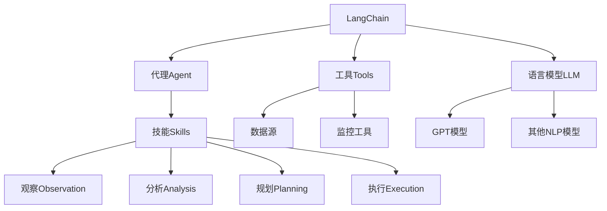

# 【LangChain编程：从入门到实践】应用监控

## 1. 背景介绍

### 1.1 问题的由来

在当今快节奏的软件开发环境中,应用程序的复杂性与规模与日俱增。随着微服务架构、分布式系统和云计算的广泛采用,有效监控应用程序的运行状况变得前所未有的重要。应用监控不仅能够帮助开发人员及时发现并解决潜在问题,还能提供关键的性能指标和用户体验数据,为持续优化和改进应用程序奠定基础。

然而,传统的应用监控方式往往需要大量的人工干预和复杂的配置,效率低下且容易出错。此外,随着系统复杂度的增加,单一监控工具难以满足全面监控的需求。因此,如何利用先进的技术来简化和优化应用监控流程,实现智能化、自动化的全面监控,成为当前亟待解决的问题。

### 1.2 研究现状

近年来,人工智能(AI)和自然语言处理(NLP)技术在各个领域得到了广泛应用,应用监控领域也不例外。一些先进的AI框架和工具开始被引入应用监控流程,以提高效率和准确性。其中,LangChain就是一个颇具前景的AI框架,它将人工智能与编程相结合,为开发人员提供了强大的工具来构建智能应用。

LangChain的核心思想是将人工智能模型(如GPT)与外部数据源和工具相集成,从而实现更智能、更自动化的任务处理。通过LangChain,开发人员可以轻松地将AI模型应用于各种场景,包括自然语言处理、数据分析、任务自动化等。在应用监控领域,LangChain可以帮助开发人员构建智能化的监控系统,自动化地收集、分析和响应各种监控数据,从而提高监控效率和质量。

### 1.3 研究意义

应用LangChain进行应用监控具有重要的理论和实践意义:

1. **提高监控效率**:LangChain能够自动化地收集、处理和分析大量的监控数据,减轻人工干预的负担,提高监控效率。

2. **增强监控智能化**:借助强大的AI模型,LangChain可以对监控数据进行智能分析,发现潜在的问题和模式,为优化决策提供依据。

3. **简化监控流程**:LangChain提供了统一的接口,将各种监控工具和数据源无缝集成,简化了监控流程的配置和管理。

4. **促进监控创新**:LangChain的开放性和可扩展性,为探索新颖的监控方法和应用场景提供了良好的基础。

5. **提升用户体验**:通过及时发现和解决应用问题,LangChain可以间接地提高应用的稳定性和用户体验。

### 1.4 本文结构

本文将全面介绍如何利用LangChain进行应用监控。文章首先阐述LangChain在应用监控中的核心概念和原理,然后详细解释其核心算法和数学模型。接下来,我们将通过实际的代码示例,演示如何使用LangChain构建智能监控系统。最后,文章将探讨LangChain在应用监控领域的实际应用场景,并对未来的发展趋势和挑战进行展望。

## 2. 核心概念与联系

在深入探讨LangChain应用监控的细节之前,我们先来了解一些核心概念及其相互关系。

1. **LangChain**:  LangChain是一个用于构建应用程序的框架,它将人工智能模型与外部数据源和工具相集成。在应用监控场景中,LangChain充当了核心协调器的角色,负责管理和调用各种组件。

2. **代理(Agent)**: 代理是LangChain中的一个重要概念,它封装了一系列技能(Skills),用于完成特定的任务。在应用监控中,代理负责执行各种监控相关的操作,如数据收集、分析和响应。

3. **工具(Tools)**: 工具是LangChain与外部系统交互的接口,可以是数据源(如日志文件、数据库等)或监控工具(如Prometheus、Grafana等)。LangChain通过工具获取监控数据并执行相应的操作。

4. **语言模型(LLM)**: 语言模型是LangChain的核心组件之一,它提供了自然语言处理和生成的能力。常见的语言模型包括GPT、BERT等。在应用监控中,语言模型可以用于分析监控数据,生成报告和警报等。

5. **技能(Skills)**: 技能是代理执行特定任务所需的能力。在应用监控场景中,技能可以包括数据收集、分析、规划和执行等方面。每个技能都由一个或多个工具组成,并由代理协调调用。

6. **观察(Observation)、分析(Analysis)、规划(Planning)和执行(Execution)**: 这四个概念体现了代理完成任务的基本流程。代理首先观察(Observation)当前的监控数据,然后进行分析(Analysis),根据分析结果制定计划(Planning),最后执行(Execution)相应的操作。

通过上述核心概念及其关系,我们可以看到LangChain为应用监控提供了一个灵活、可扩展的框架。它将人工智能模型与各种监控工具和数据源相结合,实现了智能化的监控流程。在后续章节中,我们将进一步探讨LangChain在应用监控中的具体实现细节。

## 3. 核心算法原理 & 具体操作步骤

### 3.1 算法原理概述

LangChain在应用监控中的核心算法原理可以概括为以下几个方面:

1. **代理决策循环(Agent Decision Cycle)**: 代理通过不断地观察、分析、规划和执行,来完成应用监控任务。这种循环决策过程使得代理能够持续地收集和处理监控数据,并根据情况做出相应的响应。

2. **技能组合(Skill Composition)**: 代理通过组合和调用不同的技能,来完成复杂的监控任务。每个技能都由一个或多个工具组成,代理根据当前的情况动态选择和执行相应的技能。

3. **语言模型集成(LLM Integration)**: LangChain将语言模型(如GPT)与监控流程无缝集成,利用语言模型的自然语言处理和生成能力,实现智能化的数据分析和响应生成。

4. **工具抽象(Tool Abstraction)**: LangChain将各种监控工具和数据源抽象为统一的工具接口,简化了与外部系统的集成过程。开发人员只需关注工具的功能,而无需关心具体的实现细节。

5. **内存管理(Memory Management)**: LangChain提供了内存管理机制,用于存储和管理代理在执行过程中产生的中间状态和结果。这有助于代理保持任务的连续性和一致性。

下面,我们将详细介绍LangChain应用监控的具体操作步骤。

### 3.2 算法步骤详解

LangChain应用监控的算法步骤可以概括为以下几个阶段:

#### 3.2.1 初始化阶段

在这个阶段,我们需要完成以下工作:

1. **定义监控目标**: 明确需要监控的应用程序或系统,以及监控的具体目标(如性能、错误、用户行为等)。

2. **选择工具**: 根据监控目标,选择合适的监控工具和数据源,如日志文件、数据库、Prometheus等。

3. **配置语言模型**: 选择并配置适当的语言模型(如GPT),用于自然语言处理和生成。

4. **初始化代理**: 创建一个代理实例,并为其分配初始的技能集合。技能可以包括数据收集、分析、规划和执行等方面。

5. **设置内存**: 为代理设置内存存储,用于保存执行过程中的中间状态和结果。

#### 3.2.2 执行阶段

在执行阶段,代理将进入决策循环,不断地观察、分析、规划和执行,以完成应用监控任务。具体步骤如下:

1. **观察(Observation)**: 代理通过工具从各种数据源收集监控数据,如日志、指标、事件等。

2. **分析(Analysis)**: 代理利用语言模型对收集到的监控数据进行分析,识别潜在的问题、异常模式或趋势。

3. **规划(Planning)**: 根据分析结果,代理制定相应的计划,决定需要执行的操作,如发送警报、调用外部系统等。

4. **执行(Execution)**: 代理执行已规划的操作,可能涉及调用不同的工具和技能。

5. **内存更新**: 代理将执行过程中产生的中间状态和结果存储在内存中,为下一次循环做准备。

6. **循环继续**: 代理重复上述步骤,持续监控应用程序的运行状况。

在整个执行过程中,代理可以根据需要动态地添加、修改或删除技能,以适应不同的监控场景和需求。

#### 3.2.3 响应阶段

除了持续监控之外,代理还需要根据分析结果做出相应的响应,如:

1. **生成报告**: 代理可以利用语言模型生成监控报告,总结应用程序的运行状况、发现的问题等。

2. **发送警报**: 当发现严重的异常或错误时,代理可以通过工具发送警报,通知相关人员采取行动。

3. **自动修复**: 对于某些已知的问题,代理可以尝试自动执行修复操作,如重启服务、调整配置等。

4. **优化建议**: 基于监控数据的分析结果,代理可以提出优化建议,帮助改进应用程序的性能和稳定性。

通过上述步骤,LangChain为应用监控提供了一个自动化、智能化的解决方案,大大简化了传统的手动监控流程。

### 3.3 算法优缺点

LangChain应用监控算法具有以下优点:

1. **自动化**: 算法能够自动化地收集、分析和响应监控数据,减少人工干预的需求。

2. **智能化**: 通过集成语言模型,算法能够对监控数据进行智能分析,发现潜在的问题和模式。

3. **灵活性**: 算法支持动态添加、修改和删除技能,可以适应不同的监控场景和需求。

4. **可扩展性**: 算法提供了统一的工具接口,方便与各种监控工具和数据源集成。

5. **连续性**: 内存管理机制确保了代理在执行过程中保持任务的连续性和一致性。

然而,LangChain应用监控算法也存在一些缺点和挑战:

1. **性能瓶颈**: 语言模型的计算开销较大,在处理大规模监控数据时可能会导致性能bottleneck。

2. **准确性限制**: 虽然语言模型具有强大的自然语言处理能力,但在特定领域或场景下,其准确性可能受到限制。

3. **安全隐患**: 如果语言模型被错误地训练或存在漏洞,可能会产生不可预期的结果,带来安全隐患。

4. **成本考量**: 采用LangChain进行应用监控可能需要额外的计算资源和模型许可费用,增加了成本开支。

5. **复杂性**: 将LangChain与现有的监控系统集成可能需要一定的开发和配置工作,增加了复杂性。

因此,在实际应用中,需要权衡LangChain应用监控算法的优缺点,并根据具体的监控需求和环境进行合理的选择和配置。

### 3.4 算法应用领域

LangChain应用监控算法可以广泛应用于各种类型的应用程序和系统,包括但不限于:

1. **Web应用**: 监控Web应用程序的性能、错误、用户行为等,确保良好的用户体验。