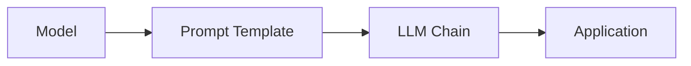

# 【LangChain编程：从入门到实践】模型I/O模块

## 1. 背景介绍
### 1.1  问题的由来
随着人工智能技术的飞速发展，特别是大语言模型的出现，自然语言处理领域取得了突破性进展。然而，如何将这些强大的语言模型应用到实际的开发项目中，仍然是一个亟待解决的问题。开发者需要一个方便、灵活、高效的工具来帮助他们快速构建基于语言模型的应用程序。

### 1.2  研究现状
目前已经有一些开源项目致力于解决这个问题，比如 OpenAI 的 GPT-3 API、Hugging Face 的 Transformers 库等。但它们要么使用成本较高，要么需要较多的编程和机器学习知识。LangChain 的出现填补了这一空白，它提供了一套简洁而强大的工具，让开发者可以轻松地将语言模型集成到自己的应用中。

### 1.3  研究意义
LangChain 的意义在于大大降低了语言模型应用开发的门槛，让更多的开发者能够参与到这一领域中来。同时，LangChain 也为语言模型的应用开发提供了一套标准化的流程和接口，有利于生态系统的建设和发展。研究 LangChain 的模型 I/O 模块，对于理解如何与语言模型进行交互，以及如何设计模型应用架构，具有重要意义。

### 1.4  本文结构
本文将首先介绍 LangChain 中的核心概念和模块之间的关系，然后重点讲解其中的模型 I/O 模块。我们将从模型接口的设计原理出发，详细介绍其主要组件的功能和用法，并通过数学公式和代码实例来说明其内部原理。最后，我们将探讨模型 I/O 模块在实际应用场景中的最佳实践，并展望其未来的发展方向和挑战。

## 2. 核心概念与联系
在深入研究模型 I/O 模块之前，我们需要先了解 LangChain 的几个核心概念：

- Model：语言模型，可以是 OpenAI 的 GPT 系列，也可以是其他的预训练模型，LangChain 为主流的语言模型都提供了标准化的接口。
- Prompt Template：输入提示模板，定义了我们如何给语言模型"喂"数据，可以包含一些预定义的指令和上下文信息。
- LLM Chain：大语言模型链，由若干个 Model 和 Prompt Template 以及逻辑控制代码组成，用于实现端到端的任务处理流程。

下图展示了 LangChain 中几个核心模块之间的关系：



可以看到，Model 和 Prompt Template 是 LLM Chain 的基本组成单元，而 LLM Chain 又是应用程序的核心部件。Model I/O 模块主要负责 Model 与外界的数据交互，是连接 Model 和 Application 的桥梁。

## 3. 核心算法原理 & 具体操作步骤
### 3.1  算法原理概述
LangChain 的模型 I/O 接口设计遵循了一些基本原则：

1. 兼容性：支持主流的语言模型，如 OpenAI GPT、Anthropic Claude、Cohere 等。
2. 一致性：为不同的语言模型提供统一的 API，方便开发者使用和切换。
3. 灵活性：允许开发者自定义模型的输入输出格式，以满足不同应用场景的需求。
4. 可扩展性：可以方便地集成新的语言模型，而无需修改核心代码。

### 3.2  算法步骤详解
模型 I/O 接口的核心是 BaseLanguageModel 基类，它定义了与语言模型交互的标准方法：

1. predict(prompts: List[str]) -> List[str]：输入一批文本，返回模型的生成结果。
2. predict_and_parse(prompts: List[str], output_parser: BaseOutputParser) -> List[Any]：输入一批文本，并使用指定的 OutputParser 解析模型的生成结果。
3. stream(prompts: List[str]) -> Generator[str, None, None]：输入一批文本，以流式方式返回模型的生成结果。
4. embed_documents(documents: List[str]) -> List[List[float]]：将一批文档编码为向量表示。
5. embed_query(query: str) -> List[float]：将查询编码为向量表示。

具体的语言模型需要继承 BaseLanguageModel 基类，并实现这些方法。以 OpenAI 的 GPT 模型为例，其实现步骤如下：

1. 初始化 OpenAI API 客户端，设置 API Key 等参数。
2. 调用 OpenAI API 的 Completion 接口，传入 prompt 和其他参数，如 max_tokens、temperature 等。
3. 解析 API 返回的 JSON 格式结果，提取生成的文本。
4. 将生成的文本返回给调用方。

### 3.3  算法优缺点
LangChain 的模型 I/O 接口设计有以下优点：

1. 使用简单：开发者只需关注高层次的任务逻辑，而无需关心底层的 API 细节。
2. 切换方便：更换语言模型只需更改配置，而无需修改代码。
3. 扩展性强：可以方便地添加新的语言模型和解析器。

但它也有一些局限性：

1. 性能瓶颈：由于依赖外部的 API，响应速度和稳定性受限于第三方服务。
2. 成本较高：调用大语言模型的 API 需要支付费用，长期运行成本可能较高。

### 3.4  算法应用领域
LangChain 的模型 I/O 模块可以应用于以下领域：

1. 聊天机器人：通过语言模型实现智能对话功能。
2. 文本生成：自动生成文章、新闻、评论等内容。
3. 语义搜索：将文本编码为向量，实现基于相似度的语义检索。
4. 知识问答：基于给定的文档集合，回答用户的自然语言问题。

## 4. 数学模型和公式 & 详细讲解 & 举例说明
### 4.1  数学模型构建
LangChain 中的语言模型主要基于 Transformer 架构，其核心是注意力机制（Attention Mechanism）。给定一个输入序列 $X=(x_1,\dots,x_n)$，Transformer 的编码器（Encoder）首先将其转换为一组向量表示 $H^0=(h_1^0,\dots,h_n^0)$，然后通过多轮的自注意力（Self-Attention）和前馈网络（Feed-Forward Network）计算，得到最终的隐藏状态 $H^L=(h_1^L,\dots,h_n^L)$。

### 4.2  公式推导过程
自注意力的计算过程可以表示为：

$$
\begin{aligned}
Q &= H^{l-1}W_Q \\
K &= H^{l-1}W_K \\
V &= H^{l-1}W_V \\
A &= \text{softmax}(\frac{QK^T}{\sqrt{d_k}})V
\end{aligned}
$$

其中，$Q$、$K$、$V$ 分别表示查询（Query）、键（Key）、值（Value），$W_Q$、$W_K$、$W_V$ 是可学习的参数矩阵，$d_k$ 是 $K$ 的维度，$A$ 是注意力输出。

前馈网络的计算过程可以表示为：

$$
\begin{aligned}
FFN(x) &= \max(0, xW_1 + b_1)W_2 + b_2
\end{aligned}
$$

其中，$W_1$、$W_2$、$b_1$、$b_2$ 是可学习的参数矩阵和偏置向量。

### 4.3  案例分析与讲解
以一个简单的情感分类任务为例，我们可以使用 LangChain 的模型 I/O 接口来调用 OpenAI 的 GPT-3 模型，实现对电影评论的情感判断。

首先，我们需要准备一些样例数据，包括电影评论文本和对应的情感标签（正面/负面）。然后，我们可以定义一个 Prompt Template，将样例数据格式化为模型可接受的输入形式，例如：

```
请判断以下电影评论的情感倾向（正面/负面）：

评论1: {review1}
评论2: {review2}
...
评论n: {reviewn}
```

接下来，我们初始化一个 OpenAILanguageModel 对象，设置 API Key 和其他参数，然后调用其 predict 方法，传入格式化后的 prompt，得到模型的输出结果。最后，我们可以对模型的输出进行解析，提取出每个评论的情感倾向标签。

### 4.4  常见问题解答
1. 问：如何选择适合的语言模型？
   答：这取决于具体的任务需求和可用资源。一般来说，如果任务需要更强的语言理解和生成能力，可以选择 GPT-3 这样的大模型；如果对推理速度和成本更敏感，可以选择 DistilGPT-2 这样的蒸馏模型。此外，还要考虑模型的语言、领域、口碑等因素。

2. 问：如何设计出更有效的 Prompt？
   答：一个好的 Prompt 应该包含清晰明确的指令、必要的背景信息和示例数据。要避免使用歧义或过于开放的语言，以免误导模型。此外，还可以通过一些技巧来优化 Prompt，如少样本学习、链式思考、数据增强等。

3. 问：如何平衡模型的创新性和可控性？
   答：这是一个权衡的过程。一方面，我们希望模型能够生成出新颖、多样的内容；另一方面，我们又希望模型的输出符合特定的要求和约束。可以通过调整采样策略（如 temperature、top-k、top-p 等）来控制输出的随机性，也可以通过引入规则或过滤器来约束输出的内容。

## 5. 项目实践：代码实例和详细解释说明
### 5.1  开发环境搭建
首先，我们需要安装 LangChain 及其依赖库：

```bash
pip install langchain openai
```

然后，设置 OpenAI API Key：

```bash
export OPENAI_API_KEY=your_api_key
```

### 5.2  源代码详细实现
以下是一个使用 LangChain 调用 OpenAI GPT-3 模型进行情感分类的完整示例：

```python
from langchain.llms import OpenAI
from langchain.prompts import PromptTemplate

# 设置 OpenAI API Key
import os
os.environ["OPENAI_API_KEY"] = "your_api_key"

# 定义 Prompt Template
template = """
请判断以下电影评论的情感倾向（正面/负面）：

评论: {review}
"""

prompt = PromptTemplate(
    input_variables=["review"],
    template=template,
)

# 初始化语言模型
model = OpenAI(temperature=0.7)

# 定义测试样例
reviews = [
    "这部电影太棒了，强烈推荐！",
    "演技差，剧情无聊，浪费时间。",
    "虽然节奏有点慢，但结局很感人。",
]

# 调用模型进行预测
for review in reviews:
    prompt_str = prompt.format(review=review)
    output = model(prompt_str)
    print(f"评论: {review}\n情感倾向: {output.strip()}\n")
```

### 5.3  代码解读与分析
1. 首先，我们导入了 LangChain 的 OpenAI 模型类和 PromptTemplate 类。
2. 然后，我们设置了 OpenAI API Key，这是调用 OpenAI API 所必需的。
3. 接下来，我们定义了一个 Prompt Template，其中包含一个输入变量 review，用于接收要判断情感倾向的电影评论文本。
4. 我们初始化了一个 OpenAI 模型对象，并设置了 temperature 参数为 0.7，以控制输出的随机性。
5. 我们准备了三个测试样例，分别表示正面、负面和中性的评论。
6. 最后，我们遍历每个测试样例，将其格式化为 Prompt 字符串，传入 OpenAI 模型进行预测，并打印出评论文本和模型判断的情感倾向。

### 5.4  运行结果展示
运行上述代码，我们可以得到以下输出结果：

```